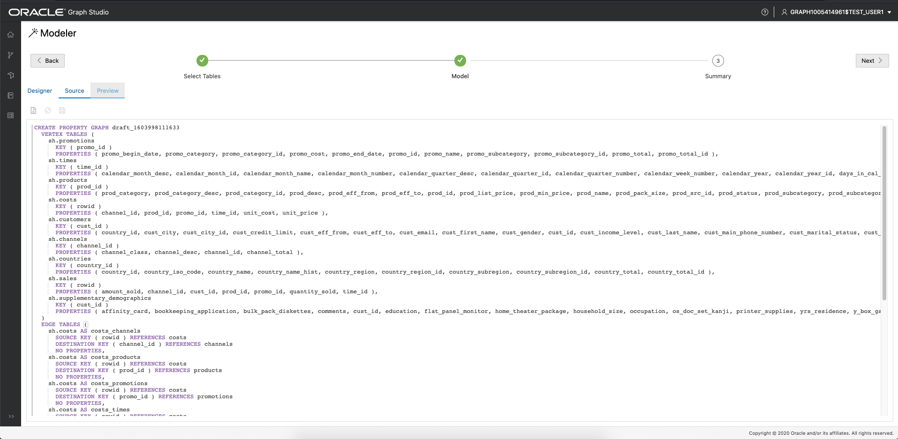
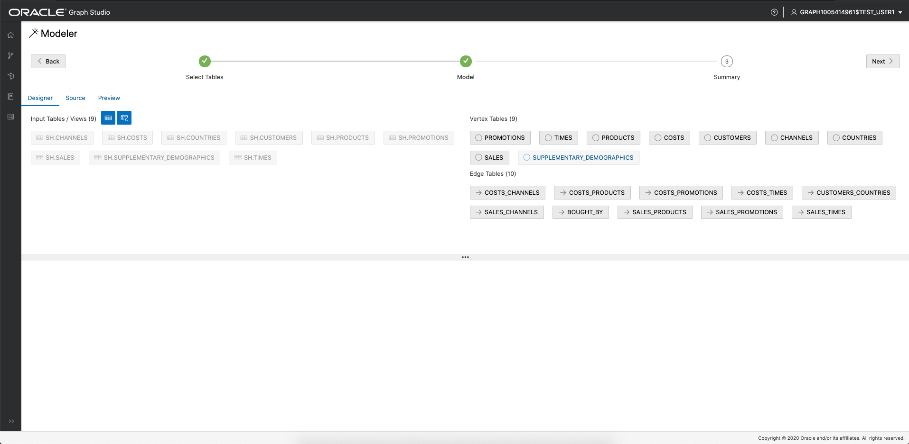
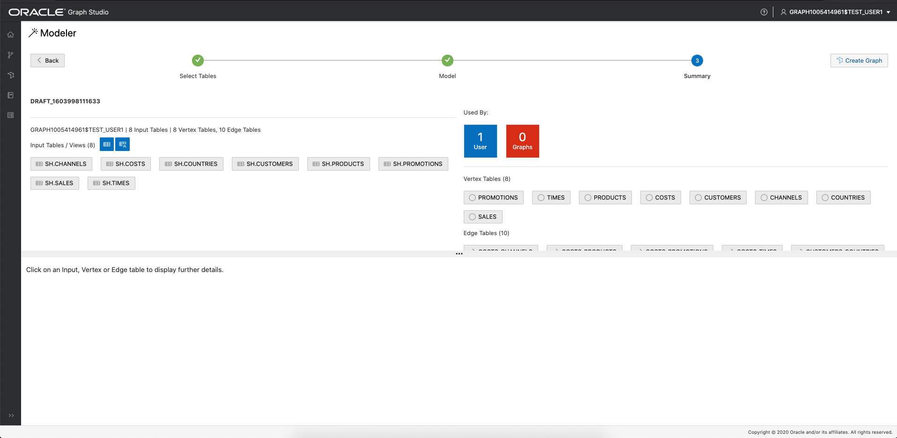

# Create a graph from existing relational data using Graph Studio

## Introduction

In this lab you will explore more of Graph Studio and learn about how you can create graphs from existing relational data stored in your 
Autonomous Data Warehouse - Shared Infrastructure (ADW) or Autonomous Transaction Processing - Shared Infrastructure (ATP) instance.

*Note: While this lab uses ADW, the steps are identical for creating and connecting to an ATP database.*

Estimated lab time: 30 minutes.

### Objectives

- Learn how to model a graph from the Sales History (SH) sample data set
- Learn how to monitor a graph creation job
- Learn how inspect created graphs and graph models

### Prerequisites

- The following lab requires an ADW/ATP account. 
- It assumes you have completed the first lab which explains how you can access the Graph Studio interface of your ADW instance and illustrates some basic concepts.

## STEP 1: Select the tables to create the graph from

1. The following screenshot shows Graph Studio user interface with the menu, or navigation, icons on the left. They naviagte to the Home, Models, Graphs, Notebooks, and Jobs pages respectively. 

    

2. Click on the *Models* menu icon.

    

    In this lab we use the Sales History (SH) sample schema to create our demo graph. The SH schema is available in all ADB instances. You can, however, apply the steps of this lab to any relational data available in your ADW/ATP database, regardless of where the data originated from. All the schemas and tables - including views - that you have access to will show up as possible input tables at te start of the modeling workflow.

    

3. Open up the *SH* schema and double click on the *COUNTRIES* table.

    You see some details about this table, like all the columns it has and their types, as well as which column is the primary key:

    

4. On the bottom left, click on the *SH.COUNTRIES - Data* tab.

    You see a preview of the values of that table. By default, it displays the first ten rows, but you can increase the sample size. You can also search for any value in that table and paginate through the preview.

5. For this lab, we choose all tables of the *SH* schema as input for our graph model. Select the *SH* and then click the button in the middle to move all SH tables to the selected section on the right.

    

6. Click on the *Next* button on the top right to move to the next step. Graph Studio analyzes the foreign key constraints and suggests a possible mapping from the selected tables to a property graph structure. This may take a few seconds. Once done, you see all the input tables you selected on the left, and the mapping to vertex and edge tables on the right.  

    

    This model can be modified if necessary.

## STEP 2: Edit your graph model

1. Click on the *CHANNELS* vertex table.

    The automatic graph modeler suggests to convert each row of the *SH.CHANNELS* input table into a vertex in target property graph. In the property graph model, vertex and edges can have a *label* to categorize them into different
    types of vertices and edges. Each label can have a different set of propererties associated with it. The graph modeler automatically sets the label to the name of the input table. That way we can later easily identify of which type
    each vertex or edge in our generated graph is. In addition, we see that each *column* of the input table was converted into a *property* in our graph model. In the property graph model, properties are arbitrary key/value pairs
    associated with each vertex or edge in our graph. By mapping all column values into properties, we make sure that all input data is preserved in our graph. 

    However, the graph modeler allows you to customize how data is mapped and remove unnecessary tables and or columns not relevant for your analysis. Reducing the amount of data to be processed will reduce the amount of processing
    resources and storage required for graph analysis.

2. Remove unnecessary properties by clicking the *X* button next to property we want to delete. In this lab, we remove the *CHANNEL\_CLASS\_ID* and *CHANNEL\_TOTAL\_ID* properties from our model.

    

3. Click on the *SH\_SALES\_CUSTOMERS* edge table.

    As you can see from the *Source Vertex* and *Destination Vertex* information, this edge type maps all relations from the *SALES* table to the *CUSTOMERS* table. In other words, it models *bought by* relationships.
    By default, the modeler gave this edge type the label *SALES\_CUSTOMER\_FK*.

4. Rename the edge label to *BOUGHT\_BY*:

    

5. Click on the *Source* tab on the upper left.

    

    You see the source code for this model. The source code is written in PGQL Data Definiton Language (DDL) syntax. You can find more information about the language in the 
    [PGQL 1.3 specification](https://pgql-lang.org/spec/1.3/#create-property-graph).

    Advanced users can edit the source code directly. Changes will be reflected immediately in the designer view and vice versa.

6. Click the *Preview* tab on the upper left.

    

    You see a visual representation of our graph model so far. Each circle in the graph represents a vertex type (label). And edge relationship in the graph represents an edge type (label)
    in between the circles. You can rearrange the graph by clicking and dragging elements around. You can also right click on each element to see the list of properties it will contain.
    In this view, we can easily identify that the *SUPPLEMENTARY\_DEMOGRAPHICS* vertex table does not have any relation to any other vertex tables. 
    
    
    
    How can we remove this vertex table from our model?

7. Click on the *Designer* tab.

8. Click on the *SUPPLEMENTARY\_DEMOGRAPHICS* vertex table.

    

9.  Click on the *Delete* icon on the right of the details panel.

    

10. In dialog confirming the deletion, choose *Yes*.
    
    

11. Go back to *Preview* mode. You will notice the *SUPPLEMENTARY\_DEMOGRAPHICS* vertex table is gone from our visual representation of the model.

12. Click *Next* on the top right.

    

    You see a summary of the model we created. All the input tables and how we want to map those to a property graph.

## STEP 3: Start the graph creation job

1. Click *Create Graph* on the top right.

    

2. Enter *SH* as graph name, SH_MODEL as the model name,  and optionally give the graph a description and some tags to identify it easier later. Leave the *Load into memory* option checked. Then click *Create*.

    

    You get redirected to the jobs page where you see your graph creation job.

    

3. Click on the running job. In the details section, click on the *Logs* icon on the top right.
   
    

    That brings up a dialog with the log.  

    

    You can leave the resulting logs dialog open to monitor the progress of the graph creation. Graph Studio automatically refreshes the logs once every few seconds.
    The graph creation job should succeed after a few minutes. After completion, another *Load into memory* job is started automatically. 

    

4. Wait for both jobs to complete successfully.

## STEP 4: Inspect the created graph and model

1. Click on the *Graphs* menu icon.

2. Click on the *SH* graph that we just created.

    

    You can see a preview of the graph, edit its name or meta data, share it with others, load it into memory or delete it.

3. Click on the *Models* menu item

4. Click on the *SH Model* that we just created:

    

    Just like the graph, the model is stored as well. You can see the source code of this model, share it with others, edit its meta data or delete it.
    You can also kick off another graph creation job from the same model.

Congratulations! You successfully converted relational tables into a property graph. You can now go ahead and analyze the relationships in that data using powerful graph queries and algorithms.

*Please proceed to the next lab.*

## Acknowledgements
* **Author** - Korbi Schmid, Product Development
* **Contributors** -  Jayant Sharma, Product Management
* **Last Updated By/Date** - Jayant Sharma, Oct 2020
  
## Need Help?
Please submit feedback or ask for help using our [LiveLabs Support Forum](https://community.oracle.com/tech/developers/categories/livelabsdiscussions). Please click the **Log In** button and login using your Oracle Account. Click the **Ask A Question** button to the left to start a *New Discussion* or *Ask a Question*.  Please include your workshop name and lab name.  You can also include screenshots and attach files.  Engage directly with the author of the workshop.

If you do not have an Oracle Account, click [here](https://profile.oracle.com/myprofile/account/create-account.jspx) to create one.
