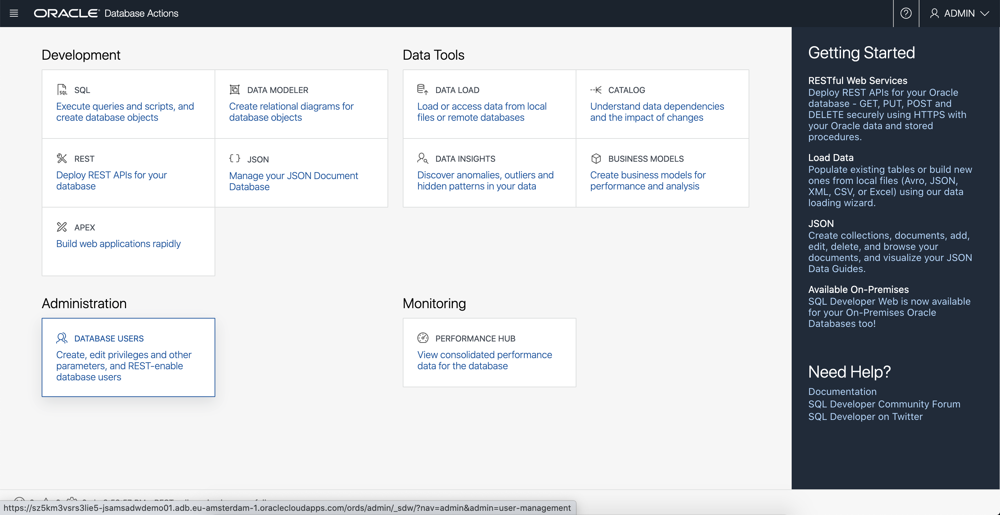
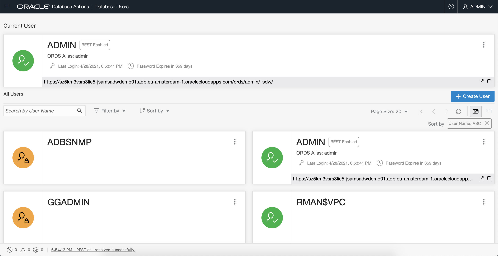
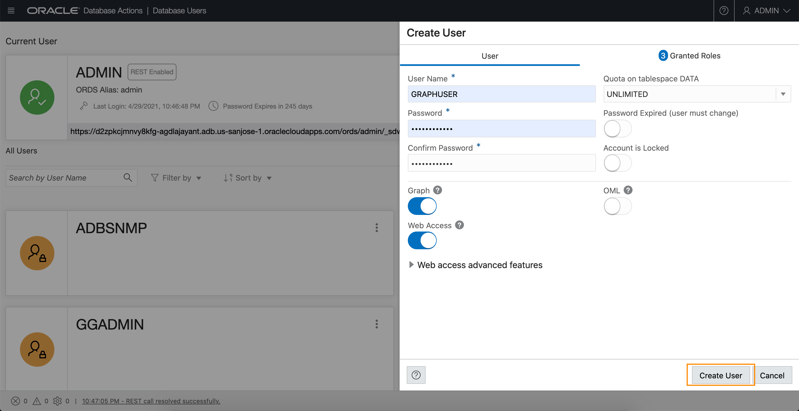

# Create the Graph User

## Introduction

In this lab you will create a database user with the appropriate roles and privileges required for using the graph capabilities of the Autonomous Database.

Estimated Lab Time: 5 minutes. 

### Objectives

Learn how to
-  create a database user with the appropriate roles and privileges required for accessing **Graph Studio**


### Prerequisites

- The following lab requires an Autonomous Data Warehouse - Shared Infrastructure or Autonomous Transaction Processing - Shared Infrastructure account. 

## **STEP 1**: Connect to the Database Actions for your Autonomous Database instance

**Note: Right-click on a screenshot to open it in a new tab or window to view it in full resolution.**

1. Open the service detail page for your Autonomous Database instance in the OCI console. 

   

2. Click on the Tools tab and then the Database Actions link to open it. 
   
   

## **STEP 2**: Create the web access and graph-enabled user

1. Login as the ADMIN user for your Autonomous Database instance. 

    

2. Click on the `Database Users` tile under `Administration`. 
   
   
   
3. Click on the `+ Create User` icon:

    

4. Enter the required details, i.e. user name and password. Turn on the **Graph Enable** and **Web Access** radio buttons. And select a quota, e.g. `UMLIMITED`,  to allocate on the `DATA` tablespace.
   
   

**Note: Please do not Graph Enable the ADMIN user and do not login to Graph Studio as the ADMIN user.**

   Click the `Create User` button at the bottom of the panel to create the user with the specified credentials

   The newly created user will now be listed.

      

   **Note: The UI steps above can be instead done by executing the following sql commands listed below when logged in as ADMIN. So step 2 below is not necessary. It shows an alternative way of creating and enabling GRAPHUSER.**
   
5. Allocate a desired table space quota to the newly created user. Open the SQL page and issue the alter command.  
   For example, 
   `ALTER USER GRAPHUSER QUOTA UNLIMITED ON DATA;`   
   will allocate a quota the user `GRAPHUSER` in the tablespace named `DATA`.  
   Copy and paste the following command into the SQL worksheet.  
   Substitute the correct values for  `<username>` and `<quota>` and then click on Run to execute it.
   ```
   <copy>
    -- Optional statement to use in place of the UI of the Administration page
   ALTER USER <username> QUOTA <quota> ON DATA;
   </copy>
   ```

   ```
   <copy>
   -- Optional statements to use in place of the UI of the Administration page
   GRANT GRAPH_DEVELOPER TO <username> ;
   ALTER USER <username> GRANT CONNECT THROUGH "GRAPH$PROXY_USER";
   </copy>
   ``` 

   The screenshots below show an example of executing the ALTER USER statement.

     

     

    
 
 6. You can similarly use SQL statements to verify that GRAPHUSER has been set up correctly.  
    You must be logged into Data Actions SQL as `ADMIN`.  
    then enter the following SQL statements and execute them. 
     
    ```
    <copy>
    select * from dba_role_privs where grantee='GRAPHUSER';

    select * from dba_proxies where client='GRAPHUSER';
    </copy>
    ```
    The results should be the same as in the screenshots below.

    

    


Please *proceed to the next lab* to learn how to create and analyze graphs in ADB.

## Acknowledgements
* **Author** - Jayant Sharma, Product Development
* **Last Updated By/Date** - Jayant Sharma, May 2021
  
