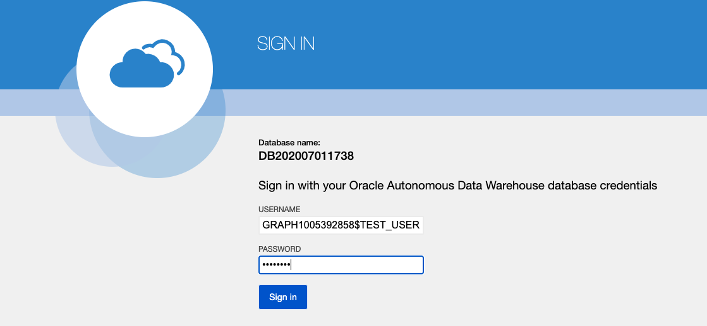
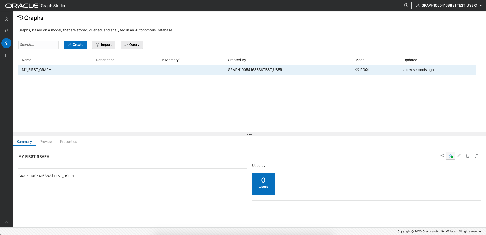
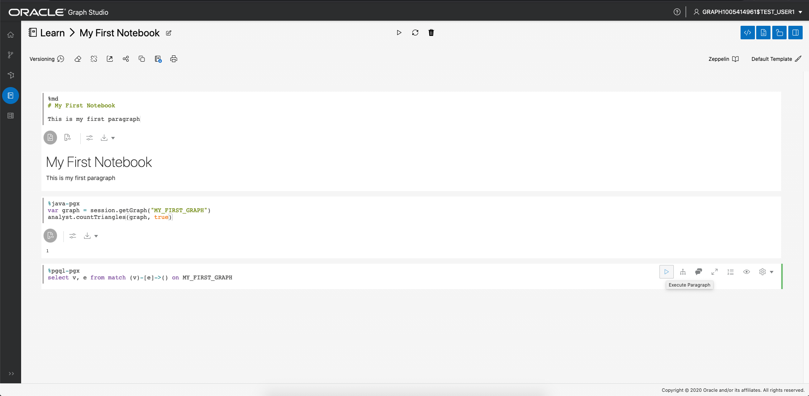
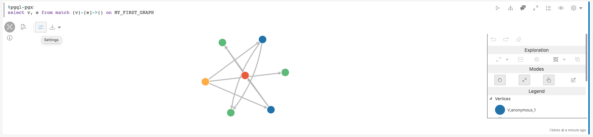

# Hello World: Create, analyze and visualize a graph from scratch

## Introduction

In this lab you will explore Graph Studio and learn how you can create and analyze a graph from scratch very quickly using
Autonomous Data Warehouse - Shared Infrastructure (ADW) or Autonomous Transaction Processing - Shared Infrastructure (ATP) instance.

*Note: While this lab uses ADW, the steps are identical for creating and connecting to an ATP database.*

Estimated lab time: 10 minutes. 

### Objectives

Learn how to
- connect to your autonomous database using **Graph Studio**
- quickly create a very simply graph from scratch using PGQL
- load graphs into memory for analysis
- create a simple notebook
- write and execute basic Markdown, PGX Java and PGQL notebook paragraphs
- visualize graph data

### Prerequisites

- The following lab requires an ADB-Shared (ADW/ATP) account. 

## **STEP 1**: Connect to your autonomous database using Graph Studio

Open the ADB service console and click on the Development link in the menu on the left. 

**Note: This particular image is from an instance where some features were disabled. Your instance will likely have them all and other features. While the UI may be slightly different the Graph Studio card will be there.**


Click on the Graph Studio card to open in a new page or tab in your browser. 

If you prefer to connect directly and know the database, tenant, and region details then use the URL pattern shown below.

```
https://adb.<region_identifier>.oraclecloud.com/graphstudio/?tenant=<tenant_name>&database=<database_name>
```

For example, to access Graph Studio of database `ADW1` belonging to tenant `TENANT1` in the US Ashburn (IAD) region, open

```
https://adb.us-ashburn-1.oraclecloud.com/graphstudio/?tenant=TENANT1&database=ADW1
```

in your browser. You can find the [region identifier for all regions here](https://docs.cloud.oracle.com/en-us/iaas/Content/General/Concepts/regions.htm).

Enter your ADW/ATP account credentials into the login screen:



Then click the "Sign In" button.

## **STEP 2**: Create a simple graph using PGQL

1. The following screenshot shows Graph Studio user interface with the menu, or navigation, icons on the left. They naviagte to the Home, Models, Graphs, Notebooks, and Jobs pages respectively. 

    

2. Click on the `Graphs` menu icon:

    

3. Next click the `</> Query` button on the page. You should see a page titled  **</> Query Playground**
   
    
4. Copy and paste the following DDL code into the PGQL input text area:

    ```
    <copy>
    CREATE PROPERTY GRAPH my_first_graph;

    INSERT INTO my_first_graph
        VERTEX austin LABELS (City) PROPERTIES (austin.name = 'Austin', austin.population = 964254),
        VERTEX tokyo LABELS (City) PROPERTIES (tokyo.name = 'Tokyo', tokyo.population = 9273672),
        VERTEX zurich LABELS (City) PROPERTIES (zurich.name = 'Zurich', zurich.population = 402762),
        VERTEX europe LABELS (Continent) PROPERTIES (europe.name = 'Europe'),
        VERTEX US LABELS (Country) PROPERTIES (US.name = 'United States of America'),
        VERTEX texas LABELS (State) PROPERTIES (texas.name = 'Texas', texas.area_size_km2 = 695662),
        VERTEX japan LABELS (Country) PROPERTIES (japan.name = 'Japan', japan.area_size_km2 = 377975),
        EDGE austinCapital BETWEEN austin AND texas LABELS (capital_of),
        EDGE austinCountry BETWEEN austin AND US LABELS (located_in),
        EDGE texasCountry BETWEEN texas AND US LABELS (located_in),
        EDGE zurichContinent BETWEEN zurich AND europe LABELS (located_in),
        EDGE tokyoCapital BETWEEN tokyo AND japan LABELS (capital_of),
        EDGE tokyoCountry BETWEEN tokyo AND japan LABELS (located_in),
        EDGE zurichTokyo BETWEEN zurich AND tokyo LABELS (connecting_flight) PROPERTIES (zurichTokyo.distance_km = 9576),
        EDGE zurichAustin BETWEEN zurich AND austin LABELS (connecting_flight) PROPERTIES (zurichAustin.distance_km = 8674)
    </copy>
    ```

    This will create a very simple graph with 7 vertices and 8 edges. For more information about the syntax, please refer to the [PGQL specification](https://pgql-lang.org/spec/1.3/#inserting-vertices)

5. Click the Execute button on the top left.

    

## **STEP 3**: Load the graph into memory

1. Navigate to the Graphs page:

    

2. Click on `MY_FIRST_GRAPH`:

    

3. Click on the *Load into memory* icon on the right of the details section:

    

    In the resulting dialog, click *Yes*.

    

4. You get redirected to the Jobs page. Wait for the job to complete.

    

## **STEP 4**: Create your first notebook

1. Navigate to the Notebooks page:

    

2. Click the *Create* button on the right.  
   
3. Name the notebook *Learn/My First Notebook*, then click *Create*. That will create a folder named `Learn` and the note `My First Notebook` within it.

    

    You will see the Markdown code rendered as HTML:

    

    Markdown paragraphs are useful to add explanations to your notebooks and order them into chapters. You can embed images and even videos using Markdown or HTML syntax, give it a try.

## **STEP 5**: Analyze, query and visualize the graph

1. Add another paragraph to the notebook by hovering at the middle of the bottom of the paragrah and clicking the *+* button which appears.
   
   
   
   Then enter the following code in the new paragraph.

    ```
    <copy>
    %java-pgx
    var graph = session.getGraph("MY_FIRST_GRAPH")
    </copy>
    ```

2. Execute that paragraph, you will see we successfully referenced our graph that we just created from scratch via the PGX Java APIs.

    

3. Modify the paragraph to run a graph algorithm. For example:

    ```
    <copy>
    %java-pgx
    var graph = session.getGraph("MY_FIRST_GRAPH")
    analyst.countTriangles(graph, true)
    </copy>
    ```

4. Execute the updated paragraph again. Upon completion it displays the result, i.e. the graph contains exactly one triangle.

    

5. Add a PGQL paragraph and enter the following code.

    ```
    <copy>
    %pgql-pgx
    select v, e from match (v)-[e]->() on MY_FIRST_GRAPH
    </copy>
    ```
    

6. Execute that paragraph and the results are rendered as an interactive graph.

     

7. Right click on one of the vertices on the screen to see all the details of that vertex.
   
    

8. Click on the settings icon of the visualization.

     

9.  Navigate to the *Visualization* tab and select *NAME* as the label to render next to the vertices:

        

    You now see the name next to each vertex, which will help you better understand the visualization. There are lots of other options to help you make sense of the graph. Feel free to play around with the settings as you like.

10. Add another paragraph with the following query and execute it.

    ```
    <copy>
    %pgql-pgx
    select c.NAME, c.POPULATION from match (c:City) on MY_FIRST_GRAPH order by c.POPULATION desc
    </copy>
    ```

    

11. Change the output to be a pie chart.

       

Congratulations! You successfully created, analyzed and visualized a graph from scratch using Graph Studio. Hopefully this little example gave you a feeling of how can use your Autonomous Database as a graph database. 

Please *proceed to the next lab* to see more complex examples of how to create and analyze graphs.

## Acknowledgements
* **Author** - Korbi Schmid, Product Development
* **Contributors** -  Jayant Sharma, Product Management
* **Last Updated By/Date** - Jayant Sharma, Oct 2020
  
## Need Help?
Please submit feedback or ask for help using our [LiveLabs Support Forum](https://community.oracle.com/tech/developers/categories/livelabsdiscussions). Please click the **Log In** button and login using your Oracle Account. Click the **Ask A Question** button to the left to start a *New Discussion* or *Ask a Question*.  Please include your workshop name and lab name.  You can also include screenshots and attach files.  Engage directly with the author of the workshop.

If you do not have an Oracle Account, click [here](https://profile.oracle.com/myprofile/account/create-account.jspx) to create one.
