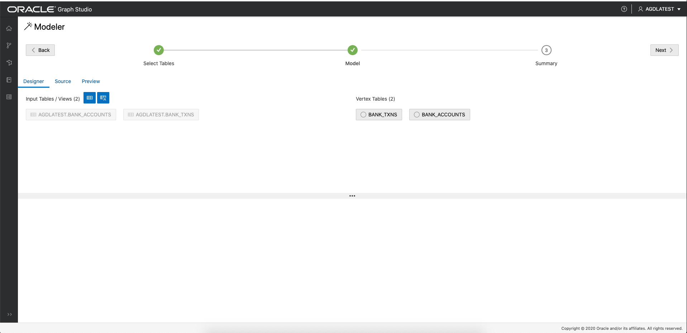

# Autonomous Graph Database: Create a graph using PGQL CREATE PROPERTY GRAPH statement

## Introduction

In this lab you will create a graph from the `bank_accounts` and `bank_txns` tables using Graph Studio and the CREATE PROPERTY GRAPH statement.

The following video shows the steps you will execute in this lab.

[](youtube:oQAR5icMh34) Autonomous Graph Database: Create a graph.

Estimated Lab Time: 15 minutes. 

### Objectives

Learn how to
- use Graph Studio and PGQL DDL (i.e. CREATE PROPERTY GRAPH statement) to model and create a graph from existing tables or views.

### Prerequisites

- The following lab requires an ADB-Shared (ADW/ATP) account. 
- And that the Graph-enabled user has been created. That is, a database user with the correct roles and privileges exists.

## **STEP 1**: Connect to your Autonomous Database using Graph Studio

1. If you have the Graph Studio URL then proceed to step 4. 

    Log in to the OCI Console, choose the ADB-S (i.e. ADW or ATP) instance, then click on the Tools tab on the details page menu on the left. 

   


2. Click on the Graph Studio card to open in a new page or tab in your browser. 

3. If you prefer to connect directly and know the database, tenancy OCID, and region details then use the URL pattern shown below.

    ```
    https://adb.<region_identifier>.oraclecloud.com/graphstudio/?tenant=<tenancy_ocid>&database=<database_name>
    ```

    For example, to access Graph Studio of database `ADW1` belonging to tenant `TENANT1` with OCID `ocid1.tenancy.oc1..thisisadecidedlybogusvalue` in the US Ashburn (IAD) region, open

    ```
    https://adb.us-ashburn-1.oraclecloud.com/graphstudio/?tenant=ocid1.tenancy.oc1..thisisadecidedlybogusvalue&database=ADW1
    ```

    in your browser. You can find the [region identifier for all regions here](https://docs.cloud.oracle.com/en-us/iaas/Content/General/Concepts/regions.htm).

4. Enter your ADW/ATP account credentials into the login screen:

    

5. Then click the "Sign In" button. You should see the studio home page.   
     

## **STEP 2**: Create a graph of accounts and transactions from the corresponding tables

1. Click on the Models icon to naviagte to the start of the modeling workflow. Then selec the `BANK_ACCOUNTS` and `BANK_TXNS` tables.   


2. Move them to the right, i.e. click the first icon on the shuttle control.   

   

3.  Click next to get a suggested model. We will edit and update this model. The suggested model has each table as a vertex since there are no foreign key constraints specified for BANK_TXNS.   

      

  We will replace the CREATE PROPERTY GRAPH statement with an updated definition.

4.  Click the Source tab to bring up the existing statement and the edit dialog.  
     

  Replace the existing statement with the following one which specifies that `BANK_ACCOUNTS` is a vertex table and `BANK_TXNS` is an edge table.  
```
<copy>
CREATE PROPERTY GRAPH bank_graph
    VERTEX TABLES (
        BANK_ACCOUNTS as ACCOUNTS 
        KEY (ACCT_ID) 
        LABELS ACCOUNTS
        PROPERTIES (ACCT_ID, NAME)
    )
    EDGE TABLES (
        BANK_TXNS 
        KEY (FROM_ACCT_ID, TO_ACCT_ID, AMOUNT)
        SOURCE KEY (FROM_ACCT_ID) REFERENCES ACCOUNTS
        DESTINATION KEY (TO_ACCT_ID) REFERENCES ACCOUNTS
        LABEL TRANSFERS
        PROPERTIES (FROM_ACCT_ID, TO_ACCT_ID, DESCRIPTION, AMOUNT)
    )
</copy>
```

5. Click the Save (floppy disk icon) to commit the changes. Then click the Designer tab to confirm that the model now has a vertex table and en edge table.  
    

6. Click `Create Graph` to move on to the next step in the flow.   

   Enter the prompted details. That is, supply a graph name (e.g. `bank_graph`), a model name (e.g. `bank_graph_model`), and other optional information.  
   

7. Graph Studio modeler will now save the metadata and start a job to create the graph.  
   The Jobs page shows the status of this job. 

     

   Once the graph has been created and loaded into memory, if you enabled that radio button, you can then query and visualize it in a notebook.


Please **proceed to the next lab** to do so.

## Acknowledgements
* **Author** - Jayant Sharma, Product Management
* **Contributors** -  Jayant Sharma, Product Management
* **Last Updated By/Date** - Jayant Sharma, Jan 2021
  
## Need Help?
Please submit feedback or ask for help using our [LiveLabs Support Forum](https://community.oracle.com/tech/developers/categories/oracle-graph). Please click the **Log In** button and login using your Oracle Account. Click the **Ask A Question** button to the left to start a *New Discussion* or *Ask a Question*.  Please include your workshop name and lab name.  You can also include screenshots and attach files.  Engage directly with the author of the workshop.

If you do not have an Oracle Account, click [here](https://profile.oracle.com/myprofile/account/create-account.jspx) to create one.
