# Graph Studio: Load data from CSV files into tables

## Introduction

In this lab you will load two CSV files into corresponding tables using the Database Actions SQL (aka SQLDeveloperWeb) interface of your 
Autonomous Data Warehouse - Shared Infrastructure (ADW) or Autonomous Transaction Processing - Shared Infrastructure (ATP) instance.

The following video shows the steps you will execute in this lab.

[](youtube:F_3xe18kWoo) Graph Studio: Load CSV Files.


Estimated Lab Time: 10 minutes. 

### Objectives

Learn how to
- load CSV files into an Autonomous Database using Database Actions SQL.


### Prerequisites

- The following lab requires an Autonomous Database - Shared Infrastructure account. 
- It assumes that a Graph and Web-Access enabled user has been created. That is, a database user with the correct roles and privileges exists and that user can log into Database Actions SQL.


## **STEP 1**: Connect to the Database Actions for your Autonomous Database instance

**Note: Right-click on a screenshot to open it in a new tab or window to view it in full resolution.**

1. Open the service detail page for your Autonomous Database instance in the OCI console.  

     

2. Click on the Tools tab and then the Database Actions link to open it.
   

## **STEP 2**: Login as the graph-enabled user

1. Login as the graph user (e.g. `GRAPHUSER`) for your Autonomous Database instance. 
   
    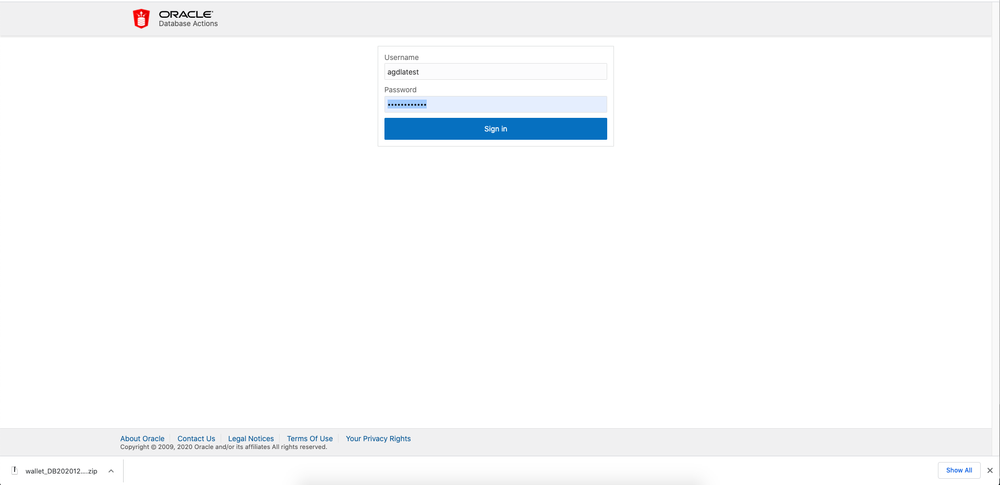  

    **Note:** If necessary, do the following to create the user with the right roles and privileges:
    - Log in to Database Actions as the ADMIN user for your Autonomous Database.
    - Select Administration and then Database Users from the navigation menu
    - Click on Create User
    - Turn on the Web-Access and Graph-enable buttons

## **STEP 3**: Download the sample datasets from the ObjectStore

1. Use `wget` or `curl` to download the sample data, i.e. CSV files, to you computer. Or copy and paste the url in your browser for the zip archive, i.e.  

    ```
    https://objectstorage.us-ashburn-1.oraclecloud.com/p/2Z71OXMvPLSZcYliEoe49EVCvcjcW_FlXmqAR2JCdZ49cIecbP1e3gtMB-4Z68cN/n/c4u03/b/data-management-library-files/o/random-acct-txn-data.zip
    ```

    A sample `curl` request is:
    ```
    curl -G -o acct-txn-data.zip https://objectstorage.us-ashburn-1.oraclecloud.com/p/2Z71OXMvPLSZcYliEoe49EVCvcjcW_FlXmqAR2JCdZ49cIecbP1e3gtMB-4Z68cN/n/c4u03/b/data-management-library-files/o/random-acct-txn-data.zip
    ```

2. Unzip the archive into a local directory such as ~/downloads.

## **STEP 4**: Upload using Database Actions SQL

1. Click on the Data Loading tab in the SQL worksheet. 
   
   
   
   Then click on `Select Files`.

   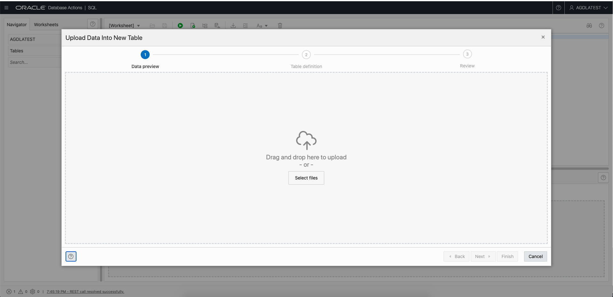

2. Navigate to the correct folder (e.g. ~/downloads) and select the bank_account.csv file.
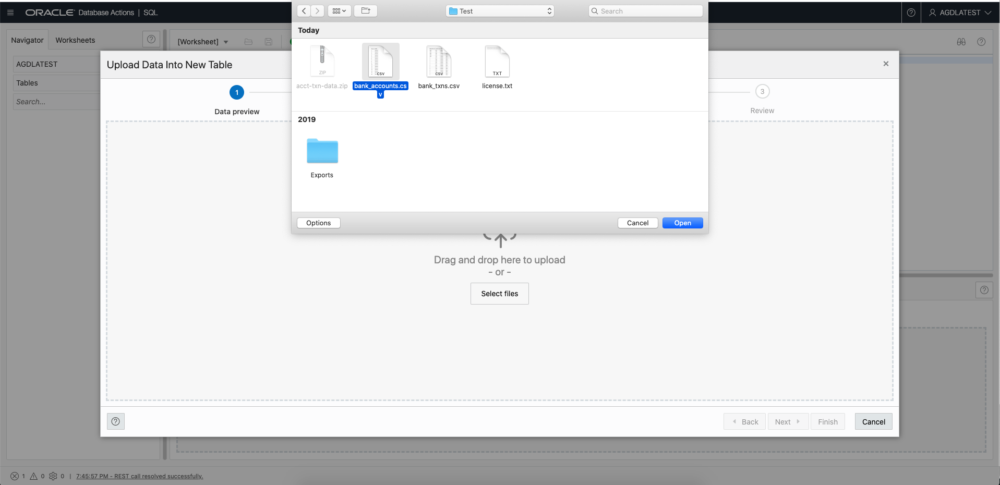

3. Preview the data then click `Next`.
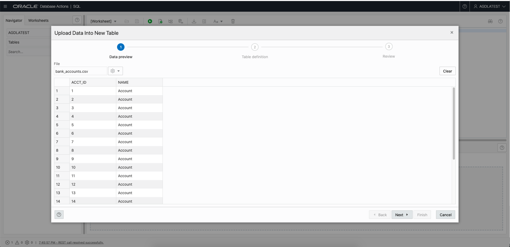

4. Modify the properties as follows:
    - Change the column type for `ACCT_ID` to `NUMBER`.
    - Click the PK checkbox to indicate that it is a primary key.

   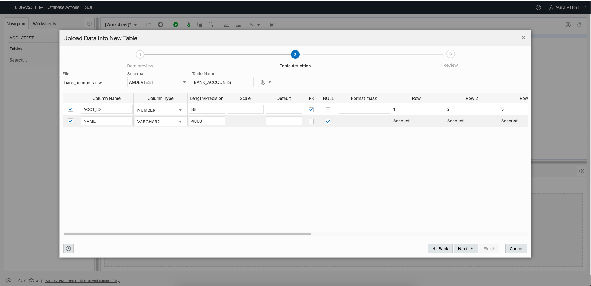

5. Click `Next` to view the generated DDL. Then click `Finish` to create the table and load the data. 
   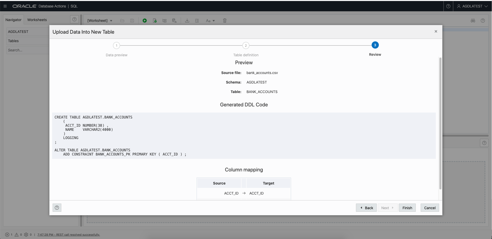
   
   Note: If you see an error message that the SDW$ERR$_BANK_ACCOUNTS$ table could not be created then check that the user has adequate quota for the tablespace name `DATA` or whichever tablesapce the user has privileges on.

6. Once the file is loaded you should see the table in the list on the left.
   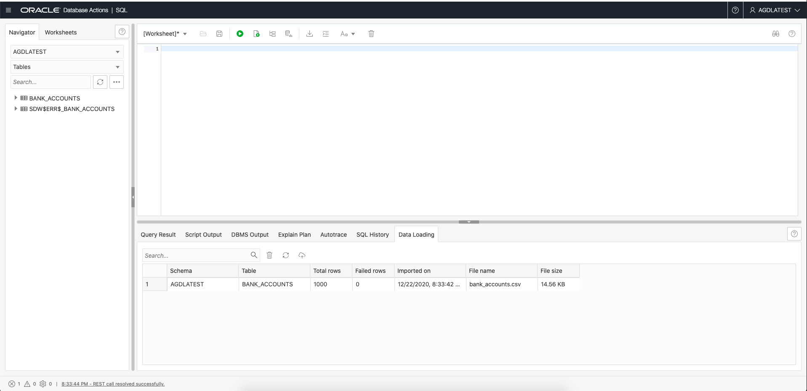

7. Now repeat the process for the second file, i.e. bank_txns.csv. 
   
   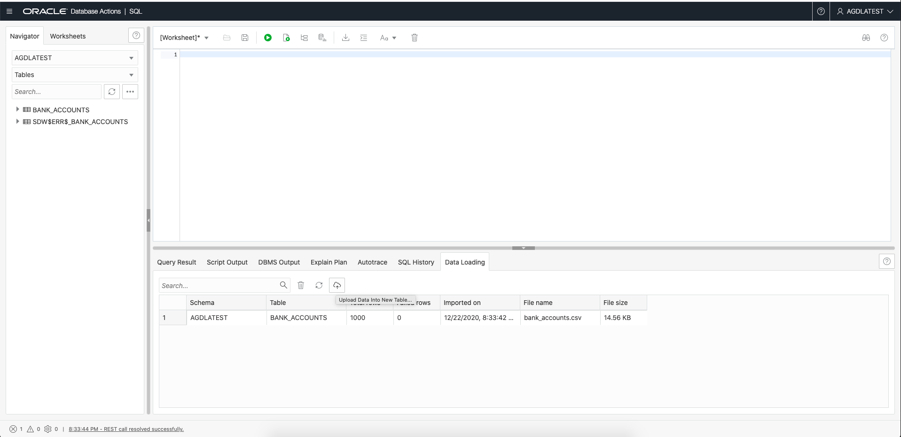

8. Navigate to the correct folder (e.g. ~/downloads) and select the bank_txns.csv file.  
   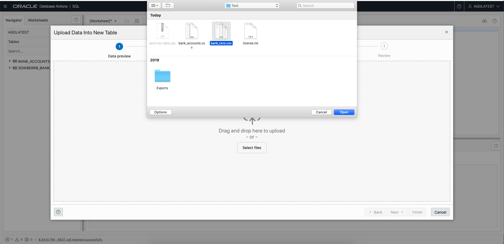

9. Edit the proeprties as follows:
    - Change the data type for `FROM_ACCT_ID`, `TO_ACCT_ID`, and `AMOUNT` to `NUMBER`.
    - Change the length for `DESCRIPTION` to 128.
    - Check the `PK` checkbox for each of `FROM_ACCT_ID`, `TO_ACCT_ID`, and `AMOUNT` to indicate that these columns form the composite primary key.  
   
   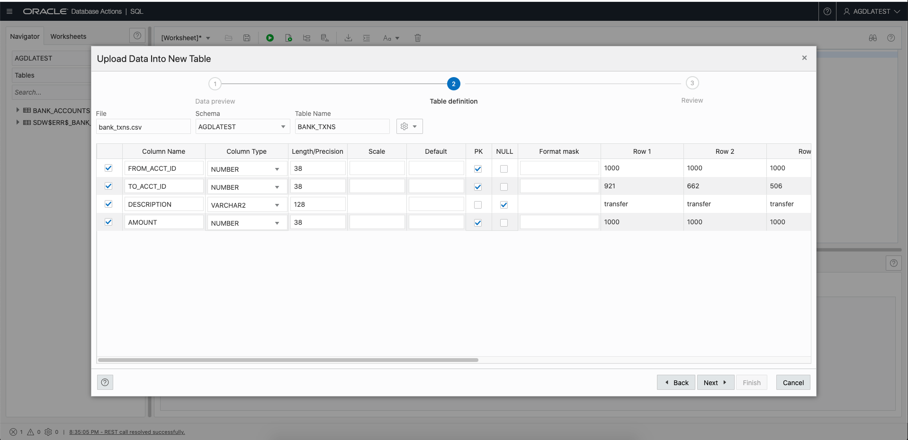
  
10. Click `Next` to view the generated DDL. Then click `Finish` to create the table and load the data.  
   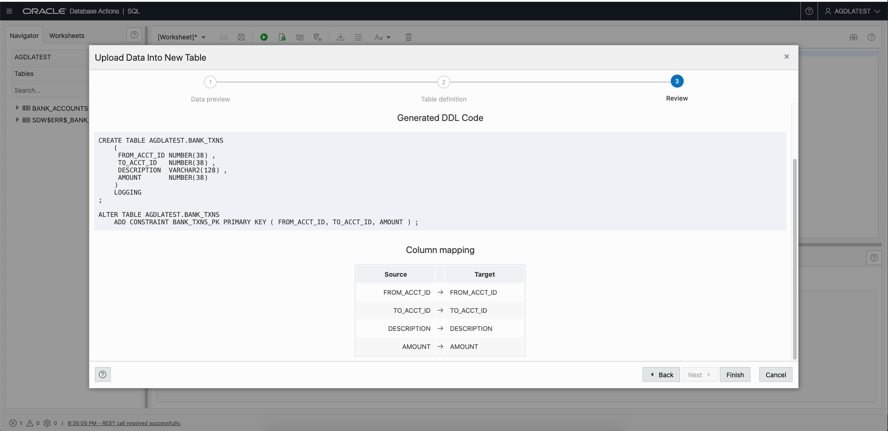

11. Once the file is loaded you should see the table in the list on the left.  
   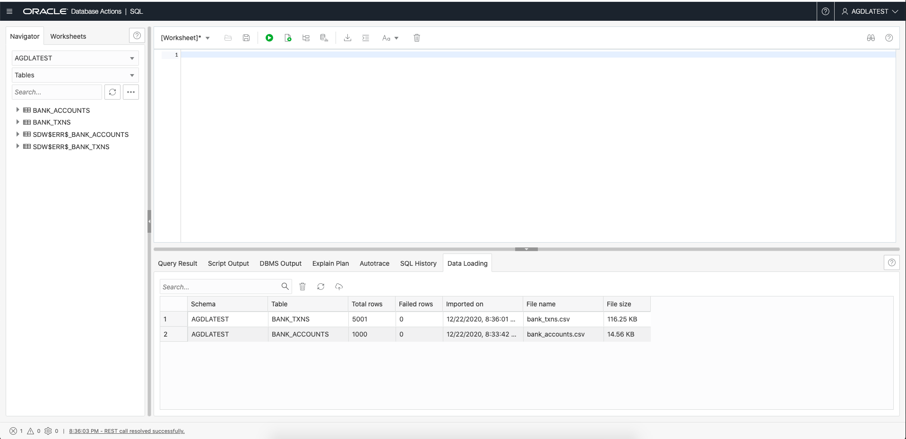


Please **proceed to the next lab** to create a graph from these tables.

## Acknowledgements
* **Author** - Jayant Sharma, Product Management
* **Contributors** -  Jayant Sharma, Product Management
* **Last Updated By/Date** - Jayant Sharma, May 2021
  
