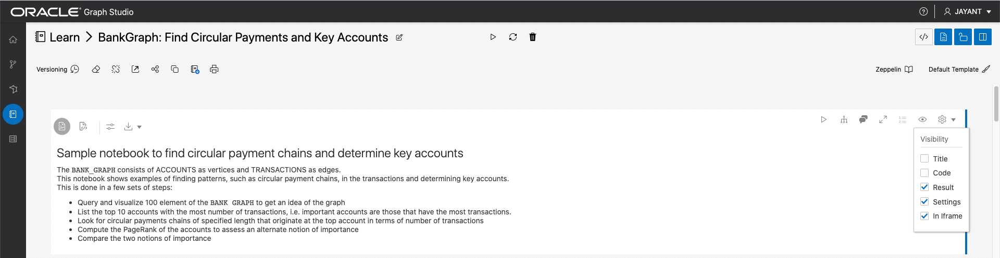
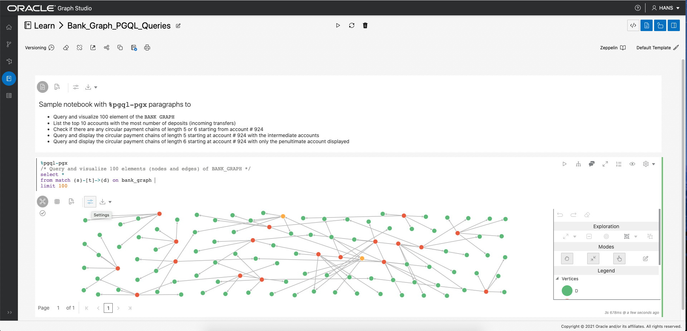

# Graph Studio: Query and visualize a graph using PGQL paragraphs in a notebook

## Introduction

In this lab you will query the newly create graph (i.e. `bank_graph`) in PGQL paragraphs of a notebook.

The following video shows the steps you will execute in this lab.

[](youtube:DLRlnw-NI1g) Graph Studio: Query a graph.

Estimated Lab Time: 30 minutes. 

### Objectives

Learn how to
- use Graph Studio notebooks and PGQL paragraphs to query and visualize a graph.

### Prerequisites

- Previous labs of this workshop. That is, the graph has been created and you are logged into Graph Studio. 

**Note: Right-click on a screenshot to open it in a new tab or window to view it in full resolution.**

## **STEP 1**: Create a notebook  

1. First check that the `BANK_GRAPH` has been loaded into memory. Click the `Graphs` menu icon 
   
   and verify that `BANK_GRAPH` is loaded into memory. If it isn't then click on the action menu 
   
   on that row and select `Load into memory`. 

   

2. Next click on the `Notebooks` menu icon and then on `Create`, on the top right side of that page, to create a new notebook.  
Name it `Learn/BankGraph: Find Circular Payments`.  

     

   The notebook will open to a blank paragraph.  

   

   Graph Studio notebooks currently support three type of paragraphs:  
      - `%md` for Markdown 
      - `%pgql-pgx` for Property Graph Query Language ([PGQL](https://pgql-lang.org)) 
      - `%java-pgx` for executing built-in graph algorithms with the Property Graph Java API  
  
3. Add a new paragraph. **Hover over the bottom middle portion of the first paragraph**. Click the + icon 
    when it is displayed.  
	 

4. Let's enter a Markdown paragraph which outlines the notebook content. Copy and paste the following text into the first blank paragraph.

	```
	<copy>
	%md
	## Sample notebook to find circular payment chains and determine key accounts

	The `BANK_GRAPH` consists of ACCOUNTS as vertices and TRANSACTIONS as edges.  
	This notebook shows examples of finding patterns, such as circular payment chains, in the transactions and determining key accounts.  
	This is done in a few sets of steps:
	- Query and visualize 100 element of the `BANK GRAPH` to get an idea of the graph
	- List the top 10 accounts with the most number of transactions, i.e. important accounts are those that have the most transactions.
	- Look for circular payments chains of specified length that originate at the top account in terms of number of transactions 
	- Compute the PageRank of the accounts to assess an alternate notion of importance
	- Compare the two notions of importance
	</copy>
	```

	Click the Run icon  to execute this paragraph.  

	Then click the Eye (visibility) icon 
	  
	to turn off the Code listing and only display the result.   

	  

 

## **STEP 2**: Query the `BANK_GRAPH` and visualize the results 

1. Copy and paste the following text into this new paragraph.  
	```
	<copy>
	%pgql-pgx
	/* Query and visualize 100 elements (nodes and edges) of BANK_GRAPH */
	select * 
	from match (s)-[t]->(d) on bank_graph 
	limit 100
	</copy>
	```

	Execute the paragraph.

	The PGQL query above fetches the first 100 elements of the graph and displays them.  
	The MATCH clause specifies a graph pattern.  
	- `(s)` is the source node 
	- `[t]` is an edge 
	- `->` indicates the edge direction, i.e. from the source `s` to a destination `d`
	- `(d)` is the destination node
	
	The LIMIT clause specifies the maximum of elements that the query should return.

	See the [PGQL site](https://pgql-lang.org) and specification for more details on the syntax and features of the language.  
	The Getting Started notebook folder also contains a tutorial on PGQL.  

2. Now let's explore some features of the visualization component. We will add the `acct_id` as node (or vertex) labels and use a different graph layout algorithm.  
   
   Click the visualization `settings` icon 
     
   (the fourth icon from the left at the top of the visualization panel).  

      

    In this `Settings` dialog, click the `Visualization` tab. Then scroll down and pick `ACCT_ID` from the `Labeling`, `Vertex Label` drop-down list.  

     

   Click the `X` on the top-right to exit the settings dialog. The resulting visualization should be similar to the screenshot below.   

   **Note: The colors and layout shown in the screenshots may differ from those in your results.**

      

   Now open the visualization settings again, click the `Visualization` tab, and choose a different layout (`Concentric`) from the Layout drop-down list. Exit the settings dialog. 

   

3. Add a Markdown paragraph describing the next step which to look for circular transfers.   
    Create a new paragraph and enter the following text into it and execute it.   
	```
	<copy>
	%md
	### Find potential fraud patterns, e.g. circular payment chain

	Circular payments chains are often of length between 5 and 7, i.e. payments pass through 5 or 6 intermediate accounts before 
	landing back at the original account.   
	First list the top ten accounts in terms of number of incoming or outgoing transfers. 
	Then let's check if there are any such payment chains that start from one of those accounts, e.g. account # 934.
	</copy>
	```

    

4. Next let's use PGQL to find the top 10 accounts in terms of number of transfers.  
	PGQL has built-in functions `IN_DEGREE` and `OUT_DEGREE` which returns the number of incoming and outgoing edges of a node. So we can use them in this query.   
	Add a new paragraph. Then copy and paste the following text into it and run it.  
	```
	<copy>
	%pgql-pgx
	/* List 10 accounts with the most number of transactions (i.e. incoming + outgoing edges) */
	select a.acct_id, (in_degree(a) + out_degree(a)) as num_transactions 
	from match (a) on bank_graph 
	order by num_transactions desc 
	limit 10 
	</copy>
	```

	  

	We see that accounts 387 and 934 are high on the list.  

5.  This step is optional. It demonstrates some layout settings of the notebook.  
    Since the table has just two columns we may want to reduce its width and place two paragraphs and result side by side.  
	Click on the gear icon at the top right to open the paragraph settings.  Move the width slider to about halfway or a little less.  

	  

6.  Now check if there are any circular transfers originating and terminating at account 934.   
	Add a new paragraph. Then copy and paste the following text into it and run it.  
	```
	<copy>
	%pgql-pgx
	/* Check if there are any circular payment chains of length 5 from acct 934 */
	select *
	from match (a)-/:TRANSFERS{5}/->(a) on bank_graph 
	where a.acct_id=934
	</copy>
	```

	

	Here `/:TRANSFERS{5}/` is a [reachability path expression](https://pgql-lang.org/spec/1.3/#reachability). It only tests for the existence of the path.  
	`:TRANSFERS` specifies that all edges in the path must have the label `TRANSFERS`.  
	While `{5}` specifies a path length of exactly 5 hops.  

	The result shows a dotted line which indicates a path, of length one or more, from the node for account 934 to itself.  
	
	
	
	It does not display all the paths or any intermediate nodes.

7. If you did not do step 5 to adjust the paragraph width then you needn't do this step either.  
   Adjust the width of the paragraph so that the top ten table query and the circular transfer query paragraphs are side by side.  

   	

8. We can modify the above query to include the node which made the deposit into account 934. This will display all the paths.   
	Add a new paragraph. Then copy and paste the following text into it and run it.  
	```
	<copy>
	%pgql-pgx
	/* Show the account that deposited into acct 934 in the 5-hop circular payment chain */
	select *
	from match (a)-/:TRANSFERS{4}/->(d)-[t]->(a) on bank_graph 
	where a.acct_id=934
	</copy>
	```

	  

	The reachability test is changed to paths of length four because we explicity specify the last hop (`(d)-[t]->(a)`).  

	  

	Click the visualization settings and then select the `Concentric` layout.  

	

9. The next query finds and displays the 6-hop circular payment chains originating at account 934.  
	
	Add a new paragraph. Then copy and paste the following text into it and run it.  
	```
	<copy>
	%pgql-pgx
	/* Show the account that deposited into acct 934 in the 5-hop circular payment chain */
	select *
	from match (a)-/:TRANSFERS{5}/->(d)-[t]->(a) on bank_graph 
	where a.acct_id=934
	</copy>
	```

	  

	The resulting visualizing will be similar to the following screenshot.  

	  

10. We may want also to display all the intermediate nodes, i.e. accounts through which the money was transferred. 

	Let's that for the 5-hop case. Add a new paragraph. Then copy and paste the following text into it and run it.  
	```
	<copy>
	%pgql-pgx
	/* Show all the transfers in 5-hop circular payment chains starting from acct 934 */
	select a, t1, i1, t2, i2, t3, i3, t4, i4, t5 
	from match (a)-[t1]->(i1)-[t2]->(i2)-[t3]->(i3)-[t4]->(i4)-[t5]->(a) on bank_graph
	where a.acct_id=934
	</copy>
	```
	  

	This result might be better viewed in a different graph layout.  
	Open the visualization settings dialog and select `Hierarchical` from the `Layouts` drop-down list.  Leave the Direction as `Top-Down` and Algorithm Type as `Network Simplex`.

	  

    Use the `Settings` icon and Visualization tab to label the vertices with the `ACCT_ID` for the resulting graph.   
	Lastly, let's change the source node's size to highlight it.   
	Open the visualization settings dialog and select the `Highlights` tab.   
	Click on `New Highlight`.   
	Then 
	- Click on the `Size` checkbox and move the slider to `3X` so that the select vertex will be 3 times as larger as others.
	- Click the + icon next to `Condition` to add a selection criterion for the vertex.
	- Select `ACCT_ID` from the first drop-down list, `=` from the second, and `934.0` from the third to specify the criterion `ACCT_ID=934`.
	
	  

	The result will be similar to the following screenshot.  

	

11. The remainder of this lab illustrates additional query features and the use of the JAVA API to execute graph algorithms.  
    
    Add a new Markdown paragraph, enter the following text, and exceute the paragraph.  

	```
	<copy>
	%md
	The queries above looked for paths of a specific length.  
	The next query looks for paths of length between 3 and 5 hops and let's the user enter the account number (i.e. the source account in the circular chain) ay runtime.
	</copy>
	```

    

12. This shows the use of bind parameters in a query. The account id value is supplied and used at runtime.  
    Add a new paragraph. Paste the following PGQL query, **enter 534 as the account id**, and then execute the paragraph.  

	```
	<copy>
	%pgql-pgx
	/* Check if there are any circular payment chains of between 3 and 5 hops starting from the user-supplied account # */
	select * 
	from match (a)-/:TRANSFERS{2,4}/->(d)-[t]->(a) on bank_graph
	where a.acct_id=${account_id}
	</copy>
	```

    

13. Now let's run the PageRank graph algorithm.  Add a paragraph.  Paste the following Markdown text and execute it.  
    ```
	<copy>
	%md 

	[PageRank](https://en.wikipedia.org/wiki/PageRank) is a measure of relative importance.  Let's compute the PageRank for the accounts in our graph.  
	Algorithms are executed on the in-memory graph via the Java API for PGX.

	First we get a handle to the graph we wish to analyze, i.e. `BANK_GRAPH`, from the implicitly created `session` object.   
	The `session`, `analyst`, and `instance` objects are implicitly created when the in-memory graph server is created. That is, when the envrionment is created.   
	Next we execute the PageRank algorithm, with default parameters, on the graph. The computed value is stored in an attrbute named `pagerank` that is added to each vertex.
	</copy>
	```

    

14. Add a paragraph to execute Java code snippets.  
    Paste the following text in the paragraph and then execute it.  

	```
	<copy>
	%java-pgx
	PgxGraph bgraph1 = session.getGraph("BANK_GRAPH");
	analyst.pagerank(bgraph1);
	</copy>
	```

    

15. Now let's use the computed PageRank value in visualizing a PGQL query result.  
    First add a Markdown paragraph outlining the next step.  

	```
	<copy>
	%md
	Now query the graph again and use the PageRank value when symbolizing the account nodes.  
	Nodes with a PageRank above a ceratin value are displayed as larger circles.
	</copy>
	```

	
	
16. Next add a paragraph to query the 6-hop transfers starting at account #934.  
    
	```
	<copy>
	%pgql-pgx
	/* Add highlights to symbolize account nodes by pagerank values. This shows that 934 is connected to other accounts with higher PageRank values. */
	SELECT *
	FROM MATCH(n)-/:Transfers{1,6}/->(m) on bank_graph
	WHERE n.acct_id = 934 limit 100
	</copy>
	```

   After the query has executed and a result is displayed click on visualization settings. Then on the Highlights tab.  
     

   Then click on `New Highlight` and enter the following details to create it.  
   Specify pagerank >= 0.0035 as the condition, size = 3X as the visual effect.  

     

   The result should be similar to the screenshot shown below.  

   


17. Now lets compare the top ten accounts by PageRank and number of transactions.  

    Add a Markdown paragraph.  

    ```
	<copy>
	%md
	Now lets compare the two notions of importance: PageRank (relative importance of the accounts) and Aggregation (counting the number of transactions)
	</copy>
	```

	

18. Then add a paragraph to show the top ten accounts by PageRank.  
 
    ```
	<copy>
	%pgql-pgx
	/* List top ten accounts by pagerank */
	select a.acct_id, a.pagerank
	from match (a) on bank_graph 
	order by a.pagerank desc limit 10
	</copy>
	```

    Click the `Table` icon to visualize the results as a table, if necessary.  

	    

19. And one to show top ten accounts by number of transfers.  

    ```
	<copy>
	%pgql-pgx
	/* List 10 accounts with the most number of edges (i.e. transfers) */
	select a.acct_id, in_degree(a) + out_degree(a) as num_transfers 
	from match (a) on bank_graph 
	order by num_transfers desc limit 10
	</copy>
	```

	    

20. Account #222 is in the top ten by PageRank but not by # of transfers. So let us look at that account and its immediate neighbors in the graph.  
    Add a markdown paragraph.

	```
	<copy>
	Notice that account **#222** is in the top ten list by PageRank but not in the list by count of # of transactions.   
	So lets look at the immediate neighbors of it and symbolize them by pagerank with large nodes having higher values.  
	The immediate neighbors are those that made a deposit into account #222, or those that received a deposit from account #222.  

	We see that #222 has neighbors with a higher pagerank value and hence it itself has a high pagerank.
	</copy>
	```

     

21. Add a paragraph to display account 222 and its neighbors. 

    ```
	<copy>
	%pgql-pgx
	/* show the transactions for acct id 222 */
	select * from match (v1)-[e1]->(a)-[e2]->(v2) on bank_graph where a.acct_id=222
	</copy>
	```

    Choose a `Grid` layout for the visualization.  
	Add a new highlight with pagerank >= 0.0035 as the condition, size = 3X as the visual effect.  
	 
	    
    
22. Similarly account #4 has a higher PageRank but is not in the top 10 by #transfers while account #380 is in the top 10 by #transfers but not by PageRank.   
    So let us look at those two and their neighbors.  

	First add a Markdown paragraph.  

    ```
	<copy>
	%md 

	Lastly, account **#4** is in the top ten list on the left (by PageRank) but not the right (# of transactions) while account **#380** is in the list on right but not the one on the left.  
	So lets us query and visualize those two accoutns and their neighbors. And once again larger nodes have a higher pagerank.   
	We see that account #380 is mostly connected to accounts with lower pagerank values while account #4 is connected to accounts with a higher pagerank.

	</copy>
	```

	  


23.	Then add a pararaph to query them and their neighbors.  

    ```
	<copy>
	%pgql-pgx
	/* Query and visualize elements (nodes and edges) of BANK_GRAPH for accts 4 and 380 */
	select * 
	from match (s)-[t]->(d) on bank_graph where s.acct_id = 4 or s.acct_id = 380 or d.acct_id = 4 or d.acct_id = 380
	</copy>
	```

    Change the graph visualization layout to `Hierarchical`. 

	  	  


**Congratulations** on successfuly completing this workshop.

## Acknowledgements
* **Author** - Jayant Sharma, Product Management
* **Contributors** -  Jayant Sharma, Product Management
* **Last Updated By/Date** - Jayant Sharma, May 2021
  
