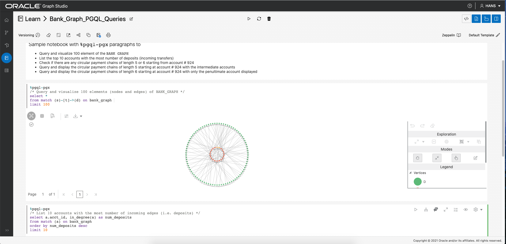
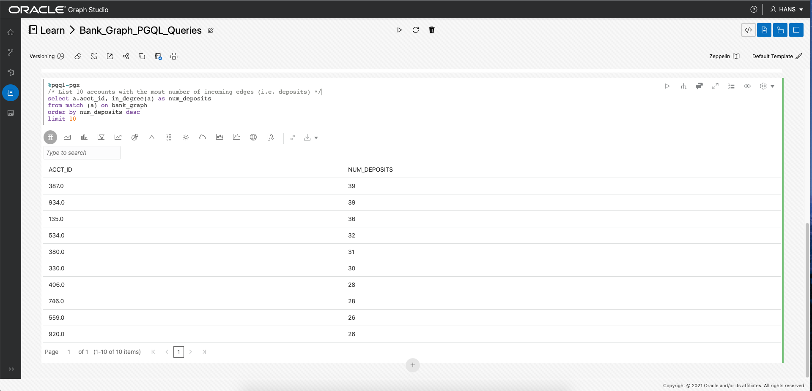

# Graph Studio: Query and visualize a graph using PGQL paragraphs in a notebook

## Introduction

In this lab you will query the newly create graph (i.e. `bank_graph`) in PGQL paragraphs of a notebook.

The following video shows the steps you will execute in this lab.

[](youtube:DLRlnw-NI1g) Graph Studio: Query a graph.

Estimated Lab Time: 15 minutes. 

### Objectives

Learn how to
- use Graph Studio notebooks and PGQL paragraphs to query and visualize a graph.

### Prerequisites

- Labs 1 and 2 of this workshop. That is, you are logged into Graph Studio and the `BANK_GRAPH` has been created and loaded into memory. 

## **STEP 1**: Create a notebook  

1. First check that the `BANK_GRAPH` has been loaded into memory. Click the `Graphs` menu icon and verify that `BANK_GRAPH` is loaded into memory. If it isn't then click on the action menu on that row and select `Load into memory`. 

2. Next click on the `Notebooks` menu icon and then on `Create`, on the top right side of that page, to create a new notebook.  
Name it `Learn/Bank_Graph_PGQL_Queries`.  

     

   The notebook will open to a blank paragraph.  

   

   Graph Studio notebooks currently support three type of paragraphs:  
      - `%md` for Markdown 
      - `%pgql-pgx` for Property Graph Query Language ([PGQL](https://pgql-lang.org)) 
      - `%java-pgx` for executing built-in graph algorithms with the Property Graph Java API  
  
3. Let's enter a Markdown paragraph which outlines the notebook content. Copy and paste the following text into the first blank paragraph.

	```
	<copy>
	%md
	### Sample notebook with `%pgql-pgx` paragraphs to:
	- Query and visualize 100 elements of the `BANK_GRAPH`
	- List the top 10 accounts with the most number of deposits (incoming transfers) 
	- Check if there are any circular payment chains of length 5 (i.e. 5-hops) starting from account #934
	- Query and display the 5-hops including the account which makes the transfer into account #934
	- Query and display the 6-hops including the account which makes the transfer into account #934
	- Query and display all the accounts involved in the 5-hop circular payment chain
	</copy>
	```

	Click the Play, or Run, icon to execute this paragraph.  

	   

	Then click the Eye (visibility) icon to turn off the Code listing and only display the result.   

	  

4. Add a new paragraph. Hover over the bottom middle portion of the first paragraph. Click the + icon when it is displayed.  
	  

## **STEP 2**: Query the `BANK_GRAPH` and visualize the results 

1. Copy and paste the following text into this new paragraph.  
	```
	<copy>
	%pgql-pgx
	/* Query and visualize 100 elements (nodes and edges) of BANK_GRAPH */
	select * 
	from match (s)-[t]->(d) on bank_graph 
	limit 100
	</copy>
	```

	Execute the paragraph.

	The PGQL query above fetches the first 100 elements of the graph and displays them.  
	The MATCH clause specifies a graph pattern.  
	- `(s)` is the source node 
	- `[t]` is an edge 
	- `->` indicates the edge direction, i.e. from the source `s` to a destination `d`
	- `(d)` is the destination node
	
	The LIMIT clause specifies the maximum of elements that the query should return.

	See the [PGQL site](https://pgql-lang.org) and specification for more details on the syntax and features of the language.  
	The Getting Started notebook folder also contains a tutorial on PGQL.  

2. Now let's explore some features of the visualization component. We will add the `acct_id` as node (or vertex) labels and use a differnet graph layout algorithm.  
   
   Click the visualization settings icon (the fourth icon from the left at the top of the visualization panel).  

      

   Click the `Visualization` tab in the `Settings` dialog. Scroll down and pick `ACCT_ID` from the `Labeling` drop-down list.  

     

   Click the `X` on the top-right to exit the settings dialog. The graph should look as shown below.  

      

   Now open the visualization settings again, click the `Visualization` tab, and choose a different layout (`Concentric`) from the Layout drop-down list. Exit the settings dialog. 

   

3. Next let's use PGQL to find the top 10 accounts in terms of number of incoming transfers.  
	PGQL has a built-in function `IN_DEGREE` which returns the number of incoming edges of a node. So we can use that in this query.   
	Add a new paragraph. Then copy and paste the following text into it and run it.  
	```
	<copy>
	%pgql-pgx
	/* List 10 accounts with the most number of incoming edges (i.e. deposits) */
	select a.acct_id, in_degree(a) as num_deposits 
	from match (a) on bank_graph 
	order by num_deposits desc
	limit 10
	</copy>
	```

	  

	We see that accounts 135 and 934 are high on the list.  

	

4. So let's check if there are any circular transfers originating and terminating at account 934.   
	Add a new paragraph. Then copy and paste the following text into it and run it.  
	```
	<copy>
	%pgql-pgx
	/* Check if there are any circular payment chains of length 5 from acct 934 */
	select *
	from match (a)-/:TRANSFERS{5}/->(a) on bank_graph 
	where a.acct_id=934
	</copy>
	```

	

	Here `/:TRANSFERS{5}/` is a [reachability path expression](https://pgql-lang.org/spec/1.3/#reachability). It only tests for the existence of the path.  
	`:TRANSFERS` specifies that all edges in the path must have the label `TRANSFERS`.  
	While `{5}` specifies a path length of exactly 5 hops.  

	The result shows a dotted line which indicates a path, of length one or more, from the node for account 934 to itself.  
	
	
	
	It does not display all the paths or any intermediate nodes.

5. We can modify the above query to include the node which made the deposit into account 934. This will display all the paths.   
	Add a new paragraph. Then copy and paste the following text into it and run it.  
	```
	<copy>
	%pgql-pgx
	/* Show the account that deposited into acct 934 in the 5-hop circular payment chain */
	select *
	from match (a)-/:TRANSFERS{4}/->(d)-[t]->(a) on bank_graph 
	where a.acct_id=934
	</copy>
	```

	  

	The reachability test is changed to paths of length four because we explicity specify the last hop (`(d)-[t]->(a)`).  

	  

	Click the visualization settings and then select the `Concentric` layout.  

	

6. The next query finds and displays the 6-hop circular payment chains originating at account 934.  
	
	Add a new paragraph. Then copy and paste the following text into it and run it.  
	```
	<copy>
	%pgql-pgx
	/* Show the account that deposited into acct 934 in the 5-hop circular payment chain */
	select *
	from match (a)-/:TRANSFERS{5}/->(d)-[t]->(a) on bank_graph 
	where a.acct_id=934
	</copy>
	```

	  

	The resulting visualizing will be similar to the following screenshot.  

	  

7. We may want also to display all the intermediate nodes, i.e. accounts through which the money was transferred. 

	Let's that for the 5-hop case. Add a new paragraph. Then copy and paste the following text into it and run it.  
	```
	<copy>
	%pgql-pgx
	/* Show all the transfers in 5-hop circular payment chains starting from acct 934 */
	select a, t1, i1, t2, i2, t3, i3, t4, i4, t5 
	from match (a)-[t1]->(i1)-[t2]->(i2)-[t3]->(i3)-[t4]->(i4)-[t5]->(a) on bank_graph
	where a.acct_id=934
	</copy>
	```
	  

	This result might be better viewed in a different graph layout.  
	Open the visualization settings dialog and select `Hierarchical` from the Layout drop-down list.  

	  

	Lastly, let's change the source node's size to highlight it.   
	Open the visualization settings dialog and select the `Highlights` tab.   
	Click on `New Highlight`.   
	Then 
	- Click on the `Size` checkbox and move the slider to `3X` so that the select vertex will be 3 times as larger as others.
	- Click the + icon next to `Condition` to add a selection criterion for the vertex.
	- Select `ACCT_ID` from the first drop-down list, `=` from the second, and `934.0` from the third to specify the criterion `ACCT_ID=934`.
	
	  

	The result will be similar to the following screenshot.  

	


Congratulations on successfuly completing this workshop.

## Acknowledgements
* **Author** - Jayant Sharma, Product Management
* **Contributors** -  Jayant Sharma, Product Management
* **Last Updated By/Date** - Jayant Sharma, Jan 2021
  
## Need Help?
Please submit feedback or ask for help using our [LiveLabs Support Forum](https://community.oracle.com/tech/developers/categories/oracle-graph). Please click the **Log In** button and login using your Oracle Account. Click the **Ask A Question** button to the left to start a *New Discussion* or *Ask a Question*.  Please include your workshop name and lab name.  You can also include screenshots and attach files.  Engage directly with the author of the workshop.

If you do not have an Oracle Account, click [here](https://profile.oracle.com/myprofile/account/create-account.jspx) to create one.
