# Loading Data into an Autonomous Database Instance

## Introduction

In this lab, you will upload files to the Oracle Cloud Infrastructure (OCI) Object Storage, create sample tables, load data into them from files on the OCI Object Storage, and troubleshoot data loads with errors.

### Before You Begin

You can load data into your new autonomous database (Autonomous Data Warehouse [ADW] or Autonomous Transaction Processing [ATP]) using Oracle Database tools, and Oracle and 3rd party data integration tools. You can load data:

+ from files local to your client computer, or
+ from files stored in a cloud-based object store

For the fastest data loading experience Oracle recommends uploading the source files to a cloud-based object store, such as Oracle Cloud Infrastructure Object Storage, before loading the data into your ADW or ATP database.

To load data from files in the cloud into your autonomous database, use the new PL/SQL `DBMS_CLOUD` package. The `DBMS_CLOUD` package supports loading data files from the following Cloud sources: Oracle Cloud Infrastructure Object Storage, Oracle Cloud Infrastructure Object Storage Classic, Amazon AWS S3, and Microsoft Azure Object Store.

This lab shows how to load data from Oracle Cloud Infrastructure Object Storage using two of the procedures in the `DBMS_CLOUD` package:

+ **create_credential**: Stores the object store credentials in your Autonomous Data Warehouse schema.
    + You will use this procedure to create object store credentials in your ADW admin schema.

+ **copy_data**: Loads the specified source file to a table. The table must already exist in ADW.
    + You will use this procedure to load tables in your admin schema with data from data files staged in the Oracle Cloud Infrastructure Object Storage cloud service.

For more information about loading data, see the documentation [Loading Data from Files in the Cloud](https://www.oracle.com/pls/topic/lookup?ctx=en/cloud/paas/autonomous-data-warehouse-cloud&id=CSWHU-GUID-07900054-CB65-490A-AF3C-39EF45505802).

In steps 1 to 3, you will create one ADW table, CHANNELS_LOCAL, and load it with sample data from your local file system. In the remaining steps, you will create several ADW tables and load them with sample data that you stage to an OCI Object Store.

**Note:** While this lab uses ADW, the steps are identical for loading data into an ATP database.

### Objectives

-   Learn how to use SQL Developer Web to load data into an autonomous database table
-   Learn how to upload files to the OCI Object Storage
-   Learn how to define object store credentials for your autonomous database
-   Learn how to create tables in your database
-   Learn how to load data from the Object Store
-   Learn how to troubleshoot data loads

### Lab Prerequisites

-   This lab requires an <a href="https://www.oracle.com/cloud/free/" target="\_blank"> Oracle Cloud Account</a>. You may use your own cloud account, a cloud account that you obtained through a trial, or a training account whose details were given to you by an Oracle instructor.

- This lab assumes you have completed the **Login to Oracle Cloud** and **Provision ADB** labs seen in the menu on the right.

- To upload data files to an object store in Oracle Cloud Infrastructure Object Storage, your cloud administrator or lab instructor **must** provide your cloud user with **read/write privileges** to the object store location where the data is to be stored. Click [here](https://docs.cloud.oracle.com/en-us/iaas/Content/StorageGateway/Tasks/interactingwithobjectstorage.htm#createIAM) for documentation on Object Storage.

## STEP 1: Download Sample Data and Create Local Table

In this step, you will download a .csv file to your local computer, then use it to populate the CHANNELS_LOCAL table that you will create in your ADW database in the next step.

1.  If you are not logged in to Oracle Cloud Console, login and select Autonomous Data Warehouse from the hamburger menu and navigate into your ADW Finance Mart instance.

    

    

2.  To login to SQL Developer Web, in your ADW Finance Mart database's details page, click the **Tools** tab and then click on **Open SQL Developer Web**. Enter **Username - admin** and with the admin **Password** you specified when creating the database and click **Sign in**.

    

    

    

3.  Click <a href="./files/channels.csv" target="\_blank">here</a> to download the sample channels.csv file, saving it to a directory on your local computer.

4.  To define the CHANNELS_LOCAL table, click <a href="./files/define_channels_local_table.txt" target="\_blank">here</a> to copy or download the table creation code snippet. Then paste it into the SQL Developer Web worksheet and click the **Run Script** button to run it.

    

## STEP 2: Load Local Data Using SQL Developer Web

1.  In the Navigator, click on the refresh button to see the new table. **Right-click** on your new CHANNELS_LOCAL table, select **Data loading**, and then select **Upload Data...**.

    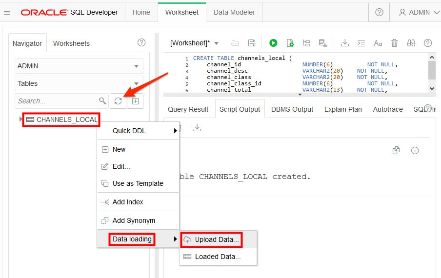

2.  The Upload Data Wizard is started. Click on **Select files** to select the file for data uploading and navigate to the **channels.csv** file that you downloaded in step 1 and upload it.

    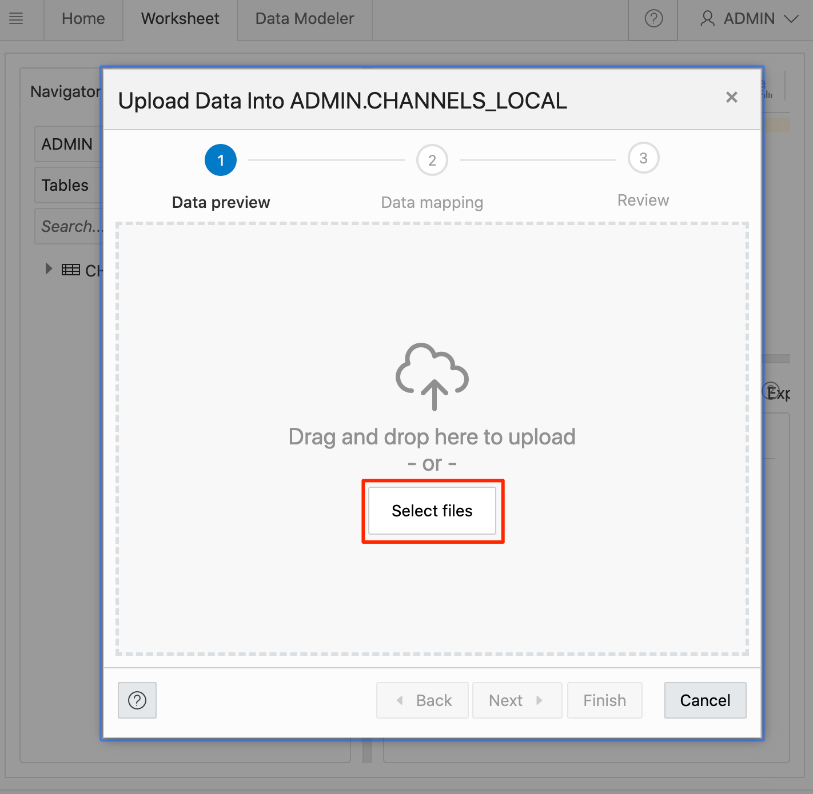

3.  Once you upload the file, step 1 of the Upload Data wizard provides a **Data preview**. You can click the **Show/Hide options** button to perform actions including skipping rows and limiting rows to upload. Use the horizontal toolbar to check the data. When you are satisfied with the file's data, click **Next**.

    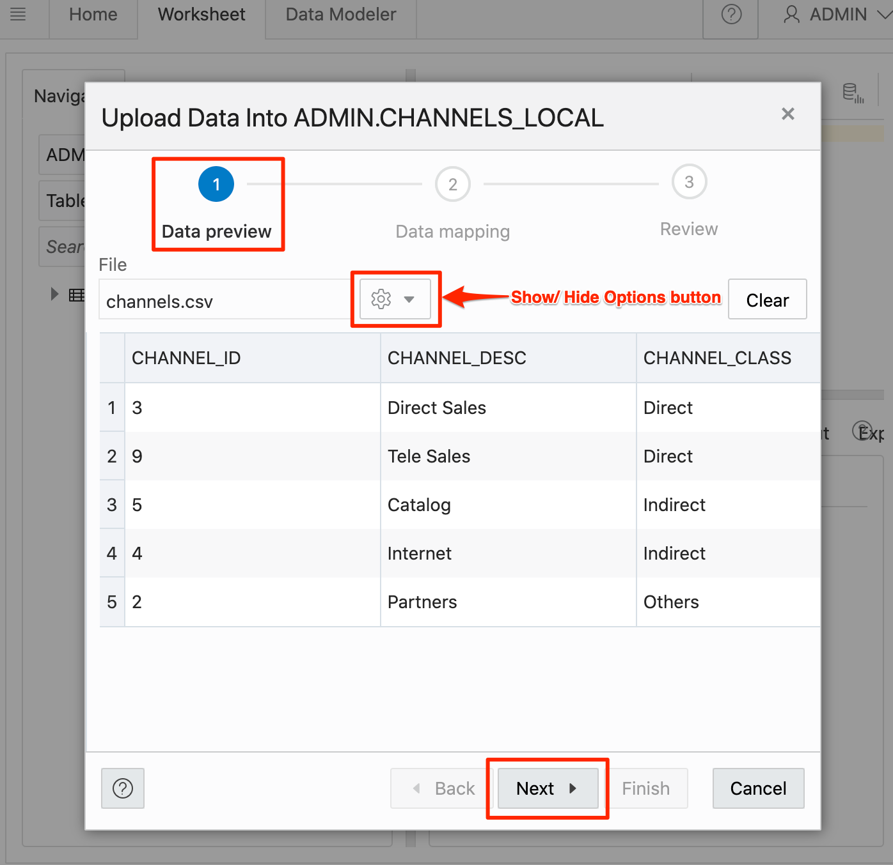

    <!--When newline is fixed -->

    *Note - If your source .csv file has delimiters other than commas between words, or line delimiters other than new-line characters, you will need to use SQL Developer for now, rather than SQL Developer Web.*

4.  In Step 2 of the Upload Wizard, **Data mapping**, you can change the source-to-target data mappings. For this exercise, leave them as default and click **Next**.

    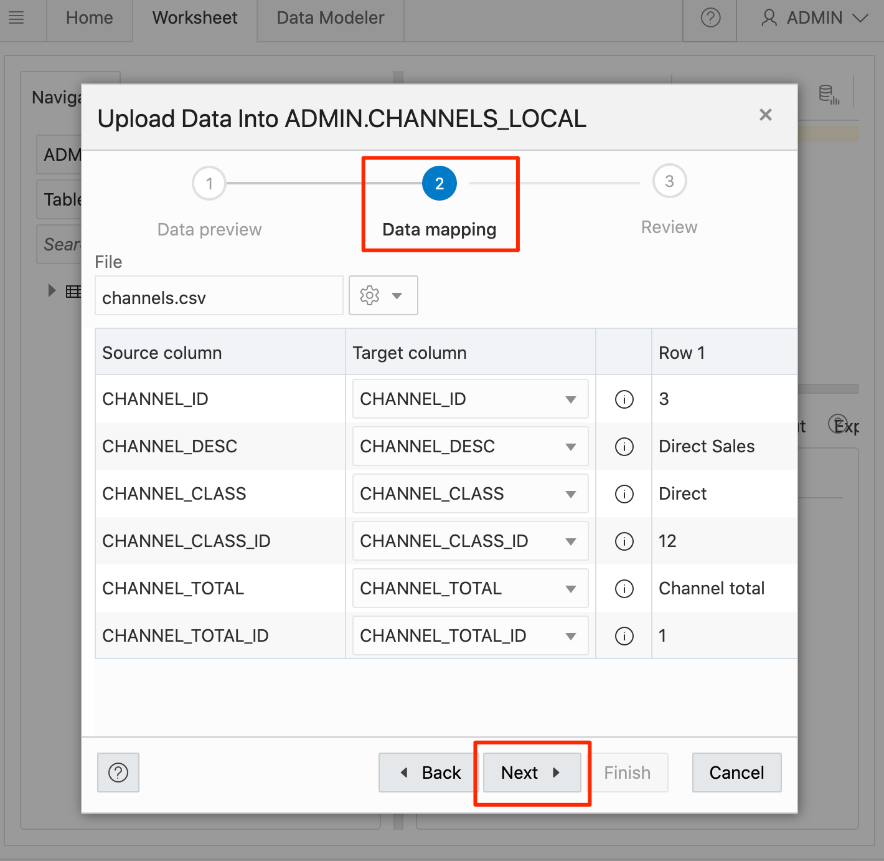

5.  The final step of the Upload Wizard, **Review**, reflects all of the choices you made in the Wizard. Click **FINISH** to load the data into your newly created table *CHANNELS_LOCAL*.

    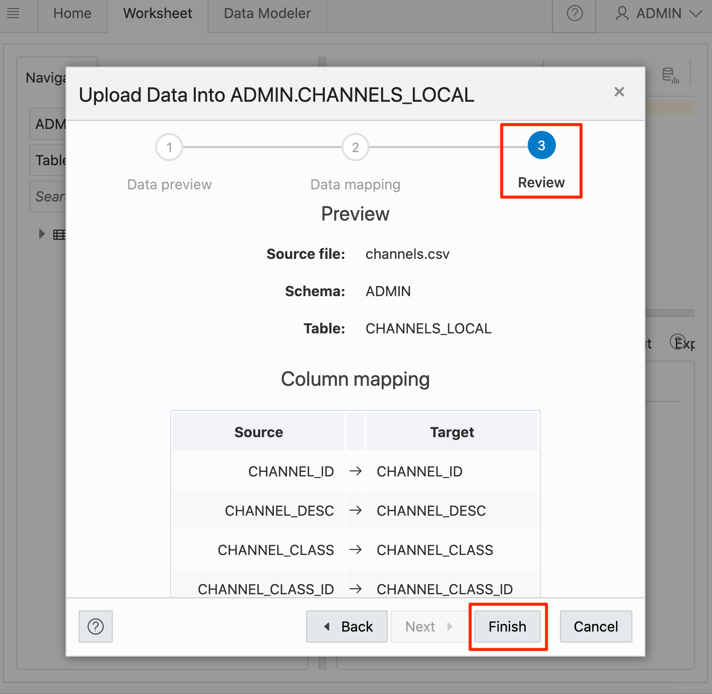

6.  Click **OK** to confirm the upload the data. Depending on the size of the data file you are uploading, the upload may take some time.

    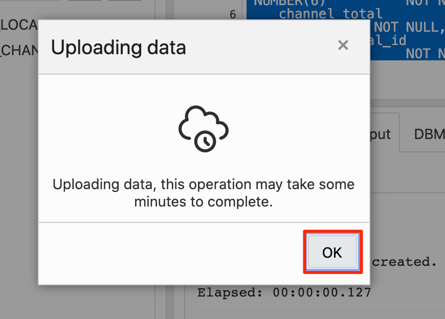

7.  If you don't see data loaded in your object tree under Tables, hit refresh.

    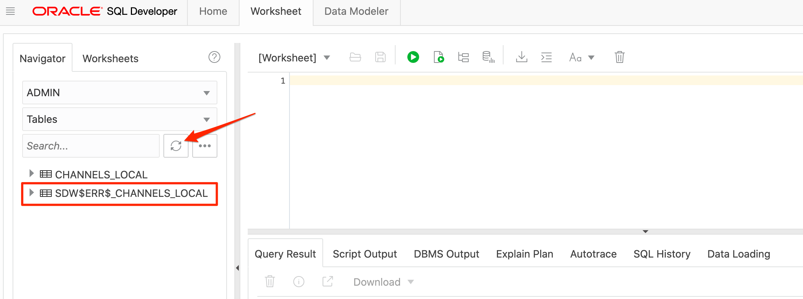

## STEP 3: Download Sample Data and Create Target Tables

In Steps 1 and 2, you created an ADW table and loaded it with sample data from your local file system. Now, you will create several ADW tables and load them with sample data that you stage to an OCI Object Store.

1.  For this step, you will need a handful of data files. Click <a href="./files/files.zip" target="\_blank">here</a> to download files zip file of the sample source files to upload to the object store. Unzip it to a directory on your local computer.

2.  Connected as your admin user in SQL Developer Web, copy and paste <a href="./files/create_tables.txt" target="\_blank">this code snippet</a> to the worksheet. Take a moment to examine the script. Then click the **Run Script** button to run it.

    - Note that it is expected that you may get *ORA-00942: table or view does not exist* errors during the DROP TABLE commands for the first execution of the script, but you should not see any other errors.

    - Note that you do not need to specify anything other than the list of columns when creating tables in the SQL scripts. You can use primary keys and foreign keys if you want, but they are not required.

    

## STEP 4: Navigate to Object Storage and Create Bucket

In OCI Object Storage, a bucket is a terminology for a container of multiple files.

1.  Now you set up the OCI Object Store. From the Autonomous Data Warehouse console, click on the hamburger menu on the top-left corner and select **Object Storage > Object Storage**.

    - To learn more about the OCI Object Storage, refer to its <a href="https://docs.us-phoenix-1.oraclecloud.com/Content/GSG/Tasks/addingbuckets.htm" target="\_blank">documentation</a>

    

2.  You should now be on the **Object Storage** page. Choose any compartment in the **Compartment** drop-down to which you have access. In this example, the **root** compartment is chosen.

    

3.  Click the **Create Bucket** button.

    

4.  Bucket names must be unique per tenancy and region; otherwise you will receive an "already exists" message. Enter a unique **Bucket Name** for your bucket, accept the defaults and click the **Create Bucket** button. In this example, **ADWCLab** bucket name is chosen.

    

## STEP 5: Upload Files to Your OCI Object Store Bucket

**Note:** As mentioned in the Prerequisites section, to upload data files to an object store in Oracle Cloud Infrastructure Object Storage, your cloud administrator or lab instructor **must** provide your cloud user with **read/write privileges** to the object store location where the data is to be stored.

1.  Click on your **Bucket Name** - ADWCLab to open it.

    

2.  Click on **Upload Objects**.

    

3.  Drag and drop, or click  **select files**, to select all the files from the unzipped files.zip file downloaded in Step 3 and upload them. Click on **Upload Objects** and wait for the upload to complete.

    

4.  If you are uploading individual file at a time, repeat this for all the files downloaded in Step 3 for this lab. When the upload is complete, click **Close.**

    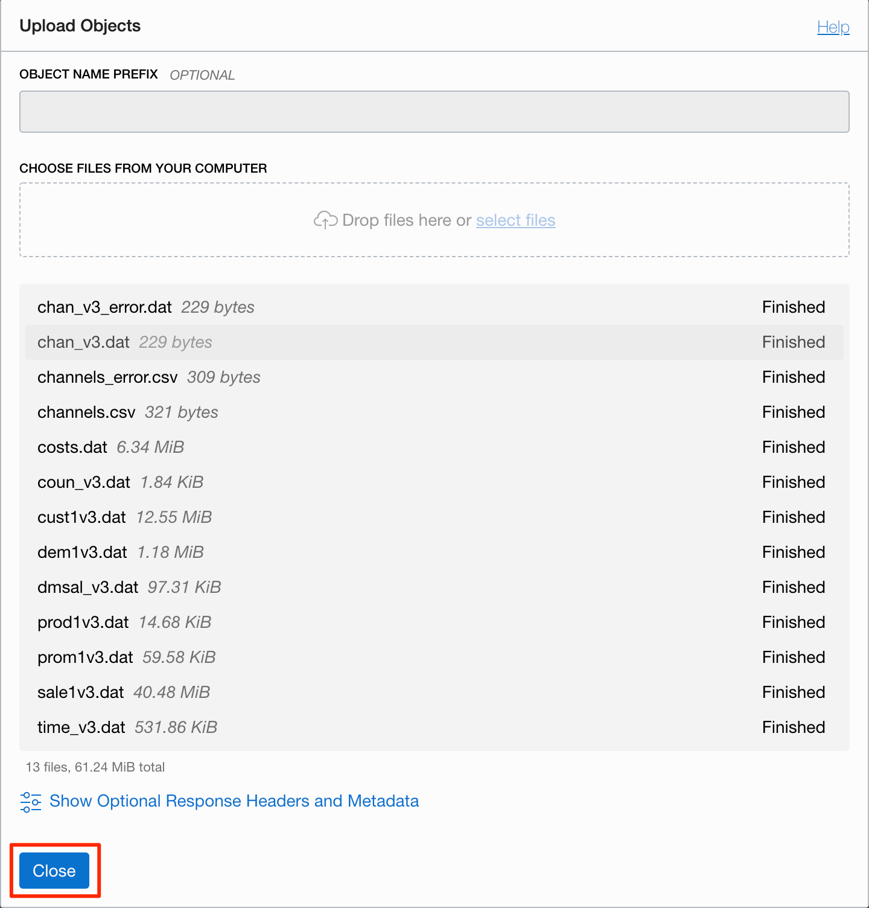

5.  The end result should look like this with all files listed under Objects.

    

## STEP 6: Object Store URL

1.  Copy following base URL that points to the location of your files staged in the OCI Object Storage. The simplest way to get the URL is by clicking on right-hand side ellipsis menu for an object in the object store and click on **View Object Details**. Copy and save the base URL in **URL Path(URI)**. We will use the base URL in the upcoming steps.

    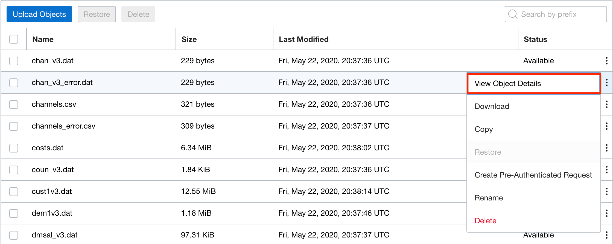

    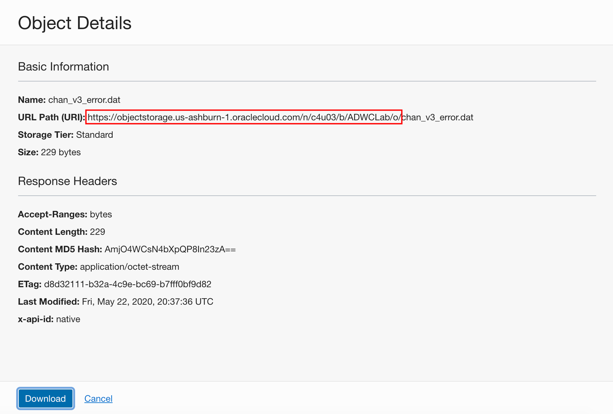

2.  Take a look at the URL you copied. In this example above, the **region name** is us-ashburn-1, the **Namespace** is c4u03, and the **bucket name** is ADWCLab.

    *Note: The URL can also be constructed as below:*

    `https://objectstorage.<`**region name**`>.oraclecloud.com/n/<`**namespace name**`>/b/<`**bucket name**`>/o`

## STEP 7: Creating an Object Store Auth Token

To load data from the Oracle Cloud Infrastructure(OCI) Object Storage you will need an OCI user with the appropriate privileges to read data (or upload) data to the Object Store. The communication between the database and the object store relies on the native URI, and the OCI user Auth Token.

1.  Click on the **person icon** at the far upper right. From the drop-down menu, click on your **User Name** (remember this username could be an email).

    

    Note: If you don't see your user name in the drop-down menu, you might be a "federated" user. In that case, go to the menu on the left side and open Users. Federated users are “federated” from another user service, whether it is an Active Directory LDAP type service or users from the older OCI Classic.

2.  View the user details and copy the **User Name** as you will need that in the next steps.

    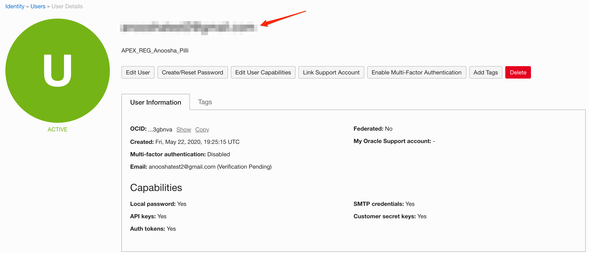

3.  On the left side of the page, click **Auth Tokens**.

    

4.  Click on **Generate Token**.

    

5.  Enter a meaningful **description** for the token and click **Generate Token**.

    

6.  The new Auth Token is displayed. Click **Copy** to copy the Auth Token to the clipboard. You probably want to save this in a temporary notepad. You will use it in the next steps. *Note: You can't retrieve the Auth Token again after closing the dialog box.*

    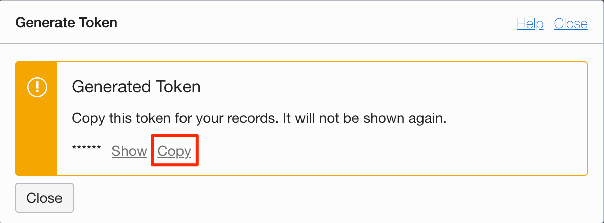

7.  Click **Close** to close the Generate Token dialog.

## STEP 8: Create a Database Credential for Your User

In order to access data in the Object Store you have to enable your database user to authenticate itself with the Object Store using your OCI object store account and Auth token. You do this by creating a private CREDENTIAL object for your user that stores this information encrypted in your Autonomous Data Warehouse. This information is only usable for your user schema.

1.  Connected as your user in SQL Developer Web, copy and paste <a href="./files/create_credential.txt" target="\_blank">this code snippet</a> to a SQL Developer Web worksheet.

2.  In this example, the credential object named **OBJ\_STORE\_CRED** is created. You reference this credential name in the following steps. Specify the credentials for your Oracle Cloud Infrastructure Object Storage service.

    - Username - Enter the **OCI Username** you copied in step 7 (usually your email address, not your database username).
    - Password - is the OCI Object Store **Auth Token** you generated in the step 7.

    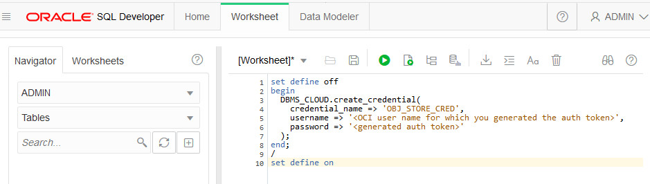

3.  Run the script.

    

4.  Now you are ready to load data from the Object Store.

## STEP 9: Loading Data from the Object Store Using the PL/SQL Package, DBMS_CLOUD

As an alternative to the wizard-guided data load, you can use the PL/SQL package **DBMS_CLOUD** directly. This is the preferred choice for any load automation.

1.  Connected as your user in SQL Developer Web, copy and paste <a href="./files/load_data_without_base_url.txt" target="\_blank">this code snippet</a> to a SQL Developer Web  worksheet. This script uses the **copy\_data** procedure of the **DBMS\_CLOUD** package to copy the data in the source files to the target tables you created before.

2.  Specify the Object Store base URL that you copied and saved in the step 6. For each **file\_uri\_list** statement -

    - Change us-phoenix-1 to your real region name. The name is case-sensitive.
    - Change idthydc0kinr to your real namespace. The name is case-sensitive.
    - Change ADWCLab to your real bucket name. The name is case-sensitive.

    **Note:** In SQL Developer Web, you will soon be able to define the Object Store base URL once, to use as a variable in file\_uri\_list statements. This capability is already supported in the full Oracle SQL Developer client tool.

3.  For the **credential_name** parameter in the **copy\_data** procedure, it is the name of the credential you defined in the step 8 - **OBJ\_STORE\_CRED** . You can use that credential.

4.  For the **format** parameter, it is a list of **DBMS_CLOUD** options (you can read more about these options <a href="https://docs.oracle.com/en/cloud/paas/autonomous-data-warehouse-cloud/user/dbmscloud-reference.html">here</a>).

5.  Run the script.

    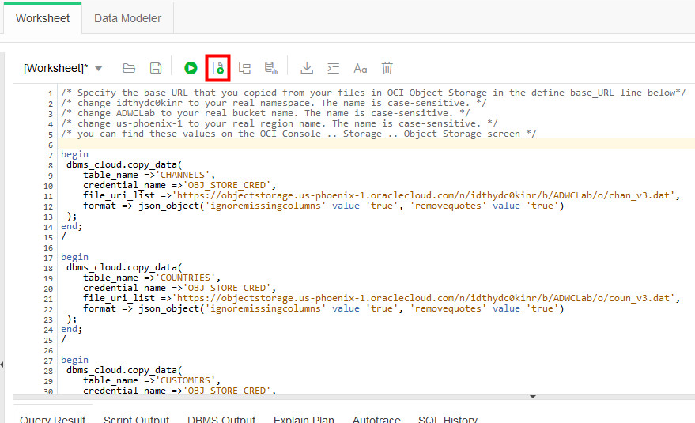

6.  You have successfully loaded the sample tables. You can now run any sample query in the <a href="https://docs.oracle.com/database/122/DWHSG/part-relational-analytics.htm#DWHSG8493" target="\_blank">relational analytics</a> section of the Oracle documentation. For example, to analyze the cumulative amount sold for specific customer IDs in quarter 2000, you could run the query in <a href="./files/query_tables.txt" target="\_blank">this code snippet</a> using the Run Script button.   <a href="https://docs.oracle.com/en/database/oracle/oracle-database/12.2/dwhsg/introduction-data-warehouse-concepts.html#GUID-452FBA23-6976-4590-AA41-1369647AD14D" target="\_blank">Click Here</a> to read more about Data Warehousing.

    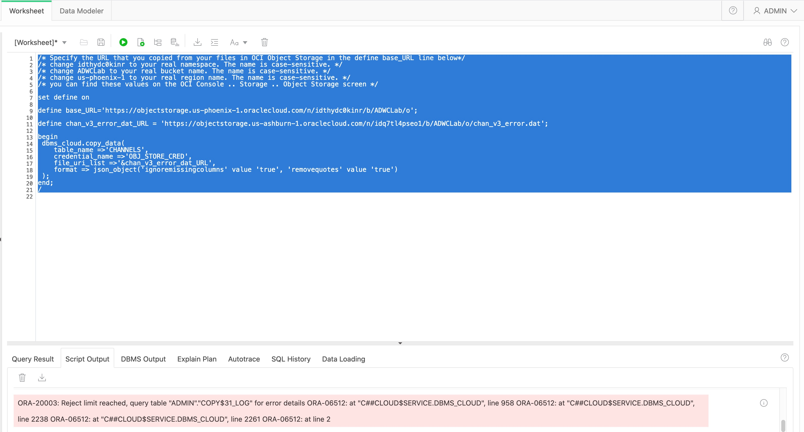

## STEP 10: Troubleshooting DBMS_CLOUD data loads

1.  Connected as your user in SQL Developer Web, run the following query to look at past and current data loads.

    ````
    <copy>
    select * from user_load_operations;
    </copy>
    line 2
    line 3
    line x
    ````

    *Notice how this table lists the past and current load operations in your schema. Any data copy and data validation operation will have backed up records in your cloud.*

2.  For an example of how to troubleshoot a data load, we will attempt to load a data file with the wrong format (chan\_v3\_error.dat). Specifically, the default separator is the **|** character, but the channels_error.csv file uses a semicolon instead.

    To attempt to load bad data, copy and paste <a href="./files/load_data_with_errors.txt" target="\_blank">this code snippet</a> to a SQL Developer Web worksheet. Let's specify the URL that points to the **chan\_v3\_error.dat** file you have copied and saved in step 6.

    - Change us-phoenix-1 to your real region name. The name is case-sensitive.
    - Change idthydc0kinr to your real namespace. The name is case-sensitive.
    - Change ADWCLab to your real bucket name. The name is case-sensitive.

    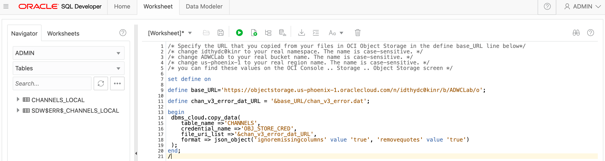

 3. Run the script as your user in SQL Developer Web. In the substitution variable pop-up for **chan\_v3\_error.dat_URL**, provide the complete URL copied for chan\_v3\_error.dat in step 6 and click **OK**. The substitution variable pop-up for **base_URL**, paste the URL copied for chan\_v3\_error.dat in step 6 without the filename and click **OK**. Expect to see "reject limit" errors when loading your data this time.

    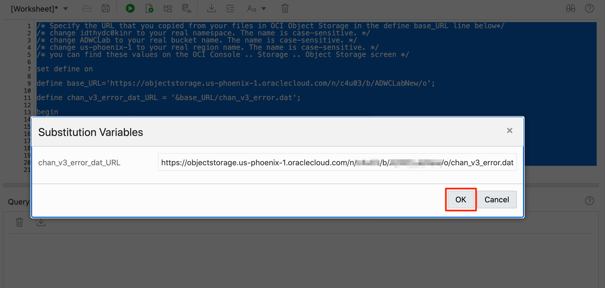

    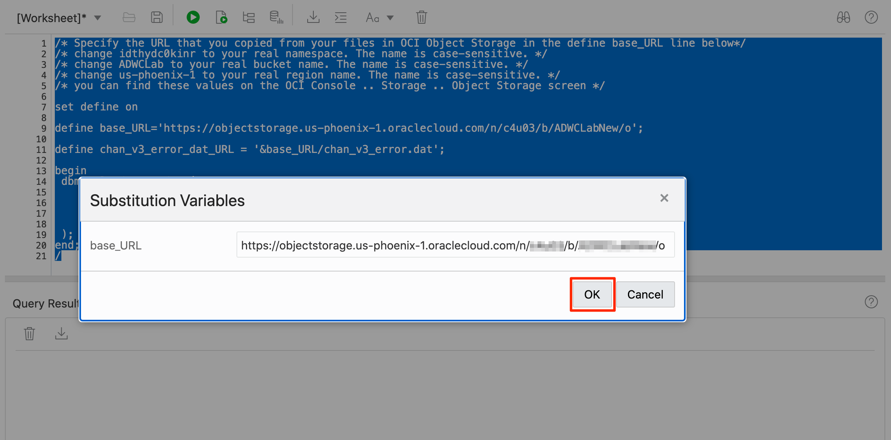

4.  Run the following query to see the load that errored out.

    ````
    <copy>
    select * from user_load_operations where status='FAILED';
    </copy>
    ````

    A load or external table validation that errors out is indicated by status=FAILED in this table. Get the names of the log and bad files for the failing load operation from the column **logfile\_table** and **badfile\_table**. The logfile\_table column shows the name of the table you can query to look at the log of a load operation. The column badfile_table shows the name of the table you can query to look at the rows that got errors during loading.

    

5.  Query the log and bad tables to see detailed information about an individual load. In this example, the names are copy$25\_log and copy$25\_bad respectively.

    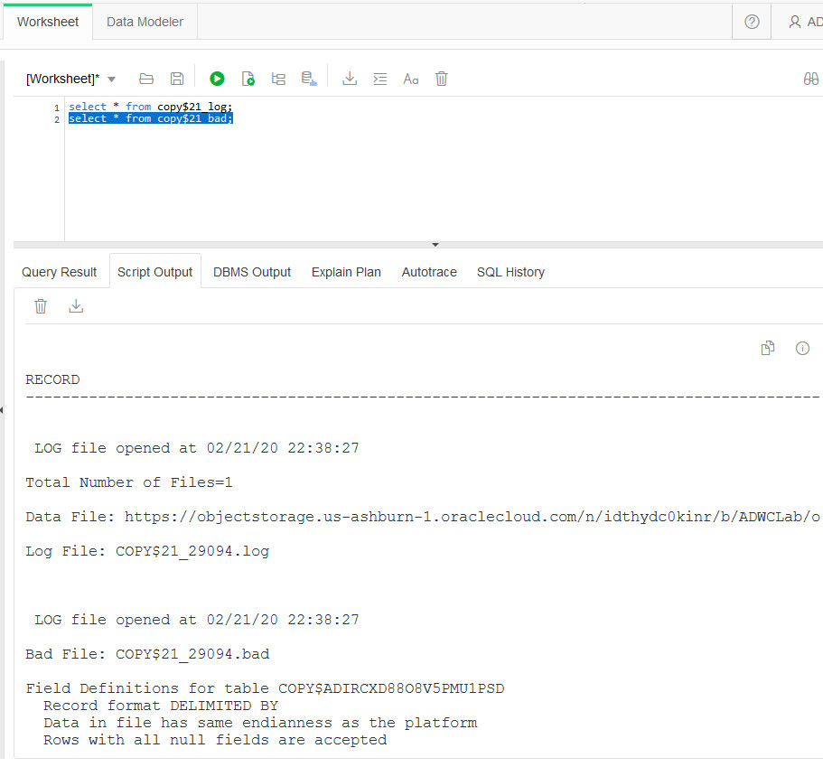

6.  To learn more about how to specify file formats, delimiters, reject limits, and more, review the <a href="https://docs.oracle.com/en/cloud/paas/autonomous-data-warehouse-cloud/user/dbmscloud-reference.html" target="\_blank"> DBMS_CLOUD Package Format Options </a>.

Please proceed to the next lab.

## Want to Learn More?

Click [here](https://docs.oracle.com/en/cloud/paas/autonomous-data-warehouse-cloud/user/load-data.html#GUID-1351807C-E3F7-4C6D-AF83-2AEEADE2F83E) for documentation on loading data into an autonomous database.

## Acknowledgements

- **Author** - Nilay Panchal, ADB Product Management
- **Adapted for Cloud by** - Richard Green, Principal Developer, Database User Assistance
- **Last Updated By/Date** - Richard Green, March 2020

See an issue?  Please open up a request [here](https://github.com/oracle/learning-library/issues).   Please include the workshop name and lab in your request.
