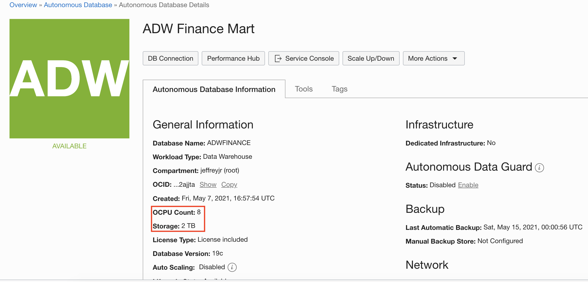

# Scaling and Performance in Your Autonomous Database

## Introduction

In this lab you will scale up your Oracle Autonomous Data Warehouse (ADW) or Autonomous Transaction Processing (ATP) service to have more CPUs. And you will watch a demo that shows the performance and concurrency impacts of scaling your service online.

### Objectives

-   Learn how to scale up an ADW or ATP service
-   Understand the performance and concurrency impacts of scaling your autonomous database service online

### Required Artifacts

-   The following lab requires an <a href="https://www.oracle.com/cloud/free/" target="\_blank">Oracle Public Cloud account</a>. If you don't already have your own cloud account then you can obtain a new cloud account through the free Oracle trial program.

### Lab Prerequisites

-   This lab assumes you have completed the **Login to Oracle Cloud** and **Provision ADB** labs seen in the menu on the right.

### Video Preview
Watch a video demonstration of monitoring an autonomous database in the Autonomous Data Warehouse cloud service.

## Step 1: Scaling your Autonomous Database Instance

1. Go back to the Cloud Console you used during the provisioning exercise and open the database instance's Details screen. From the **action menu**, click **Scale Up/Down**.

    

2.  Fill in the form with the following information.

    -   **CPU core count :** 8
    -   **Storage capacity:** 2 TB
    -   **Auto-Scaling:** Disabled
  
3.  Click **Update** after filling in the form. This will take you to the database instance's Details screen.

    

    *Note: The applications can continue running during the scale operation without downtime.*

4.  **Refresh** the page to see the result of the scaled operation.

    

## Step 2: Performance and Concurrency Benefits of Dynamic Scaling

1.  Watch a demo of the performance impact of scaling up your instance. It shows how you can dynamically scale up a database while the workload is running, to increase transaction throughput. Scaling up can also provide more concurrency for your users.

    

2.  In this example, scaling up the CPUs from 2 to 8 increased the transaction throughput from 2000 to 7500 transactions per second.

    

## Want to Learn More?

Click [here](https://docs.oracle.com/en/cloud/paas/autonomous-data-warehouse-cloud/user/autonomous-add-resources.html#GUID-DA72422A-5A70-42FA-A363-AB269600D4B0) for documentation on enabling auto-scaling.

## Acknowledgements

- **Author** - Nilay Panchal, ADB Product Management
- **Adapted for Cloud by** - Richard Green, Principal Developer, Database User Assistance
- **Last Updated By/Date** - Richard Green, March 2020
- **Contributors** - Jeffrey Malcolm Jr, Arabella Yao, June 2020

See an issue?  Please open up a request [here](https://github.com/oracle/learning-library/issues).   Please include the workshop name and lab in your request.
