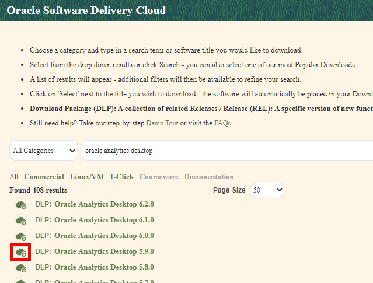
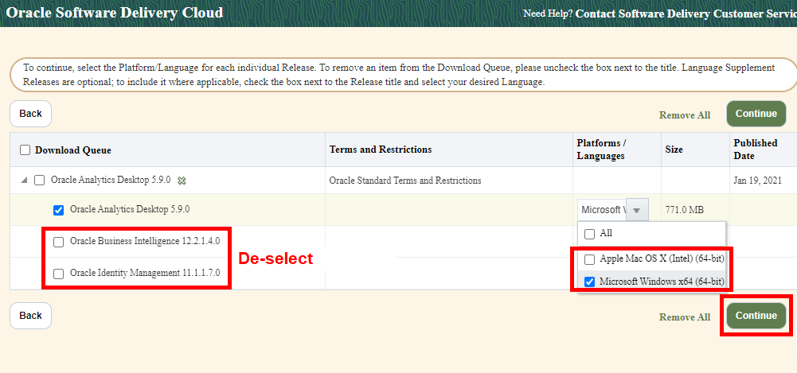
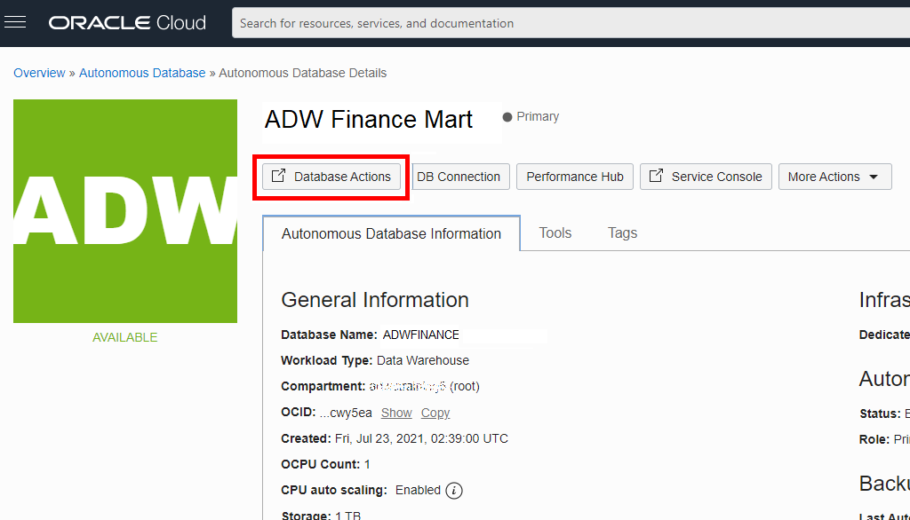

# Create rich data visualizations

## Introduction

This lab will walk you through the steps to connect *Oracle Analytics Desktop* (formerly Oracle Data Visualization Desktop) to an Oracle Autonomous Database, either in Autonomous Data Warehouse (ADW) or Autonomous Transaction Processing (ATP), and create data visualizations. Unlimited Oracle Analytics Desktop licenses are included when connecting to an ADW or ATP data source. You will receive instructions for connecting your previously created Oracle Autonomous Database instance (using sample data loaded into the database) to Oracle Analytics Desktop. We will show how you can immediately gain insights and create beautiful data visualizations.

Estimated Time: 20 minutes

Watch the video below for a quick walk through of the lab.

[](youtube:vUF4kNUbWNQ)

### Objectives
- Learn how to connect a desktop analytics tool to the powerful Autonomous Database
- Learn how to connect to the database from Oracle Analytics Desktop
- Learn how to create a simple data visualization project with Oracle Analytics Desktop
- Learn how to access and gain insights from data in the Autonomous Database

### Prerequisites
- This lab requires completion of the Provision Autonomous Database lab in the Contents menu on the left.

## Task 1: Download and install Oracle Analytics Desktop 5.9

1. Download *version 5.9* of *Oracle Analytics Desktop* (formerly Data Visualization Desktop) from <a href="https://edelivery.oracle.com/osdc/faces/SoftwareDelivery" target="\_blank">Oracle Software Delivery Cloud</a>. Do not use version 6.x of Oracle Analytics Desktop, as this lab's instructions and screenshots are for the 5.9 version. To download Oracle Analytics Desktop, follow these steps:

    > **Note:** This example shows installing Oracle Analytics Desktop to a Windows desktop. The steps for installing to an Apple Mac computer will be similar.

    Search for **oracle analytics desktop** in the search field. Click **Oracle Analytics Desktop** in the search results list.

    

    Click the icon to the left of **Oracle Analytics Desktop 5.9.0** to put it in your download queue.

    

    Click **Continue** to view the items in your download queue.

    

    De-select Oracle Business Intelligence and Oracle Identity Management. In the **Platforms / Languages** column, select your operating system and click **Continue**.

    

    Accept the terms and click **Continue** to download the installer executable file. In the next screen, click **Download**.

        

2. After saving the installer executable file, click the installer and follow the guided steps.

   

   

## Task 2: Create a view by executing the provided script in SQL Worksheet

Although you can connect to your Oracle Autonomous Database using local PC desktop tools like Oracle SQL Developer, you can conveniently access the browser-based SQL Worksheet directly from your ADW or ATP console.

For simplicity's sake, in this exercise, we will use the Oracle Sales History (SH) schema provided to create a simple view.

1. In your Database Details page, click the **Database Actions** button.

   

2. A sign-in page opens for Database Actions. For this lab, simply use your database instance's default administrator account, **Username - ADMIN** and click **Next**.

   

3. Enter the ADMIN **Password** you specified when creating the database and click **Sign in**.

    

4. The Database Actions page opens. In the **Development** box, click **SQL**.

    

5. In a SQL Worksheet, copy and execute the following script.  

      ```
      <copy>drop view DV_SH_VIEW;

      create or replace view DV_SH_VIEW as select
      P.PROD_NAME,
      P.PROD_DESC,
      P.PROD_CATEGORY,
      P.PROD_SUBCATEGORY,
      P.PROD_LIST_PRICE,
      S.QUANTITY_SOLD,
      S.AMOUNT_SOLD,
      X.CUST_GENDER,
      X.CUST_YEAR_OF_BIRTH,
      X.CUST_MARITAL_STATUS,
      X.CUST_INCOME_LEVEL,
      R.COUNTRY_NAME,
      R.COUNTRY_SUBREGION,
      R.COUNTRY_REGION,
      T.TIME_ID,
      T.DAY_NAME,
      T.CALENDAR_MONTH_NAME,
      T.CALENDAR_YEAR from
      SH.PRODUCTS P,
      SH.SALES S,
      SH.CUSTOMERS X,
      SH.COUNTRIES R,
      SH.TIMES T where
      S.PROD_ID=P.PROD_ID and
      S.CUST_ID=X.CUST_ID and
      S.TIME_ID=T.TIME_ID and
      X.COUNTRY_ID=R.COUNTRY_ID;
      </copy>
      ```

   

## Task 3: Create a connection to your Oracle Autonomous Database from Oracle Analytics Desktop

As ADW and ATP accept only secure connections to the database, you need to download a wallet file containing your credentials first. Download the wallet from either the instance's Details page, or from the ADW or ATP service console.

1. In your database's instance Details page, click **DB Connection**.

    

2. Use the Database Connection dialog to download client credentials.
    - Select a wallet type. For this lab, select **Instance Wallet**. This wallet type is for a single database only; this provides a database-specific wallet.
    - Click **Download Wallet**.

    

    > **Note:** Oracle recommends that you provide a database-specific wallet, using Instance Wallet, to your end users and for application use whenever possible. Use regional wallets only for administrative purposes that require potential access to all Oracle Autonomous Databases within a region.

3. Specify a password of your choice for the wallet. You will need this password when connecting Oracle Analytics Desktop to the database in the next step. Click **Download** to download the wallet file to your client machine.

    > **Note:** If you are prevented from downloading your Connection Wallet, it may be due to your browser's pop-up window blocker. Please disable it or create an exception for Oracle Cloud domains.

    

    Click **Close** when the download is complete.

4. Start **Oracle Analytics Desktop**. When Oracle Analytics Desktop opens, click **Connect to Oracle Autonomous Data Warehouse**.

   

5. In the **Create Connection** dialog, enter the following information:


   | Connection Info       | Entry                                             |  
   | --------------------- | :--------------------------------------------- |
   | Connection Name:      | Type in '**SALES_HISTORY**'                             |
   | Service Name:         | Scroll the drop-down field and select **adwfinance_high**, or the **high** service level of the database name you specified in Lab 1. |
   | Client Credentials:   | Click '**Select...**' and select the wallet zip file that you downloaded in Task 3.3. A file with .sso extension will appear in the field.   |
   | Username:             | Insert username created in earlier lab, likely **ADMIN**. Same username as SQL Worksheet and SQL Developer credentials. |                                            
   | Password              | Insert password created in earlier lab. Same password as SQL Worksheet and SQL Developer credentials. |

6. After completing the fields, click **Save**.

   

7. Click **Close** when the Save is complete.

8. Upon success of creating a new connection to the Autonomous Data Warehouse, click __Create__ and click __Data Set__.  

    

9. We will now choose the sales data we want to analyze and visualize in our first project. Select the connection we just created named __SALES_HISTORY__.

   

10. Click the __ADMIN__ schema in the Data Warehouse.

    > **Note:** If you do not see schemas because you are behind a firewall or on a VPN, you may need to use an alias or shut down the VPN to connect to your ADW database.*

   

11. Find and click the __DV\_SH\_VIEW__ table from the ADMIN schema.

   

12. First click the __Add All__ label in the left column, and type a new Name for the Data Set, naming it __SALES_HISTORY__. You may click __Get Preview Data__ at the bottom to see some example records. Click the __Add__ button to add the Data Set.

    > **Note:** It is important to use the new name of __SALES_HISTORY__, as the rest of the lab steps will reference that name.*

   

13. Once the __SALES_HISTORY__ Data Set is successfully created, click the navigation menu on the top left.

   

14. Select the __Data__ menu item on the left. This should reveal your new __SALES_HISTORY__ Data Set you created. Click it to open it up as a **Project**.

   

15. We are going to override the data types for two columns recognized as measures (that is, numeric), and correct them to be treated as attributes -- __CALENDAR\_YEAR__ and __CUST\_YEAR\_OF\_BIRTH__. Click the __CALENDAR\_YEAR__ column name under Data Elements, and change the __‘TreatAs’__ field to an __‘Attribute’__. Repeat for the field, __CUST\_YEAR\_OF\_BIRTH__.

   

## Task 4: Explore the data in your new project in Oracle Analytics Desktop

No matter what your role is in the organization, access to timely data can provide greater insights to improve the performance of your business. Whether you’re creating a data warehouse or a data mart for yourself or others, Oracle Autonomous Data Warehouse is making it far simpler than ever before.  Easy, fast, and elastic. This small project demonstrates this. This is how business users would interact with the Oracle Autonomous Data Warehouse.

*SCENARIO:* You work at an electronics reseller company. The founder started his business by selling camera and photography equipment. The founder has already diversified his business portfolio, as he already owns many 1-hour photo processing and video rental stores. Over the last few years, his computer reselling business has grown, but he is not convinced that the PC/server business will last. His instincts tell him to continue to focus on growing his photography equipment and supplies business rather than PCs. If you had access to this Oracle technology and solution, what would this data tell you? What insights could you share? How could this data help him focus on the right investments, grow his business, and better target his existing and potential customers?

1. We will first start by browsing the data that is available in our Data Set. Click the highlighted __Prepare__ button.  

   Notice how easy it is to browse the data elements to see what is available for you to further explore. After scrolling through the data, click the highlighted __Visualize__ option to bring up the blank canvas.

   

## Task 5: Create your first data visualization

1. We will now create a very simple visualization project to finish this part of the lab. Multi-select (ctrl+click) the 5 Data Elements within __SALES\_HISTORY__, including __PROD\_NAME__, __AMOUNT\_SOLD__, __CALENDAR\_YEAR__, __PROD\_CATEGORY__, and __QUANTITY\_SOLD__.  

2. Drag the five selected data elements to the middle of the screen.
   

3. Based upon this data, Oracle Analytics Desktop will choose a default visualization. If not, choose the __Scatter__ chart, so that the visualization matches the view below.

   

 You may **Save** this project if you need. At this point, with very few steps, you now have something that can further bring your data to life and you can begin to make some data-driven decisions. As you share this with others, more people will want to gain access to and benefit from the data. To enable this, the Oracle Autonomous Database in ADW or ATP is easy to use, fast, elastic, and will be able to quickly scale to meet your growing data and user base.

## (Optional) **Task 6**: Exporting your DVA (project) file

This task enables you to share your project file with colleagues.

1. Click the menu at the top left corner of the screen, and select __Home__.

2. Your new project (DVA) will appear on the Home page, under __Projects__.  Click the menu at the bottom right corner of your project tile and choose __Export__.

     

3. Choose to export as a __File__. Email may work if Oracle Analytics Desktop is able to interact with your local email client. Cloud provides the mechanism to upload and share your project to Oracle Analytics Cloud. See the <a href="https://docs.oracle.com/en/cloud/paas/analytics-cloud/acsgs/what-is-oracle-analytics-cloud.html#GUID-E68C8A55-1342-43BB-93BC-CA24E353D873" target="\_blank">Oracle Analytics Cloud documentation</a>.

4. Choose the Export option as shown below and save the DVA file to your Desktop.

     

## Learn more

View [documentation on working with analytics and visualization of data](https://docs.oracle.com/en/cloud/paas/autonomous-data-warehouse-cloud/user/create-reports-analytics.html#GUID-30A575A6-2CAD-4A8A-971E-2F751C8E6F90) in your Autonomous Database.

## **Acknowledgements**

- **Author** - Nilay Panchal, Oracle Autonomous Database Product Management
- **Adapted for Cloud by** - Richard Green, Principal Developer, Database User Assistance
- **Last Updated By/Date** - Richard Green, November 2021
