# Creating Rich Data Visualizations

## **Introduction**

This lab will walk you through the steps to connect *Oracle Analytics Desktop* (formerly Oracle Data Visualization Desktop) to an Oracle Autonomous Database, either in Autonomous Data Warehouse (ADW) or Autonomous Transaction Processing (ATP), and create data visualizations.  Unlimited Oracle Analytics Desktop licenses are included when connecting to an ADW  or ATP data source.  Instructions will be provided to connect your previously created Autonomous Database instance (using sample data loaded into the database) to Oracle Analytics Desktop.  We will demonstrate how you can immediately gain insights and create beautiful data visualizations.

### Objectives
- Learn how to connect a desktop analytics tool to the powerful Autonomous Database
- Learn how to connect to the database using SQL Developer Web
- Learn how to create a simple data visualization project with Oracle Analytics Desktop
- Learn how to access and gain insights from data in the Autonomous Database


### Prerequisites
- Obtained an Oracle Cloud account
- Created a new autonomous database instance in ADW or ATP
- Installation of Oracle Analytics Desktop (free with Autonomous Data Warehouse). If you already have Oracle Analytics Desktop installed, please check the version. The recommended version is 5.5.0 or greater, to connect to your Oracle Autonomous Database.
- Access to an existing Autonomous Data Warehouse instance.

## **STEP 1**: Installing Oracle Analytics Desktop on a Windows Desktop

1. Download the latest version of *Oracle Analytics Desktop* (formerly Data Visualization Desktop) from <a href="http://www.oracle.com/technetwork/middleware/oracle-data-visualization/downloads/oracle-data-visualization-desktop-2938957.html" target="\_blank"> here</a>.

2. After saving the installer executable file, click on the installer and follow the guided steps.


   

   


## **STEP 2**: Create a View by Executing the Provided Script in SQL Developer Web

Although you can connect to your autonomous database using local PC desktop tools like Oracle SQL Developer, you can conveniently access the browser-based SQL Developer Web directly from your ADW or ATP console.

For simplicity's sake, in this exercise, we will use the Oracle Sales History (SH) schema provided to create a simple view.

1. In your Database Details page, click the **Tools** tab.

   

2. The Tools page provides you access to SQL Developer Web, Oracle Application Express, Oracle ML User Administration, etc. In the SQL Developer Web box, click **Open SQL Developer Web**.

   

3. A sign-in page opens for SQL Developer Web. For this lab, simply use your database instance's default administrator account, ADMIN, with the ADMIN password you specified when creating the database. Click **Sign in**.

   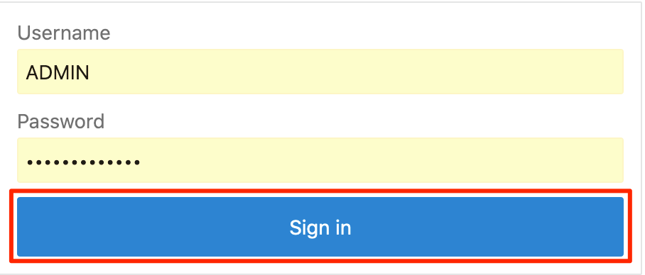

4. SQL Developer Web opens on a Worksheet tab. The first time you open SQL Developer Web, a series of pop-up informational boxes introduce the main features.

   

5. In a SQL Developer Web worksheet, copy and execute the following script.  

      ```
      <copy>drop view DV_SH_VIEW;

      create or replace view DV_SH_VIEW as select
      P.PROD_NAME,
      P.PROD_DESC,
      P.PROD_CATEGORY,
      P.PROD_SUBCATEGORY,
      P.PROD_LIST_PRICE,
      S.QUANTITY_SOLD,
      S.AMOUNT_SOLD,
      X.CUST_GENDER,
      X.CUST_YEAR_OF_BIRTH,
      X.CUST_MARITAL_STATUS,
      X.CUST_INCOME_LEVEL,
      R.COUNTRY_NAME,
      R.COUNTRY_SUBREGION,
      R.COUNTRY_REGION,
      T.TIME_ID,
      T.DAY_NAME,
      T.CALENDAR_MONTH_NAME,
      T.CALENDAR_YEAR from
      SH.PRODUCTS P,
      SH.SALES S,
      SH.CUSTOMERS X,
      SH.COUNTRIES R,
      SH.TIMES T where
      S.PROD_ID=P.PROD_ID and
      S.CUST_ID=X.CUST_ID and
      S.TIME_ID=T.TIME_ID and
      X.COUNTRY_ID=R.COUNTRY_ID;
      </copy>
      ```


   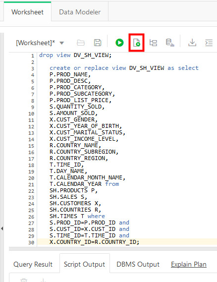

## **STEP 3**: Create a Connection to Your Autonomous Database from Oracle Analytics Desktop

As ADW and ATP accept only secure connections to the database, you need to download a wallet file containing your credentials first. The wallet can be downloaded either from the instance's Details page, or from the ADW or ATP service console.

1. In your database's instance Details page, click **DB Connection**.

    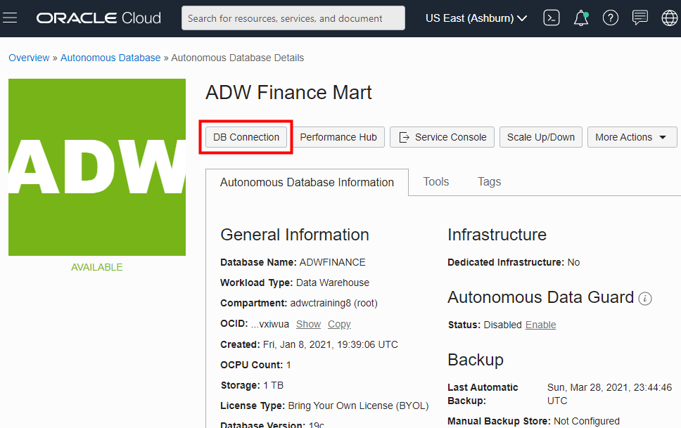

2. Use the Database Connection dialog to download client credentials.
    - Select a wallet type. For this lab, select **Instance Wallet**. This wallet type is for a single database only; this provides a database-specific wallet.
    - Click **Download Wallet**.

    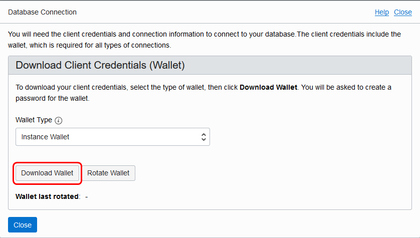

   *Note: Oracle recommends that you provide a database-specific wallet, using Instance Wallet, to end users and for application use whenever possible. Regional wallets should only be used for administrative purposes that require potential access to all Autonomous Databases within a region.*

3. Specify a password of your choice for the wallet. You will need this password when connecting Oracle Analytics Desktop to the database in the next step. Click **Download** to download the wallet file to your client machine.

   *Note: If you are prevented from downloading your Connection Wallet, it may be due to your browser's pop-up window blocker. Please disable it or create an exception for Oracle Cloud domains.*

    

    Click **Close** when the download is complete.

4. Start **Oracle Analytics Desktop**. When Oracle Analytics Desktop opens, click **Connect to Oracle Autonomous Data Warehouse**.

   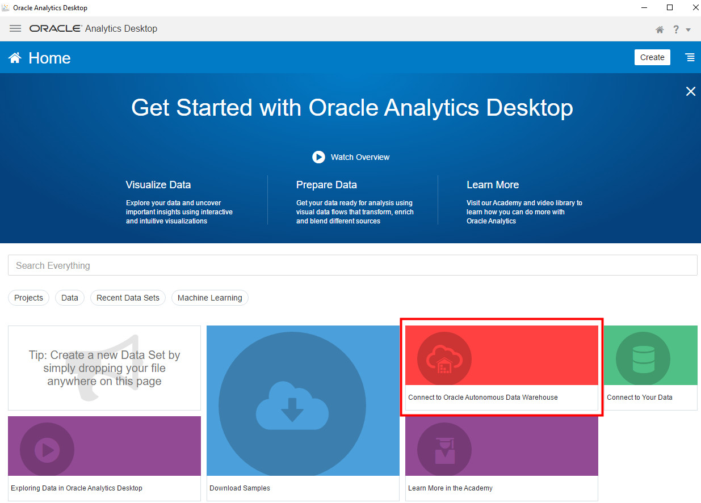

5. In the **Create Connection** dialog, enter the following information:


   | Connection Info       | Entry                                             |  
   | --------------------- | :--------------------------------------------- |
   | Connection Name:      | Type in '**SALES_HISTORY**'                             |
   | Service Name:         | Scroll the drop-down field and select **adwfinance_high**, or the **high** service level of the database name you specified in Lab 1. |
   | Client Credentials:   | Click '**Select...**' and select the wallet zip file that you downloaded in Step 3.3. A file with .sso extension will appear in the field.   |
   | Username:             | Insert username created in previous labs, likely **ADMIN**.  Same username as SQL Developer Web and SQL Developer credentials. |                                            
   | Password              | Insert password created in previous labs.  Same password as SQL Developer Web and SQL Developer credentials. |

6. After completing the fields, click **Save**.

   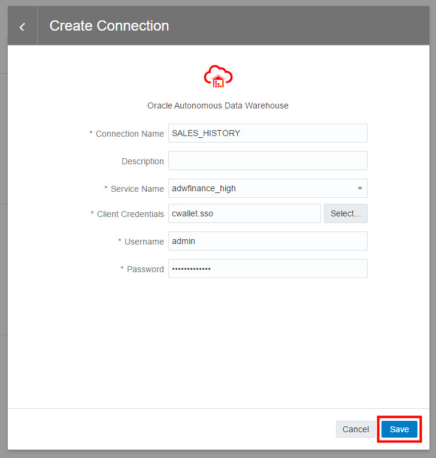

7. Click **Close** when the Save is complete.

8. Upon success of creating a new connection to the Autonomous Data Warehouse, click __Create__ and click __Data Set__.  

    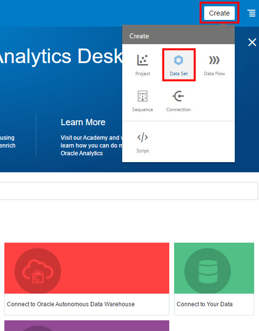

9. We will now choose the sales data we want to analyze and visualize in our first project.  Select the connection we just created named __SALES_HISTORY__.

   

10. Click the __ADMIN__ schema in the Data Warehouse.

    *Note: If you do not see schemas because you are behind a firewall or on a VPN, you may need to use an alias or shut down the VPN to connect to your ADW database.*

   

11. Find and click the __DV\_SH\_VIEW__ table from the ADMIN schema.

   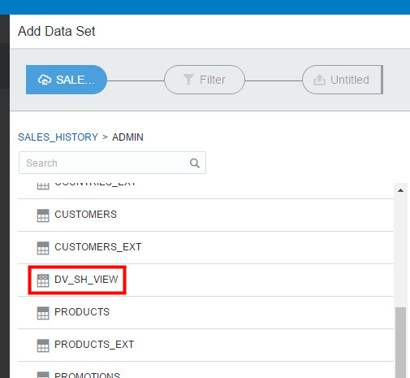

12. First click the __Add All__ label in the left column, and type a new Name for the Data Set, naming it __SALES_HISTORY__. You may click __Get Preview Data__ at the bottom to see some example records. Click the __Add__ button to add the Data Set.

  *NOTE: It is important to use the new name of __SALES_HISTORY__, as the rest of the lab steps will reference that name.*

   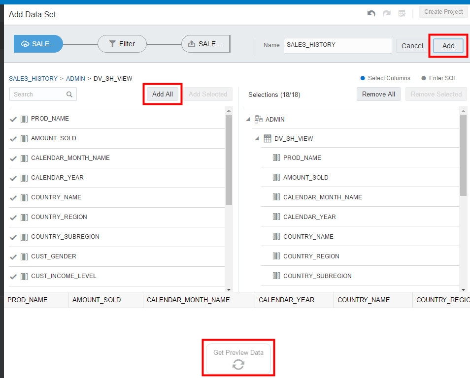

13. Once the __SALES_HISTORY__ Data Set has successfully been created, click on the main menu on the top left.

   

14. Select the __Data__ menu option on the left.  This should reveal your new __SALES_HISTORY__ Data Set you created.  Click it to open it up as a **Project**.

   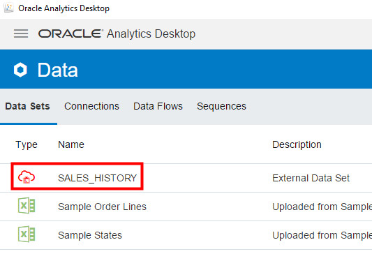

15. We are going to override the data types for two columns recognized as measures (i.e. numeric), and correct them to be treated as attributes -- __CALENDAR\_YEAR__ and __CUST\_YEAR\_OF\_BIRTH__.  Click the __CALENDAR\_YEAR__ column name under Data Elements, and change the __‘TreatAs’__ field to an __‘Attribute’__.  Repeat for the field, __CUST\_YEAR\_OF\_BIRTH__.

   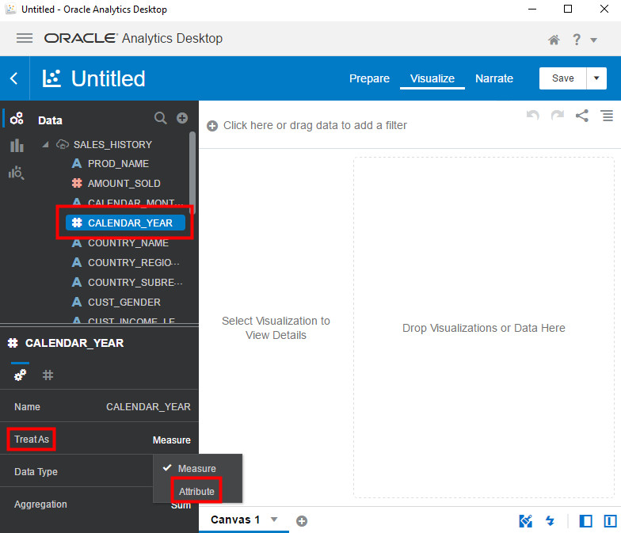

## **STEP 4**: Explore the Data in your New Project in Oracle Analytics Desktop

No matter what your role is in the organization, access to data timely can provide greater insights to improve the performance of your business.  Whether you’re creating a data warehouse or a data mart for yourself or others, Autonomous Data Warehouse is making it far simpler than ever before.  Easy, fast, and elastic.   This small project demonstrates this.  This is how business users would interact with the Autonomous Data Warehouse.

*SCENARIO:* You work at an electronics reseller company. The founder started his business by selling camera and photography equipment.  He has already diversified his business portfolio, as he already owns many 1-hour photo processing and video rental stores.  Over the last few years, his computer reselling business has grown, but he is not convinced that the PC/server business will last.  His instincts tell him to continue to focus on growing his photography equipment and supplies business rather than PCs.  If you had access to this Oracle technology and solution, what would this data tell him?  What insights could you share?  How could this data help him focus on the right investments, grow his business, and better target his existing and potential customers?

1. We will first start by browsing the data that is available in our Data Set. Click the highlighted __Prepare__ button.  

   Notice how easy it is to browse the data elements to see what is available for you to further explore.  After scrolling through the data, click the highlighted __Visualize__ option to bring up the blank canvas.

   

## **STEP 5**: Create Your First Data Visualization

1. We will now create a very simple visualization project to finish this part of the lab.  Multi-select (ctrl+click) the 5 Data Elements within __SALES\_HISTORY__, including __PROD\_NAME__, __AMOUNT\_SOLD__, __CALENDAR\_YEAR__, __PROD\_CATEGORY__, and __QUANTITY\_SOLD__.  

2. Drag the five selected data elements to the middle of the screen.
   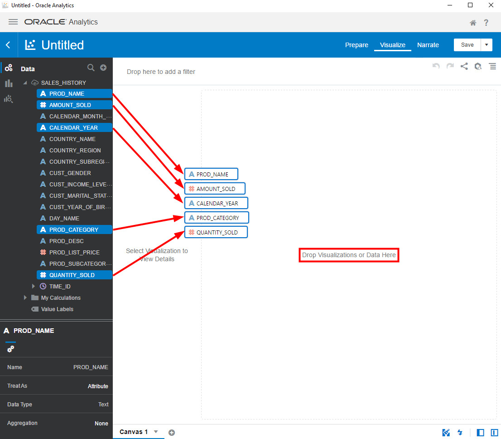

3. Based upon this data, Oracle Analytics Desktop will choose a default visualization.  If not, choose the __Scatter__ chart, so that the visualization matches the view below.

   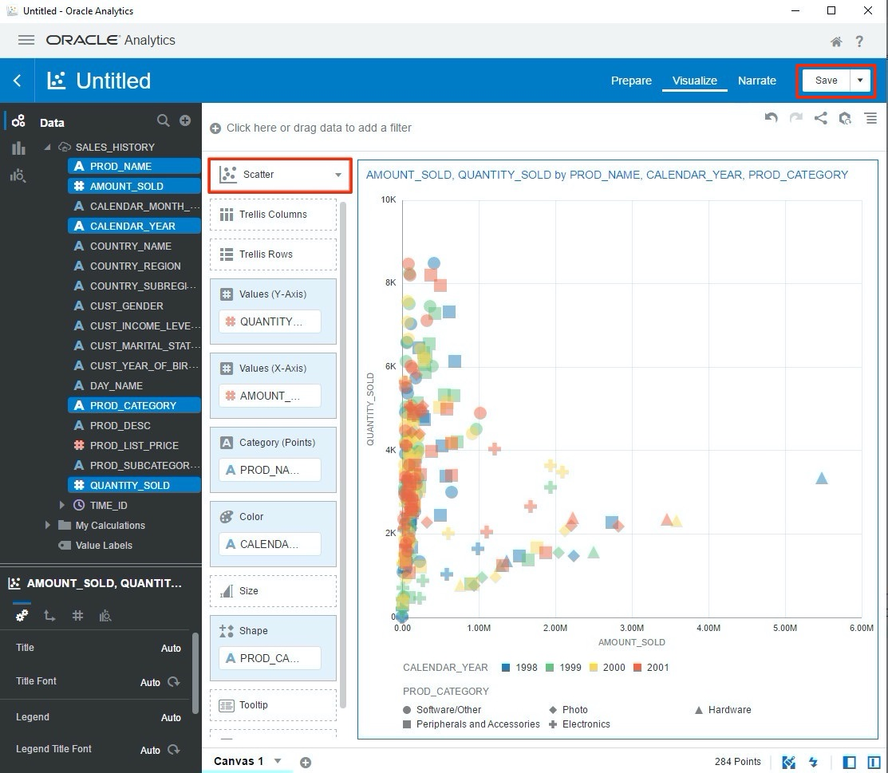

 You may **Save** this project if you need. At this point, with very few steps, you now have something that can further bring your data to life and you can begin to make some data-driven decisions.  As you share this with others, more people will want to gain access to and benefit from the data. To enable this, the Oracle Autonomous Database in ADW or ATP is easy to use, fast, elastic, and will be able to quickly scale to meet your growing data and user base.

## (Optional) **STEP 6**: Exporting your DVA (project) File

This step enables you to share your project file with colleagues.

1. Click the menu at the top left corner of the screen, and select __Home__.

2. Your new project (DVA) will appear on the Home page, under __Projects__.  Click the menu at the bottom right corner of your project tile and choose __Export__.

     

3. Choose to export as a __File__.  Email may work if Oracle Analytics Desktop is able to interact with your local email client.  Cloud provides the mechanism to upload and share your project to <a href="https://cloud.oracle.com/en_US/oac" target="\_blank">Oracle Analytics Cloud</a>.

4. Choose the Export option as shown below and save the DVA file to your Desktop.

     

Please *proceed to the next lab*.

## Want to Learn More?

Click [here](https://docs.oracle.com/en/cloud/paas/autonomous-data-warehouse-cloud/user/create-reports-analytics.html#GUID-30A575A6-2CAD-4A8A-971E-2F751C8E6F90) for documentation on working with analytics and visualization of data in your Autonomous Database.

## **Acknowledgements**

- **Author** - Nilay Panchal, ADB Product Management
- **Adapted for Cloud by** - Richard Green, Principal Developer, Database User Assistance
- **Last Updated By/Date** - Arabella Yao, Product Manager Intern, DB Product Management, July 2020

## See an issue?
Please submit feedback using this [form](https://apexapps.oracle.com/pls/apex/f?p=133:1:::::P1_FEEDBACK:1). Please include the *workshop name*, *lab* and *step* in your request.  If you don't see the workshop name listed, please enter it manually. If you would like for us to follow up with you, enter your email in the *Feedback Comments* section.
