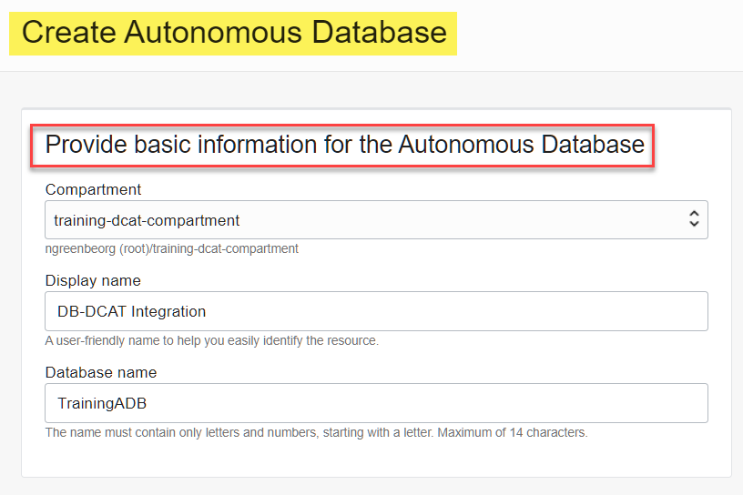
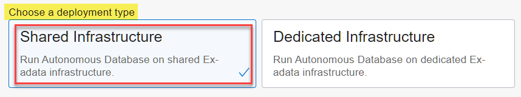
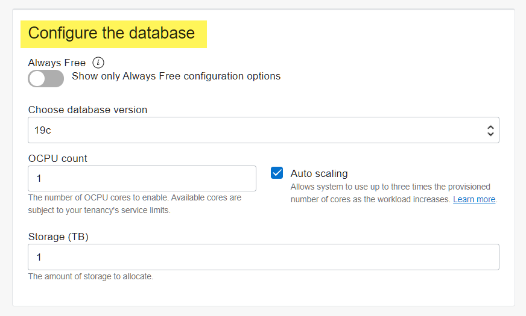
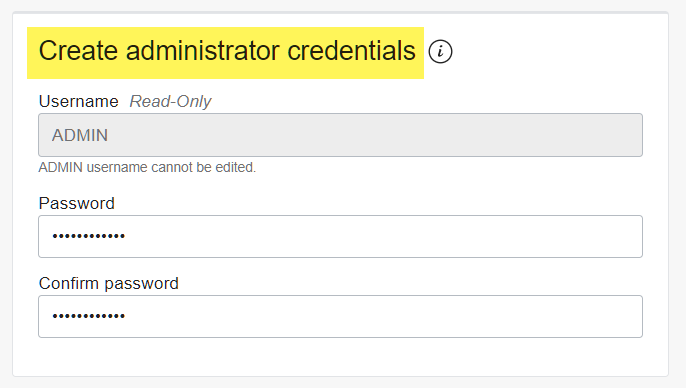
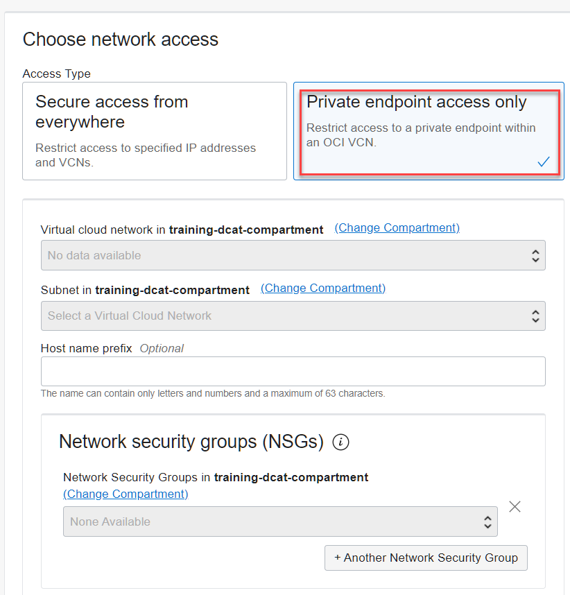
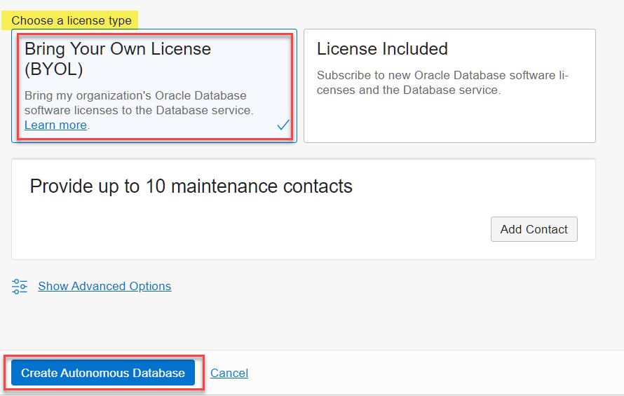

## Introduction

This lab walks you through the steps to provision a new Autonomous Data Warehouse (ADW) instance.

Estimated Lab Time: 5 minutes

### Objectives

In this lab, you will:

-   Learn how to provision a new Autonomous Database

### Prerequisites

To complete this lab, you need to have the following:

- Logged into your Oracle Cloud Account

## **STEP 1:** Log in to the Oracle Cloud Console

1. Log in to the **Oracle Cloud Console** as the Cloud Administrator. You will complete all the labs in this workshop using this Cloud Administrator.
See [Signing In to the Console](https://docs.cloud.oracle.com/en-us/iaas/Content/GSG/Tasks/signingin.htm) in the _Oracle Cloud Infrastructure_ documentation.

2. On the **Sign In** page, select your tenancy, enter your username and password, and then click **Sign In**. The **Oracle Cloud Console** Home page is displayed.

## **STEP 2**: Create an Autonomous Database Instance

1. Open the **Navigation** menu and click **Oracle Database**. Under **Oracle Database**, click **Autonomous Database**.

2. On the **Autonomous Databases** page, make sure **`training-dcat-compartment`** is selected in the **Compartment** drop-down list in the **List Scope** section. click **Create Autonomous Database**. The **Create Autonomous Database** page is displayed.

3. In the **Provide basic information for the Autonomous Database** section, specify the following:
       * **Compartment:** **`training-dcat-compartment`**.
       * **Display Name:** **`DB-DCAT Integration`**.
       * **Database Name:** **`TrainingADB`**.

       

4. In the **Choose a workload type** section, accept the **Data Warehouse** default selection.

       

5. In the **Choose a deployment type** section, accept the **Shared Infrastructure** default selection.

       

6. In the **Configure the database** section, specify the following:

       * **Always Free:** Disabled. If your Cloud Account is an Always Free account, you can select this option to create an Always Free autonomous database. An always free database comes with **1 CPU** and **20 GB** of storage. For this lab, we recommend you leave **Always Free** disabled.
       * **Choose Database version:** **`19c`**.
       * **OCPU count:** **`1`**.   
       * **Auto scaling:** Selected. This allows the system to automatically use up to three times more CPU and IO resources to meet the workload demand. You cannot scale up/down an **Always Free** autonomous database.
       * **Storage:** **`1`** (TB). If you choose an **Always Free** database, it comes with **20 GB** of storage.

       

       **Note:** If you are using a Free Trial or Always Free account, and you want to use Always Free Resources, you need to be in a region where Always Free Resources are available. You can see your current default **region** in the top, right hand corner of the page.

7. In the **Create administrator credentials** section, specify the following:

       * **Username _Read-Only_:** This read-only field displays the default username, **`ADMIN`**.     
       **Important:** Make a note of this _username_ as you will need it to perform later steps.
       * **Password:** Enter a password for the **`ADMIN`** user of your choice such as **`Training4ADB`**.        
       **Important:** Make a note of this _password_ as you will need it to perform later steps.
       * **Confirm password:** Confirm your password.

       **Note:** The password that you choose must meet the following requirements:
       - The password must be between 12 and 30 characters long and must include at least one uppercase letter, one lowercase letter, and one numeric character.
       - The password cannot contain the username.
       - The password cannot contain the double quote (") character.
       - The password must be different from the last 4 passwords used.
       - The password must not be the same password that is set less than 24 hours ago.

       

8. In the **Choose newtwork access** section, accept the default, **Allow secure access from everywhere**.    

    

    **Notes:**
    - You can select the **Private endpoint access only** access type to allow traffic only from a VCN that you specify. Access to the database from all public IPs or VCNs is blocked.

    

    - You can control and restrict access to your Autonomous Database by selecting the **Configure access control rules** checkbox. You can select from 4 IP notation types: **IP Address**, **CIDR Block**, **Virtual Cloud Network**, or **Virtual Cloud Network (OCID)**.

    

9. In the **Choose a license type** section, accept the default __Bring Your Own License (BYOL)__. Select this type when your organization has existing database licenses. Select
    - __License Included__ when you want to subscribe to new database software licenses and the database cloud service.

    

10. Click __Create Autonomous Database__.

11.  Your instance will begin provisioning. In a few minutes, the state will turn from **Provisioning** to **Available**. At this point, your Autonomous Data Warehouse database is ready to use! Have a look at your instance's details here including its name, database version, OCPU count, and storage size.

    

Please *proceed to the next lab*.

## Want to Learn More?

[Using Oracle Autonomous Database on Shared Exadata Infrastructure](https://docs.oracle.com/en/cloud/paas/autonomous-data-warehouse-cloud/user/autonomous-workflow.html#GUID-5780368D-6D40-475C-8DEB-DBA14BA675C3)

## Acknowledgements

* **Author:** Lauran Serhal, Principal UA Developer, Oracle Database and Big Data User Assistance
* **Contributor:** Martin Gubar, Director, Oracle Big Data Product Management    
* **Last Updated By/Date:** Lauran Serhal, July 2021
