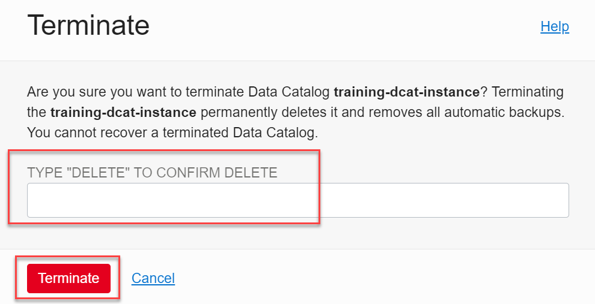

# Clean up Resources Used in this Workshop (Optional)

## Introduction

In this lab, you will learn how to delete some or all of the resources that you created in this workshop that you don't need. If you want to re-run all the labs in this workshop again from the beginning, you can delete the entire compartment.

**Note:**    
If you are using a **Free Trial** account to run this workshop, Oracle recommends that you at delete the Data Catalog instance that you created when you successfully complete this workshop, to avoid unnecessary charges. This deletes the Data Catalog instance and all of the resources in this instance.

Estimated Time: 15 minutes

### Objectives

* Delete the **`training-dcat-instance`** Data Catalog instance. This also deletes all of the resources in this instance.
* Delete the resources that you created in your **`training-dcat-compartment`** as part of this workshop. This includes your IAM group, IAM user, IAM policies, Object Storage buckets and its objects, and so on.
* Delete the entire **`training-dcat-compartment`** compartment.

###Prerequisites  
This lab assumes that you have successfully completed all of the preceding labs in the **Contents** menu.

**Note:**     
If you want to list the resources in your **`training-dcat-compartment`**, you can use the **Tenancy Explorer** page. From the **Navigation** menu, navigate to **Governance & Administration**. In the  **Governance** section, click **Tenancy Explorer**. On the **Tenancy Explorer** page, in the **Search compartments** field, type **`training`**, and then select **`training-compartment`** from the list of compartments. The resources in the **`training-compartment`** are displayed.

## Task 1: Delete Your Data Catalog Instance

You can terminate your Data Catalog instance that you created in this workshop as follows:

1. Open the **Navigation** menu and click **Analytics & AI**. Under **Data Lake**, click **Data Catalog**.

2. On the **Data Catalogs** page, in the row for the **`training-dcat-instance`** Data Catalog instance, click the **Actions** icon (three dots), and then select **Terminate** from the context menu.

   

3. A **Terminate** dialog box is displayed. Enter **delete** in the **TYPE "DELETE" TO CONFIRM DELETE**, and then click **Terminate**.

   

   The Data Catalog instance goes into a **Deleting** state and all the resources in the Data Catalog instance are permanently deleted.

## Task 2: Delete Your IAM Group, IAM User, and IAM Policies

1. Open the **Navigation** menu and click **Identity & Security**. Under **Identity**, click **Groups**.

2. From the list of available groups, search for your **training-dcat-admin-group**. You cannot delete a group that contains any members; therefore, you will need to remove the **training-dcat-admin-user** user from this group first. Click the group's name link in the **Name** column.

3. In the **Groups Detail** page, scroll down to the **Groups Members** section. Click the **Actions** button associated with the user that you want to remove from this group, and then select **Remove member from group** from the context menu.  A confirmation message box is displayed, click **Remove**.

4.  At the top of the **Groups Detail** page, click **Delete**. A confirmation message box is displayed, click **Delete**. The group is deleted and the **Groups** page is re-displayed.

5. In the **Identity** section on the left pane, click **Users**. From the list of available users, search for your **training-bds-admin** user. Click the **Actions** button associated with this user, and then select **Delete** from the context menu. A confirmation message box is displayed, click **Delete**.

6. In the **Identity** section on the left pane, click **Policies**. Click the **Actions** button associated with the **training-admin-policy** policy, and then select **Delete** from the context menu. A confirmation message box is displayed, click **Delete**.

7. Click the **Actions** button associated with the **training-bds-policy** policy, and then select **Delete** from the context menu. A confirmation message box is displayed, click **Delete**.

## Task 3: Delete Your Compartment

To delete a compartment, it must be empty of all resources. Before you initiate deleting a compartment, be sure that all its resources have been moved, deleted, or terminated, including any policies attached to the compartment. In this workshop, you created all of the resources in the **`training-dcat-compartment`**; therefore, if you want to re-run this entire workshop from the beginning, you can must delete all of the resources in the compartment as described in the earlier steps of this lab. Next, you can delete the compartment. See [Managing Compartments](https://docs.oracle.com/en-us/iaas/Content/Identity/Tasks/managingcompartments.htm) in the Oracle Cloud Infrastructure documentation.

1. Click the **Navigation** menu and click **Identity & Security**. Under **Identity**, select **Compartments**. From the list of available compartments, search for your **`training-dcat-compartment`**.

2. On the **Compartments** page, click the **Actions** button associated with **`training-dcat-compartment`**. Select **Delete** from the context menu.

3. A confirmation message box is displayed. Click **Delete**. The status of the deleted compartment changes from **Active** to **Deleting** until the compartment is successfully deleted. You can click on the compartment name link in the **Name** column to display the status of this operation.

    

This concludes the workshop.

## Want to Learn More?

* [Oracle Cloud Infrastructure Documentation](https://docs.cloud.oracle.com/en-us/iaas/Content/GSG/Concepts/baremetalintro.htm)
* [Overview of Oracle Cloud Infrastructure Identity and Access Management](https://docs.cloud.oracle.com/en-us/iaas/Content/Identity/Concepts/overview.htm)

## Acknowledgements

* **Author:**  Lauran Serhal, Principal User Assistance (UA) Developer, Oracle Database and Big Data (UA)
* **Contributors:** Martin Gubar, Director, Product Management Autonomous Database / Cloud SQL
* **Last Updated By/Date:** Lauran Serhal, September 2021
