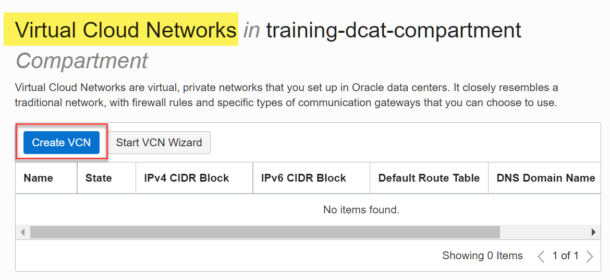
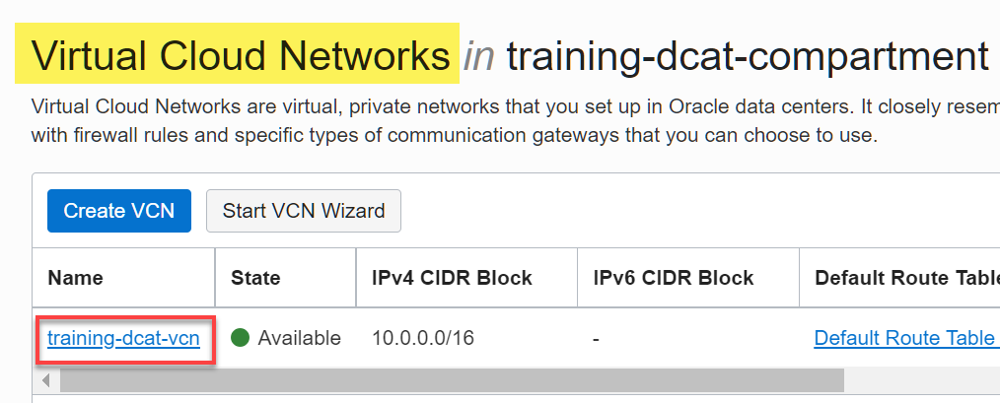
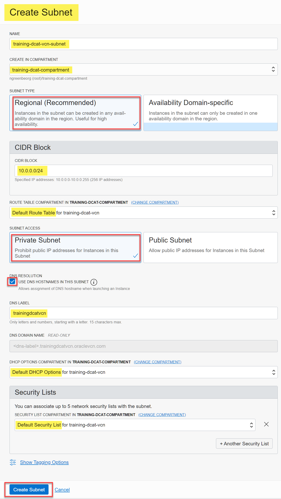
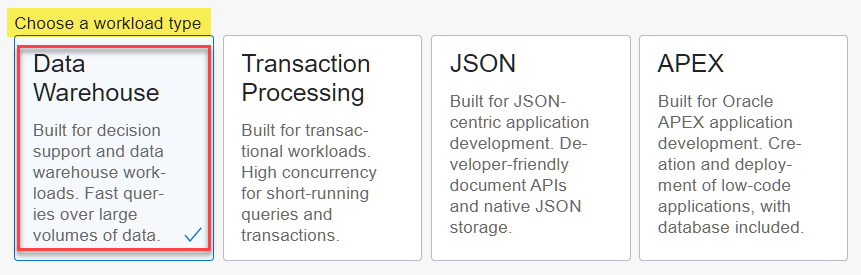

# Create an Autonomous Database Instance

## Introduction

This lab walks you through the steps to create a new Autonomous Data Warehouse (ADW) instance.

<!--- This is a comment -->

Estimated Lab Time: 5 minutes

### Objectives

In this lab, you will:

-   Learn how to provision a new Autonomous Database

### Prerequisites

To complete this lab, you need to have the following:

- Logged into your Oracle Cloud Account

## **STEP 1:** Log in to the Oracle Cloud Console

1. Log in to the **Oracle Cloud Console** as the Cloud Administrator. You will complete all the labs in this workshop using this Cloud Administrator.
See [Signing In to the Console](https://docs.cloud.oracle.com/en-us/iaas/Content/GSG/Tasks/signingin.htm) in the _Oracle Cloud Infrastructure_ documentation.

2. On the **Sign In** page, select your tenancy, enter your username and password, and then click **Sign In**. The **Oracle Cloud Console** Home page is displayed.

<!---
## **STEP 2**: Create a Virtual Cloud Network (VCN)

A Virtual Cloud Network (VCN) is a virtual, private network that you set up in a single Oracle Cloud Infrastructure region. A VCN has a single, contiguous IPv4 CIDR block of your choice. The allowable VCN size range is **/16** to **/30**. Decide on the CIDR block before you create a VCN. You can't change the CIDR value later. For your reference, here's a [CIDR Calculator](https://www.ipaddressguide.com/cidr).

Create a new VCN as follows:

1. Open the **Navigation** menu and click **Networking**. Under **Networking**, click **Virtual Cloud Networks**.

   

2. On the **Virtual Cloud Networks** page, click **Create VCN**.

   

   The **Create a Virtual Cloud Network** panel is displayed.

3. In the **Create a Virtual Cloud Network** panel, provide the following information:

    + **NAME:** Enter **`training-dcat-vcn`**.
    + **CREATE IN COMPARTMENT:** Select **`training-dcat-compartment`**, if not already selected.
    + **IPV4 CIDR BLOCK:** Enter **`10.0.0.0/16`**.
    + **USE DNS HOSTNAMES IN THE VCN:** Enable this checkbox.
    + **DNS LABEL:** Enter **`trainingdcatvcn`**.

   

4. Click **Create VCN**. The **Virtual Cloud Network Details** page is displayed.

   

5. Click the **Virtual Cloud Networks** link in the breadcrumbs. The new VCN is displayed on the **Virtual Cloud Networks** page.

    

    By default, a route table, security list, and DHCP option are automatically created for the VCN. You use these default components when you create a private subnet in the next step.

    

## **STEP 3**: Create a Private Subnet

Subnets are divisions you create in a VCN. Each subnet consists of a contiguous range of IP addresses that do not overlap with other subnets in the VCN. You create a private subnet when you don't want the resources created in the subnet to have public IP addresses.

Create a private subnet as follows:

1. On the **Virtual Cloud Networks** page, click the **`training-dcat-vcn`** VCN that you created in the previous step.

    

    The **Virtual Cloud Network Details** page is displayed.

2.  In the **Subnets** section, click **Create Subnet**.

    

3. In the **Create Subnet** panel, provide the following information:

    + **NAME:** Enter **`training-dcat-vcn-subnet`**.
    + **CREATE IN COMPARTMENT:** Select **`training-dcat-compartment`**, if not already selected.
    + **SUBNET TYPE:** Select **`Regional (Recommended)`**.
    + **CIDR BLOCK:** Enter **`10.0.0.0/24`**.
    + **ROUTE TABLE COMPARTMENT:** Select the **Default Route Table** for your VCN from this drop-down list.
    + **SUBNET ACCESS:** Select **Private Subnet**.
    + **USE DNS HOSTNAMES IN THE VCN:** Enable this checkbox.
    + **DNS LABEL:** Enter **`trainingdcatvcn`**.
    + **DHCP OPTIONS COMPARTMENT IN:** Select the **Default DHCP Options** for your VCN from this drop-down list.
    + **SECURITY LIST COMPARTMENT IN:** Select the **Default Security List** for your VCN from this drop-down list.

   

4. Click **Create Subnet**. The new private subnet is displayed in the **Subnets** section on the **Virtual Cloud Network Details** page. When the subnet is created, the status changes from from **Provisioning** to **Available**.

   

## **STEP 4**: Create a Network Security Group

When you create an Autonomous Database in a VCN, you need to specify the Network Security Group (NSG) for the database. An NSG consists of security rules that apply to only a group of Virtual Network Interface Cards (VNICs). Without security rules, no traffic is allowed in and out of VNICs in the VCN.

Create an NSG with an Ingress and Egress rules as follows:

1. On the **Virtual Cloud Networks** page, click the **`training-dcat-vcn`** VCN.

   

   The **Virtual Cloud Network Details** page is displayed.

2. In the **Resources** section on the left, click the **Network Security Groups** link.

   

   The **Network Security Groups** page is displayed. Scroll-down the page to the **Network Security Groups** section.

   

3. Click **Create Network Security Group**. The **Create Network Security Group** wizard's **Basic Info** Step 1 of 2 is displayed. Provide the following information:

    + **NAME:** Enter **`training-nsg`**.
    + **CREATE IN COMPARTMENT:** Select **`training-dcat-compartment`**, if not already selected.

    

4. Click **Next**. The **Security Rules** Step 2 of 2 of the wizard is displayed. Provide the following information:

    + **DIRECTION:** Select **`Ingress`**.
    + **SOURCE TYPE:** Select **`CIDR`**.
    + **SOURCE CIDR:** Enter **`10.0.0.0/24`** as the CIDR for the private subnet.
    + **IP PROTOCOL:** Select **`TCP`**.
    + **SOURECE PORT RANGE:** Enter **`All`**.
    + **DESTINATION PORT RANGE:** Enter **`1522`**.
    + **DESCRIPTION:** Enter an optional description.

    

5. Click **+Another Rule**. At the bottom of the **Add Security Rules** page, the second **Rule** section is displayed. Provide the following information:

    + **DIRECTION:** Select **`Egress`**.
    + **DESTINATION TYPE:** Select **`CIDR`**.
    + **DESTINATION CIDR:** Enter **`10.0.0.0/24`** as the CIDR for the private subnet.
    + **IP PROTOCOL:** Select **`All Protocols`**.
    + **DESCRIPTION:** Enter an optional description.

    

6. Click **Create**. The **Network Security Group Details** page is displayed.      

    

    **Note:**    
    In this lab, the Autonomous Database that you will provision in the next step is created in the same subnet that is used in Data Catalog to configure the private network for harvesting. For this scenario, you have created the ingress and egress rules specifying the CIDR of the private subnet.

    Your autonomous database may be in a different private subnet than the subnet used in Data Catalog to configure the private network for harvesting. In that case, you must create the ingress and egress rules specifying the CIDR of the VCN.
-->

## **STEP 5**: Create an Autonomous Database Instance with Private Access

The networking steps to create an Autonomous Data Warehouse (ADW) or Autonomous Transaction Processing (ATP) database with a Private IP are the same. In this lab, you will create an ADW database with private access as follows:

1. Open the **Navigation** menu and click **Oracle Database**. Under **Oracle Database**, click **Autonomous Database**.

2. On the **Autonomous Databases** page, make sure **`training-dcat-compartment`** is selected in the **Compartment** drop-down list in the **List Scope** section. click **Create Autonomous Database**. The **Create Autonomous Database** page is displayed.

3. In the **Provide basic information for the Autonomous Database** section, specify the following:
       * **Compartment:** **`training-dcat-compartment`**.
       * **Display Name:** **`DB-DCAT Integration`**.
       * **Database Name:** **`TrainingADB`**.

       

4. In the **Choose a workload type** section, accept the **Data Warehouse** default selection.

       

5. In the **Choose a deployment type** section, accept the **Shared Infrastructure** default selection.

       

6. In the **Configure the database** section, specify the following:

       * **Always Free:** Disabled. If your Cloud Account is an Always Free account, you can select this option to create an Always Free autonomous database.
       * **Choose Database version:** **`19c`**.
       * **OCPU count:** **`1`**.   
       * **Auto scaling:** Select this checkbox. This allows the system to automatically use up to three times more CPU and IO resources to meet the workload demand.
       * **Storage:** **`1`** (TB).

       

       **Note:** If you are using a Free Trial or Always Free account, and you want to use Always Free Resources, you need to be in a region where Always Free Resources are available. You can see your current default **region** in the top, right hand corner of the page.

7. In the **Create administrator credentials** section, specify the following:

       * **Username _Read-Only_:** This read-only field displays the default username, **`ADMIN`**.     
       **Important:** Make a note of this _username_ as you will need it to perform later steps.
       * **Password:** Enter a password for the **`ADMIN`** user of your choice such as **`Training4ADB`**.        
       **Important:** Make a note of this _password_ as you will need it to perform later steps.
       * **Confirm password:** Confirm your password.

       **Note:** The password that you choose must meet the following requirements:
       - The password must be between 12 and 30 characters long and must include at least one uppercase letter, one lowercase letter, and one numeric character.
       - The password cannot contain the username.
       - The password cannot contain the double quote (") character.
       - The password must be different from the last 4 passwords used.
       - The password must not be the same password that is set less than 24 hours ago.

       

8. In the **Choose network access** section, select the **Private endpoint access only** access type. This allows traffic only from a VCN that you specify. Access to the database from all public IPs or VCNs is blocked. Specify the following:

       * **Virtual cloud network:** **`training-dcat-vcn`**.
       * **Subnet:** **`training-dcat-vcn-subnet`**.
       * **Host name prefix:** **`training`**.
       * **Network Security Groups:** **training-nsg**.     

    

9. In the **Choose a license type** section, accept the default __Bring Your Own License (BYOL)__. Select this type when your organization has existing database licenses. Select
    - __License Included__ when you want to subscribe to new database software licenses and the database cloud service.

    

10. Click __Create Autonomous Database__.

11.  Your instance will begin provisioning. In a few minutes, the state will turn from **Provisioning** to **Available**. At this point, your Autonomous Data Warehouse database is ready to use! Have a look at your instance's details here including its name, database version, OCPU count, and storage size.

    

Please *proceed to the next lab*.

## Want to Learn More?

[Using Oracle Autonomous Database on Shared Exadata Infrastructure](https://docs.oracle.com/en/cloud/paas/autonomous-data-warehouse-cloud/user/autonomous-workflow.html#GUID-5780368D-6D40-475C-8DEB-DBA14BA675C3)

## Acknowledgements

* **Author:** Lauran Serhal, Principal UA Developer, Oracle Database and Big Data User Assistance
* **Contributor:** Martin Gubar, Director, Oracle Big Data Product Management    
* **Last Updated By/Date:** Lauran Serhal, July 2021
