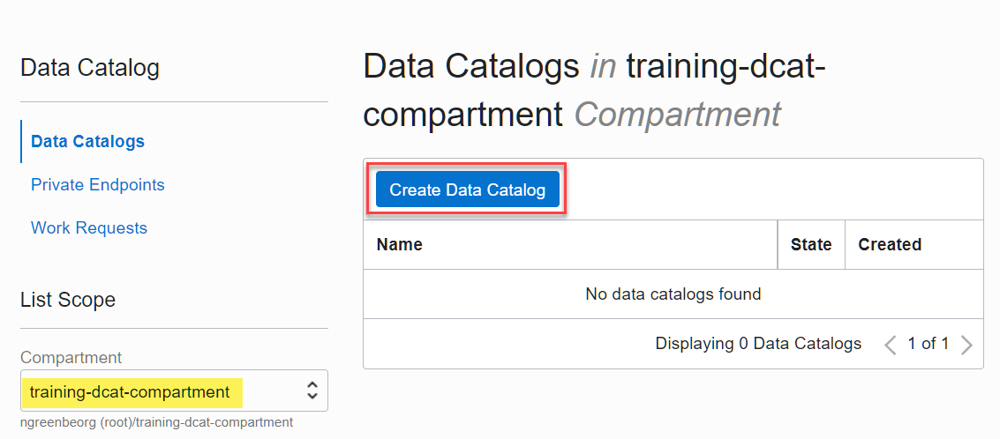
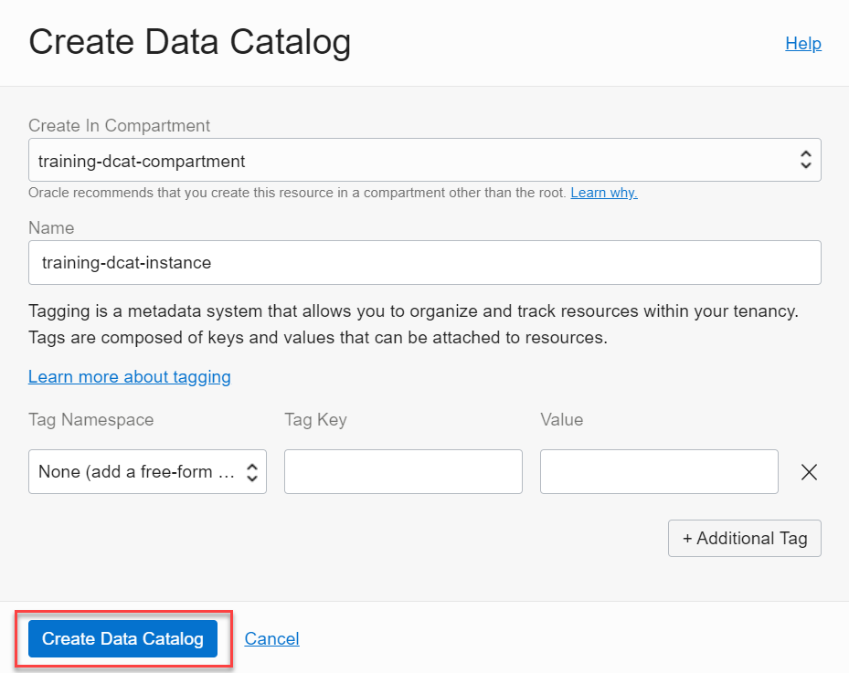
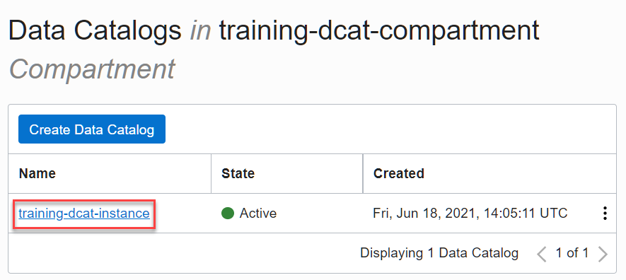
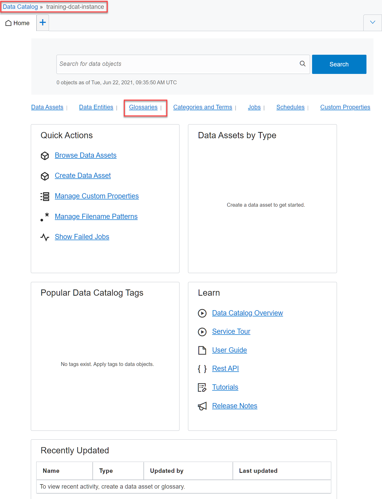
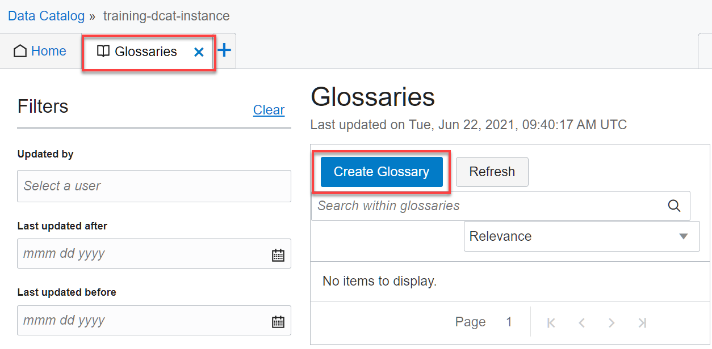
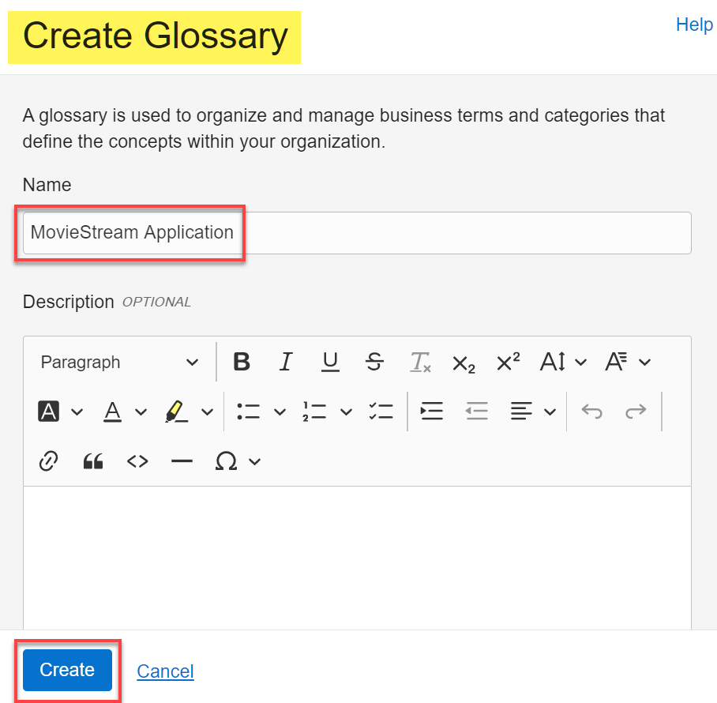
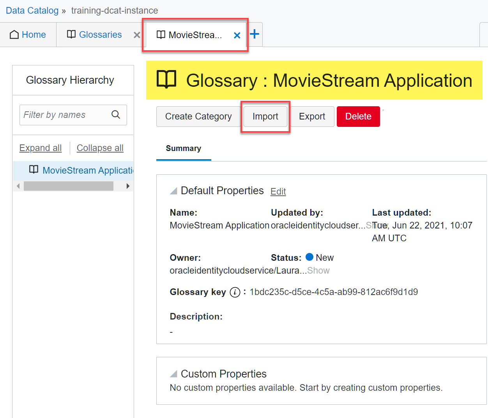
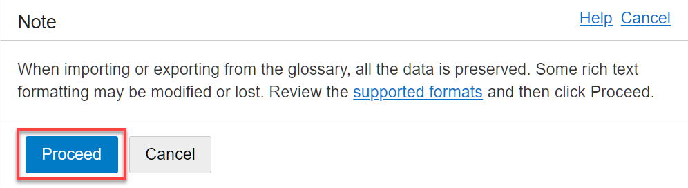
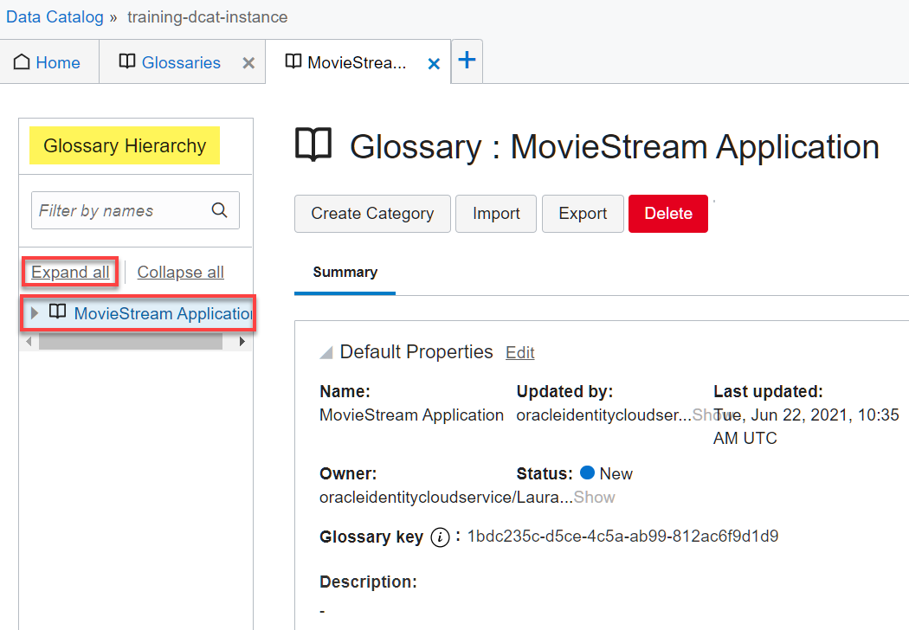
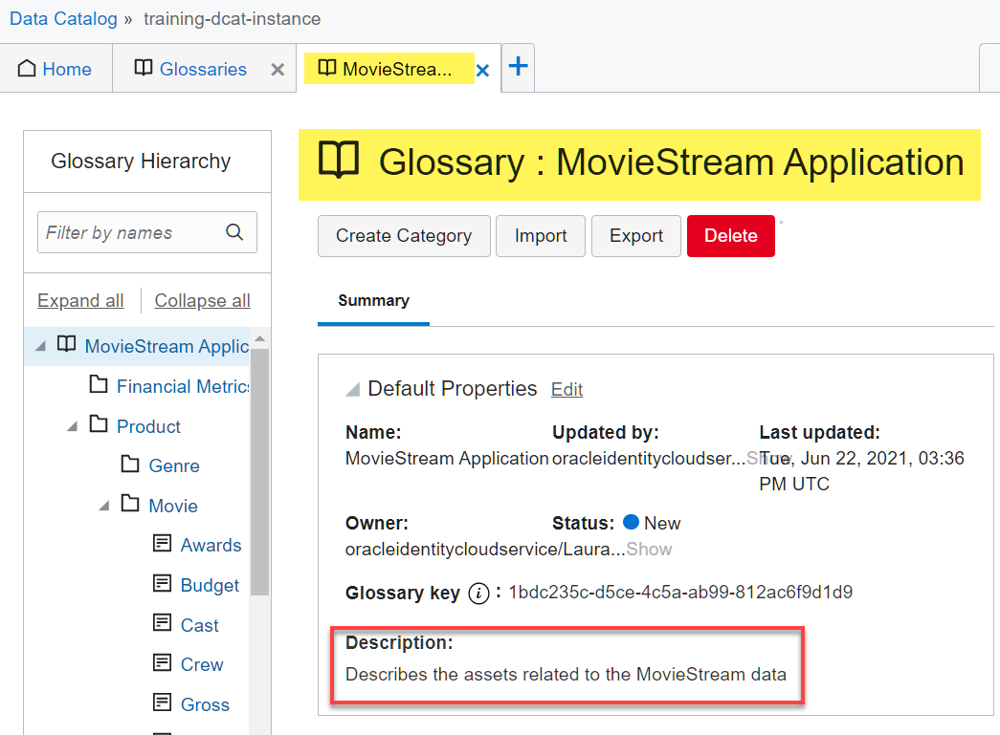

# Create a Data Catalog Instance

## Introduction

This lab walks you through the steps to create a Data Catalog instance. When you create a data catalog, you get a single collaborative environment to manage technical, business, and operational metadata. You can collect, organize, find, access, understand, enrich, and activate this metadata.

Estimated Lab Time: 15 minutes

### Objectives

In this lab, you will:
* Create a Data Catalog instance.
* Import a Glossary into your Data Catalog instance.

## **STEP 1:** Log in to the Oracle Cloud Console

1. Log in to the **Oracle Cloud Console** as the Cloud Administrator. You will complete all the labs in this workshop using this Cloud Administrator.
See [Signing In to the Console](https://docs.cloud.oracle.com/en-us/iaas/Content/GSG/Tasks/signingin.htm) in the _Oracle Cloud Infrastructure_ documentation.

2. On the **Sign In** page, select your tenancy, enter your username and password, and then click **Sign In**. The **Oracle Cloud Console** Home page is displayed.

## **STEP 2**: Create a Data Catalog Instance

Create a Data Catalog instance using the following steps.

1. Open the **Navigation** menu and click **Analytics & AI**. Under **Data Lake**, click **Data Catalog**.

	 

2. On the **Data Catalogs** page, click **Create Data Catalog**.

   

3. Select the **`training-dcat-compartment`** compartment from the **Create In Compartment** drop-down list, if not already selected.

4. Enter **`training-dcat-instance`** in the **Name** field.

   

5. Click **Create Data Catalog**. The Data Catalog instance is created and displayed in the **Data Catalogs** page.

   

## **STEP 3**: Create, Import, and Edit a Glossary

In this step, you create a new and empty business glossary in the newly created Data Catalog instance. Next, you  import an existing glossary from your local file system into the new glossary. You use a business glossary to define your concepts across your business domain. Creating a business glossary brings common understanding of the vocabulary used throughout your organization. In Data Catalog, you create categories and terms in a glossary to manage and organize your business concepts. Terms are the actual definitions of business concepts as agreed upon by different business stakeholders in your company. You use terms to organize your data entities and attributes. You can edit a glossary, category, or term to modify their default properties such as name, owner, status, and description, or any custom property that is associated with a glossary, category, or term. For detailed information on managing glossaries, see [Managing a Business Glossary](https://docs.oracle.com/en-us/iaas/data-catalog/using/manage-glossary.htm#create-glossary) in the _Oracle Cloud Infrastructure_ documentation.

1. Open the **Navigation** menu and click **Analytics & AI**. Under **Data Lake**, click **Data Catalog**.

2. On the **Data Catalogs** page, click the **`training-dcat-instance`** Data Catalog in the **Name** column.

   

3. The Data Catalog **Home** page is displayed. Click the **Glossaries** link.

   

	 The **Glossaries** tab is displayed.

	 

4. Click **Create Glossary**. The **Create Glossary** panel is displayed. Enter **`MovieStream Application`** in the **Name** field, and then click **Create**.

	 

	 The **MovieStream Application** glossary tab is displayed.

	 

5. Click **Import**. A **Note** message box is displayed indicating that some rich text formatting might be modified or lost on import. Click **Proceed**.

	 

6. Using your local system **File Explorer**, navigate to and choose the local **`MovieStream ApplicationExport.xlsx`** Excel file that you want to import. This file represents a glossary that was exported from a Data Catalog instance. Click **Open**.

	 

7. An import job is triggered and a message is displayed.

	 

	 If the import file is small, the job finishes instantly and the imported glossary is displayed. If the import file is large, you can monitor the status of the job from the Jobs tab. When the job is completed successfully, the contents of the Excel file are imported into your glossary.

	 

8. To view the imported glossary details, in the **Glossary Hierarchy** pane on the left, click **Expand all**. The children of the **MovieStream Application** glossary are displayed.

	 

	 **Note:** The categories and terms created within a glossary are displayed in the **Glossary Hierarchy** tree navigation list. Expand each category to view terms created within that category. The summary information changes as you click different nodes in the glossary tree. You can use Expand All or Collapse All to expand or collapse all the nodes available in the glossary respectively. You can also use the search bar to search for categories and terms.

9. Edit the default properties for your **MovieStream Application** glossary to include a description which you didn't specify when you created the glossary. In the **Glossary Hierarchy** pane, click the **MovieStream Application** glossary. In the **Default Properties** section on the right, click **Edit**.

  

	The **Edit Default Properties** panel opens as an overlay.

10. Enter "`Describes the assets related to the MovieStream data`" in the **Description** field. Click **Save Changes**.

	 

	 The updated description is displayed in the **Default Properties** section.

	 

You may now [proceed to the next lab](#next).

## Learn More

* [Managing a Business Glossary](https://docs.oracle.com/en-us/iaas/data-catalog/using/manage-glossary.htm#create-glossary)
* [Data Catalog Overview](https://docs.oracle.com/en-us/iaas/data-catalog/using/overview.htm)
* [What Is a Data Catalog and Why Do You Need One?](https://www.oracle.com/big-data/what-is-a-data-catalog/)
* [Get Started with Data Catalog](https://docs.oracle.com/en-us/iaas/data-catalog/using/index.htm)
* [Oracle Cloud Infrastructure Documentation](https://docs.cloud.oracle.com/en-us/iaas/Content/GSG/Concepts/baremetalintro.htm)

## Acknowledgements
* **Author:** Lauran Serhal, Principal UA Developer, Oracle Database and Big Data User Assistance
* **Contributor:** Martin Gubar, Director, Oracle Big Data Product Management    
* **Last Updated By/Date:** Lauran Serhal, July 2021
