# Harvest Technical Metadata from Oracle Object Storage

## Introduction

Harvesting is a process that extracts technical metadata from your data assets into your Data Catalog repository. A data asset represents a data source such as database, an object store, a file or document store, a message queue, or an application. This lab walks you through the steps to create an Oracle Object Storage data asset, add a default connection to the new data asset, create a filename pattern and assign it to your data asset, and finally harvest the data asset and view the harvested data entities.

Estimated Time: 30 minutes

### Objectives

In this lab, you will:
* Create an Oracle Object Storage data asset.
* Add two Object Storage connections for the newly created data asset.
* Create a Filename Pattern and assign it to the Oracle Object Storage data asset.
* Harvest the data asset.
* View the harvested data entities.

## Task 1: Log in to the Oracle Cloud Console

1. Log in to the **Oracle Cloud Console** as the Cloud Administrator. You will complete all the labs in this workshop using this Cloud Administrator.
See [Signing In to the Console](https://docs.cloud.oracle.com/en-us/iaas/Content/GSG/Tasks/signingin.htm) in the _Oracle Cloud Infrastructure_ documentation.

2. On the **Sign In** page, select your tenancy, enter your username and password, and then click **Sign In**. The **Oracle Cloud Console** Home page is displayed.

## Task 2: Create an Object Storage Data Asset

Register your Oracle Object Storage data sources with Data Catalog as a data asset.

1. Open the **Navigation** menu and click **Analytics & AI**. Under **Data Lake**, click **Data Catalog**.

2. On the **Data Catalogs** page, click the **`training-dcat-instance`** Data Catalog instance where you want to create your data asset.

   

3. On the **`training-dcat-instance`** **Home** page, click **Create Data Asset** in the **Quick Actions** tile.

   

4. In the **Create Data Asset** panel, specify the data asset details as follows:    
       * **Name:** **`Oracle Object Storage Data Asset`**.
       * **Description:** **`Data Asset to access Oracle Object Storage buckets`**.
       * **Type:** Select **Oracle Object Storage** from the drop-down list.
       * **URL:** Enter the swift URL for the OCI Object Storage resource that you will use in this lab. The URL format for an OCI Object Storage resource is as follows which includes your own _region-identifier_:

        ```
        <copy>https://swiftobjectstorage.region-identifier.oraclecloud.com</copy>
        ```
        >**Note:** In this lab, you will be accessing two Oracle Object Storage buckets that contains the data. The two buckets are located in the **adwc4pm** tenancy in the **us-ashburn-1** region. In the next step, you'll add a connection to this data asset using pre-authenticated requests (PAR). For information on PAR, see [Using Pre-Authenticated Requests](https://docs.oracle.com/en-us/iaas/Content/Object/Tasks/usingpreauthenticatedrequests.htm) in the _Oracle Cloud Infrastructure_ documentation.

        Click **Copy** to copy the following URL, and then paste it in the **URL** field:

        ```
        <copy>https://swiftobjectstorage.us-ashburn-1.oraclecloud.com</copy>
        ```

        <!--  
        >**Note:**    
        To find your own _region-identifier_, from the **Console**, click the **Region** drop-down list, and then click **Manage Regions**.

       

        The **Infrastructure Regions** page is displayed. In the **Region** section, your Home Region to which you are subscribed is displayed along with your **Region Identifier**, `us-ashburn-1`, in our example:

       
       -->

       * **Namespace:** Enter the _Object Storage Namespace_ for the specified resource. In this lab, enter **adwc4pm**.        

       <!-- Old information
       **Note:** To find your own _Object Storage Namespace_, from the **Console**, click **Profile**, and then select **Tenancy: your-tenancy-name**. In our example, the _Object Storage Namespace_ is `idrudhdwamji`.

       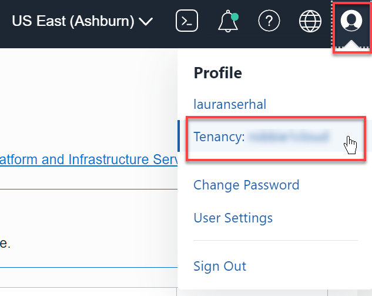

       In the **Tenancy Information** tab, the **Object Storage Namespace** is listed in the **Object Storage Settings** section.  

       
       -->

5. Click **Create** in the **Create Data Asset** panel.  

   

   A `Data Asset created successfully` message box is displayed. The **Oracle Object Storage Data Asset** tab is displayed. The details for the new Data Asset are displayed in the **Summary** tab.

   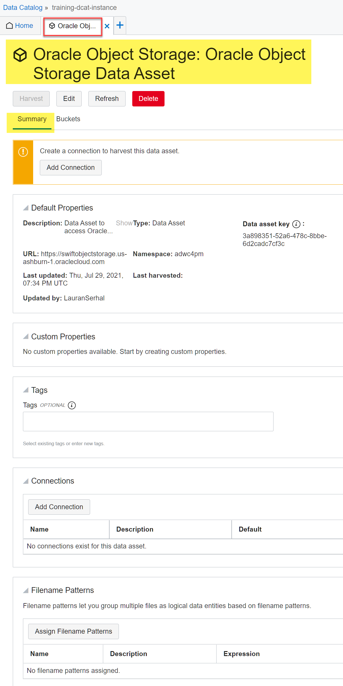


## Task 3: Add Two Data Asset Connections to the Oracle Object Storage Buckets

After you register a data source as a data asset in your data catalog, you create a connection to your data asset to be able to harvest it. You can create multiple connections to your data source. At least one connection is needed to be able to harvest a data asset. In this lab, you will create two data connections to access the **moviestream\_landing** and **moviestream\_gold** Oracle Object Storage buckets that contain the data. The two buckets are located in different tenancy than yours, named **adwc4pm** in the **us-ashburn-1** region; therefore, you will use two pre-authenticated requests (PAR), one for each bucket. For information on PAR, see [Using Pre-Authenticated Requests](https://docs.oracle.com/en-us/iaas/Content/Object/Tasks/usingpreauthenticatedrequests.htm) in the _Oracle Cloud Infrastructure_ documentation.

Add a connection to the **moviestream_landing** bucket to your new **`Oracle Object Storage Data Asset`** as follows:

1. On the **Oracle Object Storage Data Asset** tab, in the **Summary** tab, in the **Connections** section, click **Add Connection**.

   

2. In the **Add Connection** panel, specify the connection details for the **moviestream_landing** Object Storage bucket data source as follows:

       * **Name:** **`moviestream-landing-bucket-connection`**.
       * **Description:** Enter an optional description.
       * **Type:** Select **Pre-Authenticated Request** from the **Type** drop-down list.
       * **Pre-Authenticated Request URL:** Click **Copy** to copy the following URL, and then paste it in this field.

        ```
        <copy>
        https://objectstorage.us-ashburn-1.oraclecloud.com/p/tLBDQf0prua1qyczMj321erjEGwCy1kJwi5Y3B0YWBnssNmfRxRhQFRbeS799RH1/n/adwc4pm/b/moviestream_landing/o/</copy>
        ```

       * **Make this the default connection for the data asset:** Leave this checkbox unchecked.

       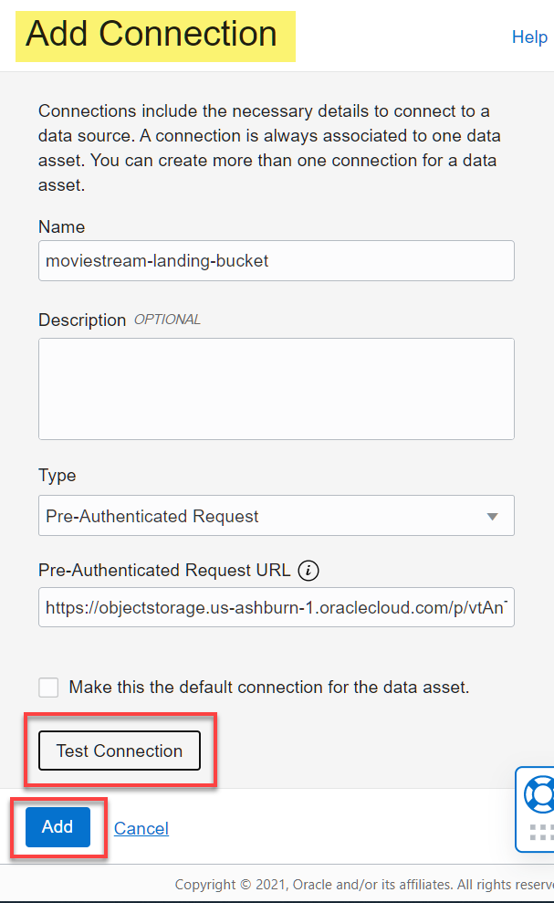


3. Click **Test Connection**. A message box is displayed indicating whether or not the test was successful.

   


4. If the test was successful, click **Add**. A message box is displayed indicating whether or not the connection was added successfully. The **`moviestream-landing-bucket-connection`** data source connection is added to the data asset and is displayed in the **Connections** section.

   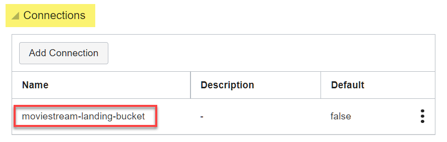


<!-- old
       **Compartment:** Enter the compartment's OCID for your Oracle Object Storage
        resource.    
       To find the compartment OCID for your Oracle Object Storage resource, open the **Navigation** menu and click **Identity & Security**. Under **Identity**, select **Compartments**. On the **Compartments** page, In the list of compartments, search for the **`training-dcat-compartment`**. In the row for the compartment, in the **OCID** column, hover over the OCID link and then click **Copy**. Next, paste that OCID to an editor or a file, so that you can retrieve it later in this lab.

         

         **Note:** The two Object Storage buckets that you will use in this lab are located in the **`training-dcat-compartment`** compartment. To view the two buckets, Open the **Navigation** menu and click **Storage**. Under **Object Storage & Archive Storage**, select **Bucket**. The **Buckets** page is displayed and the two buckets that you will use in the harvesting process are displayed.

         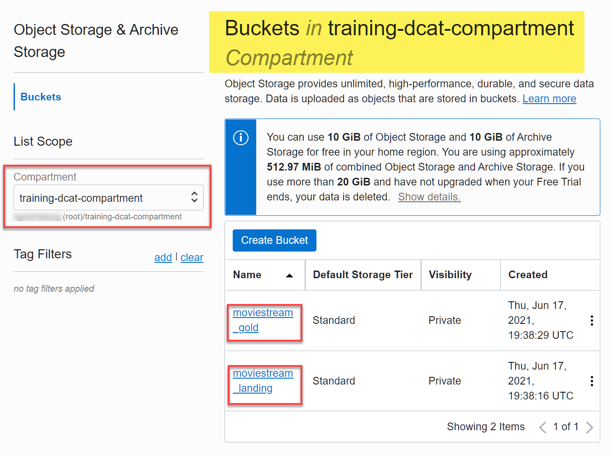

         * **Name:** **`training-bucket-1-connection`**.
         * **Description:** Enter an optional description.
         * **Type:** Select **Resource Principal** from drop-down list.
         * **OCI Region:** Enter your own _region-identifier_ that you identified in **Task 2** in this lab.
         * **Compartment:** Enter the compartment's OCID for your Oracle Object Storage resource.    

         **Note:** The two Object Storage buckets that you will use in this lab are located in the **`training-dcat-compartment`** compartment. To view the two buckets, Open the **Navigation** menu and click **Storage**. Under **Object Storage & Archive Storage**, select **Bucket**. The **Buckets** page is displayed and the two buckets that you will use in the harvesting process are displayed.
           
           -->

Add a connection to the **moviestream_gold** bucket to your new **`Oracle Object Storage Data Asset`** as follows:

1. On the **Oracle Object Storage Data Asset** tab, in the **Summary** tab, in the **Connections** section, click **Add Connection**.

2. In the **Add Connection** panel, specify the connection details for the **moviestream_gold** Object Storage bucket data source as follows:

      * **Name:** **`moviestream-gold-bucket-connection`**.
      * **Description:** Enter an optional description.
      * **Type:** Select **Pre-Authenticated Request** from the **Type** drop-down list.
      * **Pre-Authenticated Request URL:** Click **Copy** to copy the following URL, and then paste it in this field.

        ```
        <copy>https://objectstorage.us-ashburn-1.oraclecloud.com/p/S-9E_eBGGoo9xNm3QP-DoNPr8xlmibT52mXsirQdvmiv_FfRTFmAx2ajUqFY5RCW/n/adwc4pm/b/moviestream_gold/o/</copy>
        ```

        * **Make this the default connection for the data asset:** Leave this checkbox unchecked.

        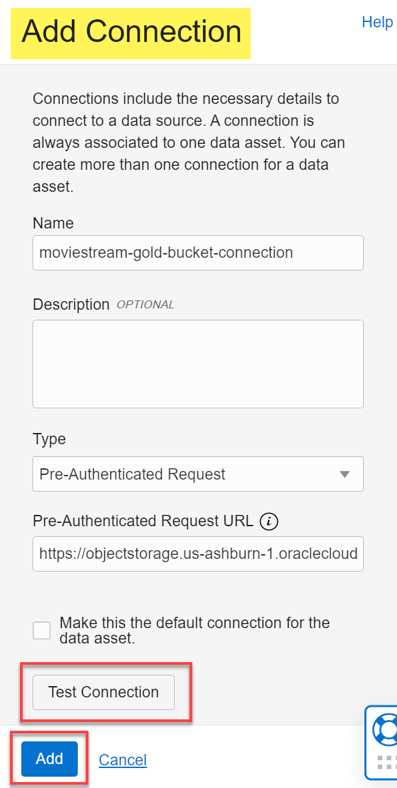    

3. Click **Test Connection**. A message box is displayed indicating whether or not the test was successful.

   

4. If the test was successful, click **Add**. A message box is displayed indicating whether or not the connection was added successfully. The **`moviestream-gold-bucket-connection`** data source connection is added to the data asset and is displayed in the **Connections** section.

   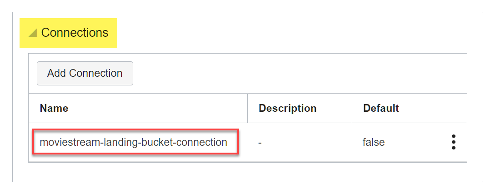


## Task 4: Create a Filename Pattern and Assign it to your Oracle Object Storage Data Asset

Your data lake typically has a large number of files that represent a single data set. You can group multiple Object Storage files into logical data entities in Data Catalog using filename patterns. A filename pattern is a regular expression that is created to group multiple Object Storage files into a logical data entity that can be used for search and discovery. Using logical data entities, you can organize your data lake content meaningfully and prevent the explosion of your entities and attributes in your Data Catalog.
If an Object Storage file is matched with multiple filename patterns, it can be part of multiple logical data entities.

>**Note:** If you harvest your Object Storage data source files without creating filename patterns, Data Catalog creates an individual logical entity for each file under each root bucket. Imagine this situation with hundreds of files in your data source resulting in hundreds of data entities in your Data Catalog.

Create a filename pattern as follows:

1. Open the **Navigation** menu and click **Analytics & AI**. Under **Data Lake**, click **Data Catalog**.

2. On the **Data Catalogs** page, click the **`training-dcat-instance`** Data Catalog instance that contains the Data Asset for which you are adding a Filename Pattern.

3. On the Data Catalog instance **Home** page, click the  tab and select **File Patterns** from the **Context** menu.

      

      The **Filename Patterns** tab is displayed.

      

      >**Note:** Alternatively, you can also access the **Filenames Pattern** tab from the Data Catalog instance **Home** page. Next, click **Manage Filename Patterns** from the **Quick Actions** tile.

      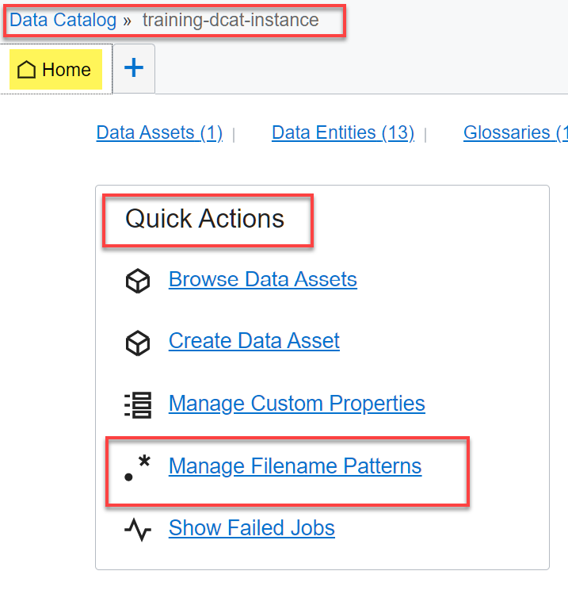

4. Click **Create Filename Pattern**. In the **Create Filename Pattern** panel, specify the following information:

       * **Name:** `Map Object Storage Folders to DCAT Logical Entities`.
       * **Description:** `Map each Object Storage folder off the moviestream_landing and moviestream_gold root buckets to DCAT Logical Entities using the regular expression`.
       * **Expression:** Enter the following regular expression:

        ```
        <copy>{bucketName:[A-Za-z0-9\.\-_]+}/{logicalEntity:[^/]+}/\S+$</copy>
        ```

        >**Note:** You can click **View Pattern Examples** for examples on filenames, pattern expressions, and the logical data entity names that are derived based on the pattern expression.

       Here's the explanation of the preceding regular expression:      

       * **``{bucketName:[A-Za-z0-9\.\-_]+}``**:      
       This section, between the opening and closing **{ }**, represents the derived bucket name. You can use the **`bucketName`** qualifier to specify that the bucket name should be derived from the path that matches the expression that follows. In this example, the bucket name is comprised of the characters leading up to first **`/`** character (which is outside the name section). The valid characters are **`A-Z`**, **`a-z`**, **`0-9`**, **`.`** (period), **-** (hyphen), and **_** (underscore). The **`+`** (plus) indicates any number of occurrences of the preceding expression inside the **[ ]**.
       Certain characters such as **`.`**, and **`-`** must be escaped by adding a **`\`** (backslash) escape character such as **`\.`** and **`\-`**.

       * **``{logicalEntity:[^/]+}``**:      
       This section, between the second set of opening and closing **{ }**, represents the derived logical entity name. You can use the **`logicalEntity`** qualifier to specify that the logical entity name should be derived from the path that matches the expression that follows. In this example, the logical entity name is comprised of the characters leading up to the second **`/`** character (which is outside the name section). The logical entity name starts after the "/" and ends with the “/” following the closing "}". It can contain any character that is not a forward slash, `/` as represented by the not **`^`** (caret) symbol.  

       * **`/\S+$`**:       
       Finally, the logical data entities names will be any non-whitespace characters (represented by `\S+`). **`$`** signifies the end of the line.

       * **Test Expression:** Enter the following filenames in the **Test filenames** text box:

        ```
        <copy>moviestream_landing/customer/customer.csv
        moviestream_gold/sales/time=jan/file1.parquet
        moviestream_gold/sales/time=feb/file1.parquet</copy>
        ```

      

5. Click the **Test Expression** link. The **Resulting Logical Entities** based on the regular expression that you specified are displayed.

      

      A message box is displayed indicating whether or not the test was successful.

      

6. Click **Create**. The **File Patterns** tab is re-displayed. The newly created file pattern is displayed in the **Filename Patterns** list.

      

7. Assign the filename pattern that you just created to your **Oracle Object Storage Data Asset**. On the **Home** tab, click the **Data Assets** link to access the **Data Assets** tab.

      

8. In the **Data Assets** list, click the **Oracle Object Storage Data Asset** data asset for which you want to assign the filename pattern that you created.

      

9. In the **Summary** tab on the **Oracle Object Storage Data Asset** details tab, scroll-down the page to the **Filename Patterns** section, and then click **Assign Filename Patterns**.

      

10. In the **Assign Filename Patterns** panel, select the checkbox next to the filename pattern(s) that you want to assign to this data asset. You can use the **Filter** box to filter the filename patterns by name. You can also de-select already assigned filename patterns to un-assign them from this data asset.

      

11. Click **Assign**. A message box is displayed indicating whether or not the test was successful. The selected filename pattern is assigned to the data asset. When you harvest the data asset, the filename pattern is used to derive logical data entities. The names of the files in the Object Storage bucket are matched to the pattern expression and the logical data entities are formed.

      

>**Note:**    
When you assign a new filename pattern to a data asset, the status of any harvested logical data entities is set to **Inactive**. You need to harvest the data asset again to derive the valid logical data entities again.


## Task 5: Harvest the Data Asset

After you create a data asset in the Data Catalog repository, you harvest the data asset to extract the data structure information into the Data Catalog and view its data entities and attributes. In this task, you will harvest the **moviestream\_landing** and **moviestream\_gold** Oracle Object Storage buckets that contain the data.

Harvest the data entities from the **moviestream\_landing** data asset as follows:

1. Open the **Navigation** menu and click **Analytics & AI**. Under **Data Lake**, click **Data Catalog**.

2. On the **Data Catalogs** page, click the **`training-dcat-instance`** Data Catalog instance that contains the data asset that you want to harvest.

3. On the Data Catalog instance **Home** tab, click **Data Assets**. The **Data Assets** tab is displayed.       

      

4. In the **Data Assets** list, click the **Oracle Object Storage Data Asset** data asset. The **Oracle Object Storage: Oracle Object Storage Data Asset** page is displayed.

      

5. Click **Harvest**. The **Select a Connection** page of the **Harvest** wizard (Step 1 of 3) is displayed in the **Harvest Data Entities** tab. Select the **`moviestream-landing-bucket-connection`** from the **Select a connection for the data asset you want to harvest** drop-down list. Click **Next**.

      

6. The **Select Data Entities** page of the **Harvest** wizard (Step 2 of 3) is displayed. The **`moviestream-landing`** bucket is already displayed in the **Available Bucket** section. Click the  icon next it to add it to the **Selected Bucket / Data Entities** section to include it in the harvest job.

      

      >**Note:** You can use this page to view and add the bucket(s) and/or data entities you want to harvest from the **Available Buckets** section. Click the  icon for each data entity you want to include in the harvest job. Click a bucket link to display its nested data entities. Click the  icon next to each data entity that you want to include in the harvest job. You can also search for a bucket or entity using the **Filter Bucket** and **Filter Bucket / data entities** search boxes.  

       


7. Click **Next**. The **Create Job** page of the **Harvest** wizard (Step 3 of 3) is displayed. Specify the following for the job details:

      * **Job Name:** Accept the default name.
      * **Job Description:** Enter an optional description.
      * **Incremental Harvest:** Leave this check box selected (default). This indicates that subsequent runs of this harvesting job will only harvest data entities that have changed since the first run of the harvesting job.
      * **Include Unrecognized Files:** Leave this check box unchecked. Select this check box if you want Data Catalog to also harvest file formats that are not currently supported such as `.log`, `.txt`, `.sh`, `.jar`, and `.pdf`.
      * **Include matched files only:** Select this check box. If you are harvesting an Oracle Object Storage data asset, select this check box if you want Data Catalog to harvest only the files that match the assigned filename patterns that you specified. When you select this check box, the files that do not match the assigned filename patterns are ignored during the harvest and are added to the skipped count.
      * **Time of Execution:** Select one of the three options to specify the time of execution for the harvest job:
         * **Run job now**: Select this option (default). This creates a harvest job and runs it immediately.    
         * **Schedule job run**: Displays more fields to schedule the harvest job. Enter a name and an optional description for the schedule. Specify how frequently you want the job to run from the **Frequency** drop-down list. Your choices are **Hourly**, **Daily**, **Weekly**, and **Monthly**. Finally, select the start and end time for the job.    

         

         * **Save job configurations for later**: Creates a job to harvest the data asset, but the job is not run.

      

9. Click **Create Job**.      

    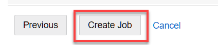

    The harvest job is created successfully and the **Jobs** tab is displayed. Click the job name link in the **Name** column.

    

10. The harvest job name tab is displayed. On the **Jobs** tab, you can track the status of your job and view the job details.  The **Logical data entities harvested** field shows **13** as the number of logical entities that were harvested using the filename pattern that you assigned to this Object Storage asset. This number represents the number of sub-folders under the **`moviestream_landing`** and **`moviestream_gold`** root buckets. There are **37** corresponding files under the sub-folders under the root buckets.

    

11. Drill-down on the **Log Messages** icon to display the job log.

    

After you harvest your data asset, you can browse or explore your data asset to view the data entities and attributes.

<!-- second bucket
Harvest the data entities from the **moviestream\_gold** data asset as follows:

1. You should already be on the **Oracle Object Storage: Oracle Object Storage Data Asset** page from the previous step.

      

2. Click **Harvest**. The **Select a Connection** page of the **Harvest** wizard (Step 1 of 3) is displayed in the **Harvest Data Entities** tab. Select the **`moviestream-gold-bucket-connection`** from the **Select a connection for the data asset you want to harvest** drop-down list. Click **Next**.

      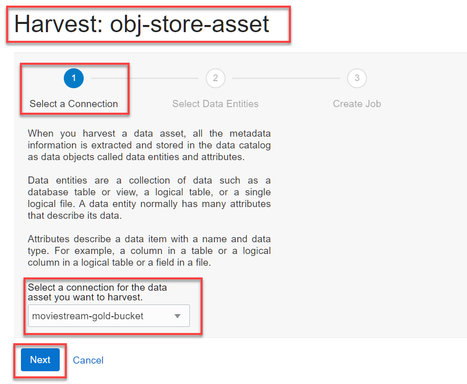

6. The **Select Data Entities** page of the **Harvest** wizard (Step 2 of 3) is displayed. The **`moviestream-gold`** bucket is already displayed in the **Available Bucket** section. Click the  icon to add it to the **Selected Bucket / Data Entities** section to include it in the harvest job.

      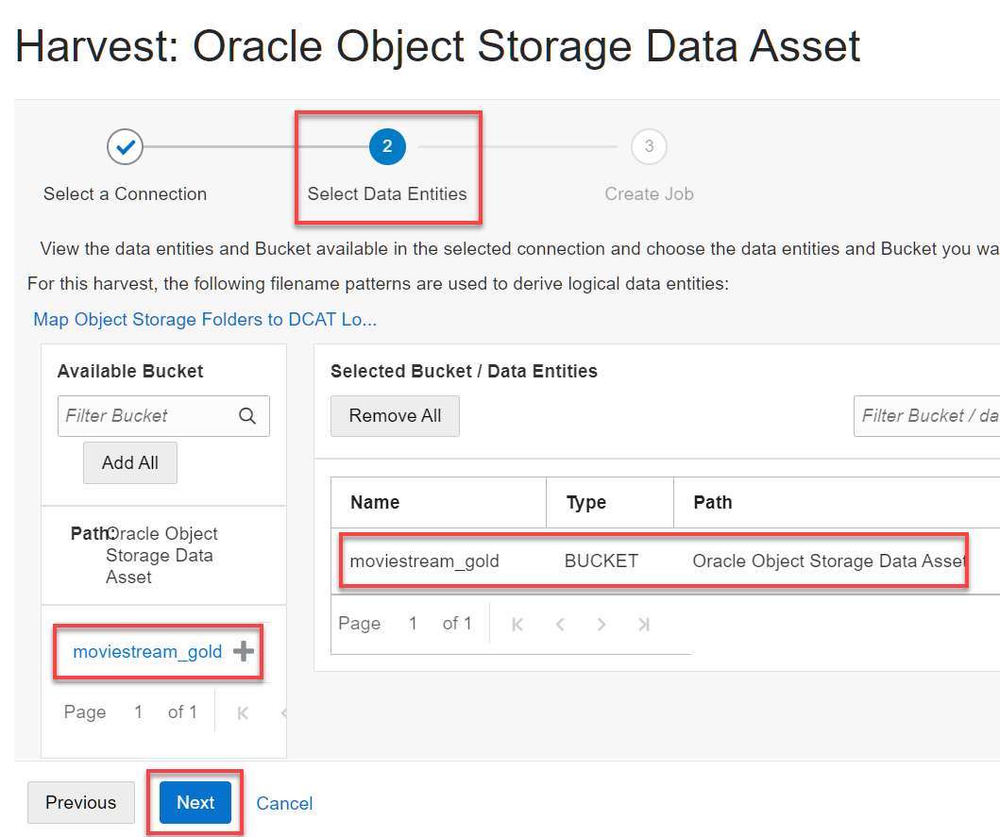

      >**Note:** You can use this page to view and add the bucket(s) and/or data entities you want to harvest from the **Available Buckets** section. Click the  icon for each data entity you want to include in the harvest job. Click a bucket link to display its nested data entities. Click the  icon next to each data entity that you want to include in the harvest job. You can also search for a bucket or entity using the **Filter Bucket** and **Filter Bucket / data entities** search boxes.  

7. Click **Next**. The **Create Job** page of the **Harvest** wizard (Step 3 of 3) is displayed. Specify the following for the job details:

      * **Job Name:** Accept the default name.
      * **Job Description:** Enter an optional description.
      * **Incremental Harvest:** Leave this check box selected (default).
      * **Include Unrecognized Files:** Leave this check box unchecked.
      * **Include matched files only:** Select this check box.
      * **Time of Execution:** Select the **Run job now** option.

      

9. Click **Create Job**.      

    

    The harvest job is created successfully and the **Jobs** tab is displayed. Click the job name link in the **Name** column.

    

10. The harvest job name tab is displayed. On the **Jobs** tab, you can track the status of your job and view the job details.  The **Logical data entities harvested** field shows **13** as the number of logical entities that were harvested using the filename pattern that you assigned to this Object Storage asset. This number represents the number of sub-folders under the **`moviestream_landing`** and **`moviestream_gold`** root buckets. There are **37** corresponding files under the sub-folders under the root buckets.

    

11. Drill-down on the **Log Messages** icon to display the job log.

    

    After you harvest your data asset, you can browse or explore your data asset to view the data entities and attributes.
-->

## Task 6: View Harvested Data Entities

1. On the Data Catalog instance **Home** tab, click **Data Entities**.

    

     The **Data Entities** tab is displayed. Remember, there were **13** logical entities that were derived from your Object Storage buckets during the harvesting process. You can use the different **Filters** on the page to refine the **Data Entities** list.

    

2. In the **Data Entities** list, click the name link for the data entity you want to view. Click the **`custsales`** logical data entity that was derived from the **`moviestream_gold`** bucket.

    

3. View the default properties, custom properties, tags, business glossary terms and categories, and recommendations, if any, for the data entity from the **Summary** tab.

    

4. From the **Attributes** tab, view the data entity attribute details.

    


## Task 7: Rename the synchronization Schemas' Prefix

1. On the **Data Catalogs** page, click the **`training-dcat-instance`** Data Catalog instance link.

   

2. On the **`training-dcat-instance`** **Home** page, click **Browse Data Assets** in the **Quick Actions** tile.

   

3. If you only have the one Data Asset created in this workshop, the **Oracle Object Storage: Oracle Object Storage Data Asset** page is displayed.

4. In the **Summary** tab, in the **DBMS_DCAT** tile, click **Edit**.

    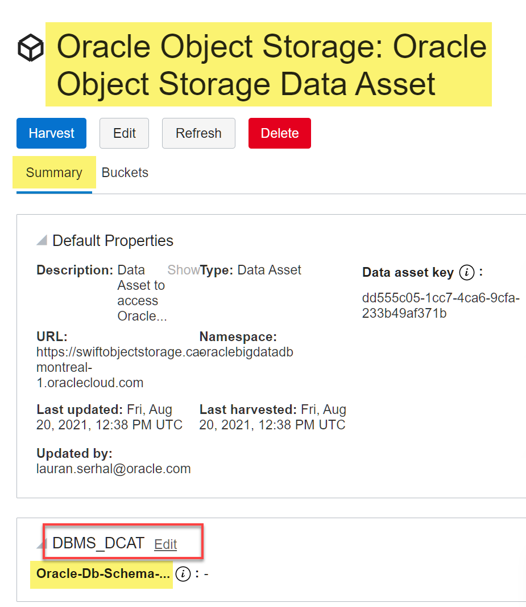

5. In the **Edit DBMS_DCAT** dialog box, enter **`obj_asset`** in the **Oracle-Db-Schema-Prefix** field, and then click **Save Changes**. This value will be used as the prefix to the schemas' that are generated by the synchronization process which is covered in the next lab. If you don't provide a prefix here, then the Data Asset name, **Oracle Object Storage Data Asset** in this example, will be used a prefix.

    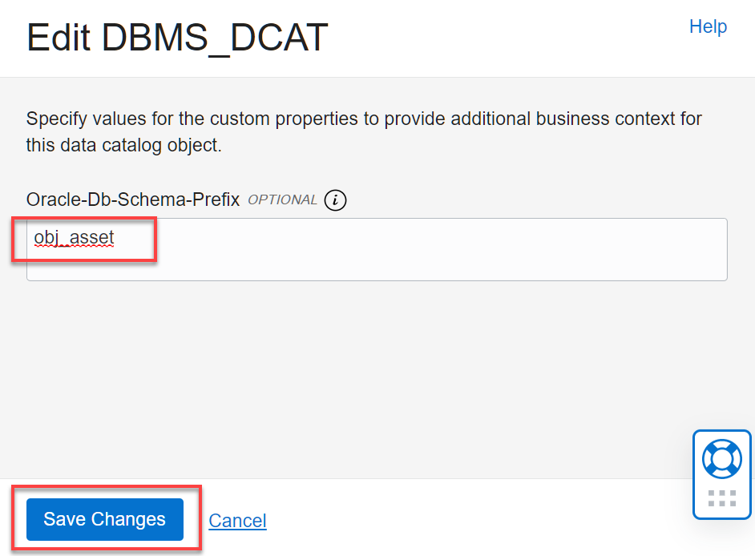

    The new prefix is displayed.

    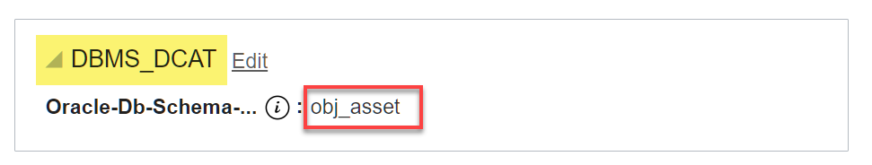


You may now proceed to the next lab.

## Learn More

* [Get Started with Data Catalog](https://docs.oracle.com/en-us/iaas/data-catalog/using/index.htm)
* [Data Catalog Overview](https://docs.oracle.com/en-us/iaas/data-catalog/using/overview.htm)
* [Oracle Cloud Infrastructure Documentation](https://docs.cloud.oracle.com/en-us/iaas/Content/GSG/Concepts/baremetalintro.htm)
* [What Is a Data Catalog and Why Do You Need One?](https://www.oracle.com/big-data/what-is-a-data-catalog/)
* [Harvesting Object Storage Files as Logical Data Entities](https://docs.oracle.com/en-us/iaas/data-catalog/using/logical-entities.htm)


## Acknowledgements
* **Author:** Lauran Serhal, Principal UA Developer, Oracle Database and Big Data User Assistance
* **Contributor:** Martin Gubar, Director, Product Management Autonomous Database / Cloud SQL    
* **Last Updated By/Date:** Lauran Serhal, September 2021
