# Harvest Technical Metadata from Oracle Object Storage

## Introduction

Harvesting is a process that extracts technical metadata from your data assets into your Data Catalog repository. A data asset represents a data source such as database, an object store, a file or document store, a message queue, or an application. This lab walks you through the steps to create an Oracle Object Storage data asset, add a default connection to the new data asset, create a filename pattern and assign it to your data asset, and finally harvest the data asset and view the harvested data entities.

Estimated Time: 30 minutes

### Objectives

In this lab, you will:
* Create an Oracle Object Storage data asset.
* Add three Object Storage connections for the newly created data asset.
* Create a Filename Pattern and assign it to the Oracle Object Storage data asset.
* Harvest the data asset.
* View the harvested data entities.
* Customize the business names for the three Oracle Object Storage buckets.

###Prerequisites  
This lab assumes that you have successfully completed all of the preceding labs in the **Contents** menu.


## Task 1: Log in to the Oracle Cloud Console

1. Log in to the **Oracle Cloud Console** as the Cloud Administrator. You will complete all the labs in this workshop using this Cloud Administrator.

2. On the **Sign In** page, select your tenancy, enter your username and password, and then click **Sign In**. The **Oracle Cloud Console** Home page is displayed.

## Task 2: Create an Object Storage Data Asset

Register your Oracle Object Storage data sources with Data Catalog as a data asset.

1. Open the **Navigation** menu and click **Analytics & AI**. Under **Data Lake**, click **Data Catalog**.

2. On the **Data Catalog Overview** page, click **Go to Data Catalogs**.

   

3. On the **Data Catalogs** page, click the **`training-dcat-instance`** Data Catalog instance where you want to create your data asset.

   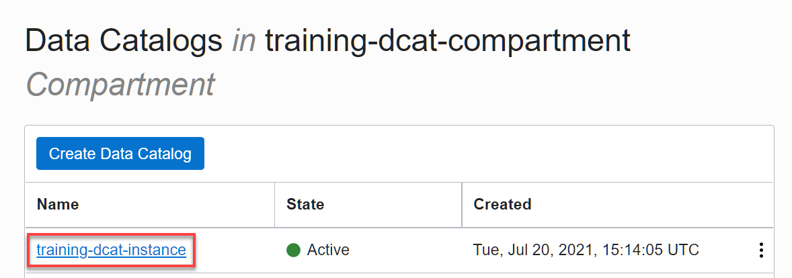

4. On the **`training-dcat-instance`** **Home** page, in the **Quick Actions** tile, click **Create Data Asset**.

   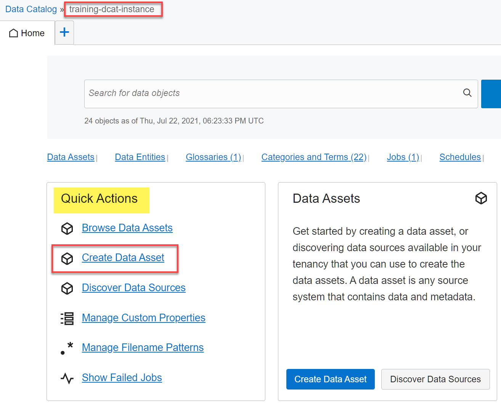

5. In the **Create Data Asset** panel, specify the data asset details as follows:    
       * **Name:** **`Data Lake`**.
       * **Description:** **`Data Asset to access Oracle Object Storage buckets in a different tenancy than yours using public PARs`**.
       * **Type:** Select **Oracle Object Storage** from the drop-down list.
       * **URL:** This is the swift URL for the OCI Object Storage resource that you will use in this lab. The URL field is automatically populated using your own **Home Region**, `us-ashburn-1` in this example. If the Oracle Object Storage buckets that you are harvesting from a different tenancy has a different **Home Region**, then make sure to edit this URL to reflect that home region.

        ```
        https://swiftobjectstorage.us-ashburn-1.oraclecloud.com
        ```
        >**Note:** In this lab, you will be accessing three Oracle Object Storage buckets that contain the data using three public pre-authenticated requests (PARs) that are provided for you. The three buckets are located in the **c4u04** tenancy in the **us-ashburn-1** region in our example. In the next step, you'll add three data connections to this data asset using the three pre-authenticated requests (PARs). Note that if you were using an Oracle Object Storage data asset type instead of PAR, you would only need one data connection instead of three. For information on PARs, see [Using Pre-Authenticated Requests](https://docs.oracle.com/en-us/iaas/Content/Object/Tasks/usingpreauthenticatedrequests.htm) in the _Oracle Cloud Infrastructure_ documentation.

       * **Namespace:** Enter **c4u04**. This is tenancy where the three Oracle Object Storage buckets that you will harvest are located.

6. Click **Create**.

   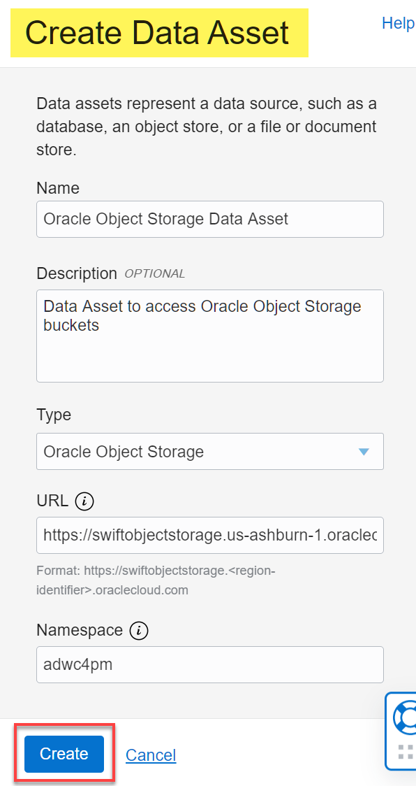

   A `Data Asset created successfully` message box is displayed. The **Data Lake** tab is displayed. The details for the new data asset are displayed in the **Summary** tab.

   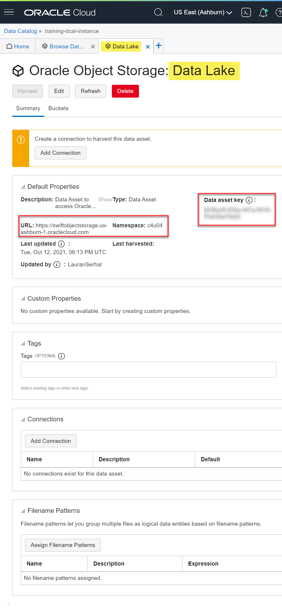

## Task 3: Gather Information About your Data Catalog Instance and Resources

In later labs, you will need more information about your Data Catalog instance and other resources. You will gather that information now, and save the identified values in your local **`workshop-resources.txt`** text file. This will save you time and steps later.

1. On the **Data Lake** tab that you are currently on from the previous task, copy the value for the **Data asset key** field, and then paste it in the **Data Catalog Data Lake (data asset) Key** section in your local **`workshop-resources.txt`** text file. Save the file.

    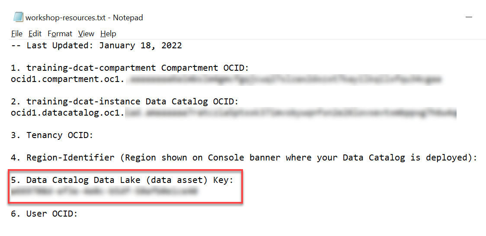

2. Find your _Tenancy's OCID_. From the **Oracle Cloud Console** banner, click the **Profile** icon. From the drop-down menu, click the **Tenancy** menu item. The **Tenancy Details** page for your tenancy is displayed. In the **Tenancy Information** tab, click the **Copy** link for the **OCID** field. The **Copy** link text changes briefly to **Copied** and then back to **Copy**.

    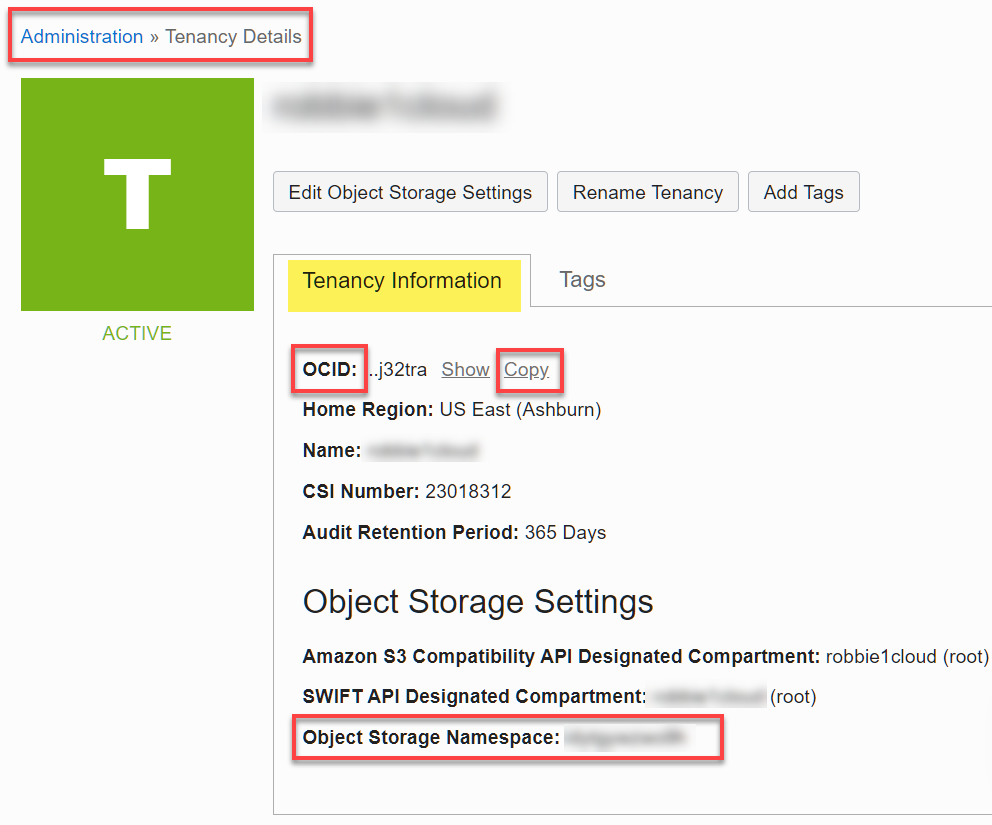

3. Paste the copied tenancy OCID value in the **Tenancy OCID** section in your local **`workshop-resources.txt`** text file. Save the file.

    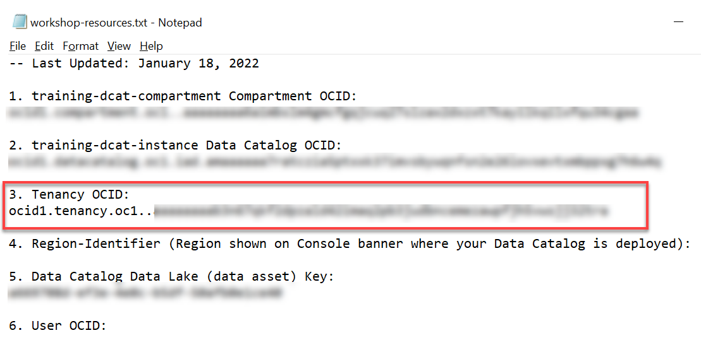

4. Find your _Region-Identifier_. From **Oracle Cloud Console** banner, click the **Regions** drop-down list, and then click **Manage Regions**.

    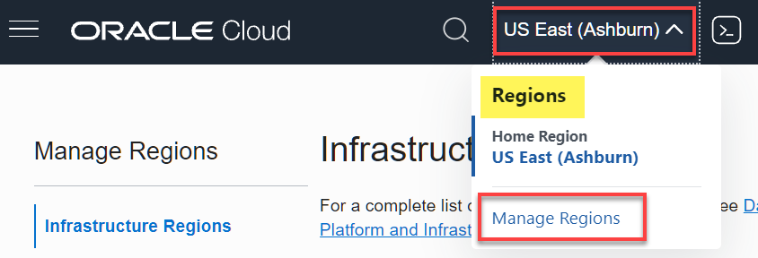

5. On the **Infrastructure Regions** page, in the **Region** section, your Home Region to which you are subscribed is displayed along with your **Region Identifier**, `us-ashburn-1`, in our example. Copy your region identifier.

    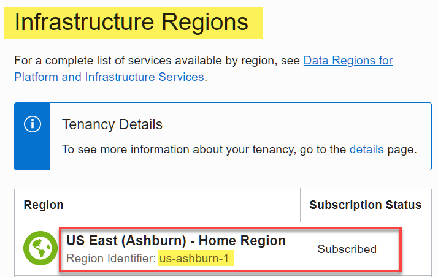

6. Paste the copied region identifier value in the **Region-Identifier** section in your local **`workshop-resources.txt`** text file. Save the file.

    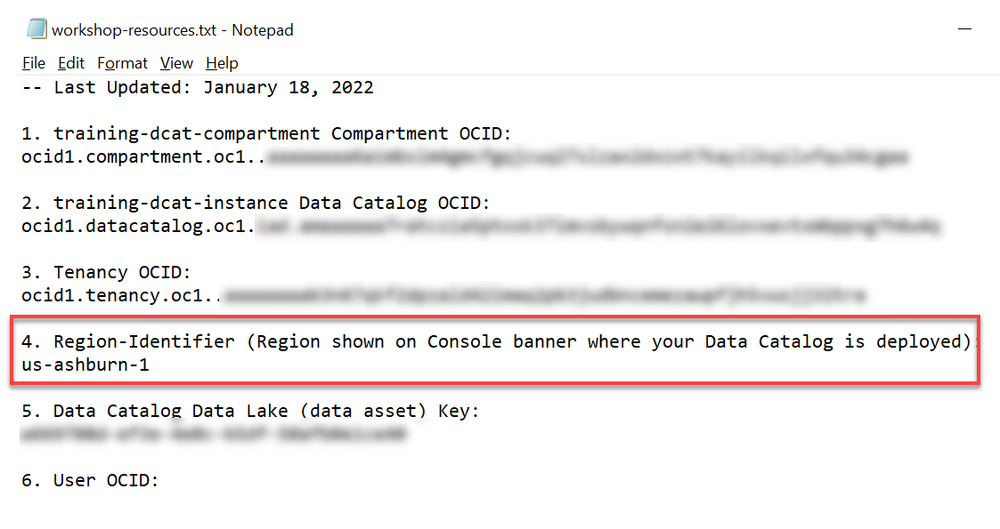

7. Find your _User OCID_. From **Oracle Cloud Console** banner, click the **Profile** icon, and then click **User Settings** from the drop-down list.

    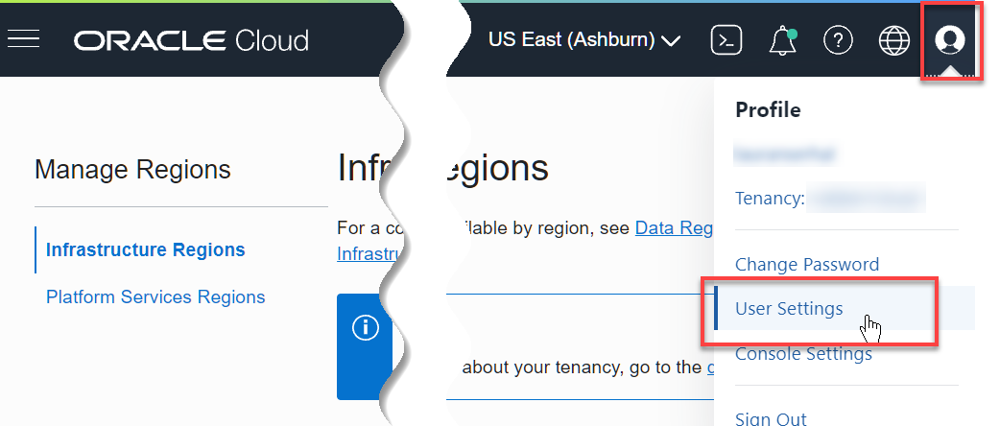

8. On the **User Details** page, in the **User Information** tab, click the **Copy** link for the **OCID** field. The **Copy** link text changes briefly to **Copied** and then back to **Copy**. Paste the copied OCID to your text editor and label it as the **User OCID** to easily identify it later.

    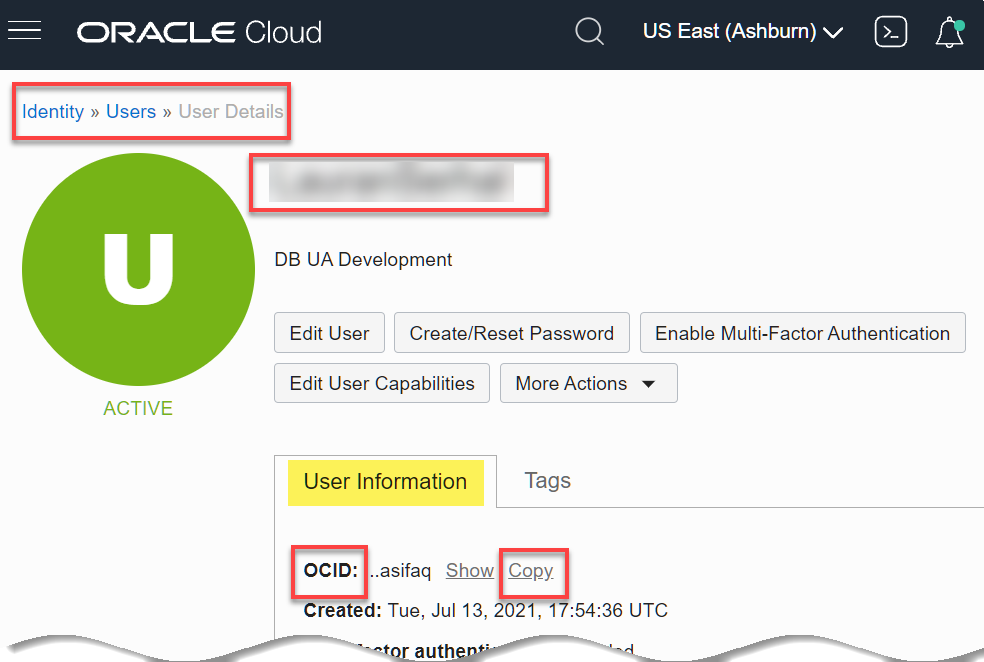

9. Paste the copied user OCID value in the **User OCID** section in your local **`workshop-resources.txt`** text file. Save the file.

    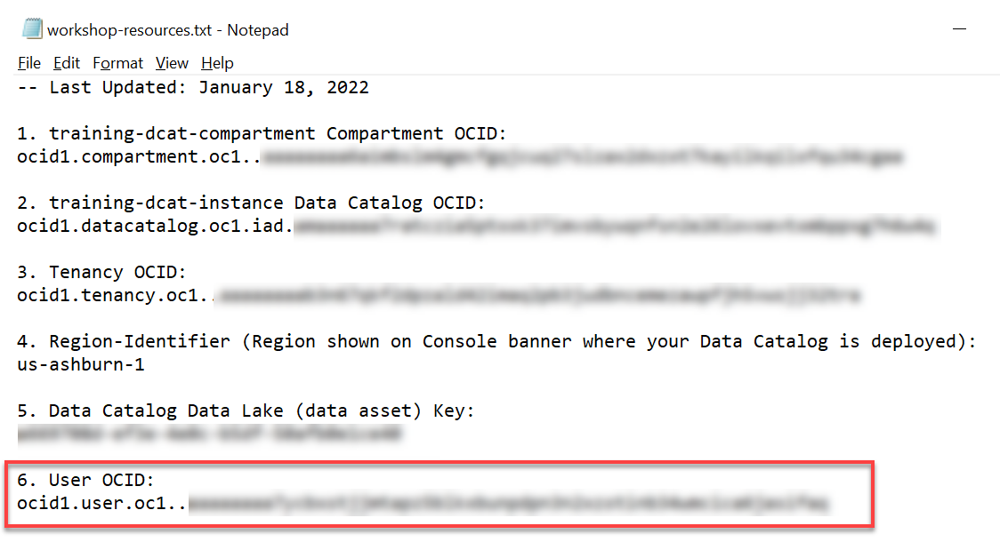


## Task 4: Add Three Data Asset Connections to the Oracle Object Storage Buckets

After you register a data source as a data asset in your data catalog, you create data connections to your data asset to be able to harvest it. You can create multiple connections to your data source. At least one connection is needed to be able to harvest a data asset. In this lab, you will create three data connections to access the **moviestream\_sandbox**, **moviestream\_landing**, and **moviestream\_gold** Oracle Object Storage buckets that contain the data. The three buckets are located in a different tenancy than yours, **c4u04**; therefore, you will use three provided public pre-authenticated requests (PARs), one for each bucket. For information on PAR, see [Using Pre-Authenticated Requests](https://docs.oracle.com/en-us/iaas/Content/Object/Tasks/usingpreauthenticatedrequests.htm) in the _Oracle Cloud Infrastructure_ documentation.

> **Note:** Pre-Authenticated Requests (PARs) are used in this workshop but are not yet supported by the metadata synchronization process and therefore will only work in limited circumstances. If your data must be public, please use public buckets instead.

Add a connection to the **moviestream_sandbox** bucket to your new **`Data Lake`** data asset as follows:

1. On the **Data Lake** tab, in the **Summary** tab, click **Add Connection**.

   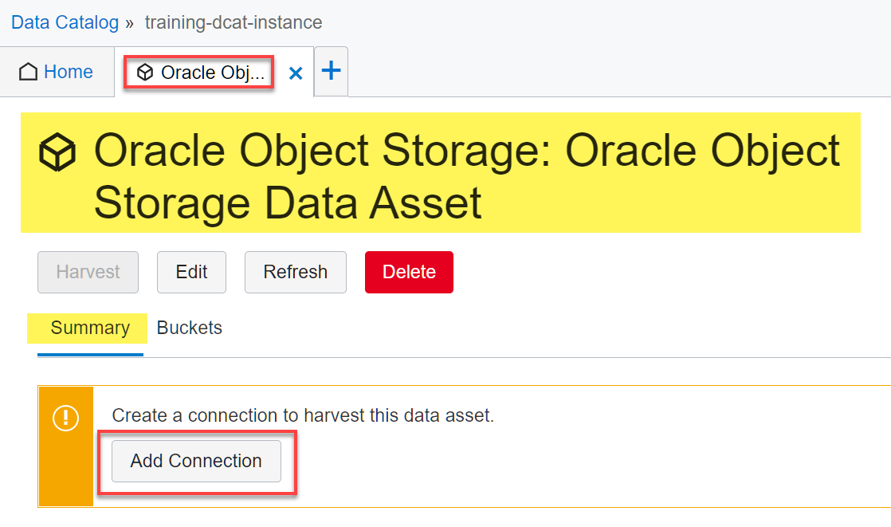

2. In the **Add Connection** panel, specify the connection details for the **moviestream_sandbox** Object Storage bucket data source as follows:

       * **Name:** **`Sandbox`**.
       * **Description:** Enter an optional description.
       * **Type:** Select **Pre-Authenticated Request** from the **Type** drop-down list.
       * **Pre-Authenticated Request URL:** Click **Copy** to copy the following URL, and then paste it in this field.

        ```
        <copy>
        https://objectstorage.us-ashburn-1.oraclecloud.com/p/WCoFAtux8IG4EPHU9TCBrsXbd6EQzqhF3-QVXEqROKeGgsbJPeIJnLZYHMhkiA7I/n/c4u04/b/moviestream_sandbox/o/
        </copy>
        ```  

       * **Make this the default connection for the data asset:** Leave this checkbox unchecked.

       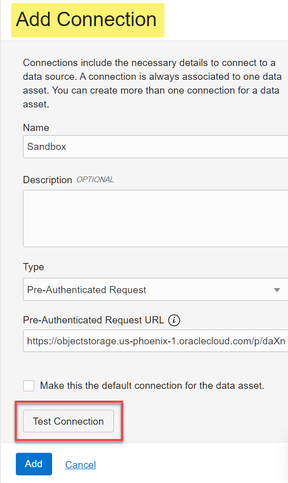


3. Click **Test Connection**. A message box is displayed indicating whether or not the test was successful.

   


4. If the test was successful, click **Add**. A message box is displayed indicating whether or not the connection was added successfully. The **`Sandbox`** data source connection is added to the data asset and is displayed in the **Connections** section.

   


Add a connection to the **moviestream_landing** bucket to your new **`Data Lake`** data asset as follows:

1. On the **Data Lake** tab, in the **Summary** tab, in the **Connections** section, click **Add Connection**.

   

2. In the **Add Connection** panel, specify the connection details for the **moviestream_sandbox** Object Storage bucket data source as follows:

       * **Name:** **`Landing`**.
       * **Description:** Enter an optional description.
       * **Type:** Select **Pre-Authenticated Request** from the **Type** drop-down list.
       * **Pre-Authenticated Request URL:** Click **Copy** to copy the following URL, and then paste it in this field.

        ```
        <copy>
        https://objectstorage.us-ashburn-1.oraclecloud.com/p/vtAnTOoRSGlZ6izqz2XGtRjHpXo8EE_Zu9nVm48YmMCd-Tn8xak_hxHodY8R43Oa/n/c4u04/b/moviestream_landing/o/
        </copy>
        ```

       * **Make this the default connection for the data asset:** Leave this checkbox unchecked.

       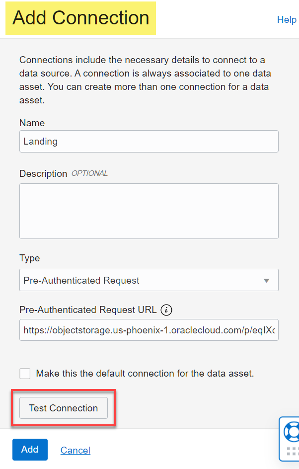


3. Click **Test Connection**. A message box is displayed indicating whether or not the test was successful.

   


4. If the test was successful, click **Add**. A message box is displayed indicating whether or not the connection was added successfully. The **`Landing`** data source connection is added to the data asset and is displayed in the **Connections** section.

   

Add a connection to the **moviestream_gold** bucket to your new **`Data Lake`** data asset as follows:

1. On the **`Data Lake`** tab, in the **Summary** tab, in the **Connections** section, click **Add Connection**.

2. In the **Add Connection** panel, specify the connection details for the **moviestream_gold** Object Storage bucket data source as follows:

      * **Name:** **`Gold`**.
      * **Description:** Enter an optional description.
      * **Type:** Select **Pre-Authenticated Request** from the **Type** drop-down list.
      * **Pre-Authenticated Request URL:** Click **Copy** to copy the following URL, and then paste it in this field.

        ```
        <copy>https://objectstorage.us-ashburn-1.oraclecloud.com/p/MsSJaLPX1fiPAdGS_TnW934DGmOMS2AUEA4r3r9KiaPJUmuSdMbSK5PXlywmqT0J/n/c4u04/b/moviestream_gold/o/</copy>
        ```

        * **Make this the default connection for the data asset:** Leave this checkbox unchecked.

        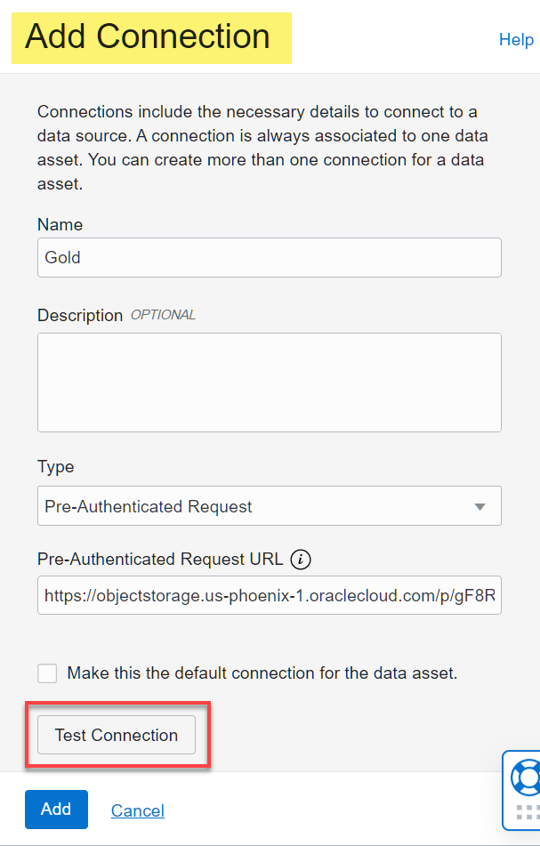    

3. Click **Test Connection**. A message box is displayed indicating whether or not the test was successful.

   

4. If the test was successful, click **Add**. A message box is displayed indicating whether or not the connection was added successfully. The **`Gold`** data source connection is added to the data asset and is displayed in the **Connections** section.

   


## Task 5: Create a Filename Pattern and Assign it to your Oracle Object Storage Data Asset

Your data lake typically has a large number of files that represent a single data set. You can group multiple Object Storage files into logical data entities in Data Catalog using filename patterns. A filename pattern is a regular expression that is created to group multiple Object Storage files into a logical data entity that can be used for search and discovery. Using logical data entities, you can organize your data lake content meaningfully and prevent the explosion of your entities and attributes in your Data Catalog.
If an Object Storage file is matched with multiple filename patterns, it can be part of multiple logical data entities.

>**Note:** If you harvest your Object Storage data source files without creating filename patterns, Data Catalog creates an individual logical entity for each file under each root bucket. Imagine this situation with hundreds of files in your data source resulting in hundreds of data entities in your Data Catalog.

Create a filename pattern as follows:

1. On the **Data Lake** tab from the previous task, click the  tab and select **Filename Patterns** from the **Context** menu.

      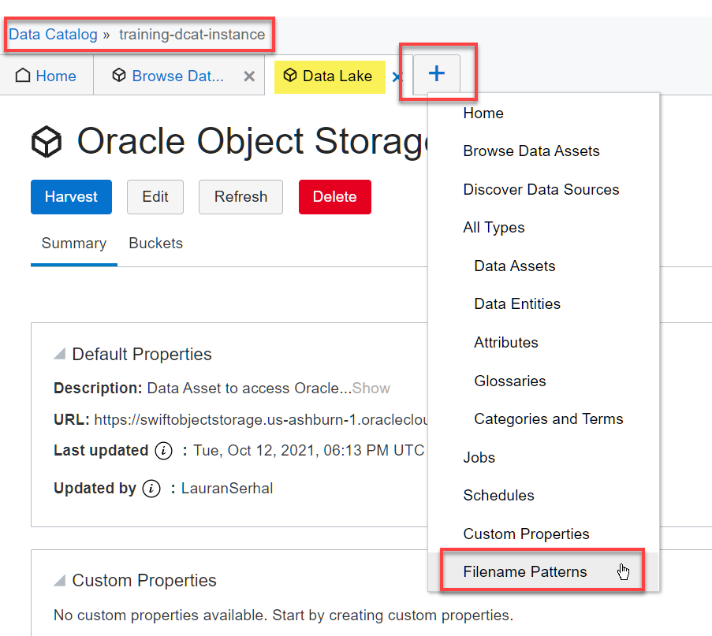

      The **Filename Patterns** tab is displayed.

      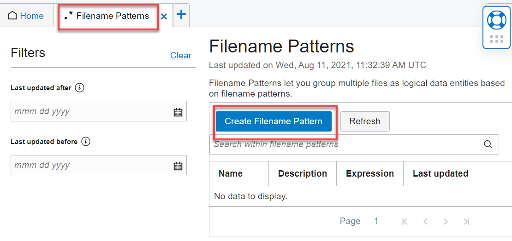

4. Click **Create Filename Pattern**. In the **Create Filename Pattern** panel, specify the following information:

       * **Name:** `folderLE`.
       * **Description:** `Map each Object Storage folder off the moviestream_sandbox, moviestream_landing, and moviestream_gold root buckets to Data Catalog Logical Entities using the selected regular expression`.

       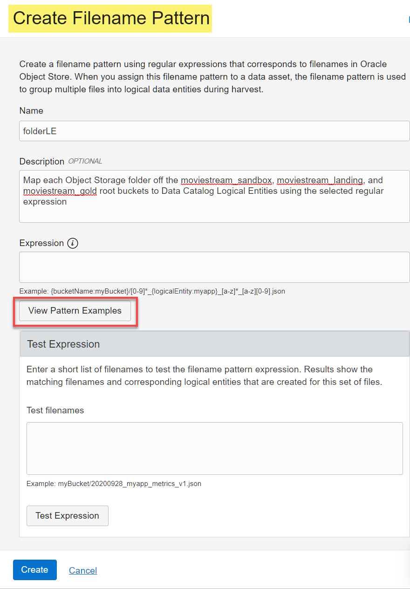

5. Click **View Pattern Examples** for examples file pattern styles, sample files, pattern expressions, and the resulting logical data entities that are derived based on the pattern expression. A list of different pattern examples is displayed. Scroll-down the page to the **Non-Hive Style Folders** section, expand it, and then click **Select**.

       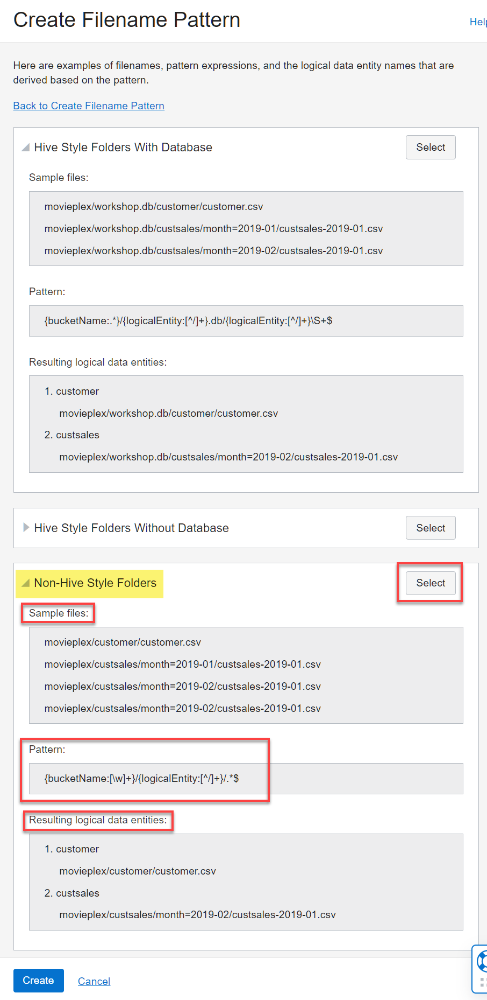

       The **Create Filename Pattern** panel is re-displayed. The selected file pattern is displayed in the **Expression** field and the respective test filenames are displayed in the **Test filenames** field.

       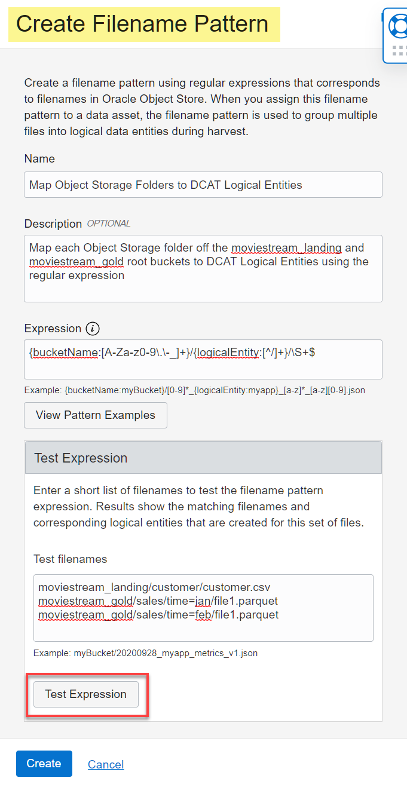

       Here's the explanation of the preceding regular expression:      

       * **``{bucketName:[\w]+}``**:      
       This section, between the opening and closing **{ }**, represents the derived bucket name. You can use the **`bucketName`** qualifier to specify that the bucket name should be derived from the path that matches the expression that follows. In this example, the bucket name is comprised of the characters leading up to first **`/`** character (which is outside the name section). `\w` stands for “word character” including alphanumeric characters plus the underscore, ASCII characters [A-Za-z0-9_]. The valid characters are **`A-Z`**, **`a-z`**, **`0-9`**, and **_** (underscore). The **`+`** (plus) indicates any number of occurrences of the preceding expression inside the **[ ]**.

       * **``{logicalEntity:[^/]+}``**:      
       This section, between the second set of opening and closing **{ }**, represents the derived logical entity name. You can use the **`logicalEntity`** qualifier to specify that the logical entity name should be derived from the path that matches the expression that follows. In this example, the logical entity name is comprised of the characters leading up to the second **`/`** character (which is outside the name section). The logical entity name starts after the "/" and ends with the “/” following the closing "}". It can contain any character that is not a forward slash, `/` as represented by the not **`^`** (caret) symbol.  

       * **`/\S+$`**:       
       Finally, the logical data entities names will be any non-whitespace characters (represented by `\S+`). **`$`** signifies the end of the line.

6. Click **Test Expression**. The **Resulting Logical Entities** based on the regular expression that you specified are displayed.

      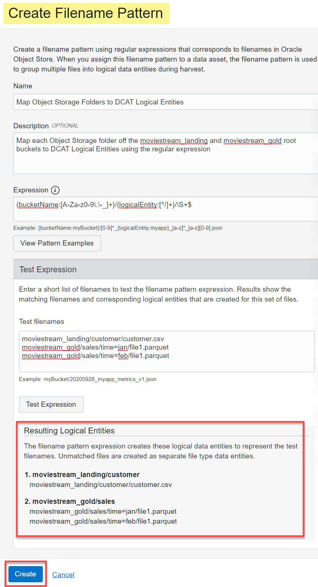

      A message box is displayed indicating whether or not the test was successful.    

7. Click **Create**. The **File Patterns** tab is re-displayed. The newly created file pattern is displayed in the **Filename Patterns** list. You might need to click **Refresh** to display the file pattern.

      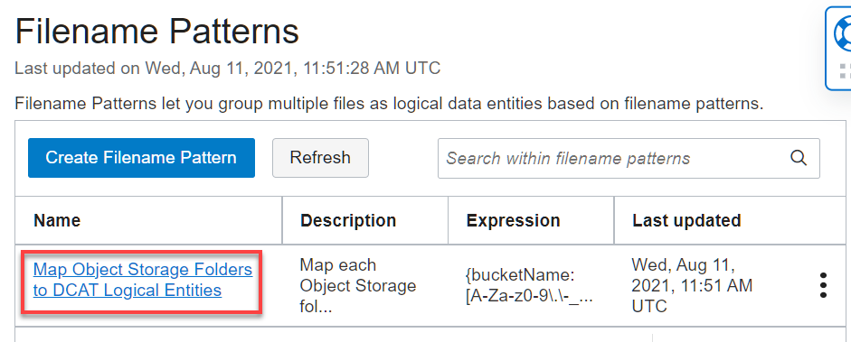

8. Assign the filename pattern that you just created to your **Data Lake** data asset. On the **Home** tab, click the **Data Assets** link to access the **Data Assets** tab.

      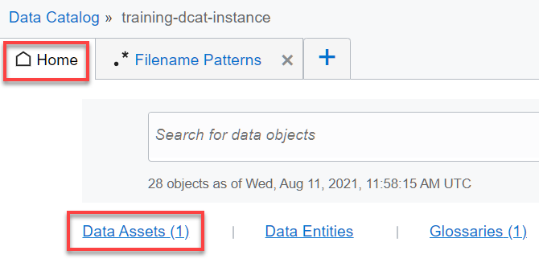

9. In the **Data Assets** list, click the **Data Lake** data asset for which you want to assign the filename pattern that you created.

      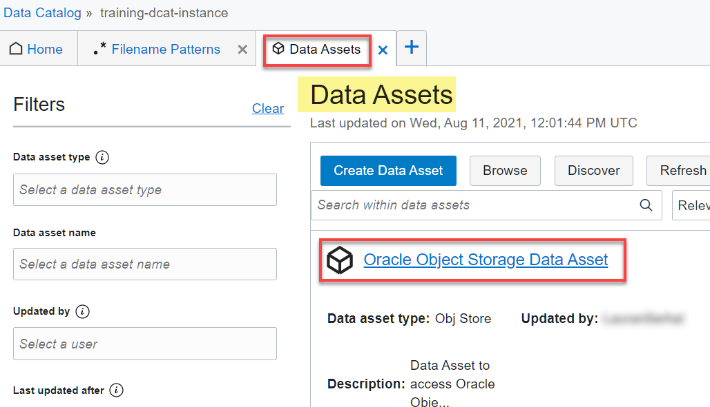

10. In the **Summary** tab on the **Data Lake** details tab, scroll-down the page to the **Filename Patterns** section, and then click **Assign Filename Patterns**.

      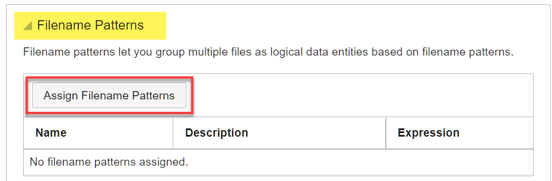

11. In the **Assign Filename Patterns** panel, select the checkbox next to the filename pattern(s) that you want to assign to this data asset, **folderLE**. You can use the **Filter** box to filter the filename patterns by name. You can also de-select already assigned filename patterns to un-assign them from this data asset.

      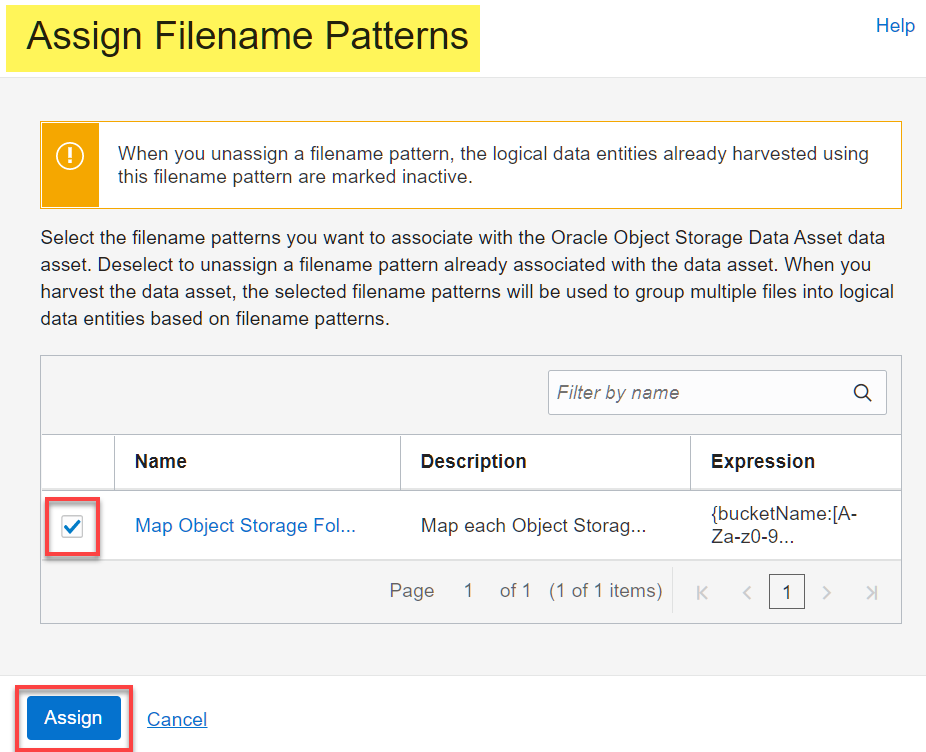

12. Click **Assign**. A message box is displayed indicating whether or not the file pattern assignment was successful. The selected filename pattern is assigned to the data asset.

      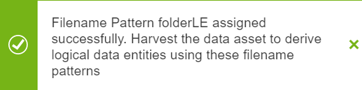

      When you harvest the data asset, the filename pattern is used to derive logical data entities. The names of the files in the Object Storage bucket are matched to the pattern expression and the logical data entities are formed.

      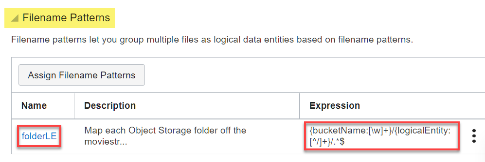

>**Note:**    
When you assign a new filename pattern to a data asset, the status of any harvested logical data entities is set to **Inactive**. You need to harvest the data asset again to derive the valid logical data entities again.


## Task 6: Harvest the Data Asset

After you create a data asset in the Data Catalog repository, you harvest it to extract the data structure information into the Data Catalog and view its data entities and attributes. In this task, you will harvest the **moviestream\_sandbox**, **moviestream\_landing**, and **moviestream\_gold** Oracle Object Storage buckets that contain the data.

Harvest the data entities from the **Data Lake** data asset starting with the _**moviestream\_sandbox**_ bucket as follows:

1. Open the **Navigation** menu and click **Analytics & AI**. Under **Data Lake**, click **Data Catalog**.

2. On the **Data Catalogs** page, click the **`training-dcat-instance`** Data Catalog instance that contains the data asset that you want to harvest.

3. On the Data Catalog instance **Home** tab, click **Data Assets**. The **Data Assets** tab is displayed.       

      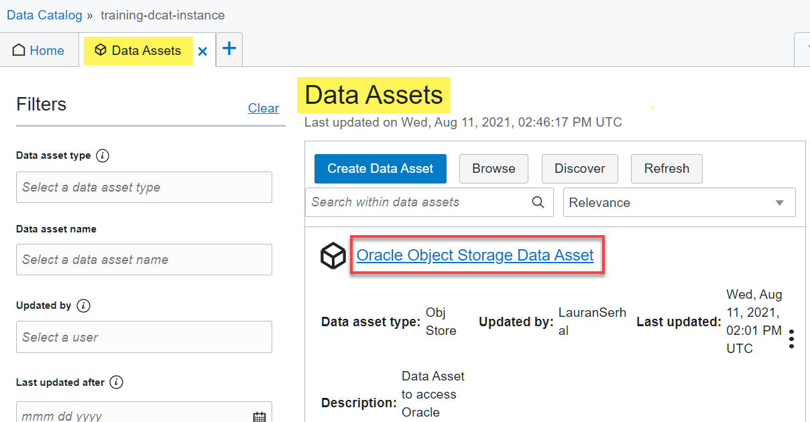

4. In the **Data Assets** list, click the **Data Lake** data asset. The **Oracle Object Storage: Data Lake** page is displayed.

      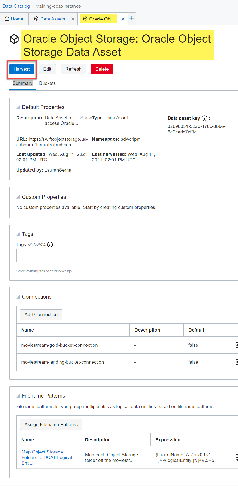

5. Click **Harvest**. The **Select a Connection** page of the **Harvest** wizard (Step 1 of 3) is displayed in the **Harvest Data Entities** tab. Select the **`Sandbox`** from the **Select a connection for the data asset you want to harvest** drop-down list. Click **Next**.

      

6. The **Select Data Entities** page of the **Harvest** wizard (Step 2 of 3) is displayed. The **`moviestream-sandbox`** bucket is already displayed in the **Available Bucket** section. Click the  icon next it to add it to the **Selected Bucket / Data Entities** section to include it in the harvest job.

      

      >**Note:** You can use this page to view and add the bucket(s) and/or data entities you want to harvest from the **Available Buckets** section. Click the  icon for each data entity you want to include in the harvest job. Click a bucket link to display its nested data entities. Click the  icon next to each data entity that you want to include in the harvest job. You can also search for a bucket or entity using the **Filter Bucket** and **Filter Bucket / data entities** search boxes.  

7. Click **Next**. The **Create Job** page of the **Harvest** wizard (Step 3 of 3) is displayed. Specify the following for the job details:

      * **Job Name:** Enter `Harvest_Data_Lake_Sandbox`.
      * **Job Description:** Enter an optional description.
      * **Incremental Harvest:** Leave this check box selected (default). This indicates that subsequent runs of this harvesting job will only harvest data entities that have changed since the first run of the harvesting job.
      * **Include Unrecognized Files:** Leave this check box unchecked. Select this check box if you want Data Catalog to also harvest file formats that are not currently supported such as `.log`, `.txt`, `.sh`, `.jar`, and `.pdf`.
      * **Include matched files only:** Select this check box. If you are harvesting an Oracle Object Storage data asset, select this check box if you want Data Catalog to harvest only the files that match the assigned filename patterns that you specified. When you select this check box, the files that do not match the assigned filename patterns are ignored during the harvest and are added to the skipped count.
      * **Time of Execution:** Select one of the three options to specify the time of execution for the harvest job:
         * **Run job now**: Select this option (default). This creates a harvest job and runs it immediately.    
         * **Schedule job run**: Displays more fields to schedule the harvest job. Enter a name and an optional description for the schedule. Specify how frequently you want the job to run from the **Frequency** drop-down list. Your choices are **Hourly**, **Daily**, **Weekly**, and **Monthly**. Finally, select the start and end time for the job.    

         

         * **Save job configurations for later**: Creates a job to harvest the data asset, but the job is not run.

      

8. Click **Create Job**. A message is briefly displayed about the job execution starting. The **Jobs** tab is displayed and the job is displayed in the list of jobs. If the harvest is successful, the harvest job **Last run status** column displays **Succeeded**. To display the job details, click the job name link in the **Name** column.

    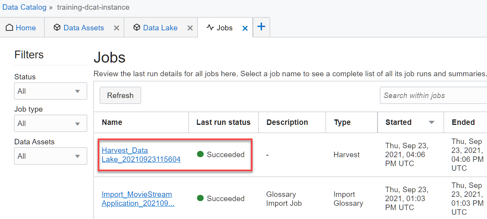

9. The harvest job name tab is displayed. On the **Jobs** tab, you can track the status of your job and view the job details. The **Logical data entities harvested** field shows **1** as the number of logical entities that were harvested using the filename pattern that you assigned to this Object Storage asset. This number represents the number of sub-folders under the **`moviestream_sandbox`** root bucket. There is **1** corresponding file under the sub-folder under the root bucket.

    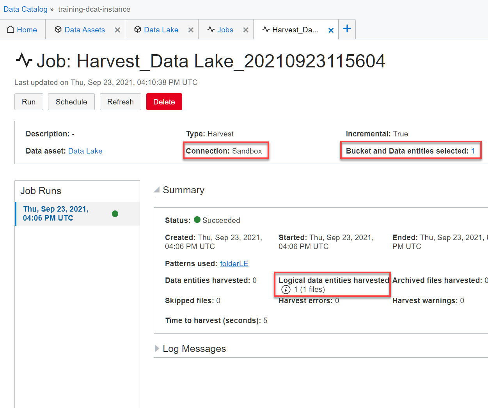

10. Drill-down on the **Log Messages** icon to display the job log.

    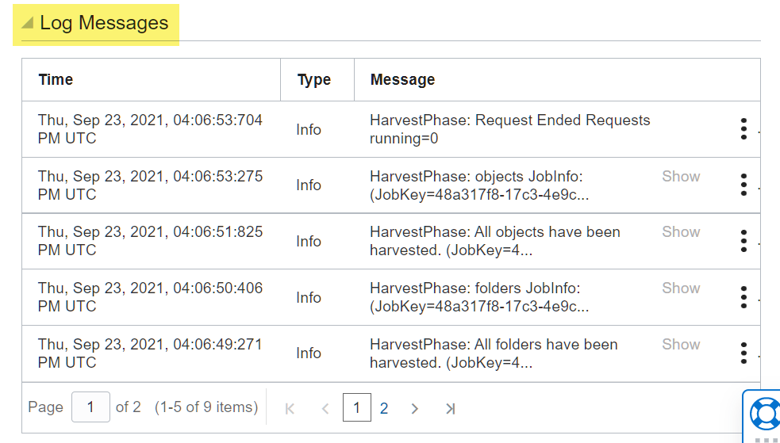


Harvest the data entities from the _**moviestream\_landing**_ data asset as follows:

1. Return to the **Browse Data Asset** tab from the previous step. If you have closed that tab, on the Data Catalog instance **Home** tab, in the **Quick Actions** tile, click **Browse Data Assets**. The **Browse Data Asset** tab is displayed that shows the **Oracle Object Storage: Data Lake** details.

      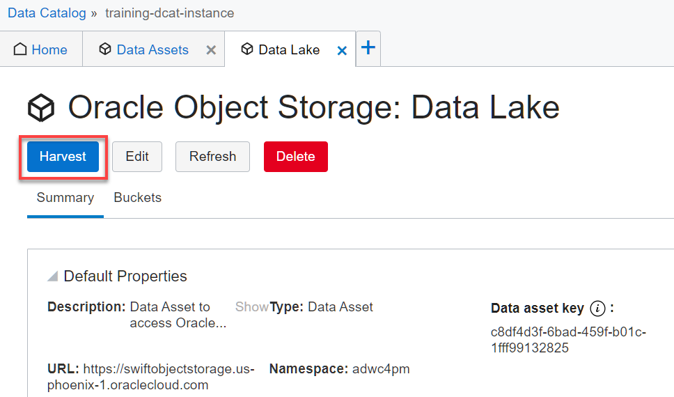

2. Click **Harvest**. The **Select a Connection** page of the **Harvest** wizard (Step 1 of 3) is displayed in the **Harvest Data Entities** tab. Select the **`Landing`** from the **Select a connection for the data asset you want to harvest** drop-down list. Click **Next**.

      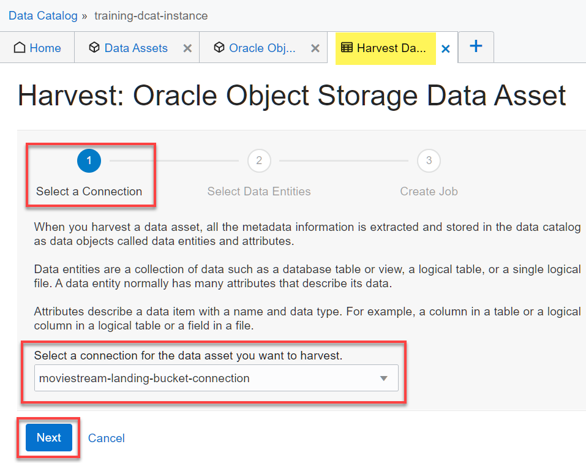

3. The **Select Data Entities** page of the **Harvest** wizard (Step 2 of 3) is displayed. The **`moviestream-landing`** bucket is already displayed in the **Available Bucket** section. Click the  icon next it to add it to the **Selected Bucket / Data Entities** section to include it in the harvest job.

      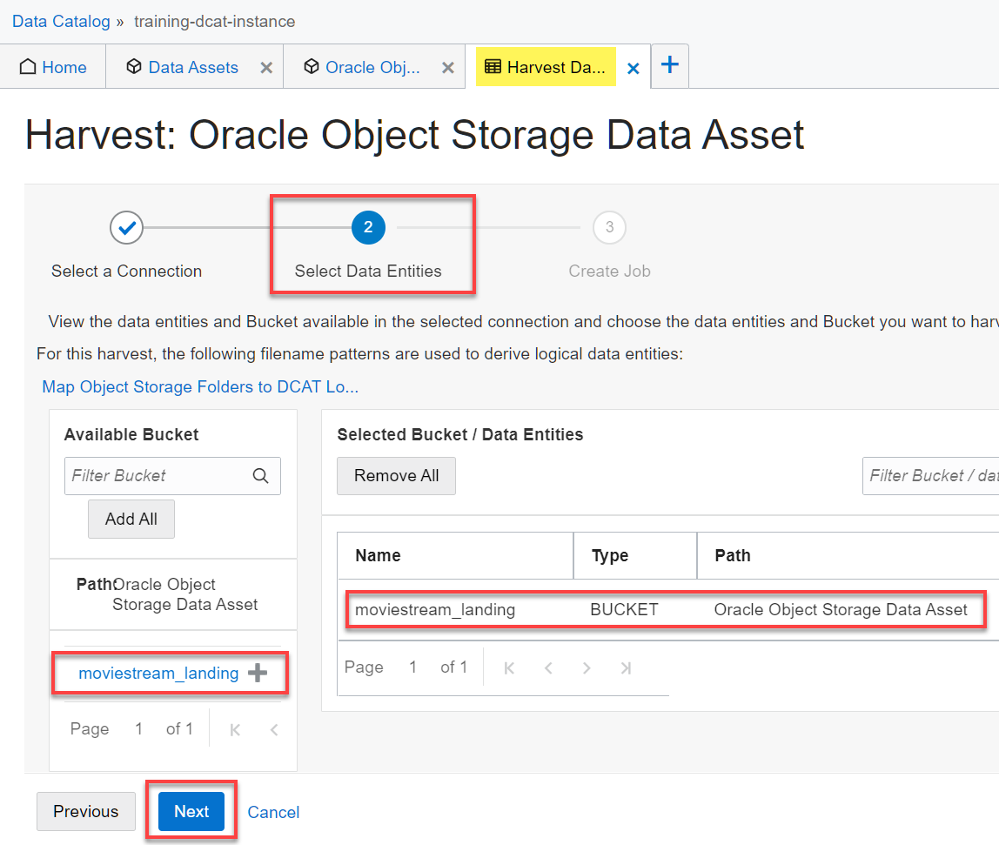

4. Click **Next**. The **Create Job** page of the **Harvest** wizard (Step 3 of 3) is displayed. Specify the following for the job details:

      * **Job Name:** Enter `Harvest_Data_Lake_Landing`.
      * **Job Description:** Enter an optional description.
      * **Incremental Harvest:** Leave this check box selected (default).
      * **Include Unrecognized Files:** Leave this check box unchecked.
      * **Include matched files only:** Select this check box.
      * **Time of Execution:** Select the **Run job now** option (default). This creates a harvest job and runs it immediately.    

    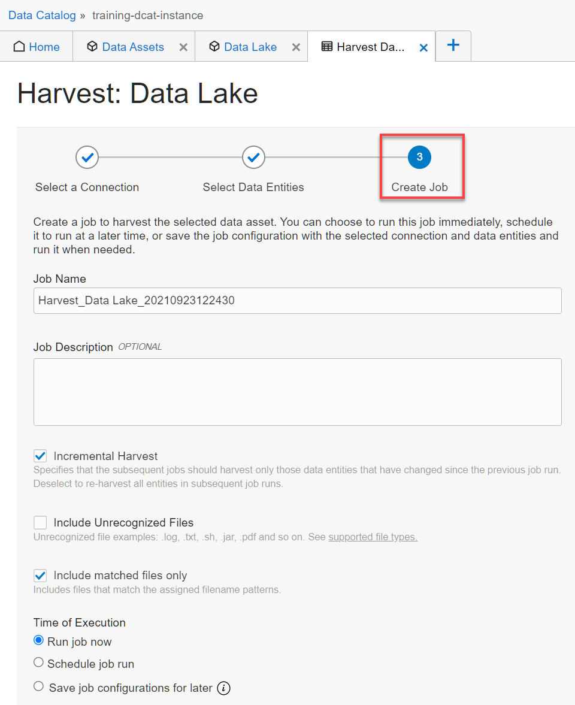

5. Click **Create Job**. A message is briefly displayed about the job execution starting. The **Jobs** tab is displayed and the job is displayed in the list of jobs. If the harvest is successful, the harvest job **Last run status** column displays **Succeeded**. To display the job details, click the job name link in the **Name** column.

    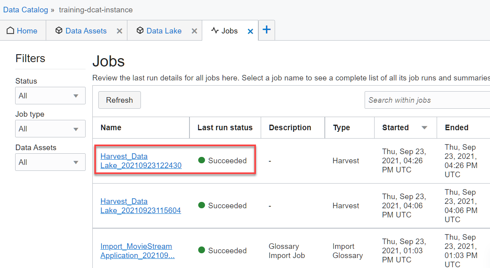

6. The harvest job name tab is displayed. On the **Jobs** tab, you can track the status of your job and view the job details. The **Logical data entities harvested** field shows **9** as the number of logical entities that were harvested using the filename pattern that you assigned to this Object Storage asset. This number represents the number of sub-folders under the **`moviestream_landing`** root bucket. There are **32** corresponding files under the sub-folders under the root bucket.

    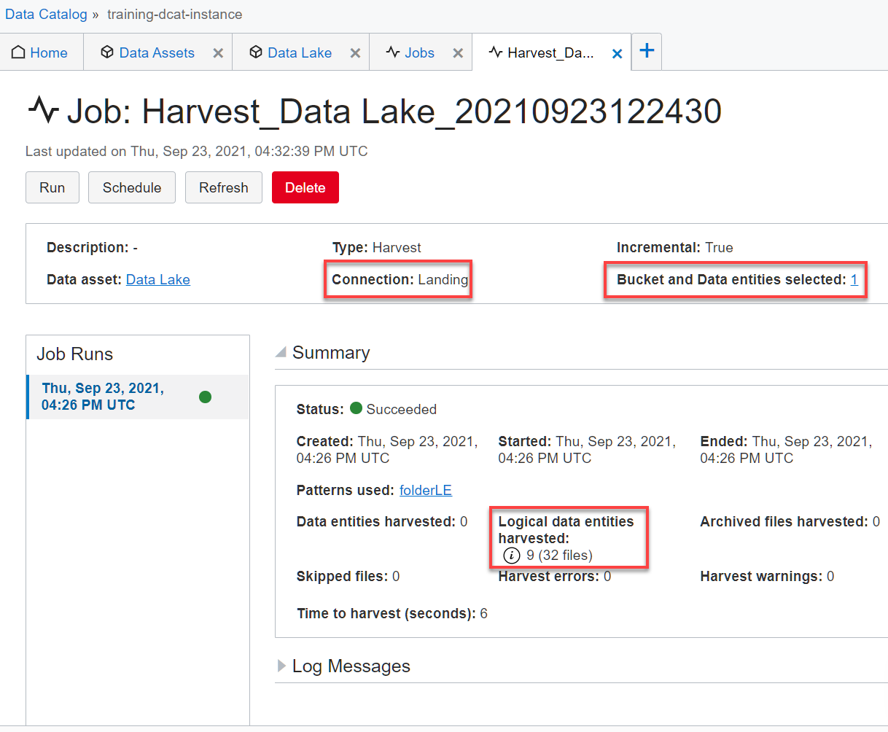

7. Drill-down on the **Log Messages** icon to display the job log.

Finally, you will harvest the data entities from the _**moviestream\_gold**_ Object Storage bucket as follows:

1. Return to the **Browse Data Asset** tab from the previous step. If you have closed that tab, on the Data Catalog instance **Home** tab, in the **Quick Actions** tile, click **Browse Data Assets**. The **Browse Data Asset** tab is displayed that shows the **Oracle Object Storage: Data Lake** details.

2. Click **Harvest**. The **Select a Connection** page of the **Harvest** wizard (Step 1 of 3) is displayed in the **Harvest Data Entities** tab. Select the **`Gold`** from the **Select a connection for the data asset you want to harvest** drop-down list. Click **Next**.

3. The **Select Data Entities** page of the **Harvest** wizard (Step 2 of 3) is displayed. The **`moviestream-gold`** bucket is already displayed in the **Available Bucket** section. Click the  icon to add it to the **Selected Bucket / Data Entities** section to include it in the harvest job.

4. Click **Next**. The **Create Job** page of the **Harvest** wizard (Step 3 of 3) is displayed. Specify the following for the job details:

      * **Job Name:** Enter `Harvest_Data_Lake_Gold`.
      * **Job Description:** Enter an optional description.
      * **Incremental Harvest:** Leave this check box selected (default).
      * **Include Unrecognized Files:** Leave this check box unchecked.
      * **Include matched files only:** Select this check box.
      * **Time of Execution:** Select the **Run job now** option.

      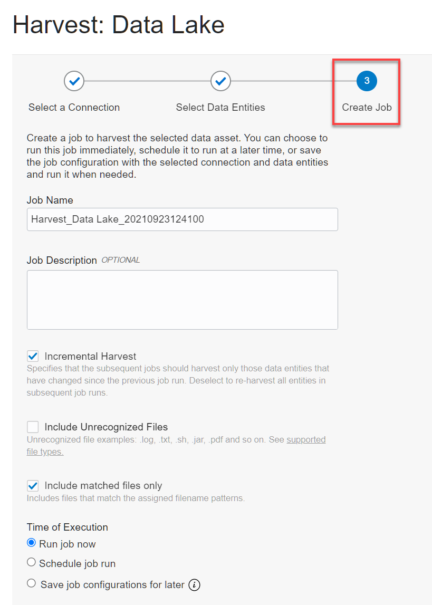

9. Click **Create Job**. The harvest job is created successfully and the **Jobs** tab is displayed. Click the job name link in the **Name** column.

    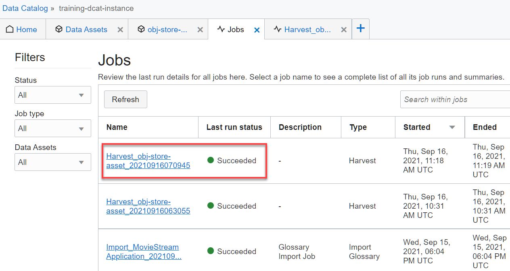

10. The harvest job name tab is displayed. On the **Jobs** tab, you can track the status of your job and view the job details.  The **Logical data entities harvested** field shows **4** as the number of logical entities that were harvested using the filename pattern that you assigned to this Object Storage asset. This number represents the number of sub-folders under the **`moviestream_gold`** root bucket. There are **27** corresponding files under the sub-folders under this root bucket.

    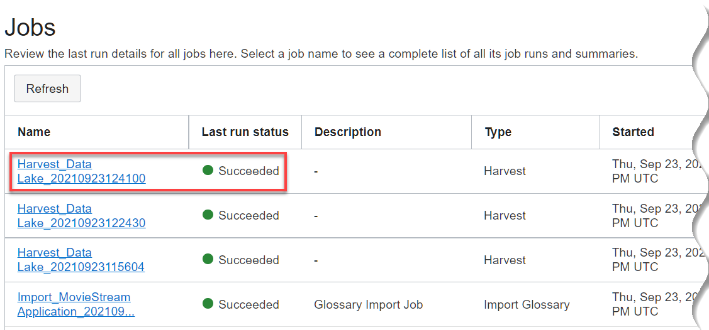

11. You can drill-down on the **Log Messages** icon to display the job log especially if there are errors or warnings.

    After you harvest your data asset, you can browse or explore your data asset to view the data entities and attributes.

## Task 7: View Harvested Data Entities

1. On the Data Catalog instance **Home** tab, click **Data Entities**.

    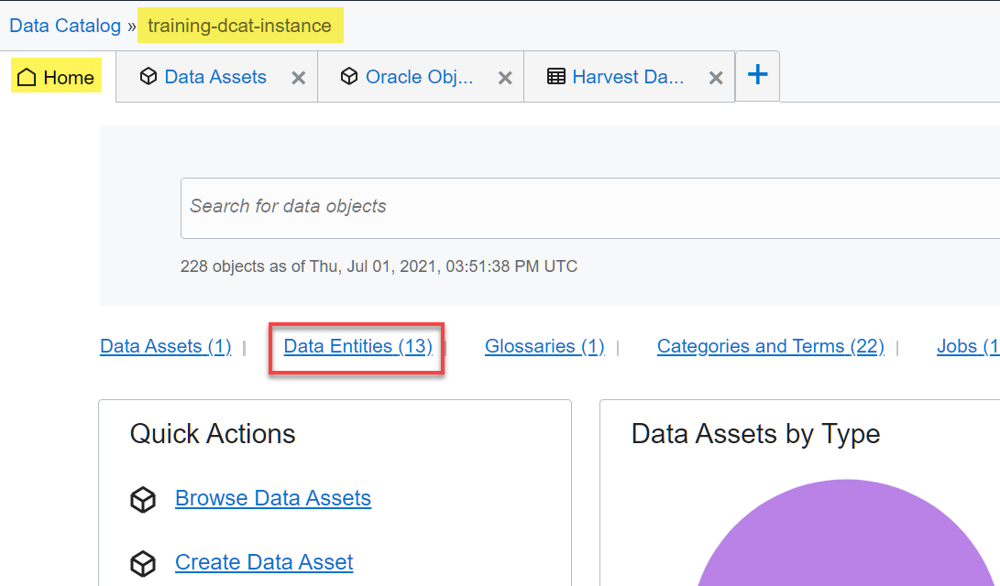

     The **Data Entities** tab is displayed. Remember, there were a total of **14** logical entities that were derived from the three Object Storage buckets during the harvesting process. You can use the different **Filters** on the page to refine the **Data Entities** list.

    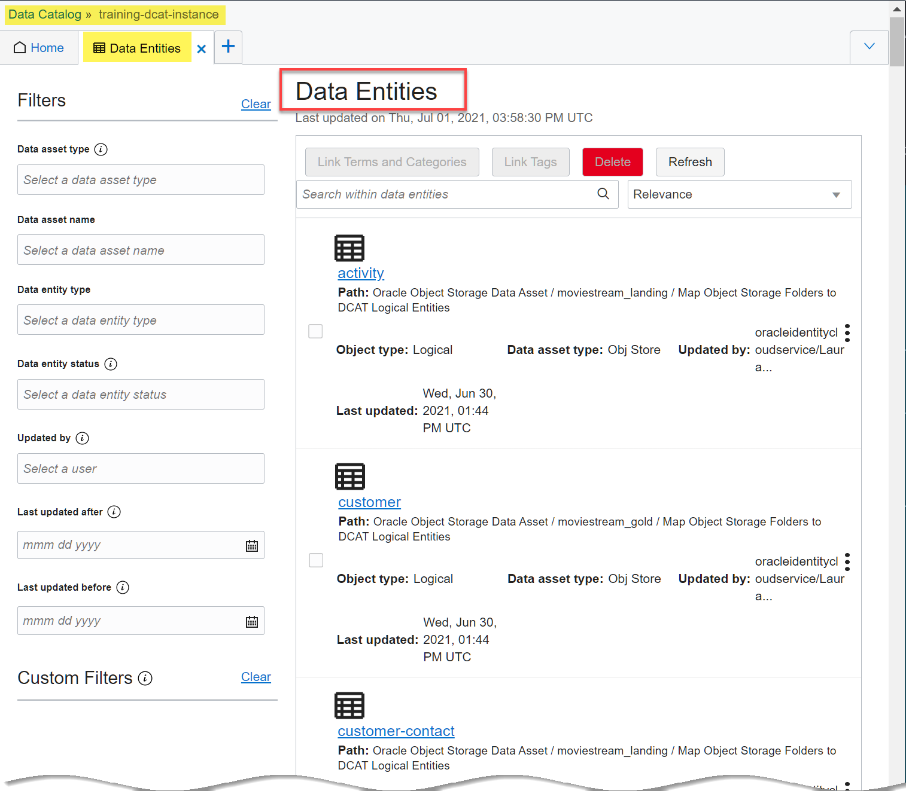

2. In the **Data Entities** list, click the name link for the data entity you want to view. Click the **`custsales`** logical data entity that was derived from the **`moviestream_gold`** bucket.

    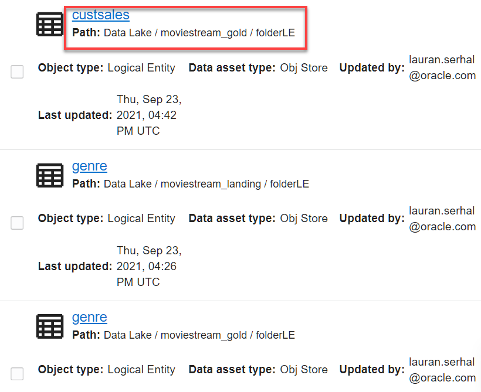

3. View the default properties, custom properties, tags, business glossary terms and categories, and recommendations, if any, for the data entity from the **Summary** tab.

    

4. From the **Attributes** tab, view the data entity attribute details.

    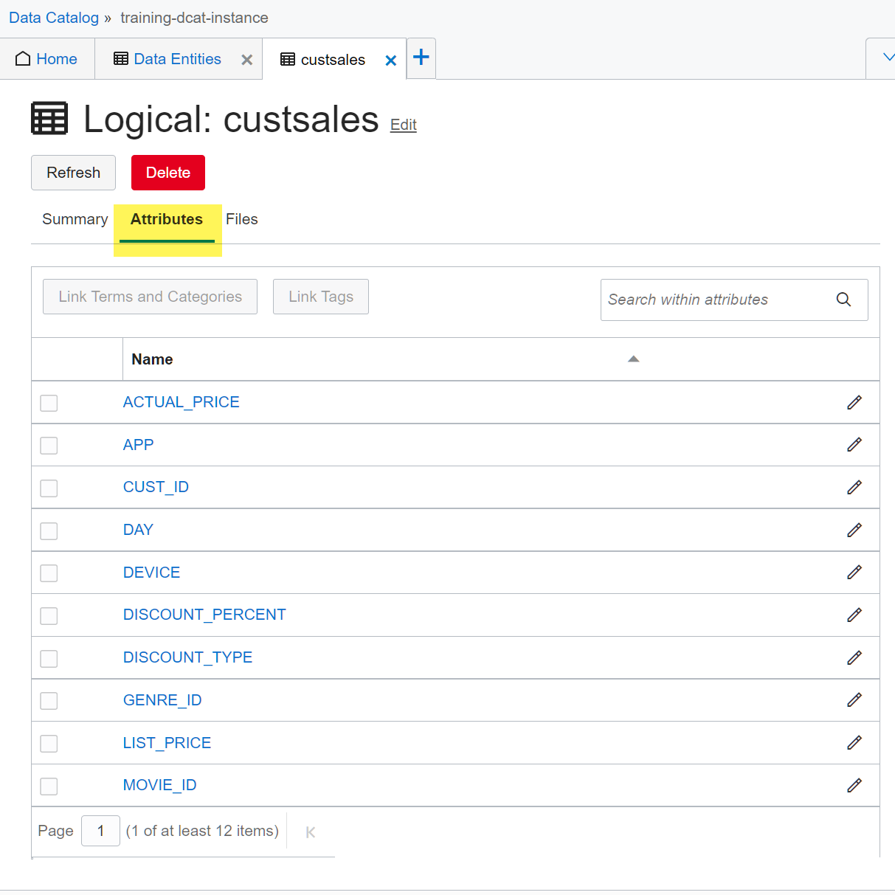

## Task 8: Customize the Business Name for the Object Storage Buckets

Customize the business names for each of the three Oracle Object Storage buckets that you use in this workshop.
When you later perform the synchronization process between your ADB and Data Catalog instances, the schemas and tables are created automatically for you. By default, the names of the schemas will start with **`DCAT$`** concatenated with the data asset's name, **`Data Lake`**, and the folder's (bucket's) name such as **`moviestream_sandbox`**. All three bucket names start with **`moviestream_`** followed by **`sandbox`**, **`landing`**, or **`gold`**. To make the generated schema names a bit shorter, you will customize the business name for each bucket and remove the **`moviestream_`** prefix from their names. For example, the generated schema name for the **`moviestream_sandbox`** will be **`DCAT$DATA_LAKE_SANDBOX`** instead of **`DCAT$DATA_LAKE_MOVIESTREAM_SANDBOX`**.
>**Note:** Later in this workshop, you will also provide a shorter custom property override that will be used in the schemas names instead of the data asset name.

1. On the **Data Catalogs** page, click the **`training-dcat-instance`** Data Catalog instance link.

    

2. On the **`training-dcat-instance`** **Home** page, click **Browse Data Assets** in the **Quick Actions** tile.

    

3. If you only have the one Data Asset created in this workshop, the **Oracle Object Storage: Data Lake** page is displayed.

4. Click the **Buckets** tab. The three Oracle Object Storage buckets are displayed.

    

5. Click the **`moviestream_gold`** link in the **Name** column. The **Bucket: moviestream_gold** details tab is displayed. In the **Summary** tab, click **Edit**.

    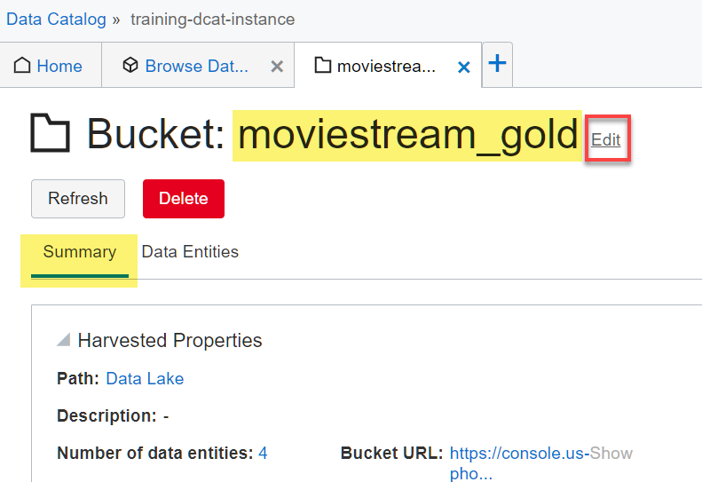  

6. In the **Edit Business Name** panel, change the name to **Gold**, and then click **Save Changes**. A **Successfully updated business name** message is displayed and the **Bucket: moviestream_gold** details tab is re-displayed. The bucket's new business name is displayed. The **Original Name** field displays the bucket's original name.

    

7. Close the **Bucket: moviestream_gold** details tab. The **Oracle Object Storage: Data Lake** page is displayed.

    >**Note:** If the new name, Gold, is not displayed, refresh your browser, and then click the **Buckets** tab.

    

Repeat the same above steps to rename the **`moviestream_landing`** bucket to **`Landing`**

1. On the **Oracle Object Storage: Data Lake** page, click the **Buckets** tab. The three Oracle Object Storage buckets are displayed.

2. Click the **`moviestream_landing`** link in the **Name** column. The **Bucket: moviestream_landing** details tab is displayed. In the **Summary** tab, click **Edit**.

3. In the **Edit Business Name** panel, change the name to **Landing**, and then click **Save Changes**. A **Successfully updated business name** message is displayed and the **Bucket: moviestream_landing** details tab is re-displayed. The bucket's new business name is displayed. The **Original Name** field displays the bucket's original name.

4. Close the **Bucket: moviestream_gold** details tab. The **Oracle Object Storage: Data Lake** page is displayed.

    


    >**Note:** If the new name, Landing, is not displayed, refresh your browser, and then click the **Buckets** tab.

Repeat the same above steps to rename the **`moviestream_sandbox`** bucket to **`Sandbox`**

1. On the **Oracle Object Storage: Data Lake** page, click the **Buckets** tab.

2. Click the **`moviestream_sandbox`** link in the **Name** column. The **Bucket: moviestream_sandbox** details tab is displayed. In the **Summary** tab, click **Edit**.

3. In the **Edit Business Name** panel, change the name to **Landing**, and then click **Save Changes**. A **Successfully updated business name** message is displayed and the **Bucket: moviestream_sandbox** details tab is re-displayed. The bucket's new business name is displayed. The **Original Name** field displays the bucket's original name.

4. Close the **Bucket: moviestream_sandbox** details tab. The **Oracle Object Storage: Data Lake** page is displayed.

    

    >**Note:** If the new name, Sandbox, is not displayed, refresh your browser, and then click the **Buckets** tab.


You may now proceed to the next lab.

## Learn More

* [Get Started with Data Catalog](https://docs.oracle.com/en-us/iaas/data-catalog/using/index.htm)
* [Data Catalog Overview](https://docs.oracle.com/en-us/iaas/data-catalog/using/overview.htm)
* [Oracle Cloud Infrastructure Documentation](https://docs.cloud.oracle.com/en-us/iaas/Content/GSG/Concepts/baremetalintro.htm)
* [What Is a Data Catalog and Why Do You Need One?](https://www.oracle.com/big-data/what-is-a-data-catalog/)
* [Harvesting Object Storage Files as Logical Data Entities](https://docs.oracle.com/en-us/iaas/data-catalog/using/logical-entities.htm)


## Acknowledgements
* **Author:** Lauran Serhal, Principal User Assistance Developer, Oracle Database and Big Data
* **Contributor:** Marty Gubar, Product Manager, Server Technologies    
* **Last Updated By/Date:** Lauran Serhal, November 2021
