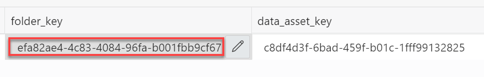

# Synchronize Autonomous Database with Data Catalog

## Introduction

Autonomous Database can leverage the Data Catalog metadata to dramatically simplify management for access to your data lake's object storage. By synchronizing with Data Catalog metadata, Autonomous Database automatically creates external tables for each logical entity harvested by Data Catalog. These external tables are defined in database schemas that are created and fully managed by the metadata synchronization process. You can immediately query data without having to manually derive the schema for external data sources and manually create external tables.

Estimated Time: 45 minutes

### Objectives

In this lab, you will:
* Access the ADB SQL Worksheet
* Initialize the lab
* Connect your ADB instance to your Data Catalog instance
* Synchronize your ADB instance with your Data Catalog instance
* Query the generated log, schemas, and external tables

### Prerequisites

This lab assumes you have:
* An Oracle account
* Completed all previous labs successfully
* Download and then create the required PL/SQL procedures for this lab.
* Execute a procedure named `run_lab_preq` procedure. You pass as a parameter the lab number that you would like to run. All of the prerequisites for that lab will be run.

## Task 1: Access the Autonomous Database SQL Worksheet

1. Log in to the **Oracle Cloud Console** as the Cloud Administrator. You will complete all the labs in this workshop using this Cloud Administrator.
See [Signing In to the Console](https://docs.cloud.oracle.com/en-us/iaas/Content/GSG/Tasks/signingin.htm) in the _Oracle Cloud Infrastructure_ documentation.

2. On the **Sign In** page, select your tenancy, enter your username and password, and then click **Sign In**. The **Oracle Cloud Console** Home page is displayed.

3. Open the **Navigation** menu and click **Oracle Database**. Under **Oracle Database**, click **Autonomous Database**.

4. On the **Autonomous Databases** page, click your **DB-DCAT Integration** ADB that you provisioned earlier.

5. On the **Autonomous Database Details** page, click the **Tools** tab. In the **Database Actions** card, click **Open Database Actions**.

   

6. On the **Database Actions** Sign in page, enter **`admin`** in the **Username** field, and then click **Next**.

   

    > **Note:** The **`admin`** username is not case sensitive.  

7. Enter **`Training4ADB`** in the **Password** field, and then click **Sign in**.

    > **Note:** The password is case sensitive. If you chose a different password for the **`admin`** user in the **Setup the Workshop Environment** lab, use that password instead of **`TrainingADB`**.

   

   The **Database Actions Launchpad** Home page is displayed.

   

8. In the **Development** section, click the **SQL** card. The **SQL Worksheet** is displayed.   

    

    > **Note:** In the remaining tasks in this lab, you will use the SQL Worksheet to run the necessary SQL statements to:
    * Connect to your Data Catalog instance from ADB and query its assets.
    * Synchronize your ADB instance with your Data Catalog instance.
    * Query the generated logs, schemas and external tables.


## Task 2: Initialize the Lab

Create and run the PL/SQL procedures to initialize the lab before you synchronize ADB and Data Catalog.  

1. Copy and paste the following script into your SQL Worksheet, and then click the **Run Script (F5)** icon in the Worksheet toolbar.

    ```
    <copy>
    -- Click F5 to run all the scripts at once

    -- drop this table with the lab listings
    drop table moviestream_labs; -- may fail if hasn't been defined

    -- Create the MOVIESTREAM_LABS table that allows you to query all of the labs and their associated scripts
    begin
        dbms_cloud.create_external_table(table_name => 'moviestream_labs',
                    file_uri_list => 'https://objectstorage.us-phoenix-1.oraclecloud.com/p/asZnZNzK6aAz_cTEoRQ9I00x37oyGkhgrv24vd_SGap2joxi3FvuEHdZsux2itTj/n/adwc4pm/b/moviestream_scripts/o/moviestream-labs.json',
                    format => '{"skipheaders":"0", "delimiter":"\n", "ignoreblanklines":"true"}',
                    column_list => 'doc varchar2(30000)'
                );
    end;
    /

    -- Define the scripts found in the labs table.
    declare
        b_plsql_script blob;            -- binary object
        v_plsql_script varchar2(32000); -- converted to varchar
        uri_scripts varchar2(2000) := 'https://objectstorage.us-phoenix-1.oraclecloud.com/p/asZnZNzK6aAz_cTEoRQ9I00x37oyGkhgrv24vd_SGap2joxi3FvuEHdZsux2itTj/n/adwc4pm/b/moviestream_scripts/o'; -- location of the scripts
        uri varchar2(2000);
    begin

        -- Run a query to get each lab and then create the procedures that generate the output
        for lab_rec in (
            select  json_value (doc, '$.lab_num' returning number) as lab_num,
                    json_value (doc, '$.title' returning varchar2(500)) as title,
                    json_value (doc, '$.script' returning varchar2(100)) as proc        
            from moviestream_labs ml
            where json_value (doc, '$.script' returning varchar2(100))  is not null
            order by 1 asc
            )
        loop
            -- The plsql procedure DDL is contained in a file in object store
            -- Create the procedure
            dbms_output.put_line(lab_rec.title);
            dbms_output.put_line('....downloading plsql procedure ' || lab_rec.proc);

            -- download the script into this binary variable        
            uri := uri_scripts || '/' || lab_rec.proc || '.sql';

            dbms_output.put_line('....the full uri is ' || uri);        
            b_plsql_script := dbms_cloud.get_object(object_uri => uri);

            dbms_output.put_line('....creating plsql procedure ' || lab_rec.proc);
            -- convert the blob to a varchar2 and then create the procedure
            v_plsql_script :=  utl_raw.cast_to_varchar2( b_plsql_script );

            -- generate the procedure
            execute immediate v_plsql_script;

        end loop lab_rec;  

        execute immediate 'grant execute on moviestream_write to public';

        exception
            when others then
                dbms_output.put_line('Unable to setup prequisite scripts.');
                dbms_output.put_line('You will need to run thru each of the labs');
                dbms_output.put_line('');
                dbms_output.put_line(sqlerrm);
     end;
     /

    begin
        run_lab_prereq(10);
    end;
    /
    </copy>
    ```
    >**Note:** It may take a few minutes to run this script as it is performing many initialization steps. Once the script completes successfully, the **`MOVIESTREAM`** user is created and initialized.

    

    The output is displayed in the **Script Output** section at the bottom of the SQL Worksheet.

    

2. View the status of the script execution. Copy and paste the following code into your SQL Worksheet, and then click the **Run Script (F5)** icon in the Worksheet toolbar.

    ```
    <copy>
    select *
    from moviestream_log order by 1;
    </copy>
    ```

    

3. Set the password for the **`MOVIESTREAM`** user.  You will log in as this user to run queries. , and then click the **Run Script (F5)** icon in the Worksheet toolbar.

    >**Note:** Substitute **``<secure password``>** with your own secured password that you will remember for later use.

    ```
    <copy>
    alter user moviestream identified by "<secure password>";
    </copy>
    ```
    


## Task 3: Gather Information About your Data Catalog Instance

In this task, you'll gather information about the Data Catalog instance which you will need in the next task. Save this information in a text editor of your choice such as Notepad in Windows so that you can easily copy and paste this information.

1. Log in to the **Oracle Cloud Console** as the Cloud Administrator that you already used in this workshop, if you are not already logged in. On the **Sign In** page, select your tenancy if needed, enter your username and password, and then click **Sign In**. The Oracle **Cloud Console** Home page is displayed.

2. Open the **Navigation** menu and click **Analytics & AI**. Under **Data Lake**, click **Data Catalog**. In the list of Data Catalog instances, search for your **training-dcat-instance**. In the row for the instance, click the **Actions** button, and then select **Copy OCID** from the context menu. Next, paste that OCID to an editor or a file, so that you can easily retrieve it later in this task.

    

3.   To find your own _region-identifier_, from the **Console**, click the **Region** drop-down list, and then click **Manage Regions**.

    

    The **Infrastructure Regions** page is displayed. In the **Region** section, your Home Region to which you are subscribed is displayed along with your **Region Identifier**, `ca-montreal-1`, in our example:

   


4. Open the **Navigation** menu and click **Identity & Security**. Under **Identity**, click **Compartments**. In the list of compartments, search for your **training-dcat-compartment**. In the row for the compartment, in the **OCID** column, hover over the **OCID** link and then click **Copy**. The status changes from **Copy** to **Copied**. Next, paste that OCID to an editor or a file, so that you can retrieve it later in this task.

    


## Task 4: Connect to Data Catalog

1. Disconnect (initialize) from Data Catalog, if already connected, by using the **`dbms_dcat.unset_data_catalog_conn`** PL/SQL package procedure. Click **Copy** to copy the following code, and then paste it into the SQL Worksheet. Click the **Run Statement** icon in the Worksheet toolbar. This procedure removes an existing Data Catalog connections. It drops all of the protected schemas and external tables that were created as part of your previous synchronizations; however, it does not remove the metadata in Data Catalog. You should perform this action only when you no longer plan on using Data Catalog and the external tables that are derived, or if you want to start the entire process from the beginning.

    ```
    <copy>
    exec dbms_dcat.unset_data_catalog_conn;
    </copy>
    ```
    If you are not connected to Data Catalog, an **ORA-20008: No data catalog connections found. ORA-06512** message is displayed in the **Script Output** tab at the bottom of the worksheet.

    

2. Define the following substitution variables, for repeated use in this task by using the SQL\*Plus **`DEFINE`** command. The variables will hold the necessary details for the Data Catalog connection such as the Data Catalog credential name, Data Catalog OCID, Compartment OCID, Home Region, and Data Asset key. Click **Copy** to copy the following code, and then paste it into the SQL Worksheet. **_Don't run the code yet. Complete the next step first._**

    ```
    <copy>
    define tenancy_ocid ='ocid1.tenancy.oc1..aaaaaaaafcue47pqmrf4vigneebgbcmmoy5r7xvoypicjqqge32ewnrcyx2a'
    define dcat_region='us-phoenix-1'
    define dcat_compartment = 'ocid1.compartment.oc1..aaaaaaaa2dw4azv4omrvlqfwl7u5zb6rnjpvecsdvjyerwjchjh6uodnemoa'
    define dcat_ocid = 'ocid1.datacatalog.oc1.phx.amaaaaaa7ratcziaatbs6unxv5ouptdnvc7chzqvj53hg7is2aoev5tete7q'
    define dcat_sandbox_asset_key='c8df4d3f-6bad-459f-b01c-1fff99132825'  
    define dcat_credential = 'OCI$RESOURCE_PRINCIPAL'
    define obj_credential = 'OCI$RESOURCE_PRINCIPAL'
    define uri_root = 'https://objectstorage.us-phoenix-1.oraclecloud.com/p/oC6LJHe8KMDEYlcfpN0wxLKbYjG4_W-E2laOeISSqBhEA343Qg-Ncn27oXup5e66/n/adwc4pm/b/moviestream_sandbox/o'
    define user_ocid = 'ocid1.user.oc1..aaaaaaaahxy6rdxo6mqzluznxjhuyz3ievpqvi5r3yle4ma4njgq6ts6qlca'
    </copy>
    ```

3. Replace the values of the **`dcat_ocid`** and **`dcat_sandbox_asset_key`** with the values that you have identified in **Task 1: Gather Information About your Data Catalog Instance** in this lab. Place the cursor on any line of code, and then click the **Run Script (F5)** icon in the Worksheet toolbar. The result is displayed in the **Script Output** tab at the bottom of the worksheet.

    

4. Enable Resource Principal to access Oracle Cloud Infrastructure Resources for the ADB instance. This creates the credential **`OCI$RESOURCE_PRINCIPAL`**. Click **Copy** to copy the following code, and then paste it into the SQL Worksheet. Place the cursor on any line of code, and then click the **Run Script (F5)** icon in the Worksheet toolbar. The result is displayed in the **Script Output** tab at the bottom of the worksheet.

    ```
    <copy>
    exec dbms_cloud_admin.enable_resource_principal();
    exec dbms_cloud_admin.enable_resource_principal('MOVIESTREAM');
    </copy>
    ```

    

    >**Note:** You can use an Oracle Cloud Infrastructure Resource Principal with Autonomous Database. You or your tenancy administrator define the Oracle Cloud Infrastructure policies and a dynamic group that allows you to access Oracle Cloud Infrastructure resources with a resource principal. You do not need to create a credential object. Autonomous Database creates and secures the resource principal credentials you use to access the specified Oracle Cloud Infrastructure resources. See [Use Resource Principal to Access Oracle Cloud Infrastructure Resources](https://docs.oracle.com/en/cloud/paas/autonomous-database/adbsa/resource-principal.html#GUID-E283804C-F266-4DFB-A9CF-B098A21E496A)

5. Confirm that the resource principal was enabled. Click **Copy** to copy the following code, and then paste it into the SQL Worksheet. Place the cursor on any line of code, and then click the **Run Statement** icon in the Worksheet toolbar. The result is displayed in the **Query Result** tab at the bottom of the worksheet.

    ```
    <copy>
    select *
    from all_credentials;
    </copy>
    ```

    


6. Query the Object Storage bucket to ensure that the resource principal and privilege work. Use the `list_objects` function to list objects in the specified location on object storage, **`moviestream_sandbox`** bucket in our example. The results include the object names and additional metadata about the objects such as size, checksum, creation timestamp, and the last modification timestamp. Click **Copy** to copy and paste the following code into the SQL Worksheet, and then click the **Run Statement** icon in the Worksheet toolbar. The result is displayed in the **Query Result** tab at the bottom of the worksheet.

    ```
    <copy>
    select *
    from dbms_cloud.list_objects('&dcat_credential', '&uri_root/');
    </copy>
    ```

    

    Here's the content of the **`moviestream_sandbox`** bucket as seen in Data Catalog.

      

7. Set the credentials to use with Data Catalog and Object Storage. The **`set_data_catalog_credential`** procedure sets the Data Catalog access credential that is used for all access to the Data Catalog. The **`set_object_store_credential`** procedure sets the credential that is used by the external tables for accessing the Object Storage. Changing the Object Storage access credential alters all existing synced tables to use the new credential. Click **Copy** to copy the following code, and then paste it into the SQL Worksheet. Place the cursor on any line of code, and then click the **Run Script (F5)** icon in the Worksheet toolbar. The result is displayed in the **Script Output** tab at the bottom of the worksheet.

    ```
    <copy>
    exec dbms_dcat.set_data_catalog_credential(credential_name => '&dcat_credential');
    exec dbms_dcat.set_object_store_credential(credential_name => '&obj_credential');
    </copy>
    ```

    

8. Create a connection to your Data Catalog instance using the `set_data_catalog_conn` procedure. This is required to synchronize the metadata with Data Catalog. An Autonomous Database instance can connect to a single Data Catalog instance. You only need to call this procedure once to set the connection. See [SET\_DATA\_CATALOG\_CONN Procedure](https://docs-uat.us.oracle.com/en/cloud/paas/exadata-express-cloud/adbst/ref-managing-data-catalog-connection.html#GUID-7734C568-076C-4BC5-A157-6DE11F548D2B). The credentials must have access to your Data Catalog Asset and the data in the **`moviestream_landing`** and **`moviestream_gold`** Oracle Object Storage buckets that you use in this workshop. Click **Copy** to copy the following code, paste it into the SQL Worksheet, and then click the **Run Script (F5)** icon in the Worksheet toolbar. This could take a couple of minutes.

    ```
    <copy>
    begin
    dbms_dcat.set_data_catalog_conn (
    region => '&dcat_region',
    catalog_id => '&dcat_ocid');
    end;
    /
    </copy>
    ```

    

    >**Note:** The above code references the substitution variables that you defined in step 1 by preceding the name of the variables by one **_`&`_**. When SQL*Plus encounters a substitution variable in a command, it executes the command as though it contained the value of the substitution variable, rather than the variable itself.

9. Query your current Data Catalog connections and review the the DCAT ocid, its compartment, and the credentials that are used to access Oracle Object Storage and Data Catalog. Click **Copy** to copy the following code, and then paste it into the SQL Worksheet. Click the **Run Statement** icon in the Worksheet toolbar. The result is displayed in the **Query Result** tab at the bottom of the worksheet. For detailed information, see [Managing the Data Catalog Connection](https://docs-uat.us.oracle.com/en/cloud/paas/exadata-express-cloud/adbst/ref-managing-data-catalog-connection.html#GUID-BC3357A1-6F0E-4AEC-814E-71DB3E7BB63D).

    ```
    <copy>
    select *
    from all_dcat_connections;
    </copy>
    ```

    


## Task 5: Display Data Assets, Folders, and Entities     

1. Display all of data assets in the connected Data Catalog instance. Copy and paste the following script into your SQL Worksheet, and then click the **Run Statement** icon in the Worksheet toolbar.

    ```
    <copy>
    select *
    from all_dcat_assets;
    </copy>    
    ```

    The row for the **`Data Lake`** data asset that you created in your Data Catalog instance is displayed in the **Query Result** tab.

    


2. Display all Data Assets folders that were harvested from the **`Data Lake`** data asset. Copy and paste the following script into your SQL Worksheet, and then click the **Run Statement** icon in the Worksheet toolbar.

    The **`moviestream_sandbox`**, **`moviestream_gold`**, and **`moviestream_landing`** folders are displayed in the **Query Result** tab. Notice the custom business names that you provided for each bucket in an earlier lab: **`Sandbox`**, **`Gold`**, and **`Landing`**. This will make the generated schemas' names a bit shorter.

    ```
    <copy>
    select *
    from all_dcat_folders;
    </copy>
    ```

    

3. Display all the entities in the folders originating from Oracle Object Storage buckets referenced in the **`Data Lake`** data asset.

    ```
    <copy>
    select *
    from all_dcat_entities;
    </copy>
    ```

    


## Task 6: Provide a Custom Property Override for the Schema Name

When you perform the synchronization process between your ADB and Data Catalog instances in this workshop, the schemas and external tables are created automatically for you. By default, the name of a generated schema will start with the keyword **`DCAT$`** concatenated with the **data asset's name** and the **Object Storage folder's name** as follows:


In this workshop, one of the generated schemas for your `moviestream_sandbox` Oracle Object Storage bucket using the `Data Lake` data asset would be as follows by default:


However, in **Lab 2: Harvest Technical Metadata from Oracle Object Storage**, in **Task 7: Customize the Business Name for the Object Storage Buckets**, you customized the business names for each of the three Oracle Object Storage buckets that you use in this workshop to make the generated schema names a bit shorter. You removed the **`moviestream_`** prefix from the name of each bucket. For example, you changed the business name for the **`moviestream_sandbox`** bucket to **`Sandbox`**; therefore, the schema name format would be as follows:


You will do one last customization to shorten the generated schemas' names a bit more. You will use a custom property override, **`obj`** that will be used instead of the actual data asset name, **`Data Lake`**, when you run the synchronization process so that the schema name would be as follows for the `Sandbox` bucket.


1. On the **Data Catalogs** page, click the **`training-dcat-instance`** Data Catalog instance link.

    

2. On the **`training-dcat-instance`** **Home** page, click **Browse Data Assets** in the **Quick Actions** tile.

    

3. If you only have the one Data Asset created in this workshop, the **Oracle Object Storage: Data Lake** page is displayed.

4. In the **Summary** tab, in the **DBMS_DCAT** tile, click **Edit**.

    

    > **Note:** The **DBMS_DCAT** tile will only be displayed after you connect ADB to Data Catalog.

5. In the **Edit DBMS_DCAT** dialog box, enter **`obj`** in the **Oracle-Db-Schema-Prefix** field, and then click **Save Changes**. This value will be used as the prefix to the schemas' that are generated by the synchronization process which is covered in the next lab. If you don't provide a prefix here, then the data asset name, **Data Lake** in this example, will be used a prefix.

    

    The new prefix is displayed.

    


## Task 7: Synchronize Autonomous Database with Data Catalog    

1. Synchronize the **`moviestream_sandbox`** Object Storage Bucket, between Data Catalog and Autonomous Database using the **`dbms_dcat.run_sync`** PL/SQL package procedure. In order to synchronize just one bucket (folder), you'll need the folder's key and the data asset key.  

    ```
    <copy>
    select path, display_name, key as folder_key, data_asset_key
    from all_dcat_folders
    where display_name='moviestream_sandbox';
    </copy>
    ```

    

    To copy a key value, double-click the cell to highlight the value, and then copy and paste it into a text editor of your choice. Copy the values for both `folder_key` and `data_asset_key` which you will need in the next command. In our example, the two key values from the previous query are as follows:

    * **`folder_key`:** `efa82ae4-4c83-4084-96fa-b001fbb9cf67`
    * **`data_asset_key`:** `c8df4d3f-6bad-459f-b01c-1fff99132825`

      


2. Copy and paste the following code into your SQL Worksheet. Replace the values for the **`asset_id`** and **`folder_list`** keys with your own values that you copied in the previous step. Click the **Run Script (F5)** icon in the Worksheet toolbar. The result is displayed in the **Script Output** tab at the bottom of the worksheet.


    ```
    <copy>
    begin
    dbms_dcat.run_sync(synced_objects =>
        '{"asset_list": [
            {
                "asset_id":"c8df4d3f-6bad-459f-b01c-1fff99132825",
                "folder_list":[
                    "efa82ae4-4c83-4084-96fa-b001fbb9cf67"
               ]
            }   
        ]}');                    
    end;
    /
    </copy>
    ```

    


3. Review the generated log to identify any issues. The **`logfile_table`** contains the name of the table containing the full log. Copy and paste the following script into your SQL Worksheet, and then click the **Run Statement** icon in the Worksheet toolbar.

    ```
    <copy>
    select type, start_time, status, logfile_table
    from user_load_operations;
    </copy>
    ```

    

    In our example, the log table name is `DBMS_DCAT$1_LOG`.

4. Review the full log. Copy and paste the following script into your SQL Worksheet, and then click the **Run Statement** icon in the Worksheet toolbar. Substitute the log table name with your with your own log table name that you identified in the previous step.


    ```
    <copy>
    select *
    from DBMS_DCAT$1_LOG
    order by log_timestamp desc;
    </copy>
    ```

    

    >**Note:** The external table name that is created automatically, is **`DCAT$`** followed by the data asset prefix that you specified earlier, **`obj`** (instead of data lake), followed by the business name for the Object Storage bucket that you specified earlier, **`sandbox`** (instead of moviestream_sandbox), followed by logical entity name, **`potential_churners`**.

    


5. Query the available Data Catalog instance entities from within ADB. Copy and paste the following query into your SQL Worksheet, and then click the **Run Statement** icon in the Worksheet toolbar.

    ```
    <copy>
    select oracle_schema_name, oracle_table_name
    from dcat_entities;
    </copy>
    ```

    The schema and external table names are displayed.

    

    The synchronization process creates schemas and external tables based on the Data Catalog data assets and logical entities. The name of the schema is displayed in the **`oracle_schema_name`** column and the name of the generated external table is displayed in the **`oracle_table_name`** column.

    >**Note:** Remember, earlier in this workshop, you provided **`obj`** as a Custom Property Override for the Schema Name instead of the data asset name of **`Data Lake`**. You also provided a shorter business name for each or the three Oracle Object Storage buckets.


6. Describe the **`all_dcat_entities`** table to get familiar with its columns. Copy and paste the following query into your SQL Worksheet, and then click the **Run Statement** icon in the Worksheet toolbar.

    ```
    <copy>
    describe all_dcat_entities
    </copy>
    ```

    


7. Display the following: Object Storage bucket folder name, logical (data) entity name, schema name, and external table name. Copy and paste the following query into your SQL Worksheet, and then click the **Run Statement** icon in the Worksheet toolbar.

    ```
    <copy>
    select a.folder_name,
       a.display_name,
       a.business_name,
       a.description,
       lower(d.oracle_schema_name),
       lower(d.oracle_table_name)
    from all_dcat_entities a, dcat_entities d
    where a.data_asset_key = d.asset_key
    and a.key = d.entity_key
    order by 1,2;
    </copy>
    ```

    

    >**Note:** The result shows the information for only one of the three Object Storage buckets, **`moviestream_sandbox`**. Earlier, you performed the synchronization only on this bucket.

8. Query the first nine rows of the `potential_churners` external table. Copy and paste the following script into your SQL Worksheet, and then click the **Run Statement** icon in the Worksheet toolbar.

    ```
    <copy>
    select *
    from dcat$obj_sandbox.potential_churners
    where rownum < 10;
    </copy>
    ```

    


9. Synchronize all of the available data assets in your Data Catalog instance. Copy and paste the following code into your SQL Worksheet, and then click the **Run Script (F5)** icon in the Worksheet toolbar.

    ```
    <copy>
    begin
    dbms_dcat.run_sync('{"asset_list":["*"]}');
    end;  
    /
    </copy>
    ```

    

    The synchronization can take few minutes to complete. When it is completed successfully, the output is displayed at the bottom of the SQL Worksheet.

      


10. Access to the automatically generated tables by the synchronization process is secure.  You need to grant access to users/roles. Autonomous Databases come with a predefined database role named **`DWROLE`**. This role provides the common privileges for a database developer or data scientist to perform real-time analytics. Grant the select on tables privilege to the data warehouse role using the `grant_select_on_dcat_tables` custom procedure. This procedure grants READ access on the Data Catalog sourced tables to the `dwrole` role. See [Manage User Privileges on Autonomous Database - Connecting with a Client Tool](https://docs.oracle.com/en/cloud/paas/autonomous-database/adbsa/manage-users-privileges.html#GUID-50450FAD-9769-4CF7-B0D1-EC14B465B873)


    ```
    <copy>
    exec grant_select_on_dcat_tables('dwrole');
    </copy>
    ```

    

You may now proceed to the next lab.

## Learn More

* [Using Oracle Autonomous Database on Shared Exadata Infrastructure](https://docs.oracle.com/en/cloud/paas/autonomous-database/adbsa/index.html)
* [Connect with Built-in Oracle Database Actions](https://docs.oracle.com/en/cloud/paas/autonomous-database/adbsa/sql-developer-web.html#GUID-102845D9-6855-4944-8937-5C688939610F)
* [DBMS_DCAT Package](https://docs-uat.us.oracle.com/en/cloud/paas/exadata-express-cloud/adbst/ref-dbms_dcat-package.html#GUID-4D927F21-E856-437B-B42F-727A2C02BE8D)
* [Oracle Cloud Infrastructure Documentation](https://docs.cloud.oracle.com/en-us/iaas/Content/GSG/Concepts/baremetalintro.htm)
* [Get Started with Data Catalog](https://docs.oracle.com/en-us/iaas/data-catalog/using/index.htm)
* [Data Catalog Overview](https://docs.oracle.com/en-us/iaas/data-catalog/using/overview.htm)


## Acknowledgements

* **Author:** Marty Gubar, Product Manager, Server Technologies
* **Contributor:** Lauran Serhal, Principal User Assistance Developer, Oracle Database and Big Data     
* **Last Updated By/Date:** Lauran Serhal, October 2021
