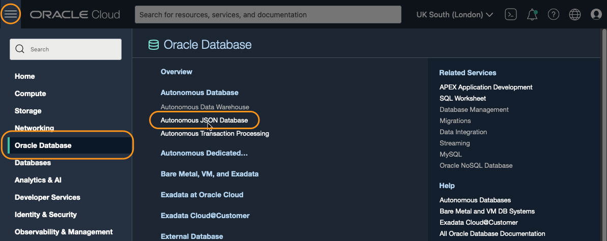
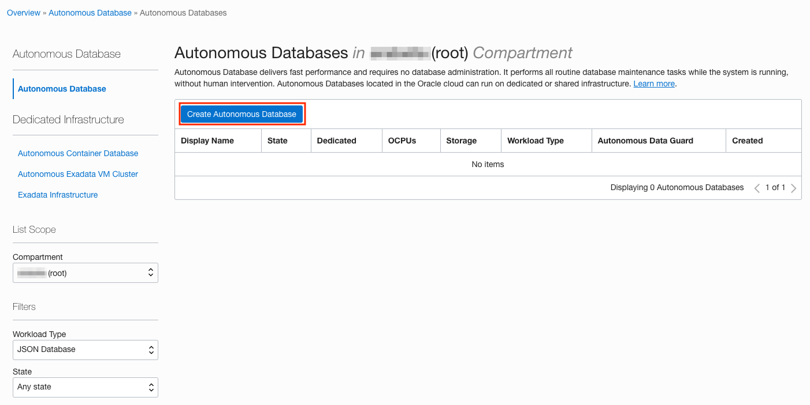
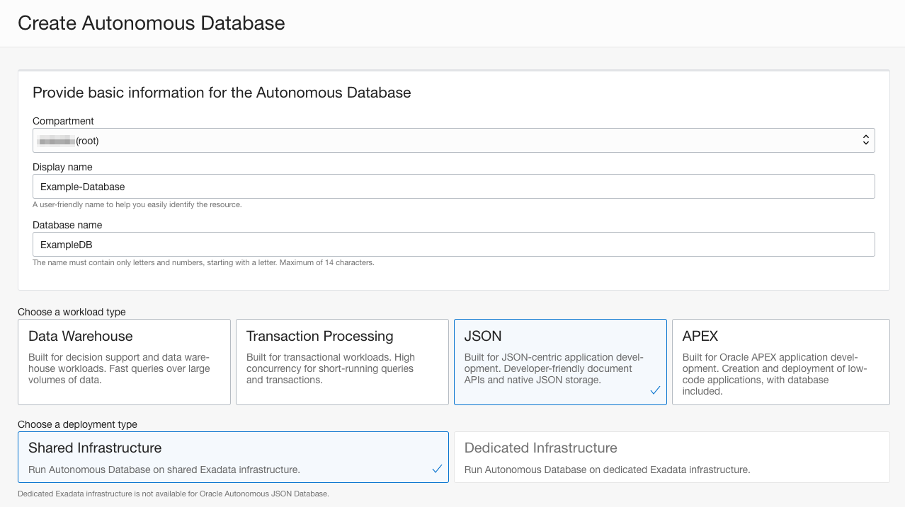
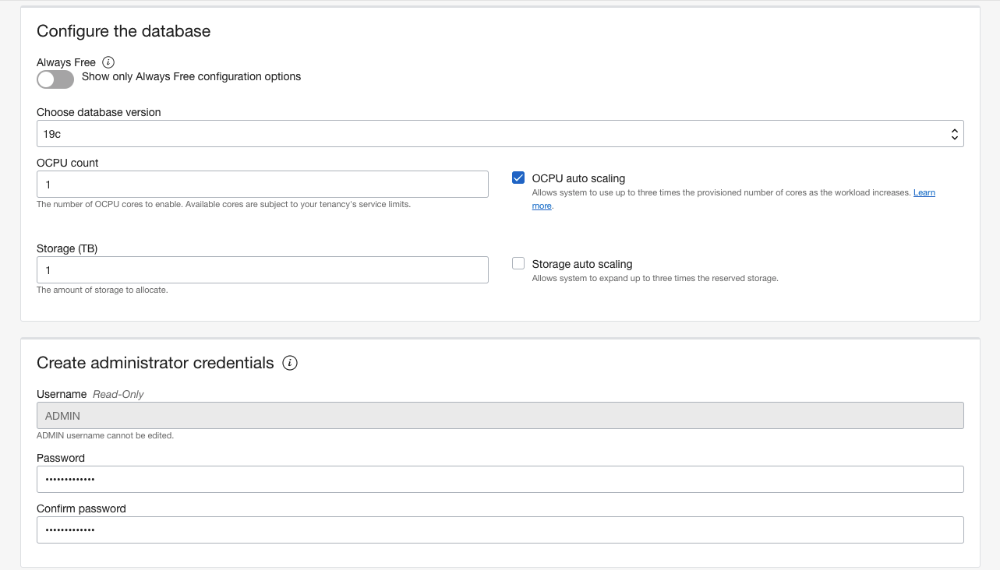
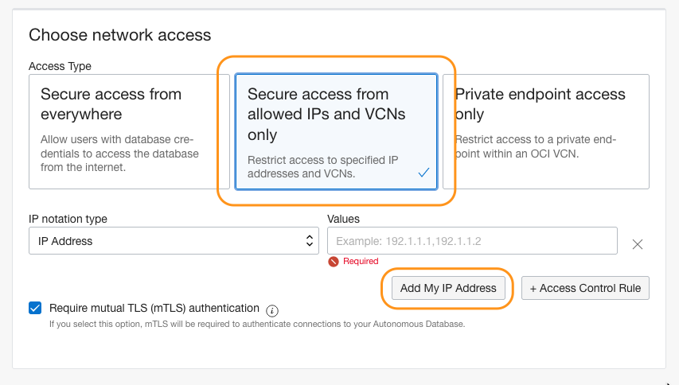
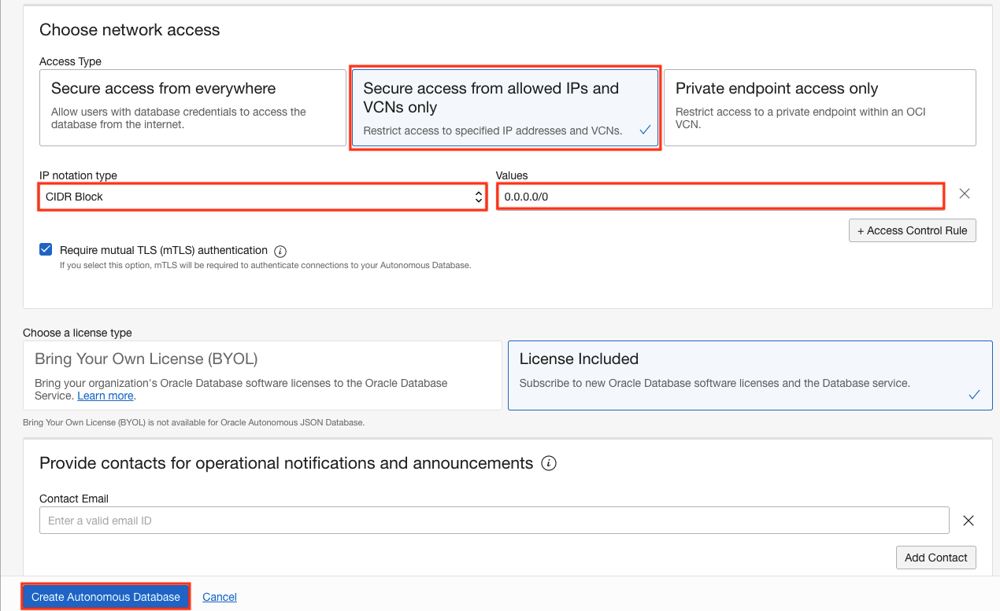
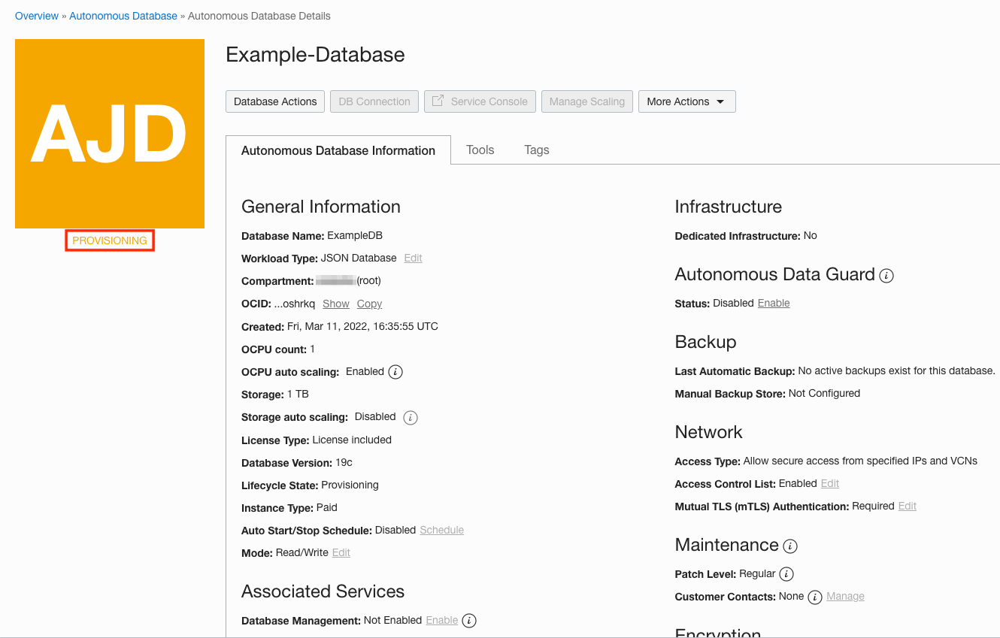
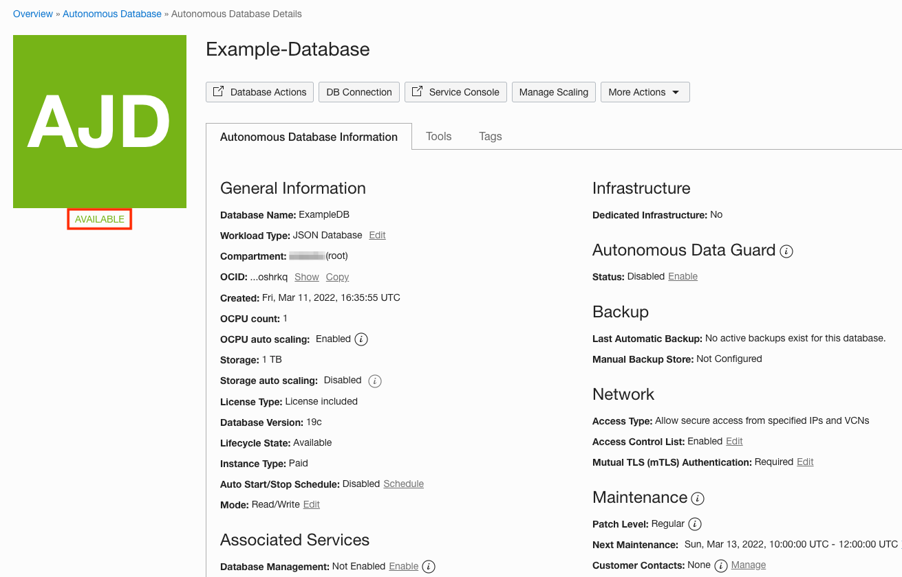
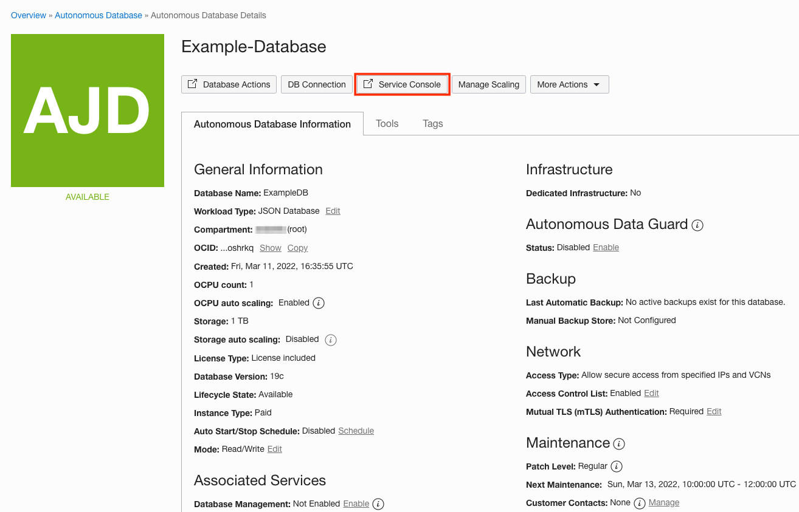
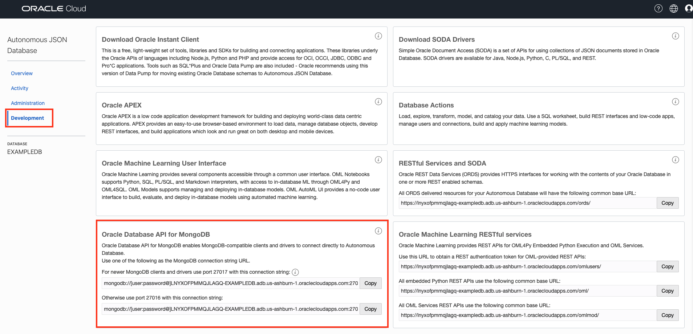

# Create an Autonomous JSON Database find the MongoDB connection URL

## Introduction
This lab walks you through the steps to get started using the Oracle Autonomous JSON Database (AJD) on Oracle Cloud. In this lab, you will provision a new AJD instance and locate the MongoDB connection URL.

Estimated Time: 10 minutes

### Objectives

In this lab, you will:

- Learn how to provision an Autonomous JSON Database
- Locate the MongoDB connection URL


## Task 1: Create an Autonomous JSON Database

1. Once signed into Oracle Cloud, click the "Hamburger Menu" in the top left. Click **Oracle Database**, then **Autonomous JSON Database**.

    

2. Now click on **Create Autonomous Database**.

    

3. Provide a Display name and Database Name (or leave them at the generated defaults). Leave workload type set to **JSON** and deployment type as **Shared Infrastructure**.

    

4. Scroll down to "Create administrator credentials", and enter and confirm a password for the ADMIN user. Don't forget this password!

    

5. The next part is important. The Database API for MongoDB will **only** be available if you define "Secure access from allowed Ips and VCNs only". Click that option (it is **not** the default).

    If you will just want to connect from your current machine, use the "Add My IP Address" button. If you will want to connect from other machines (such as an Oracle Cloud VM) you can enter the addresses of those as well.

    

    Hint: If you’re not sure what compute instances you will want to connect from, you can change the IP notation type field to CIDR block, and enter a value of 0.0.0.0/0. That will allow you to connect from anywhere, but naturally you should only use that for testing. 

6. When done, click **Create Autonomous Database** at the bottom of the screen.

    

7.  You will see an orange AJD logo with PROVISIONING underneath.

    

8. When finished (it typically takes around one minute), the logo will go green with AVAILABLE underneath.

    

## Task 2: Find the MongoDB connection URL     

1. On the Autonomous Database Details page, launch the **Service Console**. 

    

2. The Service Console will open in a new tab, and you can choose **Development**. You may need to scroll down a little on the Development page, but you should see **Oracle Database API for MongoDB**, with two URLs listed.

    

    >**Note**: Don't see that? Most likely you didn't define "Secure Access from allowed IPs" for your database. If the database is set up for "Secure Access from anywhere" then this card will not be shown (in later versions it may be shown, but grayed out).

    Port 27017 should work for most newer clients and tools, but if you have problems it may be worth trying the port 27016 URL instead.

3.  Copy the first URL using the Copy button, and save it somewhere for later use. The URL has the following format:

    ```
    mongodb://[user:password@]autonomousDatabaseAddress:27017/[user]?authMechanism=PLAIN&authSource=$external&ssl=true&retryWrites=false&loadBalanced=true
    ```

4. Take out the initial [user:password@] (we will provide separate credentials) and change the [user] in the second part of the URL to our database username, currently "admin". So the modified URL will look something like:    

    ```
    mongodb://autonomousDatabaseAddress:27017/admin?authMechanism=PLAIN&authSource=$external&ssl=true&retryWrites=false&loadBalanced=true
    ```

You may now **proceed to the next lab**.


## Acknowledgements

- **Author** - Roger Ford, Principal Product Manager
- **Contributors** - Kamryn Vinson, Database Product Management
- **Last Updated By/Date** - Kamryn Vinson, March 2022


