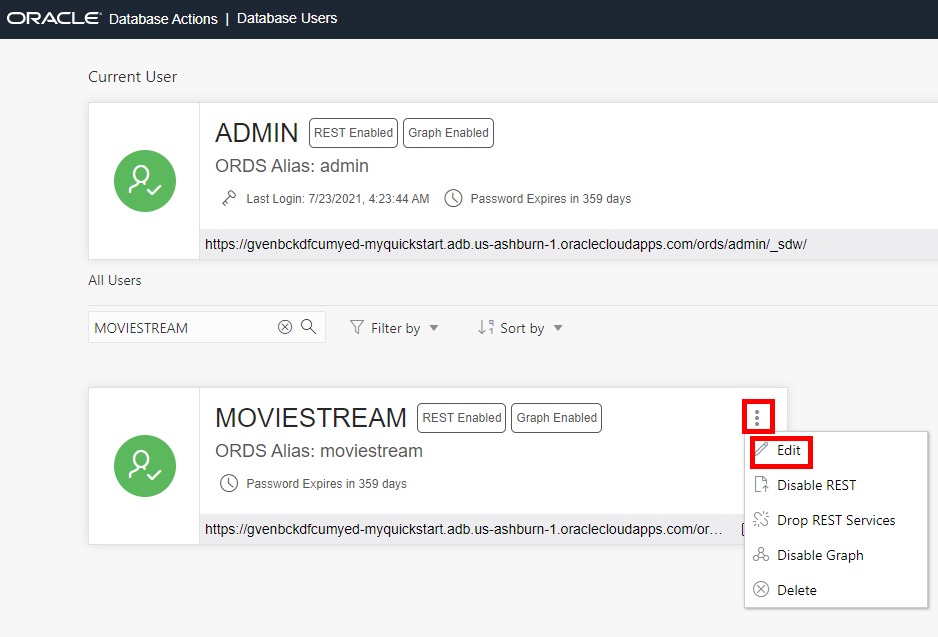
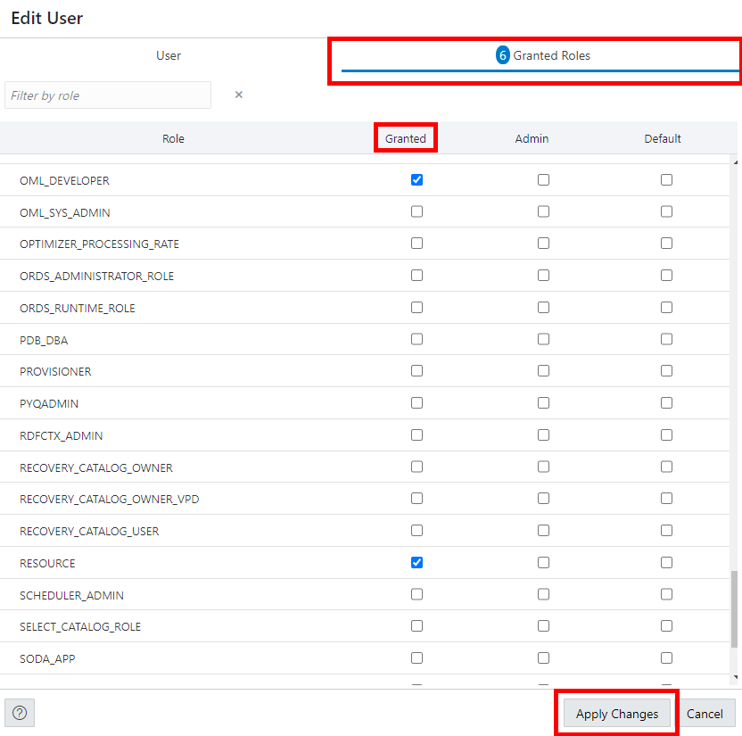

# Create a Database User

## Introduction

In this lab, you will create a database user and launch SQL Worksheet.

Estimated Time: 10 minutes

### Objectives

In this lab, you will:
* Create a database user
* Update the user's profile to grant additional roles
* Log in as the user
* Launch SQL Worksheet

## **Step 1**: Create a Database User

When you create a new data warehouse, you automatically get an account called ADMIN that is your super administrator user. In the real world, you will definitely want to keep your data warehouse data completely separate from the administration processes. Therefore, you will need to know how to create separate new users and grant them access to your data warehouse. This section will guide you through this process using the "New User" wizard within the SQL Worksheet (one of the built-in tools in Autonomous Data Warehouse).

For this workshop we need to create one new user.

1. Navigate to the Details page of the Autonomous Database you provisioned in the "Provisioning an ADW Instance" lab. In this example, the database is named "My Quick Start ADW." Launch **Database Actions** by clicking the **Tools** tab and then click **Open Database Actions**.

    

2. Enter ADMIN for the username and click **Next**. On the next form, enter the ADMIN password - which is the one you entered when creating your Autonomous Data Warehouse. Click **Sign in**.

    

3. On the Database Actions home page, click the **Database Users** card.

    

4.  You can see that your ADMIN user is listed as the current user.  On the right-hand side, click the **+ Create User** button.

    

5. The **Create User**  form will appear on the right-hand side of your browser window. Use the settings below to complete the form:

 - username: **MOVIESTREAM**
 - password: create a suitably strong password, and make note of it, as you will be asked for it in an upcoming step.

    **NOTE - Rules for User Passwords** Autonomous Data Warehouse requires strong passwords. User passwords user must meet the following default password complexity rules:

    - Password must be between 12 and 30 characters long

    - Must include at least one uppercase letter, one lowercase letter, and one numeric character

    - Limit passwords to a maximum of 30 characters

    - Cannot contain the username

    - Cannot be one of the last four passwords used for the same username

    - Cannot contain the double quote (") character

    There is more information available in the documentation about password rules and how to create your own password rules; see here: [Create Users on Autonomous Database](https://docs.oracle.com/en/cloud/paas/autonomous-database/adbsa/manage-users-create.html#GUID-B5846072-995B-4B81-BDCB-AF530BC42847)

- Toggle the **Graph** button to **On**.
- Toggle the **Web Access** button to **On** and expand **Web access advanced features**. Accept the default alias which is automatically set to moviestream - this allows the user access to our new data warehouse using the Database Actions tools.
- Leave the **Authorization required** toggle button as on/blue. 
- In the upper right section of the Create User dialog, select **UNLIMITED** from the drop down menu for Quota on tablespace DATA
- Leave the **Password Expired** toggle button as off (Note: this controls whether the user will be prompted to change their password when they next login).
- Leave the **Account is Locked** toggle button as off. 
- **Do not** toggle the **OML** button to **On**. We will select this and grant other roles in the next step.
- Click **Create User** at the bottom of the form.

    

Now that you have created a user with several roles, let's see how easy it is to grant some additional roles.

## **Step 2:** Update the User's Profile to Grant Additional Roles

1. The Database Users page now shows your new MOVIESTREAM user in addition to the ADMIN user. Click the 3-dotted ellipsis symbol to the right of the MOVIESTREAM user's name, and select **Edit** from the menu.

    

2. Click the **Granted Roles** tab at the top of the Edit User form and add the following roles under the **Granted** column: **CONSOLE\_DEVELOPER**, **DWROLE**, and **OML\_DEVELOPER**.

    

    Notice that two additional roles have already been automatically assigned: **CONNECT** and **RESOURCE**. Click **Apply Changes**. 

## **Step 3:** Log In As the User

Now you need to switch from the ADMIN user to the MOVIESTREAM user, before starting the next lab on data loading.

1. At the bottom of the card for the MOVIESTREAM user, click the icon with the upward pointing diagonal arrow.

    

2. Enter the username MOVIESTREAM and the password you defined when you created this user.

    

3. This will launch the Database Actions home page.

    

## **Step 4:** Launch SQL Worksheet 

In the next labs, you will use the SQL Worksheet application that is built in to the data warehouse environment. 

1. In the **Development** section of the Database Actions page, click the **SQL** card to open a new SQL worksheet:

    

    This will open up a new window that should look something like the screenshot below. The first time you open SQL Worksheet, a series of pop-up informational boxes introduce you to the main features. Click Next to take a tour through the informational boxes.

    

Please *proceed to the next lab*.

## Learn More

See the documentation on [Managing Users on Autonomous Database](https://docs.oracle.com/en/cloud/paas/autonomous-database/adbsa/manage.html#GUID-AD7ACC07-AAF7-482A-8845-9C726B1BA86D). This topic describes administration tasks for managing users on Autonomous Database.

## Acknowledgements
* **Author** - Rick Green, Principal Developer, Database User Assistance
* **Last Updated By/Date** - Rick Green, July 2021
