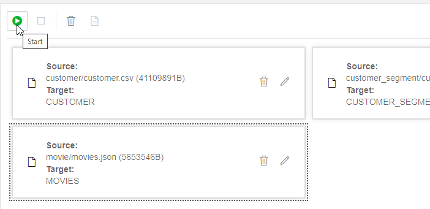
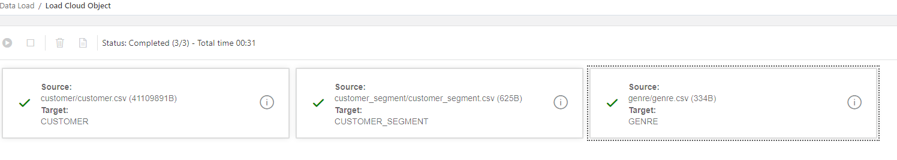
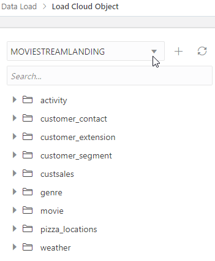
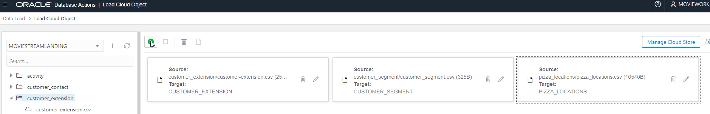
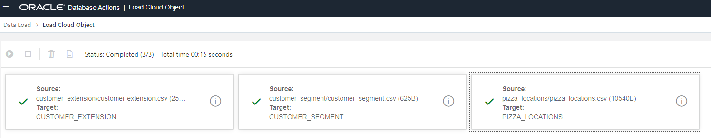
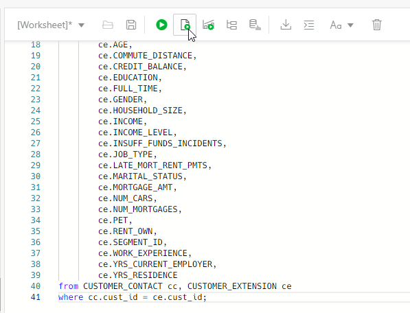
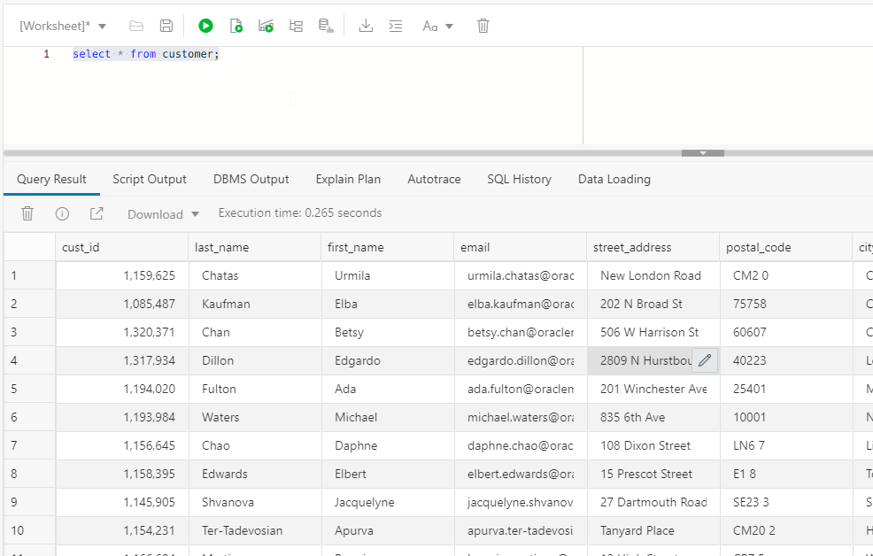
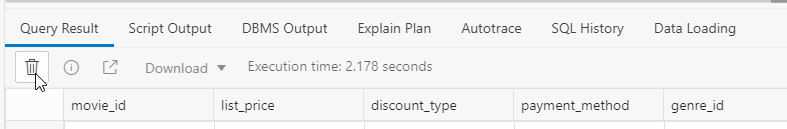
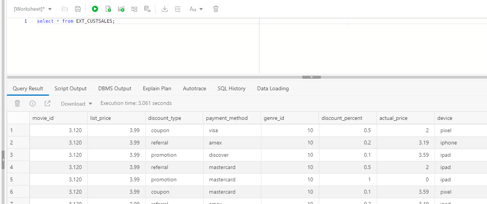

# Loading data from object storage using Data Tools and scripting

## Introduction

This lab takes you through the steps needed to load and link data from the MovieStream data lake on [Oracle Cloud Infrastructure (OCI) Object Storage](https://www.oracle.com/cloud/storage/object-storage.html) into an Oracle Autonomous Database instance in preparation for exploration and analysis.

You can load data into your Autonomous Database (Autonomous Data Warehouse [ADW] or Autonomous Transaction Processing [ATP]) using Oracle Database tools, as well as Oracle and 3rd party data integration tools. You can load data:

+ from files in your local device,
+ from tables in remote databases, or
+ from files stored in cloud-based object storage (OCI Object Storage, Amazon S3, Microsoft Azure Blob Storage, Google Cloud Storage)

You can also leave data in place in cloud-based object storage, and link to it from your Autonomous Database.

> **Note:** While this lab uses ADW, the steps are identical for loading data into an ATP database.

Estimated Time: 30 minutes

### About Product

In this lab, we will learn more about the Autonomous Database's built-in Data Load tool - see the [documentation](https://docs.oracle.com/en/cloud/paas/autonomous-database/adbsa/data-load.html#GUID-E810061A-42B3-485F-92B8-3B872D790D85) for more information.

We will also learn how to exercise features of the DBMS_CLOUD package to link and load data into the autonomous database using SQL scripts. For more information about DBMS_CLOUD, see its [documentation](https://docs.oracle.com/en/cloud/paas/autonomous-database/adbsa/dbms-cloud-package.html).


### Objectives


-   Learn how to define Object Storage credentials for your autonomous database
-   Learn how to load data from Object Storage using Data Tools
-   Learn now to load data from Object Storage using the DBMS_CLOUD APIs executed from SQL


### Prerequisites

This lab requires you to have access to an autonomous database instance (either ADW or ATP).

The MOVIESTREAM user must have been set up. If the user is not set up, please complete Lab 3 in this series (Create a Database User) before proceeding.

## **Step 1**: Configure the Object Storage Connections

In this step, you will set up access to the two buckets on Oracle Object Store that contain data that we want to load - the landing area, and the 'gold' area. 

1. In your ADW database's details page, click the Tools tab. Click **Open Database Actions**

	  

2. On the login screen, enter the username MOVIESTREAM, then click the blue **Next** button.

3. Enter the password for the MOVIESTREAM user you set up in the previous lab.

4. Under **Data Tools**, click on **DATA LOAD**

    

5. In the **Explore and Connect** section, click on **CLOUD LOCATIONS** to set up the connection from your autonomous database to OCI Object Storage.

    

6. To add access to the Moviestream landing area, click on **+Add Cloud Storage** in the top right of your screen.

-   In the **Name** field, enter 'MovieStreamLanding'

> **Note:** Take care not to use spaces in the name.

-   Leave the Cloud Store selected as **Oracle**
-   Copy and paste the following URI into the URI + Bucket field:

```
https://objectstorage.us-ashburn-1.oraclecloud.com/n/adwc4pm/b/moviestream_landing/o
```

-   Select **No Credential** as this is a public bucket
-   Click on the **Test** button to test the connection. Then click **Create**.

7. The page now invites us to load data from this area. In this case, we want to set up access to an additional cloud location first. Click on Data Load in the top left of your screen to go back to the main Data Load page.

    

8. In the **Explore and Connect** section, click on **CLOUD LOCATIONS**, then to add access to the Moviestream gold area, click on **+Add Cloud Storage**.

-   In the **Name** field, enter 'MovieStreamGold'

> **Note:** Take care not to use spaces in the name.

-   Leave the Cloud Store selected as **Oracle**
-   Copy and paste the following URI into the URI + Bucket field:

> https://objectstorage.us-ashburn-1.oraclecloud.com/n/adwc4pm/b/moviestream_gold/o

-   Select **No Credential** as this is a public bucket
-   Click on the **Test** button to test the connection. Then click **Create**.

We now have two cloud storage locations set up.


## **Step 2:** Load data from files in Object Storage using Data Tools

In this step we will perform some simple data loading tasks, to load in CSV files from Object Storage into tables in our autonomous database.

1. To load or link data from our newly configured cloud storage, click on the **Data Load** link in the top left of your screen.

    

2. Under **What do you want to do with your data?** select **LOAD DATA**, and under **Where is your data?** select **CLOUD STORAGE**, then click **Next**

    

3. From the MOVIESTREAMGOLD location, expand the **customer_contact** and **genre** folders in the tree view on the left hand side and drag the following two files to the right hand pane:

-   customer_contact.csv
-   genre.csv

    

> **Note:** We will be loading files from the **custsales** and **movie** folders in later steps.

4. You will notice the target table names are derived from the folder and file names, but in this case we want to name the tables simply according to the file names. First, click on the pencil icon to edit the settings for the customer_contact/customer_contact.csv load task.

    

5. Rename the target table to **CUSTOMER_CONTACT**

    

6. Click **Close** to close the settings editor.

7. Click on the pencil icon to edit the settings for the genre/genre.csv load task.

8. Rename the target table to **GENRE**. Then click **Close**.

9. Click on the Play button to run the data load job.

    

    The job should take about 20 seconds to run.

10. Check that both data load cards have green tick marks in them, indicating that the data load tasks have completed successfully.

    

11. Now, to load some more data from the MovieStream landing area, click on the **Data Load** link in the top left of your screen.

    

12. Under **What do you want to do with your data?** select **LOAD DATA**, and under **Where is your data?** select **CLOUD STORAGE**, then click **Next**

13. This time, select **MOVIESTREAMLANDING** in the top left of your screen.

    

14. From the MOVIESTREAMLANDING location, expand the **customer_extension**, **customer_segment** and **pizza_locations** folders in the tree view and drag the following three files to the right hand pane:

-   customer_extension.csv
-   customer_segment.csv
-   pizza_locations.csv

    

15. Again, we want to name the tables simply according to the file names. First, click on the pencil icon to edit the settings for the customer_extension/customer_extension.csv load task.

16. Rename the target table to **CUSTOMER_EXTENSION**

    

17. Click **Close** to close the settings editor.

18. Click on the pencil icon to edit the settings for the customer_segment/customer_segment.csv load task.

19. Rename the target table to **CUSTOMER_SEGMENT**

20. Click **Close** to close the settings editor.

21. Click on the pencil icon to edit the settings for the pizza_locations/pizza_locations.csv load task.

22. Rename the target table to **PIZZA_LOCATIONS**.

23. Click **Close** to close the settings editor.

24. Click on the Play button to run the data load job.

    

    The job should take about 20 seconds to run.

25. Check that all three data load cards have green tick marks in them, indicating that the data load tasks have completed successfully.

    

26. Click on the **Done** button in the bottom right of the screen.

## **Step 3:** Creating the Customer view

We have now created two main tables containing information about MovieStream customers - CUSTOMER_CONTACT and CUSTOMER_EXTENSION. It will be useful to link these tables together to create a view of customer information. We can do this with some simple SQL.

1. In the **Development** section, click on **SQL** to open a SQL Worksheet.

2. Copy and paste the following script into the Worksheet. This script will create the view **customer**, joining our customer information together.

```
create or replace view CUSTOMER
as
select  cc.CUST_ID,                
        cc.LAST_NAME,              
        cc.FIRST_NAME,             
        cc.EMAIL,                  
        cc.STREET_ADDRESS,         
        cc.POSTAL_CODE,            
        cc.CITY,                   
        cc.STATE_PROVINCE,         
        cc.COUNTRY,                
        cc.COUNTRY_CODE,           
        cc.CONTINENT,              
        cc.YRS_CUSTOMER,           
        cc.PROMOTION_RESPONSE,     
        cc.LOC_LAT,                
        cc.LOC_LONG,               
        ce.AGE,                    
        ce.COMMUTE_DISTANCE,       
        ce.CREDIT_BALANCE,         
        ce.EDUCATION,              
        ce.FULL_TIME,              
        ce.GENDER,                 
        ce.HOUSEHOLD_SIZE,         
        ce.INCOME,                 
        ce.INCOME_LEVEL,           
        ce.INSUFF_FUNDS_INCIDENTS, 
        ce.JOB_TYPE,               
        ce.LATE_MORT_RENT_PMTS,    
        ce.MARITAL_STATUS,         
        ce.MORTGAGE_AMT,           
        ce.NUM_CARS,               
        ce.NUM_MORTGAGES,          
        ce.PET,                    
        ce.RENT_OWN,    
        ce.SEGMENT_ID,           
        ce.WORK_EXPERIENCE,        
        ce.YRS_CURRENT_EMPLOYER,   
        ce.YRS_RESIDENCE
from CUSTOMER_CONTACT cc, CUSTOMER_EXTENSION ce
where cc.cust_id = ce.cust_id;
```
3. Click on the **Run Script** button (or use the F5 key) to run the script.

    

4. To check that the view has been created correctly, click on the bin icon to clear the worksheet and copy and paste the following statement:

```
select * from customer;
```

5. Click on the Run button to run the statement. You should see customer information, like this.

    

If you scroll to the right, you can see the columns that have been joined from the **customer_extension** table, such as **age**, **commute_distance** and so on.

## **Step 4:** Using Database APIs to load richer data files

The DBMS_CLOUD package is a feature of the autonomous database that allows us to extend the database to load from, and link to, cloud data storage systems such as Oracle OCI Object Storage, Amazon S3, and Microsoft Azure Blob Storage. This package is used by the Data Load tool we have just used above, but can also be exercised using SQL. For more information see the [DBMS_CLOUD documentation](https://docs.oracle.com/en/cloud/paas/autonomous-database/adbsa/dbms-cloud-package.html).

In this step, we will use some of the additional features of the DBMS_CLOUD APIs to load in some Parquet and JSON files with differently structured data.

>**Note** [Parquet](https://parquet.apache.org/documentation/latest/) is a common big data file format, where often many parquet files are used to store large volumes of data with a common type and with a common set of columns; in this case, the customer sales data for Moviestream. 

1.  Still in the SQL Worksheet viewer, click on the bin icon on the top toolbar to clear the worksheet.

    

    Then click on the bin icon below **Query Result** in the bottom window to clear the output.

    

2.  Now, copy and paste the following script into the Worksheet. This script will create the table **ext_custsales**, linking to the files in the **custsales** folder in Object Store.

```
define uri_gold = 'https://objectstorage.us-ashburn-1.oraclecloud.com/n/adwc4pm/b/moviestream_gold/o'
define parquet_format = '{"type":"parquet",  "schema": "all"}'
 
begin
    dbms_cloud.create_external_table(
        table_name => 'ext_custsales',
        file_uri_list => '&uri_gold/custsales/*.parquet',
        format => '&parquet_format',
        column_list => 'MOVIE_ID NUMBER(20,0),
                        LIST_PRICE BINARY_DOUBLE,
                        DISCOUNT_TYPE VARCHAR2(4000 BYTE),
                        PAYMENT_METHOD VARCHAR2(4000 BYTE),
                        GENRE_ID NUMBER(20,0),
                        DISCOUNT_PERCENT BINARY_DOUBLE,
                        ACTUAL_PRICE BINARY_DOUBLE,
                        DEVICE VARCHAR2(4000 BYTE),
                        CUST_ID NUMBER(20,0),
                        OS VARCHAR2(4000 BYTE),
                        DAY date,
                        APP VARCHAR2(4000 BYTE)'
    ); 
end;
```

3.  Click on the **Run Script** button (or use the F5 key) to run the script.

    

    We now have a new **ext_custsales** table that links to all of the parquet files in the **custsales** folder of our data lake on Object Store. 
    
4.  To check that the data has been linked correctly, click on the bin icon to clear the worksheet and copy and paste the following statement:

```
select * from ext_custsales;
```

5.  Click on the Run button to run the statement. You should see transactional data representing customer movie purchases and rentals, like this:

    

    Click on the bin icon below **Query Result** in the lower window to clear the query output.


6.  For the purposes of later labs, it is useful for us to copy the data from **ext_custsales** over to a **custsales** table. To do this, click on the bin icon to clear the worksheet. Then, copy and paste the following statement into the worksheet:

```
create table custsales as select * from ext_custsales;
```

7.  Click on the Run (or Run Script) button to run the statement. 

> **Note:** This may take a minute or two, since it will be copying over 25m rows.

8.  Next, we will create an external table to link to the **movies.json** file. To do this, click on the bin icon in the top toolbar to clear the worksheet, and then the bin icon in the lower window to clear the output, then copy and paste the following script:

```
define uri_gold = 'https://objectstorage.us-ashburn-1.oraclecloud.com/n/adwc4pm/b/moviestream_gold/o'
define json_format = '{"skipheaders":"0", "delimiter":"\n", "ignoreblanklines":"true"}'
begin
    dbms_cloud.create_external_table(
        table_name => 'ext_movie',
        file_uri_list => '&uri_gold/movie/movies.json',
        format => '&json_format',
        column_list => 'doc varchar2(30000)'
        );
end;
/  
```

9. This has created a simple external table (**ext_movie**) with the whole JSON structure in a single column. It will be useful to create a more structured table from this data, including a primary key and format constraints. To do this, click on the bin icon in the top toolbar to clear the worksheet, and then the bin icon in the lower window to clear the output, then copy and paste the following script:

```
create table movie as
select
    cast(m.doc.movie_id as number) as movie_id,
    cast(m.doc.title as varchar2(200 byte)) as title,   
    cast(m.doc.budget as number) as budget,
    cast(m.doc.gross as number) gross,
    cast(m.doc.list_price as number) as list_price,
    cast(m.doc.genre as varchar2(4000)) as genre,
    cast(m.doc.sku as varchar2(30 byte)) as sku,   
    cast(m.doc.year as number) as year,
    to_date(m.doc.opening_date, 'YYYY-MM-DD') as opening_date,
    cast(m.doc.views as number) as views,
    cast(m.doc.cast as varchar2(4000 byte)) as cast,
    cast(m.doc.crew as varchar2(4000 byte)) as crew,
    cast(m.doc.studio as varchar2(4000 byte)) as studio,
    cast(m.doc.main_subject as varchar2(4000 byte)) as main_subject,
    cast(m.doc.awards as varchar2(4000 byte)) as awards,
    cast(m.doc.nominations as varchar2(4000 byte)) as nominations,
    cast(m.doc.runtime as number) as runtime,
    substr(cast(m.doc.summary as varchar2(4000 byte)),1, 4000) as summary
from ext_movie m;
 
alter table movie add constraint pk_movie_cust_id primary key ("MOVIE_ID");
alter table movie add constraint movie_cast_json check (cast IS JSON);
alter table movie add constraint movie_genre_json check (genre IS JSON);
alter table movie add constraint movie_crew_json check (crew IS JSON);
alter table movie add constraint movie_studio_json check (studio IS JSON);
alter table movie add constraint movie_awards_json check (awards IS JSON);
alter table movie add constraint movie_nominations_json check (nominations IS JSON);
```

10.  Click on the **Run Script** button to run the script.

11. Part of our later data analysis will require us to have a TIME table in the autonomous database. Adding this table will simplify analytic queries that need to do time-series analyses. We can create this table with a few lines of SQL. Click on the bin icon to clear the worksheet, and then the bin icon in the lower window to clear the output, then copy and paste the following lines:

```
create table TIME as
SELECT TRUNC (to_date('20210101','YYYYMMDD')) as day
  FROM DUAL CONNECT BY ROWNUM < 732;  
```

14. Click on the **Run Script** button to run the script.

15. Now that we have all the data we need loaded into the database, it is useful to create a view on the customer sales data for further analysis. Click on the bin icon to clear the worksheet, and then the bin icon in the lower window to clear the output, then copy and paste the following script:

```
create materialized view mv_custsales
build immediate
refresh complete
as SELECT
    cs.day,
    c.cust_id,
    c.last_name,
    c.first_name,
    c.city,
    c.state_province,
    c.country,
    c.continent,
    c.age,
    c.commute_distance,
    c.credit_balance,
    c.education,
    c.full_time,
    c.gender,
    c.household_size,
    c.income,
    c.income_level,
    c.insuff_funds_incidents,
    c.job_type,
    c.late_mort_rent_pmts,
    c.marital_status,
    c.mortgage_amt,
    c.num_cars,
    c.num_mortgages,
    c.pet,
    c.promotion_response,
    c.rent_own,
    c.work_experience,
    c.yrs_current_employer,
    c.yrs_customer,
    c.yrs_residence,
    c.loc_lat,
    c.loc_long,   
    cs.app,
    cs.device,
    cs.os,
    cs.payment_method,
    cs.list_price,
    cs.discount_type,
    cs.discount_percent,
    cs.actual_price,
    1 as transactions,
    s.short_name as segment,
    g.name as genre,
    m.title,
    m.budget,
    m.gross,
    m.genre as genre_list,
    m.sku,
    m.year,
    m.opening_date,
    m.cast,
    m.crew,
    m.studio,
    m.main_subject,
    nvl(json_value(m.awards,'$.size()'),0) awards,
    nvl(json_value(m.nominations,'$.size()'),0) nominations,
    m.runtime
FROM
    genre g, customer c, custsales cs, customer_segment s, movie m
WHERE
     cs.movie_id = m.movie_id
AND  cs.genre_id = g.genre_id
AND  cs.cust_id = c.cust_id
AND  c.segment_id = s.segment_id;
  
alter table mv_custsales add constraint cs_cast_json check (cast IS JSON);
alter table mv_custsales add constraint cs_crew_json check (crew IS JSON);
alter table mv_custsales add constraint cs_studio_json check (studio IS JSON);
```

16. Click on the **Run Script** button to run the script and create the view.

> **Note:** This is likely to take a few minutes.

17. To take a look at the data in the new materialized view, click on the bin icon to clear the worksheet, and then the bin icon in the lower window to clear the output, then copy and paste the following statement:

```
select * from mv_custsales;
```

Click on the run button. You can now see a more complete view of customer movie purchases, with many attributes of both the customer (such as **last_name**,**first_name**, and **age**) and, if you scroll to the right to see more columns, the movie (such as **title**, **genre** and **year**) included in the view.

  

This completes the Data Load lab. We now have a full set of structured tables loaded into the Autonomous Database from the MovieStream Data Lake, and a view that links many of the tables together for further analysis. We will be working with these tables, and the view, in later labs.


## Acknowledgements

* **Author** - Mike Matthews, Autonomous Database Product Management
* **Contributors** -  Marty Gubar, Autonomous Database Product Management
* **Last Updated By/Date** - Mike Matthews, Autonomous Database Product Management, July 2021
