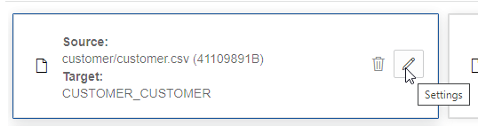

# Loading data from object storage using Data Tools (& API)

## Introduction

This lab takes you through the steps needed to link to, and load, data from the MovieStream data lake on Oracle Object Store into an Oracle autonomous database instance in preparation for exploration and analysis.

You can load data into your autonomous database (Autonomous Data Warehouse [ADW] or Autonomous Transaction Processing [ATP]) using Oracle Database tools, as well as Oracle and 3rd party data integration tools. You can load data:

+ from files in your local device,
+ from tables in remote databases, or
+ from files stored in cloud-based object storage (Oracle, S3, Azure, Google)

> **Note:** While this lab uses ADW, the steps are identical for loading data into an ATP database.

Estimated Time: 30 minutes

### Objectives <optional>


-   Learn how to define Object Store credentials for your autonomous database
-   Learn how to load data from the Object Store
-   Learn how to troubleshoot data loads


## **Step 1**: Configure the Object Storage Connection

1. In your ADW database's details page, click the Tools tab. Click **Open Database Actions**

	  

2. On the login screen, enter the username MOVIEWORK, then click the blue **Next** button.

3. Enter the password for the MOVIEWORK user you set up in the previous lab.

4. Under **Data Tools**, click on **DATA LOAD**

    

5. In the **Explore and Connect** section, click on **CLOUD LOCATIONS** to set up the connection from your autonomous database to Object Store.

    

5. Click on **+Add Cloud Storage** in the top right of your screen.

-   In the **Name** field, enter 'MovieStreamDataLake'

> **Note:** Take care not to use spaces in the name.

-   Leave the Cloud Store selected as **Oracle**
-   Copy and paste the following URI into the URI + Bucket field:

> https://objectstorage.us-ashburn-1.oraclecloud.com/n/adwc4pm/b/moviestream_gold/o

-   Select **No Credential** as this is a public bucket
-   Click on the **Test** button to test the connection. Then click **Save**.


## **Step 2:** Load data from files in Object Storage

In this step we will perform some simple data loading tasks, to load in CSV files from Object Store into tables in our autonomous database.

1. Now, to load or link data from this newly configured cloud storage, click on the **Data Load** link in the top left of your screen.

    

2. Under **What do you want to do with your data?** select **LOAD DATA**, and under **Where is your data?** select **CLOUD STORAGE**, then click **Next**

    

3. Expand the **customer**, **customer_segment**, and **genre** folders in the tree view on the left hand side and drag the following three files to the right hand pane:

-   customer.csv
-   customer_segment.csv
-   genre.csv

> **Note:** We will be loading files from the movie **custsales** folder in later steps.

4. You will notice the target table names are derived from the folder and file names, but in this case we want to name the tables using simple names. First, click on the pencil icon to edit the settings for the customer/customer.csv load task.

    

5. Rename the target table to **CUSTOMER**

    

6. In the Mapping section, we can see that the Data Load tool has guessed the target data types for the table. In this case, we want to change the target column type for the **POSTAL_CODE** column from NUMBER to VARCHAR2(4000).

    

7. Click **Close** to close the settings editor.

8. Click on the pencil icon to edit the settings for the customer_segment/customer_segment.csv load task.

9. Rename the target table to **CUSTOMER_SEGMENT**. Then click **Close**.

10. Click on the pencil icon to edit the settings for the genre/genre.csv load task.

11. Rename the target table to **GENRE**. Then click **Close**.

12. Click on the Play button to run the data load job.

    

    The job should take about 30 seconds to run.

13. Check that all three data load tasks completed successfully, and have green tick icons next to them.

    

## **Step 3:** Using Database APIs to load richer data files

In this step, we will use some of the additional options of the DBMS_CLOUD APIs to load in some files with differently structured data.

1.  Using the top left menu, navigate to **Development** > **SQL** to open SQL Developer Web

2.  Copy and paste the following script into the Worksheet. This script will create an external table **ext_custsales**, linking to the multiple parquet files in the **custsales** folder in Object Store.

```
define uri_gold = 'https://objectstorage.us-ashburn-1.oraclecloud.com/n/adwc4pm/b/moviestream_gold/o'
define parquet_format = '{"type":"parquet",  "schema": "all"}'
 
begin
    dbms_cloud.create_external_table(
        table_name => 'ext_custsales',
        file_uri_list => '&uri_gold/custsales/*.parquet',
        format => '&parquet_format',
        column_list => 'MOVIE_ID NUMBER(20,0),
                        LIST_PRICE BINARY_DOUBLE,
                        DISCOUNT_TYPE VARCHAR2(4000 BYTE),
                        PAYMENT_METHOD VARCHAR2(4000 BYTE),
                        GENRE_ID NUMBER(20,0),
                        DISCOUNT_PERCENT BINARY_DOUBLE,
                        ACTUAL_PRICE BINARY_DOUBLE,
                        DEVICE VARCHAR2(4000 BYTE),
                        CUST_ID NUMBER(20,0),
                        OS VARCHAR2(4000 BYTE),
                        DAY date,
                        APP VARCHAR2(4000 BYTE)'
    ); 
end;
```

3.  Click on the **Run Script** button (or use the F5 key) to run the script.

    

    We now have a new **ext_cust_sales** table that links to the parquet files in our data lake on Object Store. We can work with this data directly in the autonomous database, but for the purposes of later labs, it is useful for us to copy this data over to **cust_sales** table that is independent on the parquet files. 

4.  To do this, click on the bin icon to clear the worksheet

    

    Then, copy and paste the following script into the worksheet:

exec dbms_output.put_line(systimestamp || ' - create custsales')
create table custsales as select * from ext_custsales;

5.  Click on the Run Script button again to run the script.

6.  Next, we will create an external table to link to the **movies.json** file, then create a more structured table from this data. To do this, click on the bin icon to clear the worksheet, then copy and paste the following script:

define uri_gold = 'https://objectstorage.us-ashburn-1.oraclecloud.com/n/adwc4pm/b/moviestream_gold/o'
define json_format = '{"skipheaders":"0", "delimiter":"\n", "ignoreblanklines":"true"}'
begin
    dbms_cloud.create_external_table(
        table_name => 'ext_movie',
        file_uri_list => '&uri_gold/movie/movies.json',
        format => '&json_format',
        column_list => 'doc varchar2(30000)'
        );
end;
/  

exec dbms_output.put_line(systimestamp || ' - create movie')
create table movie as
select
    cast(m.doc.movie_id as number) as movie_id,
    cast(m.doc.title as varchar2(200 byte)) as title,   
    cast(m.doc.budget as number) as budget,
    cast(m.doc.gross as number) gross,
    cast(m.doc.list_price as number) as list_price,
    cast(m.doc.genre as varchar2(4000)) as genre,
    cast(m.doc.sku as varchar2(30 byte)) as sku,   
    cast(m.doc.year as number) as year,
    to_date(m.doc.opening_date, 'YYYY-MM-DD') as opening_date,
    cast(m.doc.views as number) as views,
    cast(m.doc.cast as varchar2(4000 byte)) as cast,
    cast(m.doc.crew as varchar2(4000 byte)) as crew,
    cast(m.doc.studio as varchar2(4000 byte)) as studio,
    cast(m.doc.main_subject as varchar2(4000 byte)) as main_subject,
    cast(m.doc.awards as varchar2(4000 byte)) as awards,
    cast(m.doc.nominations as varchar2(4000 byte)) as nominations,
    cast(m.doc.runtime as number) as runtime,
    substr(cast(m.doc.summary as varchar2(4000 byte)),1, 4000) as summary
from ext_movie m
where rownum < 10;
 
alter table movie add constraint pk_movie_cust_id primary key("MOVIE_ID");
alter table movie add CONSTRAINT movie_cast_json CHECK (cast IS JSON);
alter table movie add CONSTRAINT movie_genre_json CHECK (genre IS JSON);
alter table movie add CONSTRAINT movie_crew_json CHECK (crew IS JSON);
alter table movie add CONSTRAINT movie_studio_json CHECK (studio IS JSON);
alter table movie add CONSTRAINT movie_awards_json CHECK (awards IS JSON);
alter table movie add CONSTRAINT movie_nominations_json CHECK (nominations IS JSON);

7. Click on the **Run Script** button to run the script.


----------------------------------
N. Code examples that include variables

	```
  <copy>ssh -i <ssh-key-file></copy>
  ```

## Learn More

*(optional - include links to docs, white papers, blogs, etc)*

* [URL text 1](http://docs.oracle.com)
* [URL text 2](http://docs.oracle.com)

## Acknowledgements
* **Author** - <Name, Title, Group>
* **Contributors** -  <Name, Group> -- optional
* **Last Updated By/Date** - <Name, Group, Month Year>
