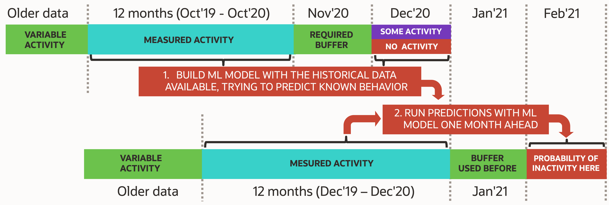
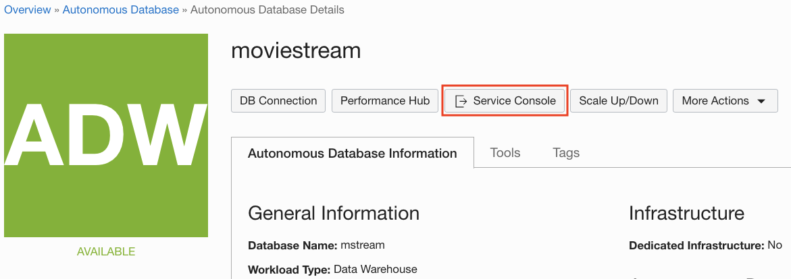
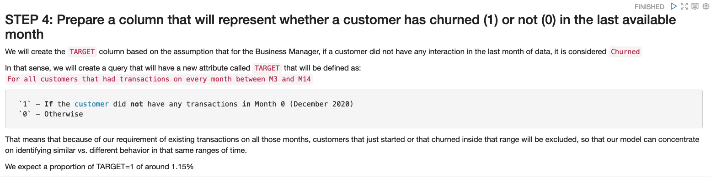

# Using Oracle Machine Learning AutoML UI to predict churn

## Introduction

In this lab, you will use the Oracle Machine Learning (OML) SQL notebook application provided with your Autonomous Data Warehouse, as well as the OML AutoML UI and its features to identify customers with a higher likelihood of churning from **Oracle MovieStream** streaming services to a different movie streaming company.

There are two parts to this Lab:
* Data preparation required by machine learning algorithms to understand customer behavior from the past
* Use of the Oracle Machine Learning AutoML UI to build a model that can predict churn, and score current customers

Estimated Time: 90 minutes

### About Product

In this lab, we will learn more about the Autonomous Database's built-in Oracle Machine Learning components, including:
  * Oracle Machine Learning Notebooks - see [OML Notebooks documentation](https://docs.oracle.com/en/database/oracle/machine-learning/oml-notebooks/index.html).
  * Oracle Machine Learning for Python - see [OML4Py documentation](https://docs.oracle.com/en/database/oracle/machine-learning/oml4py/index.html).
  * Oracle Machine Learning AutoML UI - see [OML AutoML UI documentation](https://docs.oracle.com/en/database/oracle/machine-learning/oml-automl-ui/index.html)

### Objectives

In this lab, you will:
  * Access the Oracle Machine Learning Notebooks on Autonomous Database environment
  * Download and import a Notebook for Data Preparation
  * Run a notebook for a complete Data Preparation process
  * Prepare a Table that will be used for building a machine learning model using **OML AutoML UI**
  * Use **OML AutoML UI** to build the best machine learning model that can help predict future Churn by customers
  * Use the machine learning model to score the list of customers and predict their likelihood to churn in the future

### Prerequisites

* This lab requires completion of Labs 1-4 in the Contents menu on the left.

*Note: If you have a **Free Trial** account, when your Free Trial expires your account will be converted to an **Always Free** account. You will not be able to conduct Free Tier workshops unless the Always Free environment is available. **[Click here for the Free Tier FAQ page.](https://www.oracle.com/cloud/free/faq.html)***

## Task 1: Understanding customer churn and preparing the OML environment

To understand customer behavior, we need to look into the their Geo-Demographic information, but also their transactional behavior.  For transactional data, we need to be able to provide summaries of number of transactions and aggregated values per month for each type of transaction that we would like to explore, since the algorithms need to receive as input a single row per customer, with all their attributes spread out in columns.

To create the Database Table that is necessary to build the Machine Learning model, we will work with the data that exists in the **CUSTSALES** Oracle Database table, which contains historical customer transactions for every movie streamed, including payment and discounts, and can help us identify customer preferences and usage of the service. In order to prepare the information in an aggregated format, with **one customer per row** (which is a data layout required by Machine Learning), we will have to work with the Time information of the transactions to determine the customer behavior. 

**Customer churn** definition can be very complex, but for our example here we will use the following definition: 
- A customer is considered "churned" if they had **no (zero) streams in the last available month of data**, while having streamed movies during 12 previous months.
- In contrast to those customers, the customers that will be compared to those (and considered good) are the customers that have been **streaming movies for the last 12 months plus on the last available month of data**.

The following diagram shows the process we will use, including a **BUFFER** month that represents the time needed to be able to **ACT** on the knowledge that a customer is about to leave.  Predicting the **probability that a customer is going to leave exactly right now** does not help preparing a Campaign, since there is a lot of processing involved in updating customer data at the end of a day before one can do scoring, excluding customers that have a DO NOT CONTACT exception, but also executing offers and other processes in sync with all other divisions of the Enterprise will always take time.  

In addition to that, **a customer leaving today probably made that decision a while ago**, so our Machine Learning model needs to be able to detect any change in behavior from at least a month ago, which is the reason for the buffer of 1 month in the following process.

In **Task 2** we will learn how to create and run the functions necessary to transform the data into the required layout for running the Machine Learning algorithms successfully.  We will do that by accessing an OML notebook that will provide a step-by-step process that is going to create the Table needed as input to the next Task.
    
We will finish up in **Task 3** using **OML AutoML UI** to create a Machine Learning model that best identifies future churn, then genrerate the code to Score the current customers for their probability to Churn in the future. 

1. Download the Oracle Machine Learning Notebook for this lab
  The first step is to download the notebook to your machine and then import it into the Oracle Machine Learning notebook application.

  **Click** <a href="./files/Data_Preparation_for_Predicting_Churn_with_OML.json" download="Data_Preparation_for_Predicting_Churn_with_OML.json" target="\_blank">here</a> to download the sample notebook for this lab, Data\_Preparation\_for\_Predicting\_Churn\_with\_OML.json, to a folder on your local computer.

2. Access Oracle ML Notebook as one of the ADB users

  You create and work with notebooks in Oracle Machine Learning Notebooks. You can access Oracle Machine Learning Notebooks from Autonomous Database.

  In "Lab 2: Quick Tour of ADW", under "Task 1: Familiarizing with the Autonomous Database Console",  at the Step 6 you got access to the **Development page**.  In there you can see a "card" to open **Oracle Machine Learning (OML) Notebooks**.

  As a quick recap, from the tab on your browser with your ADW instance, click **Service Console**.

  

  Once in the Service Console, select **Development** from the menu on the left.

  
  
  From the cards that are available in the Development section, click on the **Oracle Machine Learning Notebooks** card.

  

  <if type="livelabs">Sign in with ``MOVIESTREAM`` using the password you created in "Lab 3: Create a Database User", Task 1, Step 5. </if><if type="freetier">Enter your Autonomous Database user credentials and click **Sign in**. Please note that your user has to have the proper credentials for Oracle Machine Learning, described under "**Lab 3:** Create a Database User", at "**Task 2:** Update the User's Profile to Grant Additional Roles"</if>

  

  Click on the **Notebooks** on the Quick Actions menu.

  

3. Import the Notebook into your OML Notebooks session.

  In the Notebooks screen, click the **Import** button and navigate to the folder where you downloaded the notebook **Data\_Preparation\_for\_Predicting\_Churn\_with\_OML.json** file you downloaded previously in Task 1.
  Click **Open** to load the notebook into your environment.

  
  
  In case of success, you should receive a notification at the top of the screen that the Import process worked, and you should be able to see the notebook called **Data Prep for pRedicting Churn with OML** in the list of Notebooks.
  
  

  You are ready to proceed to the next Task.

4. Open the Notebook just imported into OML Notebooks
   
  We are going to open the Notebook for editing.  For that we need to **click on the Notebook's name**.  You will see that the Notebook server starts and loads the Notebook, where you get to the top of the Notebook. 

  

  Before running anything on the Notebook, we have to make adjustments to the **Interpreters**, which specifies whether to run the Notebook using the LOW, MEDIUM or HIGH Autonomous Database consumer group. You can read more about the details of the different service levels in the [Autonomous Database documentation](hhttps://docs.oracle.com/en/cloud/paas/autonomous-database/adbsa/service-names-data-warehouse.html#GUID-80E464A7-8ED4-45BB-A7D6-E201DD4107B7).

  The first thing we need to do is to click on the gear icon on the top right, which will open the panel with the Interpreters, and on that panel make sure to select at least one of the interpreters that indicate **%sql (default), %script, %python**.  You can move the interpreters to change their order and bring the one you prefer to the top.  Ideally move the **MEDIUM** interpreter (the one with "_medium" in the name) to the top, or only select it by clicking on it (it becomes blue) and leave the others unclicked (they stay white).

  

  Once you are satisfied, **click Save** to save your options, and stay in the notebook screen.

  We will follow the notes and instructions in the notebook, but before we do, and to make sure the entire environment is ready, we will start the execution of the entire notebook by clicking at the top of the screen, on the icon that looks like a **play button** next to the notebook name, like indicated in the image below.

  

  In the menu that pops open, confirm that you do want to run the entire Notebook by clicking the **OK** button.

  The entire run is expected to take around 5 minutes or less, depending on the resources available, but we can start exploring the contents while it is still running. 

## Task 2: Data Preparation for Machine Learning
  
1. Prepare a time difference column to build our monthly aggregations
   
  The `CUSTSALES` Database table contains a Time Stamp column called `DAY_ID` indicating when each purchase was made.  To identify customer trends over time, we will build new aggregation columns that indicate how many months before the last one were the transactions made.  This is because Machine Learning algorithms do not know the meaning of January or September, and because we are going to be always evaluating the last X months of data before predicting the customer behavior in the subsequent months.

  On other types of machine learning problems, one could include Seasonality into the mix, including Seasons of the year, week of the month, day of the week and more, but in our current example we will simplify the process and only look at monthly trends. 

  You can follow on the notebook and keep scrolling down as you go through it.  You see that the current **Step 1** explains the text about the data aggregation we need, so we will start by checking out the data.  

  

  Scrolling down you will see the first steps, where we count the number of records from the `CUSTOMER` dataset, and the `CUSTSALES` table.

  

  We also might want to take a look at the distributions of some of the columns.  Usually it would be important to look at all the columns, but we give you an example here.  We try to look at any irregularities in the distributions.

  

  We finally will review the listing of the `CUSTSALES` table.

  

  We now will prepare the Time Difference column, so we will create the aggregations by the difference of time to a specific month.

  

  We will run a quick test to check if everything is as expected in our assumption for the calculation, and we will check the Time Difference distribution, which we expect will be in a range from 1 (latest month) to 24 (2 years ago).

2. Prepare some acceleration and velocity attributes to try to understand customer behavior

  In this step we will use the time difference column we created to build the aggregation attributes for the `CUSTSALES` table.

  

  To make sure that the aggregate number of transactions per month is working correctly, we limit the query to a single customer that we know had transactions for all months, and compare to a customer that we know did not make any transactions in the last month (considered a Churner).  We expect that the Non-churner customer on the left would have transactions on `MDIFF_JAN2021=1`, while the Non-churner would only start to have transactions on `MDIFF_JAN2021=2`.

  

  Now that this is working, we will create the full Pivot for the Aggregations for each customer.  Machine Learning models require data to be all consolidated in a single record for each `CUST_ID`, so we need to use some Pivot processing on the data.

  

  We will create the full code for testing with only those 2 customers we had previously experimented with, just to check for any problems.  It starts with the many `CASE` statements in the code, where we are identifying which month the transaction is coming from and accumulating thre results. 

  The query starts with:
  

  The query ends with: 

  

  The result can be seen in those 2 records listed, where we can see that the Churner has a **"0"** for the data from **M1**.

  
  
  
  

3. Prepare a pivotting table for several of the transaction features
  
  
  
  

4. Prepare a column that will represent whether a customer has churned (1) or not(0) in the last available month

5. Build the final dataset for Machine Learning

## Task 3: Use AutoML UI to build a Machine Learning model to predict churn

1. TBD

## Learn More

*(optional - include links to docs, white papers, blogs, etc)*

* [URL text 1](http://docs.oracle.com)
* [URL text 2](http://docs.oracle.com)

## Acknowledgements
* **Author** - <Name, Title, Group>
* **Contributors** -  <Name, Group> -- optional
* **Last Updated By/Date** - <Name, Group, Month Year>
