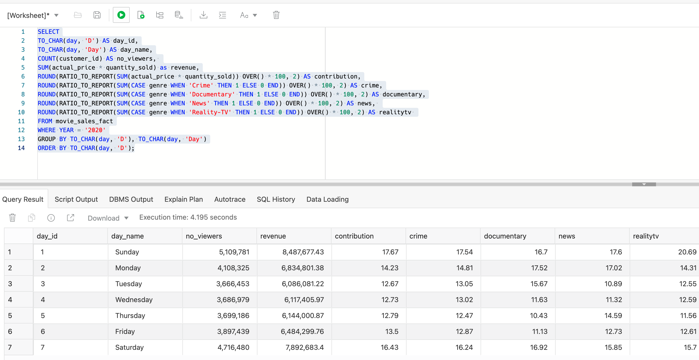
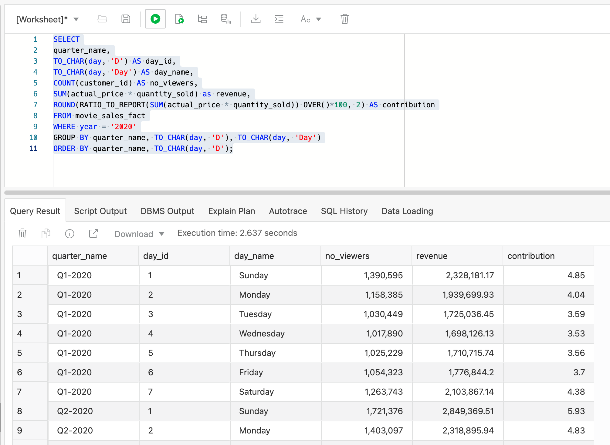
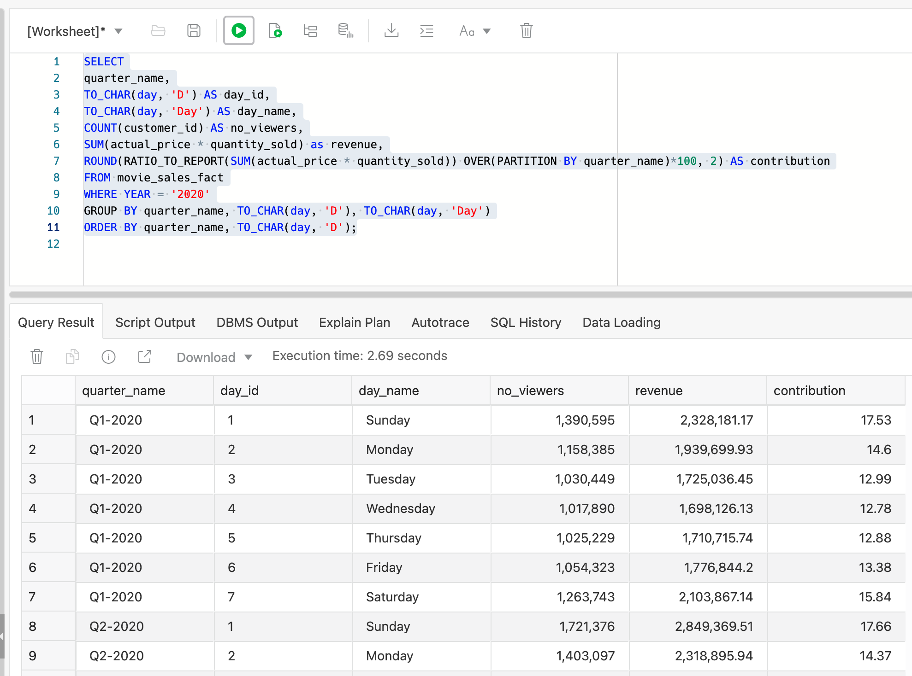


# Analyzing Movie Sales Data

## Introduction

In most real-world scenarios queries against your data warehouse would normally involve the use of a data visualization tool such as Oracle Analytics Cloud (alternatively, 3rd party business intelligence products such as Qlik, Tableau, PowerBI, and so on, currently support Autonomous Data Warehouse). Within this part of the workshop we will use SQL commands to query our data using the built-in SQL Worksheet.  

**Note** that your Autonomous Data Warehouse also comes complete with a built-in machine learning notebook tool which is launched from the tools menu on the console page. It is aimed at data scientists and data analysts and allows them to build machine learning models using PL/SQL, Python and/or R. This feature is explored in one of our other online labs for Autonomous Data Warehouse.

  *Autonomous Data Warehouse also provides 5 free licenses for Oracle Analytics Desktop which is the desktop client version of Oracle Analytics Cloud. Other sections in this workshop provide step-by-step guidance on how to use both products.*

Estimated time: 15 minutes

### Objectives

- Learn how to use SQL Worksheet

- Learn how query caching improves performance

- How to easily calculate revenue contribution

- How to pivot data rows into columns to make analysis easier

### Prerequisites

- You will need to have completed the related LiveLabs workshop, **Autonomous Data Warehouse: Data Loading and Management Using SQL on the MovieStream Dataset**. The **Getting Started** section of that prerequisite workshop describes how to obtain an Oracle cloud account if you do not already have one. In that workshop you provision an Oracle Autonomous Database, and then load the MovieStream data needed for this analytics workshop.

## STEP 1 - Exploring Sales Data

1. To get us started, let's use a very simple query to look at total movie sales by year and quarter:

    ```
    <copy>SELECT year,quarter_name,SUM(quantity_sold * actual_price)
    FROM movie_sales_fact
    WHERE YEAR = '2020'
    GROUP BY year, quarter_nameORDER BY 1,2;</copy>
    ```

2. The result should look something like this:

    

    Note the time taken to run your query. In the above example, this was 1.315 seconds to run (*when you run your query the timing may vary slightly*). Now simply run the query again:

    

3. This time the query ran much faster, taking just 0.004 seconds! So what happened?

    When we executed the query the first time, Autonomous Data Warehouse executed the query against our movie sales table and scanned all the rows. It returned the result of our query to our worksheet and then it stored the result in something called a **result cache**;. When we then ran the same query again Autonomous Data Warehouse simply retrieved the result from its result cache! No need to scan all the rows again. This saved a lot of time and saved us money because we used hardly any compute resources.

    If you want to understand a bit more about **result cache**, then keep going with the section below; otherwise just jump ahead to **STEP 3 - Analyzing Customer Viewing Habits**.

## STEP 2 - Learn How ADW's RESULT CACHE Means Faster Queries (Optional)

A result cache is an area of memory within our Autonomous Data Warehouse that stores the results of database queries for reuse. The *cached* rows are shared across queries and sessions.  What this means is that when we run a query, the first thing the database does is to search its cache memory to determine whether the result already exists in the result cache. If it does, then the database retrieves the result from memory instead of executing the query. If the result is not cached, then the database executes the query, returns the result and stores the result in the result cache so the next time the query is run the results can simply be returned from the cache.

But, how do you know if the results from a query are returned from cache?

1. Our Autonomous Data Warehouse console has a built-in performance monitoring tool called  **Performance Hub** . This tool gives us both real-time and historical performance data for our Autonomous Data Warehouse. Performance Hub shows active session analytics along with SQL monitoring and workload information. Let's try running a query and then see how Autonomous Data Warehouse executes it.

2. To simplify the monitoring process, we will add some additional instructions to the database about how we want it to execute our query. These extra instructions are called  **hints**  and they are enclosed within special markers: **/*  */.** In the example below we have given our query a name (Query 1) and we have told Autonomous Data Warehouse to monitor the query during its execution: 

    ```
    <copy>SELECT /* Query 1 */ /*+ monitor */
    year,
    quarter_name,
    continent,country,
    state_province,
    COUNT(customer_id) AS no_customers,
    COUNT(distinct movie_id) AS no_movies,
    SUM(actual_price) AS total_revenue,
    SUM(actual_price)/COUNT(customer_id) AS avg_revenue
    FROM movie_sales_fact
    WHERE YEAR = '2020'
    GROUP BY year, quarter_name, continent, country, state_province
    ORDER BY 1,2,3,4;</copy>
    ```

3. This query should return a result similar to this:

    

4. Click this icon at the top of the worksheet:

    

5. This will run an Explain Plan. This shows, in a tree-form, how Autonomous Data Warehouse executed our query. You read the tree from bottom to top so the last step is to put the result set into the result cache:

    

6. Now simply run the query again:

    ```
    <copy>SELECT /* Query 1 */ /*+ monitor */
    year,
    continent,
    country,
    state_province,
    COUNT(customer_id) AS no_customers,
    count(distinct movie_id) AS no_movies,
    SUM(actual_price) AS total_revenue,
    SUM(actual_price)/COUNT(customer_id) AS avg_revenue
    FROM movie_sales_fact
    WHERE YEAR = '2020'
    GROUP BY year,continent, country, state_province
    ORDER BY 1,2,3,4;</copy>
    ```

7. You can see that it runs significantly faster this time!

    

8. If you look at the explain plan again it will be the same explain plan as last time which is helpful in some ways but we want to dig a little deeper this time. To track the actual execution process, we need to switch over to the Autonomous Data Warehouse console. There should be a tab open in your browser which is labelled **Oracle Cloud Infrastructure**, or simply open a new tab and go to  **[cloud.oracle.com](http://cloud.oracle.com),**  then click on the card labelled **View all my resources **,  and find your data warehouse in the list of resources, and use Performance Hub. Switch back to your Autonomous Data Warehouse console page. 

    

9. Click the button **Performance Hub** to open the monitoring window.

    **Note:** our performance charts will look a little different because we have only just started using our new Autonomous Data Warehouse:

    

10. Now click the tab marked **SQL Monitoring** in the lower half of the screen:

    

    **Note:** The first two queries in the list will be the queries we just executed - (*you can identify them by looking at database times if the two queries are not grouped together*). The first execution of our query (row two in the table above) shows that we used 8 parallel slaves to execute the query and this resulted in 2,470 I/O requests to retrieve data stored on disk. So it's clear that we had to use some database resources to run our query the first time. Now look at the performance monitoring data for the second execution (the first row in the table above) - no parallel resources were used, no I/O requests were made and the database time was insignificant. This tells us that the database was able to reuse the results from a previous execution of the same query. Essentially there was zero cost in running the same query a second time. 

    This is a typical real-world scenario where users are viewing pre-built reports on dashboards and in their data visualization tools. Result cache is one of the many transparent performance features that helps our Autonomous Data Warehouse efficiently and effectively run our data warehouse workloads.

Now that we have some insight into how Autonomous Data Warehouse manages queries, let's expand our first query and begin to do some analysis of our sales data.

## STEP 3 - Analyzing Customer Viewing Habits

1. First, we need to switch back to the tab where we are running SQL Worksheet.

2. Let's start by investigating the viewing habits of our MovieStream customers by seeing how many of them are buying movies on each day of the week and whether there are any specific patterns we can spot? Copy the following SQL into your worksheet and then press the green circle icon to execute the query: 

    ```
    <copy>SELECT
    TO_CHAR(day, 'D') AS day_id,
    TO_CHAR(day, 'Day') AS day_name,
    COUNT(customer_id) AS no_viewers,
    SUM(actual_price * quantity_sold) AS revenue
    FROM movie_sales_fact
    WHERE YEAR = '2020'
    GROUP BY to_CHAR(day, 'D'), TO_CHAR(day, 'Day')
    ORDER BY TO_CHAR(day, 'D');</copy>
    ```

3. This should return something similar to the following:

    

    This shows that we have more customers buying movies on Fridays, Saturdays, Sundays and Mondays since these days show the highest revenue. The revenue in the middle of week is still great, but definitely lower. But it's hard to see a clear pattern just by looking at the raw sales numbers.

## STEP 4 - Calculating Each Day's Contribution

### Overview

It would be helpful for our analysis if we could calculate the contribution that each day is providing to our overall sales. To do this, we need to use a special type of aggregation process within our query - we need a type of function that is called a **window** function. This type of function is very powerful since it allows us to calculate additional totals (or ratios, ranks, averages, maximum values, minimum values) as part of our query. In this case, we want to calculate the total revenue across all seven days and then divide each day's total by that aggregate total. 

Let's start by defining the total for each day:   **```SUM(actual_price * quantity_sold)```**

Then we can add the total revenue for all days by using a window function to extend the **SUM** function. This means adding the additional keyword **OVER** as follows:  **```SUM(actual_price * quantity_sold) OVER ()```**  

  **NOTE:** If you to read more about window functions, look at this topic in the [Oracle Data Warehouse Guide](https://docs.oracle.com/en/database/oracle/oracle-database/19/dwhsg/sql-analysis-reporting-data-warehouses.html#GUID-2877E1A5-9F11-47F1-A5ED-D7D5C7DED90A).

Now we can combine these two calculations to compute the contribution for each day: **```SUM(actual_price * quantity_sold) / SUM(actual_price * quantity_sold) OVER ()```**

**BUT WAIT!** There is actually a specific SQL function that can do this calculation for us. It's called [RATIO\_TO\_REPORT](https://docs.oracle.com/en/database/oracle/oracle-database/19/dwhsg/sql-analysis-reporting-data-warehouses.html#GUID-C545E24F-B162-45CC-8042-B2ACED4E1FD7) and the SQL looks like this:

**```RATIO_TO_REPORT(SUM(actual_price * quantity_sold)) OVER()```**

This approach looks much neater, easier to read, and much simpler!

We are going to extend the **```RATIO_TO_REPORT```** function a little further on in this workshop so you will get some more insight regarding the flexibility and power of this type of calculation. 

1. For now, let's extend our original query so that it now includes this new window function:

    ```
    <copy>SELECT
    TO_CHAR(day, 'D') AS day_id,
    TO_CHAR(day, 'Day') AS day_name,
    COUNT(customer_id) AS no_viewers,
    SUM(actual_price * quantity_sold) AS revenue,
    RATIO_TO_REPORT(SUM(actual_price * quantity_sold)) OVER()*100 AS contribution
    FROM movie_sales_fact
    WHERE YEAR = '2020'
    GROUP BY TO_CHAR(day, 'D'), TO_CHAR(day, 'Day')
    ORDER BY TO_CHAR(day, 'D');</copy>
    ```

2. The output from this query is shown below and the last column containing the contribution calculation is definitely a little challenging to read:

    

3. In a spreadsheet, it's very easy to clean up this type of report by using the decimals button. SQL has a similar way to formatting option called **ROUND**, so let's clean up the output:

    ```
    <copy>SELECT
    TO_CHAR(day, 'D') AS day_id,
    TO_CHAR(day, 'Day') AS day_name,
    COUNT(customer_id) AS no_viewers,
    SUM(actual_price * quantity_sold) AS revenue,
    ROUND(RATIO_TO_REPORT(SUM(actual_price * quantity_sold)) OVER()*100, 2) AS contribution
    FROM movie_sales_fact
    WHERE YEAR = '2020'
    GROUP BY TO_CHAR(day, 'D'), TO_CHAR(day, 'Day')
    ORDER BY TO_CHAR(day, 'D');</copy>
    ```
4. Now we can get a much clearer picture of the contribution each day is providing:

    

5. We can see that Friday provides a significant contribution compared to the other weekdays, however, **Saturday**, **Sunday** and **Monday** are actually providing the highest levels of contribution across the whole week.  Now let's try and breakout the data across different dimensions to get some more insight. 

## STEP 5 - Breaking Data Out By Specific Genre

Let's expand our focus and consider the types of movies that customers are watching each day. To do this, we can use the **SQL CASE** feature (which is similar to the IF() function in Excel) in conjunction with a count for each genre of movie as follows:

For each genre where we know how many movies of that type were watched, we include the following code:

<pre>CASE genre WHEN 'crime' THEN 1 ELSE null END</pre>

1. We can take this formula and wrap it within a contribution calculation (**```RATIO_TO_REPORT```**), applying the formatting technique we just used above. Let's focus on a specific range of genres: crime, documentary, news and reality-tv genres.

    ```
    <copy>SELECT
    TO_CHAR(day, 'D') AS day_id,
    TO_CHAR(day, 'Day') AS day_name,
    COUNT(customer_id) AS no_viewers,
    SUM(actual_price * quantity_sold) as revenue,
    ROUND(RATIO_TO_REPORT(SUM(actual_price * quantity_sold)) OVER() * 100, 2) AS contribution,
    ROUND(RATIO_TO_REPORT(SUM(CASE genre WHEN 'Crime' THEN 1 ELSE 0 END)) OVER() * 100, 2) AS crime,
    ROUND(RATIO_TO_REPORT(SUM(CASE genre WHEN 'Documentary' THEN 1 ELSE 0 END)) OVER() * 100, 2) AS documentary,
    ROUND(RATIO_TO_REPORT(SUM(CASE genre WHEN 'News' THEN 1 ELSE 0 END)) OVER() * 100, 2) AS news,
    ROUND(RATIO_TO_REPORT(SUM(CASE genre WHEN 'Reality-TV' THEN 1 ELSE 0 END)) OVER() * 100, 2) AS realitytv
    FROM movie_sales_fact
    WHERE YEAR = '2020'
    GROUP BY TO_CHAR(day, 'D'), TO_CHAR(day, 'Day')
    ORDER BY TO_CHAR(day, 'D');</copy>
    ```
2. This should return something similar to the following:

    

From the data we can see that viewing of Reality-TV related movies is definitely more popular on Mondays compared to other days of the week. News is definitely not popular on  Tuesdays, and Monday is the day to sit down and watch a documentary movie!

We are starting to get an interesting picture of our customers' viewing habits during the week, so now let's drill into this daily analysis and look at how the daily contributions change within each of the four reporting quarters.

## STEP 6 - Breaking Data Out By Quarter

It's most likely that when you are doing this type of analysis on your own data set the next most obvious step is to look at the same data over time to see if any other interesting patterns pop out.

1.  Let's dig a little deeper into the numbers by breaking out the data by year. With SQL all we need to do is add the additional column name into the **SELECT** clause, **GROUP BY** clause and most importantly the **ORDER BY** clause as well:

    ```
    <copy>SELECT
    quarter_name,
    TO_CHAR(day, 'D') AS day_id,
    TO_CHAR(day, 'Day') AS day_name,
    COUNT(customer_id) AS no-viewers,
    SUM(actual_price * quantity_sold) AS revenue,
    ROUND(RATIO_TO_REPORT(SUM(actual_price * quantity_sold)) OVER()*100, 2) AS contribution
    FROM movie_sales_fact
    WHERE YEAR = '2020'
    GROUP BY quarter_name, TO_CHAR(day, 'D'), TO_CHAR(day, 'Day')
    ORDER BY quarter_name, TO_CHAR(day, 'D');</copy>
    ```
2. the result should look similar to this:

    

3. Take a look at the contribution column; the values are very low. This is because we are comparing each day's data with the grand total for revenue across all four quarters. What we really need to do is compute the contribution within each quarter. This is a very easy change to make by simply adding a **PARTITION BY** clause to our window function.

    ```
    <copy>SELECT
    quarter_name,
    TO_CHAR(day, 'D') AS day_id,
    TO_CHAR(day, 'Day') AS day_name,
    COUNT(customer_id) AS no_viewers,
    SUM(actual_price * quantity_sold) as revenue,
    ROUND(RATIO_TO_REPORT(SUM(actual_price * quantity_sold)) OVER(PARTITION BY quarter_name)*100, 2) AS contribution
    FROM movie_sales_fact
    WHERE YEAR = '2020'
    GROUP BY quarter_name, TO_CHAR(day, 'D'), TO_CHAR(day, 'Day')
    ORDER BY quarter_name, TO_CHAR(day, 'D');</copy>
    ```

4. Now it's much easier to see that we have a same familiar pattern across Monday, Friday, Saturday and Sunday:

    

## STEP 7 - Creating An Excel-Like Pivot Table

### Overview

However, the challenge here is it would be much easier if we could have a spreadsheet-like view of our result set, where the quarters are across the top of the report. Spreadsheets (along with many BI/data visualization tools) make this very easy to achieve through the use of pivot tables. Fortunately, SQL provides an almost identical feature:  **[PIVOT](https://docs.oracle.com/en/database/oracle/oracle-database/19/dwhsg/sql-analysis-reporting-data-warehouses.html#GUID-05BB22CD-0F53-4C90-AE84-CE3F88DBD591)** function (you may need to scroll down to find the section on PIVOT). In this example, we are telling SQL to break out the contribution column into separate columns for each quarter (where each column will be named as Q1, Q2, Q3 and Q4): 

**Note:** You don't need to run this block of code:

    ```
    PIVOT
    (
    SUM(CONTRIBUTION) contribution
    FOR QUARTER_NAME IN('Q1-2020' as "Q1", 'Q2-2020' as "Q2", 'Q3-2020' as "Q3", 'Q4-2020' as "Q4")
    )
    ```

1. If we wrap a **PIVOT** operation around our previous query, this will allow us to swap rows for each quarter into columns. So let's take the quarters and flip them into columns and just focus on the contribution data:

    ```
    <copy>SELECT * FROM
    (SELECT
    quarter_name,
    TO_CHAR(day, 'D') AS day_id,
    TO_CHAR(day, 'Day') AS day_name,
    ROUND(RATIO_TO_REPORT(SUM(actual_price * quantity_sold)) OVER(PARTITION BY quarter_name)*100, 2) AS contribution
    FROM movie_sales_fact
    WHERE YEAR = '2020'
    GROUP BY quarter_name, TO_CHAR(day, 'D'), TO_CHAR(day, 'Day')
    ORDER BY quarter_name, TO_CHAR(day, 'D'))
    PIVOT
    (
    SUM(CONTRIBUTION) contribution
    FOR QUARTER_NAME IN('Q1-2020' as "Q1", 'Q2-2020' as "Q2", 'Q3-2020' as "Q3", 'Q4-2020' as "Q4")
    )
    ORDER BY 1;</copy>
    ```
2. This now looks more like a spreadsheet and it's now a lot easier to visually analyze the data over two time dimensions.

    

### Wrapping It All Up

From this result set, we can easily spot that Monday's contribution is declining over time whilst the contribution provided by Friday, Saturday and Sunday is increasing over time. This could have important knock-on effects for our networks and servers during those three days, so this trend will need to be watched closely to see how it develops further over time.

### Recap

In this section, you have looked at the following key features of your Autonomous Data Warehouse:

- Seeing how the result cache can transparently speed up queries

- Using built-in analytic functions to calculate contribution (**```RATIO_TO_REPORT```**)

- Applying formatting options to numeric results

- Transforming data from rows into columns to make comparisons easier by using **PIVOT**

## **Acknowledgements**

- **Author** - Keith Laker, ADB Product Management
- **Adapted for Cloud by** - Richard Green, Principal Developer, Database User Assistance
- **Last Updated By/Date** - Richard Green, June 2021
