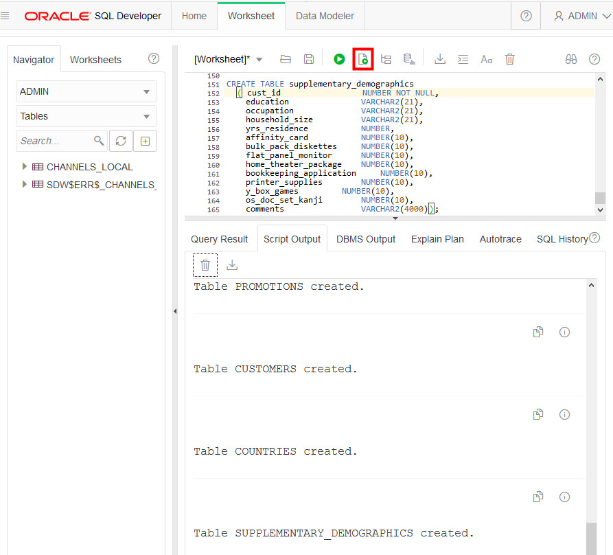

# Upload Files using OCI Object Store

## Introduction

In this lab, you will upload files to the Oracle Cloud Infrastructure (OCI) Object Storage, create sample tables, load data into them from files on the OCI Object Storage, and troubleshoot data loads with errors.

You can load data into your new autonomous database (Autonomous Data Warehouse [ADW] or Autonomous Transaction Processing [ATP]) using Oracle Database tools, and Oracle and 3rd party data integration tools. You can load data:

+ from files local to your client computer, or
+ from files stored in a cloud-based object store

For the fastest data loading experience Oracle recommends uploading the source files to a cloud-based object store, such as Oracle Cloud Infrastructure Object Storage, before loading the data into your ADW or ATP database.

To load data from files in the cloud into your autonomous database, use the new PL/SQL `DBMS_CLOUD` package. The `DBMS_CLOUD` package supports loading data files from the following Cloud sources: Oracle Cloud Infrastructure Object Storage, Oracle Cloud Infrastructure Object Storage Classic, Amazon AWS S3, and Microsoft Azure Object Store.

This lab shows how to load data from Oracle Cloud Infrastructure Object Storage using two of the procedures in the `DBMS_CLOUD` package:

+ **create_credential**: Stores the object store credentials in your Autonomous Data Warehouse schema.
    + You will use this procedure to create object store credentials in your ADW admin schema.
+ **copy_data**: Loads the specified source file to a table. The table must already exist in ADW.
    + You will use this procedure to load tables in your admin schema with data from data files staged in the Oracle Cloud Infrastructure Object Storage cloud service.

**Note:** While this lab uses ADW, the steps are identical for loading data into an ATP database.

### More Information
For more information about loading data, see the documentation [Loading Data from Files in the Cloud](https://www.oracle.com/pls/topic/lookup?ctx=en/cloud/paas/autonomous-data-warehouse-cloud&id=CSWHU-GUID-07900054-CB65-490A-AF3C-39EF45505802).

### Objectives

-   Learn how to use SQL Developer Web to load data into an autonomous database table
-   Learn how to upload files to the OCI Object Storage
-   Learn how to define object store credentials for your autonomous database
-   Learn how to create tables in your database
-   Learn how to load data from the Object Store
-   Learn how to troubleshoot data loads

### Required Artifacts

-   The following lab requires an <a href="https://www.oracle.com/cloud/free/" target="\_blank"> Oracle Cloud account</a>. You may use your own cloud account, a cloud account that you obtained through a trial, or a training account whose details were given to you by an Oracle instructor.

In Steps 1 to 3, you will create one ADW table, CHANNELS_LOCAL, and load it with sample data from your local file system. In the remaining steps, you will create several ADW tables and load them with sample data that you stage to an OCI Object Store.

### Lab Prerequisites

This lab assumes you have completed the [Login to Oracle Cloud] (?lab=lab-1-login-oracle-cloud) and [Provision ADB] (?lab=lab-2-provision-adb) labs seen in the menu on the right.

## STEP 3: Download Sample Data and Create Target Tables

In Steps 1 and 2, you created an ADW table and loaded it with sample data from your local file system. Now, you will create several ADW tables and load them with sample data that you stage to an OCI Object Store.

1. For this step, you will need a handful of data files.  Click <a href="./files/files.zip" target="\_blank">here</a> to download a zip file of the sample source files for you to upload to the object store. Unzip it to a directory on your local computer.

2. Connected as your admin user in SQL Developer Web, copy and paste <a href="./files/create_tables.txt" target="\_blank">this code snippet</a> to a worksheet. Take a moment to examine the script. Then click the **Run Script** button to run it.

-   It is expected that you may get ORA-00942 *table or view does not exist* errors during the DROP TABLE commands for the first execution of the script, but you should not see any other errors.

    

*Note that you do not need to specify anything other than the list of columns when creating tables in the SQL scripts. You can use primary keys and foreign keys if you want, but they are not required.*

## STEP 4: Navigate to Object Storage and Create Bucket

In OCI Object Storage, a bucket is the terminology for a container of multiple files.

1. Now you set up the OCI Object Store. From the Autonomous Data Warehouse console, pull out the left side menu from the top-left corner and select **Object Storage > Object Storage**. To revisit signing-in and navigating to ADW, please see [Lab 1](LabGuide1.md).

  

  *To learn more about the OCI Object Storage, refer to its <a href="https://docs.us-phoenix-1.oraclecloud.com/Content/GSG/Tasks/addingbuckets.htm" target="\_blank">documentation</a>*

2. You should now be on the **Object Storage** page. Choose the **root** compartment in the **Compartment** drop-down if it is not already chosen.
    

3. Click the **Create Bucket** button:

    

4. Name your bucket **ADWCLab** and click the **Create Bucket** button.

    

## STEP 5: Upload Files to Your OCI Object Store Bucket

1. Click your **bucket name** to open it:

    

2. Click the **Upload Objects** button:

    

3. Drag and drop, or click  **select files**,  to select all the files downloaded in Step 1. Click **Upload Objects** and wait for the upload to complete:

    

4. Repeat this for all files you downloaded in Step 1 for this lab. When the upload is complete, click **Close.**

5. The end result should look like this with all files listed under Objects:

    

## STEP 6: Object Store URL
1. Copy following base URL that points to the location of your files staged in the OCI Object Storage. The simplest way to get this URL is from the "Object Details" in the right hand side ellipsis menu in the Object Store.

 

 

2. Take a look at the URL you copied. In this example above, the **region name** is us-ashburn-1, the **Namespace** is idthydc0kinr, and the **bucket name** is ADWCLab.

    *Note:The URL can also be constructed as below:*

    `https://objectstorage.<`**region name**`>.oraclecloud.com/n/<`**namespace name**`>/b/<`**bucket name**`>/o`

3. **Save** the base URL you copied in a note. We will use the base URL in upcoming steps.

## STEP 7: Creating an Object Store Auth Token

To load data from the Oracle Cloud Infrastructure(OCI) Object Storage you will need an OCI user with the appropriate privileges to read data (or upload) data to the Object Store. The communication between the database and the object store relies on the native URI, and the OCI user Auth Token.

1. Go back to the **Autonomous Data Warehouse Console** in your browser. From the pull-out menu on the top left, under **Identity**, click **Users**.

    

2. Click the **user's name** to view the details.  Also, remember the username as you will need that in the next step. This username could also be an email address.

    

3. On the left side of the page, click **Auth Tokens**.

    

4. Click **Generate Token**.

    

5. Enter a meaningful **description** for the token and click **Generate Token**.

    

6. The new Auth Token is displayed. Click **Copy** to copy the Auth Token to the clipboard.  You probably want to save this in a temporary notepad document for the next few minutes (you'll use it in the next step).
    *Note:* You can't retrieve the Auth Token again after closing the dialog box.

    

7. Click **Close** to close the Generate Token dialog.

## STEP 8: Create a Database Credential for Your User

In order to access data in the Object Store you have to enable your database user to authenticate itself with the Object Store using your OCI object store account and Auth token. You do this by creating a private CREDENTIAL object for your user that stores this information encrypted in your Autonomous Data Warehouse. This information is only usable for your user schema.

1. Connected as your user in SQL Developer Web, copy and paste <a href="./files/create_credential.txt" target="\_blank">this code snippet</a> to a SQL Developer Web worksheet.

2. Specify the credentials for your Oracle Cloud Infrastructure Object Storage service: The username will be your **OCI username** (usually your email address, not your database username) and the password is the OCI Object Store **Auth Token** you generated in the previous step.  In this example, the credential object named **OBJ\_STORE\_CRED** is created. You reference this credential name in the following steps.

    

3. Run the script.

    

4.  Now you are ready to load data from the Object Store.

Please proceed to the next lab.

## Want to Learn More?

Click [here](https://docs.oracle.com/en/cloud/paas/autonomous-data-warehouse-cloud/user/load-data.html#GUID-1351807C-E3F7-4C6D-AF83-2AEEADE2F83E) for documentation on loading data into an autonomous database.

## Acknowledgements

- **Author** - Nilay Panchal, ADB Product Managemnt
- **Adapted for Cloud by** - Richard Green, Principal Developer, Database User Assistance
- **Last Updated By/Date** - Richard Green, March 2020

See an issue?  Please open up a request [here](https://github.com/oracle/learning-library/issues).   Please include the workshop name and lab in your request.
