# Use Autonomous Database Tools

## Introduction
This lab introduces the suite of data tools built into the Oracle Autonomous Data Warehouse.

Estimated Time: 25 minutes

### Objectives
In this lab, you will:
- Familiarize with the suite of built-in database tools of the Oracle Autonomous Data Warehouse
- Load data

### Prerequisites

To complete this lab, you need to have the following:

- All previous labs successfully completed

## Task 1: Overview of Built-In Data Tools Suite

**PREPARING QUARTERLY SALES ANALYSIS**

  

### MovieStream Critics Corner: Introduction

*Fans of the Space genre on MovieStream will be familiar with that spine-tingling feeling of excitement that comes with the count-down: “11, 10, 9, (ignition sequence starts), 6, 5, 4, 3, 2, 1, 0... Lift-off! We have a lift-off!” All the money you spent on that sub-woofer is justified by the rumble of those rocket motors driving out 7.8 million pounds of thrust. We’re at that stage of the workshop. This is the launch, so strap in, this is going to be an exciting journey!*

### Introduction

Autonomous Data Warehouse comes with a built-in suite of tools that can help you with many of the typical data warehouse tasks. This tool suite is complementary to various capabilities accessible via the SQL command line, which themselves are covered by other workshops.  To explore how these new built-in tools can make you work smarter and faster, you will take on the role of a departmental analyst at MovieStream. As a **departmental analyst**, you have been assigned the task of reviewing the sales data from Q2 of fiscal year 2020 and making recommendations for a marketing campaign based on this analysis.

  > **Note:** MovieStream's financial year is aligned with the calendar year, so FYQ2 is April-June.

In this section of the workshop, you are going to work through some common data warehouse requirements and scenarios that you will frequently run into when working on your own projects:

1. Load and inspect data to see if there are any obvious errors
2. Transform data to correct errors in the original data set
3. Create a business model (also known as a semantic model) over your data set
4. Run the Data Insights tool to identify anomalies and outliers in your data set
5. Use the built-in Catalog to understand the origins of the data within your data warehouse (this is called  ***Data Lineage***)
6. Use the built-in Catalog to understand the impact of making changes to your data model (this is called  ***Impact Analysis***)

**Let's get started!**

### Access Autonomous Database Built-In Tool Suite

In the previous lab, you created the database user **QTEAM**, and you should still be connected as user QTEAM.

There are two ways to access the Autonomous Database built-in tool suite:

1. Via the Autonomous Database console page
2. Directly via URL

> **Note:** If you are already in Database Actions home page, you may go directly to Step 3.

### Access Autonomous Database Tools via the ADW Console

On the Autonomous Data Warehouse console page, click the **Tools** tab, and in the **Database Actions** card, click the link to **Open Database Actions**:

  

### Access Autonomous Database Tools Directly via URI

When user QTEAM was created (in a previous step), a card appeared on the Database Users screen, similar to what is shown below. Notice the URI at the bottom of the card.

1. Click the **Copy to clipboard** icon to copy this to your clipboard. This URI may be used to access the Database Actions page of Autonomous Database Tools directly, without needing to use the OCI Console.
  
2. In the dialog that appears, sign in as user QTEAM, with the password assigned previously, and click **Sign In**.
  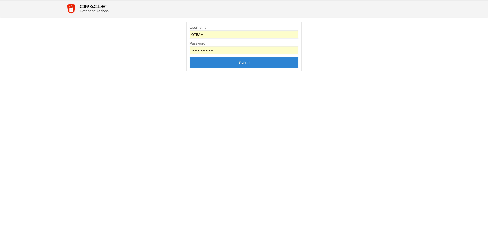
3. This will take you to the Autonomous Data Warehouse **Database Actions** home page (shown below). This page has a card for each of the most common tasks that the data warehouse user would want to perform. The cards are grouped by theme. For example, here you see groups for Development and Data Tools. Each card has a title and description.  
  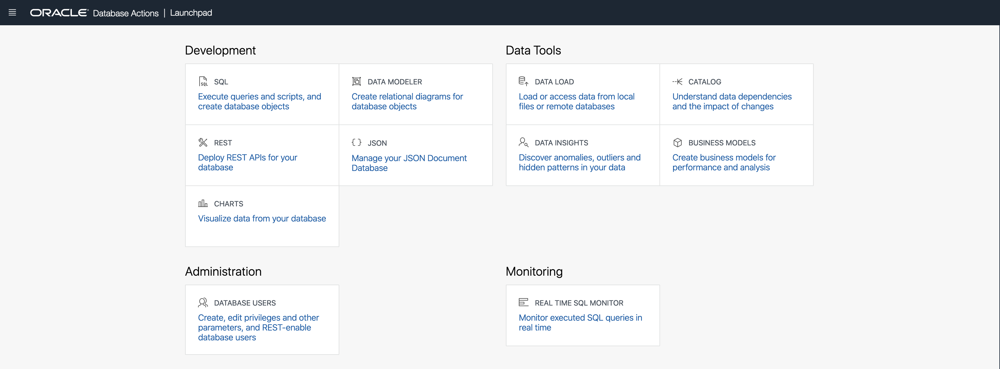
4. If you want more information about each of the tasks related to each card, then you can access the online help by clicking the **Question Mark** in the title bar, as indicated in the image below:
  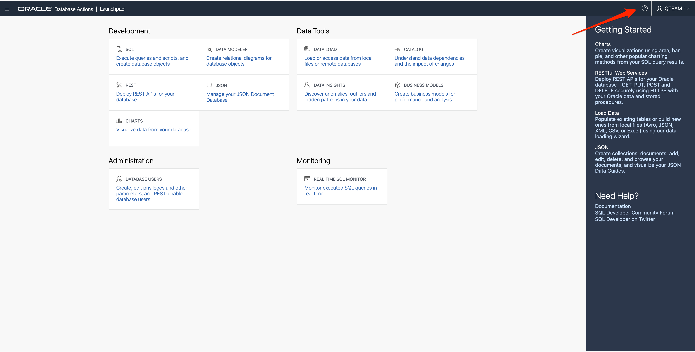
5. This will pop out a tray containing links to the relevant topics in the Autonomous Data Warehouse documentation. To close the help tray, simply click the  **X**.
  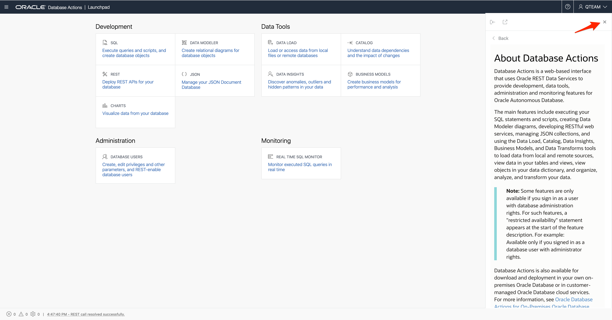

### RECAP

In this section of the workshop, you are playing the role of a different user of your Autonomous Data Warehouse: a departmental analyst whose database username is **QTEAM**. 

You have seen two different ways of navigating to the Database Actions home page, which is the launching pad for the various built-in tools:

- Navigating to **Database Actions** from the ADW console
- Using a URL (which can be copied from the ADW console) to access **Database Actions** directly

You've taken a brief tour of the **Database Actions** home page, with its card interface and ready access to documentation and other useful resources. The next task is to use the data loading tools to help you create your quarterly sales reports.

## Task 2: Launch Data Load Workflow

### MovieStream Critics Corner: Data Load

*In Analytics, just as in the streaming movie business, a good start is essential. The analysts at MovieStream pay careful attention to how commonly customers give up on a movie after just a few minutes, presumably because of a bad start. Similarly, we at Oracle Autonomous Database know that Data Load is the start of your Analytics work, and our Data Load tool is built to ensure you get off to a great start.*

### Overview

In this section, you are going to explore how to load spreadsheets stored on your local computer and combine that data with another data set which is stored in the Oracle Object Store. As you load these various data files, you are going to discover that some of your data is not correctly formatted. Sometimes it can be very hard to spot issues hidden within a data set, but as you will see, Autonomous Data Warehouse has unique tools to help you spot the typical data errors you find in most data warehouse projects.

#### Video Preview

Watch a video demonstration of the Data Load tool of Autonomous Database:

[] (youtube:SJUw4wIvkS4)
> **Note:** Interfaces in this video may look different from the interfaces you will see.

1. Click the **Data Load** card on the **Database Actions** home page.

  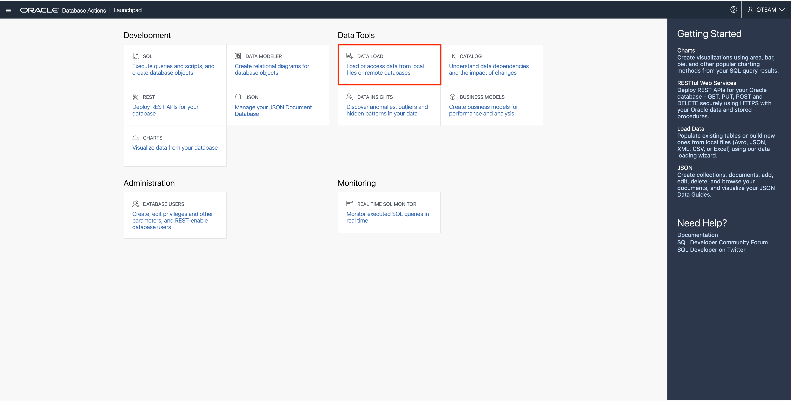

2. This will take you to the screen shown below which controls the data loading process - dividing it up in a series of simple questions:

  

  The layout of the cards on the above page is organized into three rows:  

    **row 1** - identifies how you are going to get to your source data: load it, link to it, or use a trickle feed data

    **row 2** - covers where your data is stored: local file, another database, or in a cloud object storage

    **row 3** - allows you to explore your data and manage your connections to the various cloud objects stores such as Oracle Object Store, Amazon's S3, Microsoft's Azure Blob Storage, and Google's Object Store. 

### About Data Loading In This Part Of The Workshop

The first step in data analysis is to load data, which may come from a wide variety of sources. Autonomous Data Warehouse supports data load from a very wide range of sources. In this workshop, you explore loading data from two prominent data sources – files on a local disk, and files in object store. All the files to be loaded into your ADW are in OCI Cloud Storage. The next section, *Loading Data from Local Files*, starts by having you download some of these files to your local disk. Of course, this simulates the real-world situation where some of the data you have to analyze might be downloaded from a website, or may have arrived via an email as an attachment. However, it may be that the environment you are using to run your workshop may not allow you to download files to your local computer. Therefore, these workshop notes include an alternative approach for loading the data you need, which is to use data files stored in the Oracle Object Store. This will all become clear as you go through the next series of steps in this workshop. 

  > **Note:** This workshop focuses on just two ways to load data. Within this workshop, it would be impractical and unrealistic to include data loading scenarios from all supported sources. Loading data from applications and databases are both supported by Autonomous Data Warehouse but are outside the scope of this workshop. For more information about data loading, see the documentation,  **[click here](https://docs.oracle.com/en/database/oracle/sql-developer-web/sdwad/load-data.html#GUID-E810061A-42B3-485F-92B8-3B872D790D85)**.

## Task 3: Load Data from Local Files

   **Important: **  Your computer may not support downloading files to your local disk. If you are in this situation, please skip forward to next main section **Load Data from Object Store.**

### Preparation

For these purposes, you have been given an extract of data by your IT team, and it has been delivered as a .CSV file. The file has been placed in a bucket in the Oracle Object Store. As part of this project, you are going to also reuse some data files from previous assignments that you have done in the past for the same team in the marketing department. These additional data files need to be moved to your computer so you can load them into your data warehouse.

Below are the four files that you will be using during this part of the workshop. Before you can begin, you need to download three files to your local computer and make a note of where they are stored, because you will need to use them later in this section. Click each of the three links below to download the two spreadsheet files and the csv-text file.

- **Movie\_Sales\_2020.csv**  This CSV file is stored in an Object Storage public bucket. This will be loaded in a separate step.
- Click **[here](https://objectstorage.us-phoenix-1.oraclecloud.com/n/dwcsprod/b/MovieStream-QTEAM-Download/o/Days_Months.xlsx)** to download the **Days\_Months.xlsx** Excel file to your local computer.
- Click **[here](https://objectstorage.us-phoenix-1.oraclecloud.com/n/dwcsprod/b/MovieStream-QTEAM-Download/o/Devices.xlsx)** to download the **Devices.xlsx** Excel file to your local computer.
- Click **[here](https://objectstorage.us-phoenix-1.oraclecloud.com/n/dwcsprod/b/MovieStream-QTEAM-Download/o/Countries.csv)** to download the **Countries.csv** CSV file to your local computer.

    > **Note:** This file might just appear as new tab in your browser rather than just simply downloading. Please use the Save or Save As feature in your browser's File menu to save the file as **Countries.csv**, and *make a note of where you saved it*!

**Before you proceed -**  be sure to take note of the location of the three files that you downloaded earlier to your local computer.

1. To load the files from your local computer, you need to click on the first card in each of the first two rows of cards (in row one - **LOAD DATA** and row two - **LOCAL FILE** ) which will mark each box with a blue tick in the bottom right corner. To move forward to the next step in this process, simply click the blue **Next** button. 
  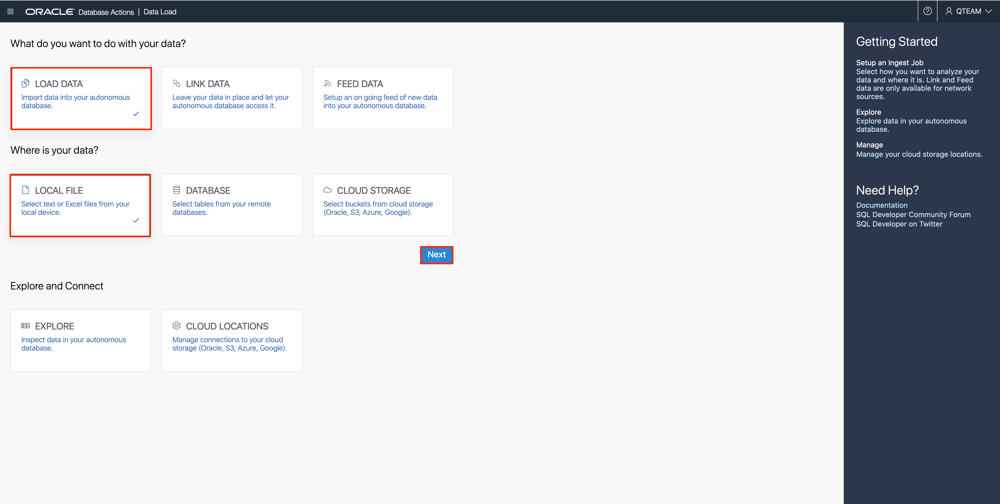
2. This is where you need to locate the three files (Countries.csv, Days_Months.xlsx and Devices.xlsx) that you downloaded earlier! If they are easily accessible, then you can simply drag **ALL THREE** files at one time, and drop them onto to canvas as stated in the text on the screen.
  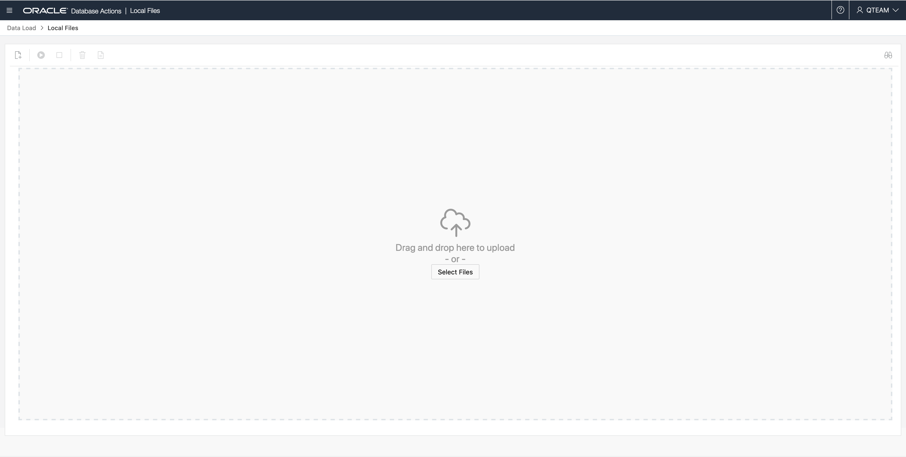
3. An alternative approach is to click **Select Files** button in the middle of the screen, which will open the file explorer on your local computer where you can locate your data files: Countries.csv, Days\_Months.xlsx, and Devices.xlsx. 
    >**Note:** Even though you only picked three files, four cards will appear for the data TARGETS to be loaded.
  
  
  Why do you have  ***four***  cards listed on the data loading screen? This is because your spreadsheet file **Days\_Months.xlsx** contains two worksheets: one for Days and one for Months. The data loading wizard automatically parsed your spreadsheet and created a separate data loading card for each worksheet. 
  

4. Before you load any data, let's review what the data loading wizard has discovered about the data within your data files. Let's focus on the **Countries.csv** file. Click the **pencil icon** on the right side of the card to inspect the data loading properties:
  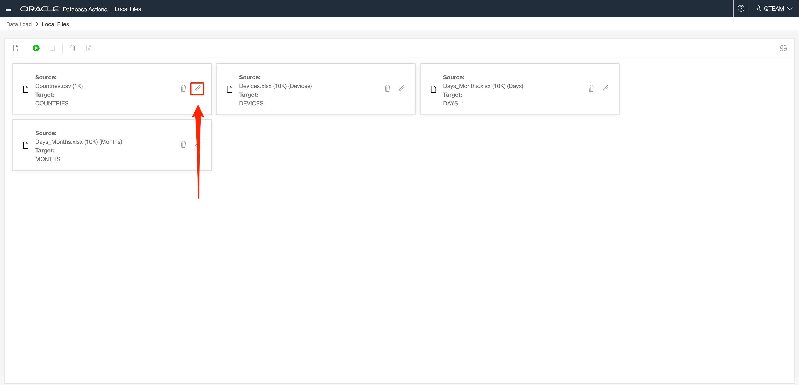
5. In the bar on the left, there are links for Settings, File, Table, and an Error Log. This screenshot shows the **Settings** page. Observe that this shows the structural information and intelligent default values that data wizard has created from simply looking at the file.
  
6. How does it do this? Most csv files contain structural information about the data within the file in the first row. Notice that there is a tick box selected, **Get from file header**. 
  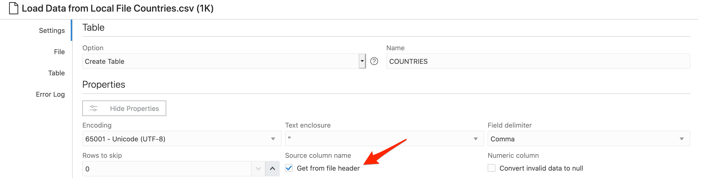
7. This has allowed the data loading wizard to discover that your data file contains two columns of data: **COUNTRY** and **CONTINENT**. The default table name has based derived from the filename. Click the drop-down menu under **Option.**
  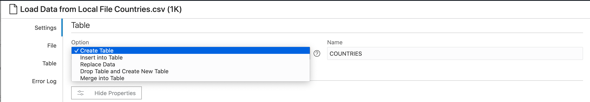
8. Notice that various operations are supported. For this part of the lab, accept the default option,  **Create Table**. 
  > **Note:**  If you look back at the previous section where you loaded the movie sales data for 2020, you will remember that you had to create your movie\_sales\_fact table before you could load your data files. This wizard creates the table for you during the data load process! Notice also that the wizard has automatically mapped the columns. Column mapping looks sensible, both in terms of column names and data types.

9. Click **Close**  in the bottom right to return to the Data Load card and then click the **green button** in the menu panel to start the Data Load job.
  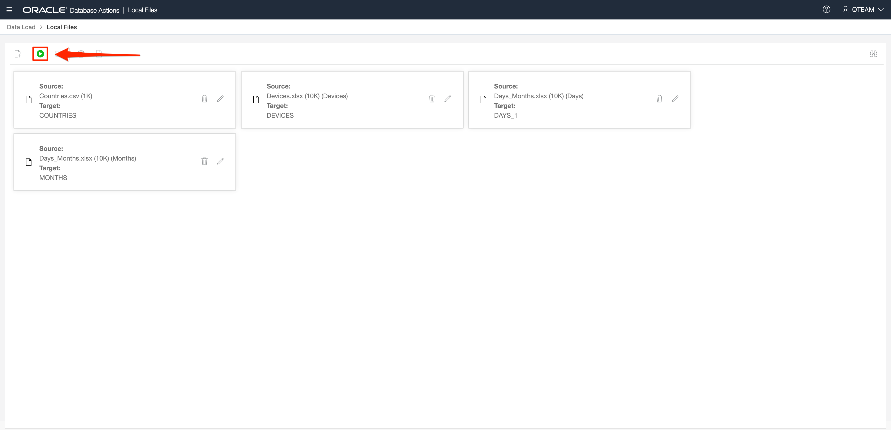
  The time taken to load each file depends on factors including file size and network speed. The progress of the job can be monitored from the status bar and the ring to the left of each job card. When the ring is complete, the file has uploaded successfully. 
  

Now let's inspect the tables that were automatically created during the data load process.

### Inspect Your New Data

10. To access the data explorer tool, click the **Data Load** breadcrumb at the upper left of your screen:
  
11. Then click the **EXPLORE** card on the main data loading page.
  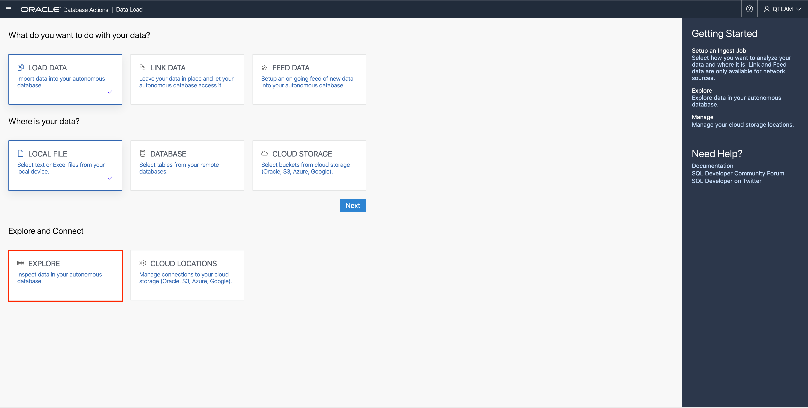
12. This brings up a list of the Tables and Views in this schema of the Autonomous Database. At this stage, all you see are the four tables you just loaded.
  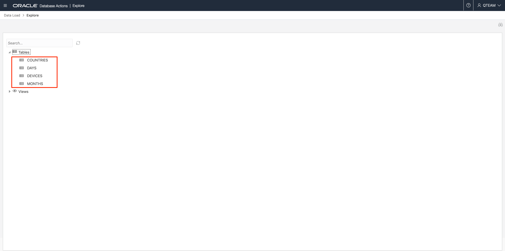
13. Click the table **COUNTRIES** and a data preview panel will appear that will allow you to review the data you just loaded. Note that this is a relatively simple table containing a list countries and their continents. 
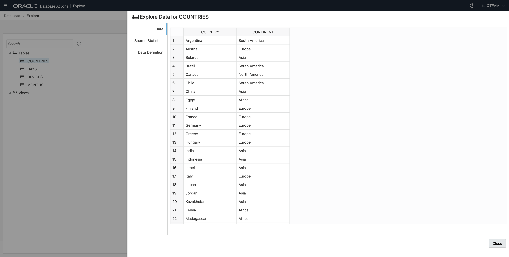
14. Click the **Close** button in the bottom right corner.

### RECAP: Loading Data from Local Files

In this part of the workshop, you used the new data loading tool to quickly load data into your data warehouse from three local data files simply by dragging and dropping them onto the Data Load canvas. One file was in CSV format and the other two were Excel spreadsheets. One of the spreadsheets contained two worksheets and each one was loaded into its own table. The data loading process automatically created a target table containing the appropriate column structures based on the data within each file.

In a few clicks, you were able to define and load data into four new tables without having to write any SQL code. It was all done with a few mouse clicks.

## Task 4: Load Data from Object Store

In the previous exercise, you loaded data from files that you located on your local computer. In this part of the lab, you are going to load some more data, but this time using a file which is in the Oracle Object Store. There are two parts to this process, and the first part only needs to be performed once. The two parts are:

1. Set up connection to the Oracle Object Store.
2. Load the file.

### Set Up Cloud Location

1. To begin this process, you need to navigate back to the **Data Load** page. From the **Explore** page, click the **Data Load** breadcrumb at the top left corner of the page:
  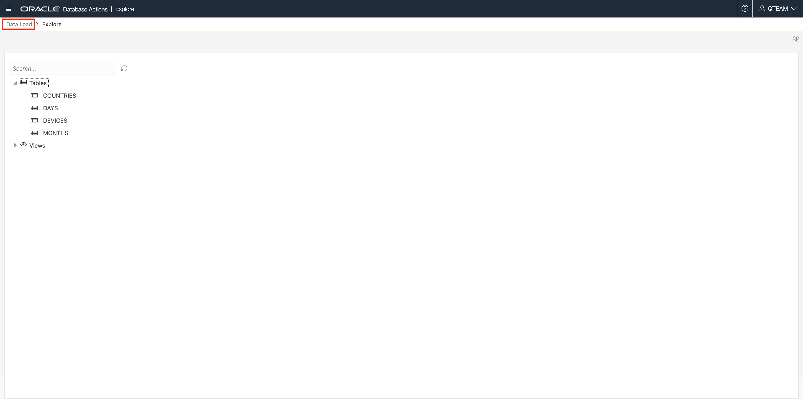
2. On the **Data Load** main page, click the **Cloud Locations** card so you can define a new connection to your object store.
  
3. Click the **Add Cloud Storage** button on the upper right and define a Cloud Storage location as follows:

    <table class="wrapped relative-table confluenceTable" style="width: 100.0%;"><colgroup> <col style="width: 9.19509%;"/> <col style="width: 12.019421%;"/> <col style="width: 45.07344%;"/> <col style="width: 33.71451%;"/> </colgroup><tbody><tr><th colspan="1" class="confluenceTh">Field</th><th colspan="1" class="confluenceTh">Your Region</th><th colspan="1" class="confluenceTh">Value</th><th colspan="1" class="confluenceTh">Notes</th></tr><tr><td class="confluenceTd">Name</td><td colspan="1" class="confluenceTd"></td><td class="confluenceTd">MOVIE_SALES</td><td colspan="1" class="confluenceTd">Lower case names not currently supported</td></tr><tr><td class="confluenceTd">Description</td><td colspan="1" class="confluenceTd"></td><td class="confluenceTd">Movie Sales</td><td colspan="1" class="confluenceTd"></td></tr><tr><td rowspan="4" class="confluenceTd">URI + Bucket</td><td colspan="1" class="confluenceTd">Europe, Middle East, Africa</td><td class="confluenceTd">https://objectstorage.uk-london-1.oraclecloud.com/n/dwcsprod/b/MovieStream/o/</td><td rowspan="4" class="confluenceTd">Choose the closest location </td></tr><tr><td colspan="1" class="confluenceTd">Americas</td><td colspan="1" class="confluenceTd">https://objectstorage.us-phoenix-1.oraclecloud.com/n/dwcsprod/b/MovieStream/o/</td></tr><tr><td colspan="1" class="confluenceTd">Japan</td><td colspan="1" class="confluenceTd">https://objectstorage.ap-tokyo-1.oraclecloud.com/n/dwcsprod/b/MovieStream/o/</td></tr><tr><td colspan="1" class="confluenceTd">Asia &amp; Oceania</td><td colspan="1" class="confluenceTd">https://objectstorage.ap-mumbai-1.oraclecloud.com/n/dwcsprod/b/MovieStream/o/</td></tr><tr><td class="confluenceTd">Credential</td><td colspan="1" class="confluenceTd"></td><td class="confluenceTd">No credential</td><td colspan="1" class="confluenceTd">Make sure the radio button is switched on to indicate the no credential is needed</td></tr></tbody>
    </table>

    

  Your completed form should look like the one above. When you have completed these details, click **Create**.

### Load Data Files from A Cloud Storage Location

4. Navigate back to the main Data Load page again using the breadcrumb link. Click the two cards for  **Load Data**  from  **Cloud Storage **and then click the blue **Next** button. 
  
5. Now you see a file browser-like view of your Object Store. Locate the file **Movie\_Sales\_2020.csv** in the left part of the screen. Click and drag this file onto the canvas on the right. 
  
6. As before, you can edit the properties of your new data load job by clicking the **pencil** button on the right-hand side of the card. 
  
7. You can use this page to quickly review the properties sheet and make any changes to column names or data types. As soon as you are satisfied with the format, you can close the form and then click the **green arrow** button to start your data load job. 
  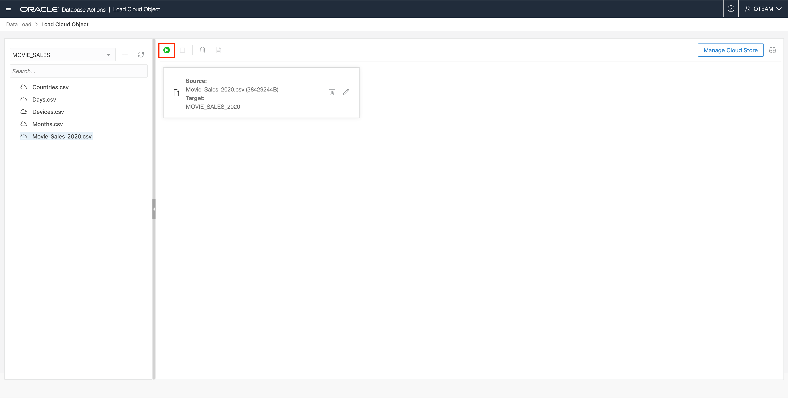

### Inspect Data In Table MOVIE\_SALES\_2020

8. Navigate to the **Data Load** main page and click the **Explore** card. You'll now see table MOVIE\_SALES\_2020 has been loaded into your Autonomous Data Warehouse.
9. Click this table and then click **Source Statistics** on the panel to the left of the screen. Statistics help you quickly understand the structure and content of the table. In this case, this data presents a nice simple way to characterize the data you've just loaded. 
  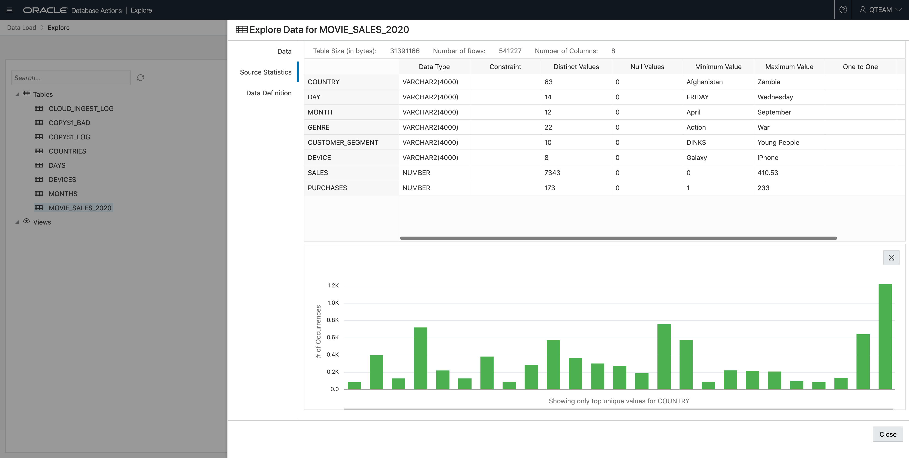

### Identify Data Problems

10. Click on the word **DAY** in the first column. You can see that there are 14 distinct values - which looks odd. The low value is **FRIDAY** (i.e. it's all uppercase) and the high value is **Wednesday**, which is in title case. The distribution of these values is shown in the bar chart at the bottom of the form (see the image above). As you move your mouse across these bars, you can see there are two separate bars for each day: one in uppercase and the other in title case.
11. You can also see that you have data for twelve months. This should not be a surprise, since the data extract you loaded in the previous step was for 2020. However, for your quarterly reporting project, it's obvious that you have too many months: your mission here is to analyze data only for Q2. 
12. Right now, simply take a note of these issues. You will address these issues in a later stage of the workshop. 

## Task 5: Load Reference Data from Object Store

 **Important**: If you succeeded in loading the four reference tables, COUNTRIES, DAYS, DEVICES and MONTHS from local disk, you should skip ahead to **RECAP**.

This section is provided in case your workshop environment does not allow you to download files to your local machine. If you're unable to do this, of course you will have been unable to complete the previous section, **Load Data from Local Files**. You still need the reference data for subsequent tasks of the lab, and if you are in this situation, you should complete the following steps.

1. To load the reference tables from object storage, navigate to the **Data Load** main page. Select the cards for **Load Data** from **Cloud Storage** and click **Next**.
  
2. Select the four files: **Countries.csv**, **Days.csv**, **Devices.csv** and **Months.csv**. Drag-and-drop them on the **Data Loading** area, as shown below.
  
3. Four cards will appear on the data loading area: one for each source file / target table combination. Click the green **Start** button. 
  
4. Then click **Run** in the dialog that appears.
  
5. When the job has completed, you'll see check marks on the left of each card to indicate that the data has loaded successfully.
  

### **Notes**:

1. Autonomous Database supports uploading of .xlsx files from local disk, but not from Object Stores. Only .csv files are currently supported.
2. Autonomous Database does not currently support loading files from sub-folders in Object Stores.

### Clean Up Data Load Log Tables

During data load from Object Storage, Autonomous Data Warehouse creates a number of ancillary tables for logging purposes.

6. Following data load from Object Storage, if you click the **Explore** card on the **Data Load** main page, it may look like this: 
  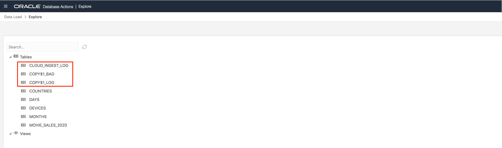
7. Three such logging tables are highlighted above. There may be more than one table with names beginning with COPY$. Following the successful load operations, these tables are no longer required, and can safely be dropped. You'll do this using a SQL Worksheet. Navigate to this tool directly from the hamburger menu at the top left, open the Development menu if necessary, and press **SQL**.
  
8. Drop the tables as follows:

    a. Click the **refresh** button (circular arrows) to see the full list of tables in the schema and identify the logging tables.

    b. For each table type, drop table {TABLE NAME} in the SQL Worksheet.

    c. Click the green **Run** button.

    d. Confirm the successful deletion in the Script Output pane.
  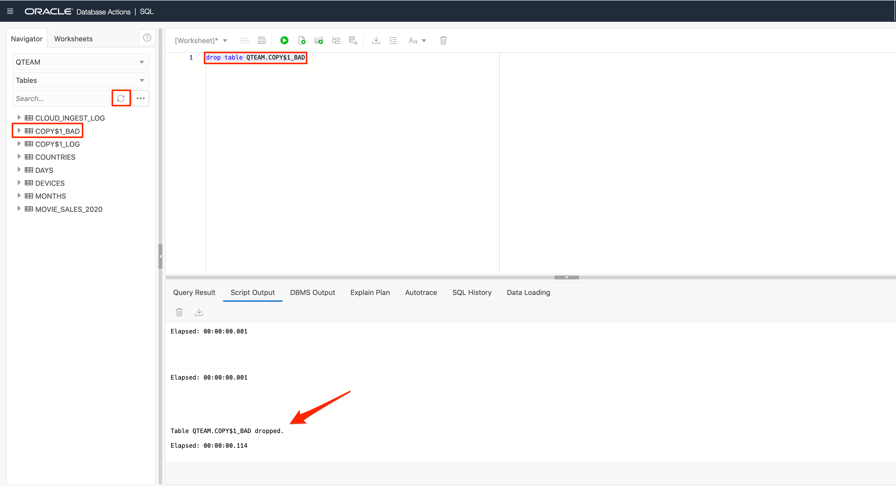

### RECAP

In this section, you loaded data into your ADB from files both on your local computer and in the object store. In both cases, this was simply a matter of dragging and dropping. Inspection of the data in table MOVIE\_SALES\_2020 identified two problems:

- You have too much data: Movie consumption for all of 2020, whereas you only want data for Q2.
- Column DAY contains values that are both in upper case and title case. 

You will correct these data problems in the next task of the workshop. 

## Want To Learn More

See the documentation on [Database Actions](https://docs.oracle.com/en/database/oracle/sql-developer-web/sdwad/about-sdw.html#GUID-AF7601F9-7713-4ECC-8EC9-FB0296002C69).

## Acknowledgements

- Created By/Date - Patrick Wheeler, Product Management, Autonomous Database, March 2021
- Contributors - Keith Laker, Rick Green, Nilay Panchal, Hermann Baer
- Last Updated By - Arabella Yao, August 2021
