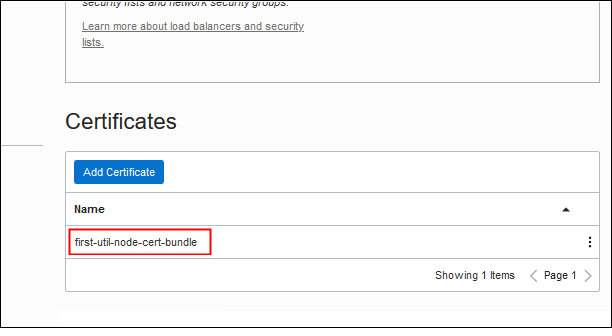

#  Use a Load Balancer to Access Services on Big Data Service (HA Cluster)

<!-- #  Use a Load Balancer to Access Services on Big Data Service (Non-HA Cluster)-->

## Introduction

In this lab, you'll create a load balancer to be used as a front end for accessing Cloudera Manager, Hue, and Oracle Data Studio on your highly-available (HA) Big Data Service cluster.

When you've completed the lab, you'll be able to open the consoles for those services by using the IP address (or hostname) of the load balancer, plus the port number used by the service. (Each service listens on a specific port.) For example, if the IP address of the load balancer is `10.2.0.2`, and Cloudera Manager listens on port `7183`, you can open Cloudera Manager by entering `https://10.2.0.2:7183` in your web browser. Hue listens on port `8889`, so you can open Hue by entering `https://10.2.0.2:8889`.

Typically, a load balancer is used  to spread workloads across multiple mirrored servers, to optimize resource usage and to ensure high-availability. However, this lab tells you how to use a load balancer to direct traffic to specific services running specific servers (that is, Big Data Service nodes). Cloudera Manager runs on the first utility node of a non-HA cluster, and Hue and Data Studio run on the second utility node. The load balancer you create in this lab handles traffic on both nodes. (In a non-HA cluster, all three services run on the first utility node.)

One advantage of using a load balancer is that you can configure it to use the Secure Sockets Layer (SSL) protocol to secure traffic to and from the services on your cluster. <!--SSL is a protocol used to ensure privacy, authentication, and data security in internet communications.--> SSL encrypts and decrypts transmitted data, ensures that the sender and receiver of data are who they claim to be, and signs the data to verify its integrity.  In this lab, you'll implement end-to-end SSL, so the load balancer will accept SSL encrypted traffic from clients and encrypt traffic to the cluster.

SSL uses *certificates* and *keys* to implement its security features. For highest security on a production system, you should obtain them from a trusted SSL certificate authority like IdenTrust or DigiCert. However, Big Data Service includes self-signed certificates and keys which you can use for learning and testing. The instructions in this lab tell you how to use those included files.

Estimated Lab Time: 75 minutes

### Objectives

In this lab, you will:

* Create an Oracle Cloud Infrastructure load balancer for an existing Big Data Service HA  cluster.

<!-- * Create an Oracle Cloud Infrastructure load balancer for an existing non-HA Big Data Service cluster.-->

* Configure the load balancer to function as a front end for connecting to Cloudera Manager, Hue, and Big Data Studio on the cluster.

* Implement end-to-end SSL encryption for the load balancer. You'll use the self-signed SSL certificates that are included with the cluster.

**Note:** If you want to create a load balancer for an non-HA cluster, see the [Use a Load Balancer to Access Services on Big Data Service (non-HA Cluster)](https://bgelernt.github.io/learning-library/data-management-library/big-data/bds-load-balancer/workshops/freetier/?qa=true?lab=use-load-balancer-access-services-on-big/?qa=true&lab=use-load-balancer-access-services-on-big) lab.  If you want to use SSL certificates from a trusted certificate authority, see [Use a Load Balancer to Connect to Services on a Cluster](https://docs.oracle.com/en/cloud/paas/big-data-service/user/use-load-balancer-connect-cluster.html) in *Using Big Data Service*.

### What Do You Need?

* This workshop requires an Oracle Cloud account. You may use your own cloud account or you can get a Free Trial account as described in the <!-- Prerequisites--> **Get Started with Oracle Cloud** lab in the **Contents** menu. <!-- FIND OUT ABOUT RENAMING THAT TO "GET STARTED WITH ORACLE CLOUD"-->

* Any operating system command shell containing Secure Shell (SSH) and Secure Copy (SCP). This lab assumes you're using a recent installation of Windows, such as Windows 10, which includes Windows PowerShell, `ssh`, and `scp`.

    * An **Oracle Cloud Infrastructure environment** with a **Virtual Cloud Network (VCN)**, a **public subnet**, appropriate **security rules**, and a **Big Data Service non-HA cluster**. The fastest way to set up the environment for this lab is to complete the  [Getting Started with Oracle Big Data Service (HA Cluster)](https://oracle.github.io/learning-library/data-management-library/big-data/bds/workshops/freetier/?lab=introduction-oracle-big-data-service)  workshop. Specifically, you must complete the following labs in that workshop:

      * **Lab 1: Set Up Your BDS Environment**
      * **Lab 2: Create a BDS Hadoop Cluster**
      * **Lab 4: Access a BDS Node Using a Public IP Address**

    Once you've completed those labs, you can start with **STEP 1: Gather Information**, below.

If you choose not to complete the [Getting Started with Oracle Big Data Service (HA Cluster)](https://oracle.github.io/learning-library/data-management-library/big-data/bds/workshops/freetier/?lab=introduction-oracle-big-data-service) workshop as described above, you must create and configure:

<!-- If you don't complete the [Getting Started with Oracle Big Data Service (Non-HA Cluster)](https://oracle.github.io/learning-library/data-management-library/big-data/bds-non-ha/workshops/freetier/?lab=introduction-oracle-big-data-service) workshop, you must create and configure:-->

* An **Oracle Big Data Service HA cluster** running in a **VCN** with an internet gateway and a public regional subnet (for a public load balancer).  See [Set Up Oracle Cloud Infrastructure for Oracle Big Data Service](https://docs-uat.us.oracle.com/en/cloud/paas/big-data-service/user/set-oracle-cloud-infrastructure-oracle-big-data-service.html) and [Create a Cluster](https://docs.oracle.com/en/cloud/paas/big-data-service/user/create-cluster.html) in *Using Big Data Service*.

<!--* A **non-HA Oracle Big Data Service cluster** running in a **VCN** with an internet gateway and a public regional subnet (for a public load balancer). See [Set Up Oracle Cloud Infrastructure for Oracle Big Data Service](https://docs-uat.us.oracle.com/en/cloud/paas/big-data-service/user/set-oracle-cloud-infrastructure-oracle-big-data-service.html) and [Create a Cluster](https://docs.oracle.com/en/cloud/paas/big-data-service/user/create-cluster.html) in *Using Big Data Service*.-->

* **Security rules** that allow incoming traffic on the ports where services run in the cluster: Cloudera Manager (port 7183), Hue (port 8889), and Big Data Studio (port 30000). See [Create Ingress Rules \(Open Ports\)](https://docs.oracle.com/en/cloud/paas/big-data-service/user/define-security-rules.html#GUID-CE7BE686-4047-4DAA-BCE7-3B46BABC321F) in *Using Big Data Service*.

* **Administrative access** to manage load balancers.  See "Let network admins manage load balancers" in [Common Policies](https://docs.cloud.oracle.com/en-us/iaas/Content/Identity/Concepts/commonpolicies.htm) in the Oracle Cloud Infrastructure documentation.

* An **SSH key pair**. The key pair must include the private key that was associated with the cluster when it was created. In the steps below, the sample key pair files are named `my-ssh-key` (the private key) and `my-ssh-key.pub` (the public key used when the cluster was created). See [Create a Cluster](https://docs.oracle.com/en/cloud/paas/big-data-service/user/create-cluster.html) in *Using Oracle Big Data Service* and [Creating a Key Pair](https://docs.cloud.oracle.com/en-us/iaas/Content/GSG/Tasks/creatingkeys.htm?Highlight=ssh%20key#CreatingaKeyPair) in the Oracle Cloud Infrastructure documentation.

* **Access to the cluster file system** (via SSH). You must be able to connect directly to the first and second utility nodes on your cluster. To do this, prior to creating a load balancer, you must set up your environment to allow that access. For example you can use Oracle FastConnect or Oracle IpSec VPN, you can set up a bastion host, or you can map private IPs to public IP addresses. See  [Establish Connections to Nodes with Private IP Addresses](https://docs.oracle.com/en/cloud/paas/big-data-service/user/establish-connections-nodes-private-ip-addresses.html) in *Using Big Data Service*.

<!--  In this lab, the sample IP addresses are `10.2.0.101` (first utility node) and `10.2.0.102` (second utility node). Your IP addresses will be different.-->

<!-- In this lab, the sample IP addresses is `10.2.0.101` (first utility node). Your IP address will be different.-->

## **STEP 1:** Gather Information

Gather the following information before you start:


   | Information | Where To Find It |
| :--- | :--- |
| SSH private key file | The name and location of the SSH private key file that is paired with with the SSH public key associated with the cluster. <br><br>In the examples shown in this lab, the SSH key pair is `my-ssh-key` (the  private key) and `my-ssh-key.pub` (the public key that was associated with the cluster when it was created). In the examples below, the private key is located in `C:\Users\MYHOME\bds\ssh\`.|
| Target location for downloading SSL files | A location on your local computer for saving downloaded SSL files. You'll retrieve these files later, when creating the load balancer.|
|IP Addresses of the first and second utility nodes |The accessible IP address of the first utility node, which is where Cloudera Manager runs, and the accessible IP address of the second utility node, where Hue and Big Data Studio run. <br><br>If you followed the steps in the [Getting Started with Oracle Big Data Service (HA Cluster)](https://oracle.github.io/learning-library/data-management-library/big-data/bds/workshops/freetier/?lab=introduction-oracle-big-data-service) workshop, these are the public IP addresses that you mapped to the nodes' private IP addresses. <br><br>If you're using a bastion host, Oracle FastConnect, or Oracle IPSec VPN, find the IP addresses of the nodes assigned via those solutions.|

<!--  | Information | Where To Find It |
| :--- | :--- |
| SSH private key file | The name and location of the SSH private key file that is paired with with the SSH public key associated with the cluster. <br><br>In the examples shown in this lab, the SSH key pair is `my-ssh-key` (the  private key) and `my-ssh-key.pub` (the public key that was associated with the cluster when it was created). In the examples below, the private key is located in `C:\Users\MYHOME\bds\ssh\`.|
| Target location for downloading SSL files | A location on your local computer for saving downloaded SSL files. You'll retrieve these files later, when creating the load balancer.|
|IP Addresses of the first and second utility nodes |The accessible IP address of the first utility node, which is where Cloudera Manager, Hue, and Big Data Studio run. <br><br>If you followed the steps in the [Getting Started with Oracle Big Data Service (Non-HA Cluster)](https://oracle.github.io/learning-library/data-management-library/big-data/bds-non-ha/workshops/freetier/?lab=introduction-oracle-big-data-service) workshop, these are the public IP addresses that you mapped to the nodes' private IP addresses. <br><br>If you're using a bastion host, Oracle FastConnect, or Oracle IPSec VPN, find the IP addresses of the nodes assigned via those solutions.| -->


## **STEP 2:** Copy SSL Certificates from the Cluster

In this step, you'll obtain the self-signed SSL certificates that were automatically created with your cluster.

You'll copy the following certificate and key from the _first_ utility node:

  * `/opt/cloudera/security/x509/`_&lt;first\_utility\_node\_certificate&gt;_`.pem`

  * `/opt/cloudera/security/x509/node.hue.key`

And you'll copy the following certificate and key from the _second_ utility node:

  * `/opt/cloudera/security/x509/`_&lt;second\_utility\_node\_certificate&gt;_`.pem`

  * `/opt/cloudera/security/x509/node.hue.key`

To copy the files:

1. On the Windows taskbar, right-click the Windows **Start** button and select **Windows PowerShell**.

  

  **Note:** If you use a Virtual Private Network (VPN), you may need to disconnect from VPN before using PowerShell to connect to your cluster. Re-establish your VPN connection when you move on to **STEP 3: Create the Load Balancer,** below.

2. In PowerShell, use `ssh` with your private key to connect to the first utility node:

      ```
    PS C:\Users\MYHOME\> <copy>ssh -i <private-ssh-key> opc@<first-util-node-ip></copy>
      ```
    For example, if you're working from `C:\Users\MYHOME`, your private key file `my-ssh-key` is in `C:\Users\MYHOME\bds\ssh`, and the accessible IP address of the first utility node of your cluster is `10.2.0.101`, enter:

      ```
    PS C:\Users\MYHOME\> <copy>ssh -i ./bds/ssh/my-ssh-key opc@10.2.0.101</copy>
    Last login: Tue Nov 10 17:59:41 2020 from some-host
    [opc@myclustun0 ~]$

      ```

      Notice that the name of the first utility node is shown in the Linux prompt. In the example above, it's `myclustun0`.

3. At the Linux prompt, list the contents of ``/opt/cloudera/security/x509/``, which is the directory that contains the SSL files on the node. For example:

      ```
    [opc@myclustun0 ~]$ <copy>ls /opt/cloudera/security/x509/</copy>
    agents.pem
    hostname.key
    hostname.pem
    hue.pem
    node_myclustmn0.sub12345678901.myclustevcn.oraclevcn.com.pem
    node_myclustmn1.sub12345678901.myclustevcn.oraclevcn.com.pem
    node_myclustun0.sub12345678901.myclustevcn.oraclevcn.com.pem
    node_myclustun1.sub12345678901.myclustevcn.oraclevcn.com.pem
    node_myclustwn0.sub12345678901.myclustevcn.oraclevcn.com.pem
    node_myclustwn1.sub12345678901.myclustevcn.oraclevcn.com.pem
    node_myclustwn2.sub12345678901.myclustevcn.oraclevcn.com.pem
    node.cert
    node.hue.key
    node.key
    ssl.cacerts.pem
    ssl.private.key
      ```

4. Copy and save the file *names* of the PEM files for the first and second utility nodes. You can identify them by looking at the first part of the names, where ``<cluster>`` is the first seven letters of the cluster name and `un0` and `un1` identify the nodes. For example, on a cluster named `mycluster`:

    * `node_myclust`**`un0`**`.sub12345678901.myclustevcn.oraclevcn.com.pem` (first utility node)
    * `node_myclust`**`un1`**`.sub12345678901.myclustevcn.oraclevcn.com.pem` (second utility node)

    You'll use these names in the following steps, when you issue commands to download the files.

5. At the Linux prompt, type `exit` to disconnect from the cluster.

6. Remain in PowerShell, and use the `scp` command to copy the SSL certificate from the first utility node  (`node0`) to a ``<target>`` location on your computer. For convenience later, copy the file to an easily recognizable name, with a `.pem` filename extension:

      ```
    PS C:\Users\MYHOME\> <copy>scp -i <ssh-private-key> opc@<first-util-node-ip-address>:/opt/cloudera/security/x509/<ssl-cert-file-name> <target-dir/filename></copy>
      ```

      For example, if you're in your `C:\Users\MYHOME` directory, you want to copy the file to your `C:\Users\MYHOME\bds\ssl\` directory, and you want to rename the file to `first-util-node-cert.pem`, enter the following:

      ```
    PS C:\Users\MYHOME\> <copy>scp -i ./bds/my-ssh-key opc@10.2.0.101:/opt/cloudera/security/x509/node_myclustun0.sub12345678901.myclustevcn.oraclevcn.com.pem ./bds/ssl-files/first-util-node-cert.pem</copy>
      ```

      Notice that the IP address is for the first utility node. In this example, it's  `10.2.0.101`.

7. Copy the SSL certificate from the second utility node (`node1`):  

      ```
    PS C:\Users\MYHOME\> <copy>scp -i <ssh-private-key> opc@<second-util-node-ip-address>:/opt/cloudera/security/x509/<ssl-cert-file-name> <target-dir/filename> </copy>
      ```

      For example:

      ```
    PS C:\Users\MYHOME\> <copy>scp -i ./bds/my-ssh-key opc@10.2.0.102:/opt/cloudera/security/x509/node_myclustun1.sub12345678901.myclustevcn.oraclevcn.com.pem ./bds/ssl-files/second-util-node-cert.pem</copy>
      ```

      Notice that the IP address is for the second utility node. In this example, it's  `10.2.0.102`.

      **Note** You could have copied both certificate files from either the first or second utility nodes, because the SSL certificate files for all the nodes are stored on all the nodes. However, in the next two steps, you must copy the key file for the first utility node from the first utility node and the key file for the second utility node from the second utility node.

8. Copy the SSL key file (named `node.hue.key`) for the first utility node to a ``<target>`` location on your computer. For convenience later, copy the file to an easily recognizable name, with a `.key` filename extension.  

      ```
    PS C:\Users\MYHOME\> <copy>scp -i <ssh-private-key> opc@<first-util-node-ip-address>:/opt/cloudera/security/x509/node.hue.key <target-dir/filename></copy>
      ```

      For example:

      ```
    PS C:\Users\MYHOME\> <copy>scp -i ./bds/my-ssh-key opc@10.2.0.101:/opt/cloudera/security/x509/node.hue.key ./bds/ssl-files/first-util-node.key</copy>
      ```

9. Copy the SSL key file  (also named `node.hue.key`) for the second utility node:  

      ```
    PS C:\Users\MYHOME\> <copy>scp -i <ssh-private-key> opc@<second-util-node-ip-address>:/opt/cloudera/security/x509/node.hue.key <target-dir/filename></copy>
      ```

      For example:

      ```
    PS C:\Users\MYHOME\> <copy>scp -i ./bds/my-ssh-key opc@10.2.0.102:/opt/cloudera/security/x509/node.hue.key ./bds/ssl-files/second-util-node.key</copy>
      ```

      Notice that the IP address is for the second utility node. In this example, it's `10.2.0.102`.

10. List your downloaded files to make sure the files were downloaded appropriately, for example:

      ```
    PS C:\Users\MYHOME\> <copy>ls</copy> ./bds/ssl-files

    Directory: C:\Users\MYHOME\ssl-files

    Mode      LastWriteTime            Length Name
    ----      -------------  ------    ----
    -a----    11/17/2020     9:21 AM   1285 first-util-node-cert.pem
    -a----    11/17/2020     9:30 AM   1675 first-util-node.key
    -a----    11/17/2020     9:32 AM   1285 second-util-node-cert.pem
    -a----    11/17/2020     9:32 AM   1675 second-util-node.key   
      ```

11. Close Windows PowerShell.

## **STEP 3:** Create the Load Balancer

1. On the Oracle Cloud Console banner at the top of the page, open the navigation menu . Under **Core Infrastructure**, point to **Networking**, and then click **Load Balancers**.

    

2. On the **Load Balancers in *&lt;compartment&gt;* Compartment** page, under **Compartment** in the panel on the left, select the compartment containing your cluster. Then click **Create Load Balancer**.

    

3. On the **Add Details** page of the **Create Load Balancer** wizard, enter the following information:

    * **Load Balancer Name:** Enter a name to identify the load balancer; for example, `bds-load-balancer`.

    * **Choose Visibility Type:** Click **Public** to create a load balancer that will be accessible from the public internet.

    * **Assign a public IP address** Click **Ephemeral IP Address** to have an ephemeral IP address assigned to the load balancer. When the load balancer is deleted, this IP address will return to the pool of available IP addresses in the tenancy.

    * **Choose Total Bandwidth:** Accept the default **Small**.

    * **Virtual Cloud Networking in *&lt;compartment&gt;*:** Click the **Select a virtual cloud network** list and select the VCN where your cluster is running. If the network is in a different compartment, click **Change Compartment** and select the compartment from the list.

     * **Subnet in *&lt;compartment&gt;*:** Click the **Select a subnet** list and select a public subnet in your VCN to use for the load balancer. (A public subnet is required for a public load balancer.) If the subnet is in a different compartment, click **Change Compartment** and select the compartment from the list.

     * **Use network security groups to control traffic:** Leave this box unchecked.

    

4. Click **Next**.

5.  On the **Choose Backends** page of the wizard, enter the following information to create a backend set for Cloudera Manager:

    * **Specify a Load Balancing Policy:** Accept the default **Weighted Round Robin**.

    * **Select Backend Servers:** Skip this option. You'll add a backend server later.

    * **Specify Health Check Policy:** Enter the following for the health check policy for this Cloudera Manager backend set:

        * **Protocol:** Select **HTTP**.

        * **Port:** Enter **7183**, which is the port on which Cloudera Manager listens.

        * **URL Path (URI):** Keep the default forward slash (**/**).

        * **Use SSL:** Leave this box unchecked. You'll configure SSL for this backend set later.

        

6. Click **Next**.

7. On the **Configure Listener** page of the wizard, enter the following information:

    * **Listener Name:** Enter a name for the listener for Cloudera Manager; for example, **`cm-listener`**.

    * **Specify the type of traffic your listener handles:** Select **HTTP**. You'll change this to HTTPS later.

    * **Specify the Port Your Listener Monitors for Ingress Traffic**: Enter **7183**.

    

8. Click **Submit**. When the large load balancer status icon at the top of the **Load Balancer Details** page is green and says "Active," you can continue with the steps below. It may take a few minutes to create the load balancer.

  

## **STEP 4:** Create Certificate Bundles

In this step, you'll create certificate bundles with the SSL certificate and key files that you downloaded in **STEP 2: Copy SSL Certificates from the Cluster**. You'll create one bundle for the first utility node and one for the second utility node. You'll use these later to configure SSL for backend sets and listeners.  

1. On the left side of the **Load Balancer Details** page, under **Resources**, click **Certificates** and then click **Add Certificate**.

  

2. On the **Add Certificate** page, enter the following information:

    * **Certificate Name:** Enter `first-util-node-cert-bundle` (or a name of your choice).

    * **SSL Certificate:** In the **SSL Certificates** box, click the **select one** link, find and select the SSL certificate you downloaded from the first utility node; for example, `first-util-node-cert.pem` in `C:\Users\MYHOME\bds\ssl-files`, and click **Open**.

      **Note:** If you don't see all your `.pem` and `.key` files in the directory where you saved them in **STEP 2: Copy SSL Certificates from the Cluster**, above, make sure that all files types are displayed in the Windows **File Upload** dialog box by selecting **All Files (\*.\*)** from the list above the **Open** button.

      

    * **Specify CA Certificate:** Check this box, and then click the **select one** link to add the same file that you just added for **SSL Certificate**, above; for example, `first-util-node-cert.pem`.

    * **Specify Private Key**: Check this box, and then click the **select one** link to add the SSL key you downloaded from the first utility node; for example, `first-util-node.key`.

    

3. Click **Add Certificate**, and then click **Close** in the **Work Request Submitted** dialog box. It may take a few moments for the bundle to be added to the **Certificates** table at the bottom of the **Certificates** page.

    

    **Note:** If you get an error that the certificate and key files don't match, check to make sure that you added the PEM and KEY files that you downloaded from the same (first) utility node.

4. Remain on the **Certificates** page. Click **Add Certificate** again, and then on the **Add Certificate** page, enter the following information:

    * **Certificate Name:** Enter `second-util-node-cert-bundle` (or a name of your choice).

    * **SSL Certificate:** In the **SSL Certificates** box, click the **select one** link, find and select the SSL certificate you downloaded from the second utility node; for example, `second-util-node-cert.pem`, and click **Open**.

    * **Specify CA Certificate:** Check this box, and then add the same file that you just added for **SSL Certificate**, above.

    * **Specify Private Key**: Check this box, click the **select one** link, find and select the SSL key you downloaded from the second utility node; for example, `second-util-node.key`, and click **Open**.

5. Click **Add Certificate**, and then click **Close** in the **Work Request Submitted** dialog box. It may take a few moments for the bundle to be added to the **Certificates** table.

## **STEP 5:** Configure the Backend Set for Cloudera Manager

1. On the left side of the **Certificates** page, under **Resources**, click **Backend Sets**. The backend set you created in **STEP 3: Create the Load Balancer** is displayed in the **Backend Sets** table, with a name like **`bs_lb_<date-timestamp>`**; for example, **bs\_lb\_2020-1117-1226**. Click the **Action**  menu at the end of the row containing this backend set, and select **Edit**.

    

3. On the **Edit Backend Set** page, enter the following information.

    * **Name:** Read only. This name was created for you by the wizard.

    * **Traffic Distribution Policy:** Accept the default **Weighted Round Robin**.

    * **Use SSL:** Select this box. Then, under **Certificate Name**, select the bundle you created with the self-signed SSL certificate for the first utility node; for example, **first-util-node-cert-bundle**.

    * **Verify Peer Certificate:** Check this box.

    * **Verify Depth:** Set to **1**.

    * **Session Persistence:** Accept the default **Disable Session Persistence**.

    

4. Click **Update Backend Set**, and then click **Close** in the **Work Request Submitted** dialog box. When complete, a cipher suite name is added to the **Cipher Suite** field for the backend set. It may take a few moments.


    

## **STEP 6:** Create a Backend Set for Hue

1. Remain on the **Backed Sets** page and click **Create Backend Set**. On the **Create Backend Set** page, enter the following information.

    * **Name:** Enter a name; for example, **`hue-backend-set`**.

    * **Traffic Distribution Policy:** Accept the default **Weighted Round Robin**.

    * **Use SSL:** Select this box. Then, under **Certificate Name**, select the bundle you created with the self-signed SSL certificate for the second utility node; for example, **second-util-node-cert-bundle**.

    * **Verify Peer Certificate:** Check this box.

    * **Verify Depth:** Set to **1**.

    * **Session Persistence:** Accept the default **Disable Session Persistence**.

    * **Health Check:** Enter the following information:

        * **Protocol:** Select **TCP**.

        * **Port:** Enter **`8889`**, which is the port on which Hue listens.

    

2. Click **Create Backend Set**, and then click **Close** in the **Work Request Submitted** dialog box. It may take a few moments for the backend set to be added to the **Backend Sets** table.

## **STEP 7:** Create a Backend Set for Big Data Studio

1. Remain on the **Backend Sets** page and click **Create Backend Set** again. On the **Create Backend Sets** page, enter the following information.

    * **Name:** Enter a name; for example, **`data-studio-backend-set`**.

    * **Traffic Distribution Policy:** Accept the default **Weighted Round Robin**.

    * **Use SSL:** Select this box, then, under **Certificate Name**, select the bundle you created with the self-signed SSL certificate for the second utility node; for example,  **second-util-node-cert-bundle**.

    * **Verify Peer Certificate:** Check this box.

    * **Verify Depth:** Set to **1**.

    * **Session Persistence:** Accept the default **Disable Session Persistence**.

    * **Health Check:** Enter the following information:

        * **Protocol:** Select **HTTP**.

        * **Port:** Enter **`30000`**, which is the port on which Big Data Studio listens.

        * **URL Path (URI)**: Enter a forward slash (**/**).

2. Click **Create Backend Set**, and then click **Close** in the **Work Request Submitted** dialog box. It may take a few moments for the backend set to be added to the **Backend Sets** table.

## **STEP 8:** Add a Backend Server for Cloudera Manager

1. Remain on the **Backend Sets** page. In the **Backend Sets** table, click the name of the backend set for Cloudera Manager; for example, **bs\_lb\_2020-0928-1136**. (Remember, the **Create Load Balancer** wizard assigned this name to first backend set; that is, the one for Cloudera Manager.)

2. On the left side of the **Backend Set Details** page, under **Resources**, click **Backends**.

  

3. On the **Backends** page, click **Add Backends**, and then enter the following information on the **Add Backends** page:

    * **IP Addresses:** Select this option at the top of the page, so you can enter a specific IP address.

    * **IP Address**: Enter the private IP address of the first utility node of your cluster; for example, `10.2.0.101`.

      * **Port:** Enter **`7183`**, which is the port on which Cloudera Manager listens.

      * **Weight:** Accept the default value **1**.

    

4. Click **Add**, and then click **Close** in the **Work Request Submitted** dialog box. It may take a few moments for the backend server to be added to the **Backends** table.

## **STEP 9:** Add a Backend Server for Hue

1. Click **Backend Sets** in the breadcrumbs at the top of the page to return to the **Backend Sets** page. In the **Backend Sets** table, click the name of the backend set you created for Hue; for example, **hue-backend-set**.

2. On the left side of the **Backend Set Details** page, under **Resources**, click **Backends**. Then click **Add Backends**.

3. On the **Backends** page, click **Add Backends**, and then enter the following information on the **Add Backends** page:

    * **IP Addresses:** Select this option at the top of the page, so you can enter a specific IP address.

    * **IP Address:** Enter the private IP address of the second utility node; for example, **`10.2.0.102`**.

    * **Port:** Enter **`8889`**, which is the port on which Hue listens.

    * **Weight:** Accept the default value **1**.

4. Click **Add**, and then click **Close** in the **Work Request Submitted** dialog box. It may take a few moments for the backend server to be added to the **Backends** table.

## **STEP 10:** Add a Backend Server for Big Data Studio

1. Click **Backend Sets** in the breadcrumbs at the top of the page to return to the **Backend Sets** page. In the **Backend Sets** table, click the name of the backend set you created for Big Data Studio; for example, **data-studio-backend-set**.

2. On the left side of the **Backend Set Details** page, under **Resources**, click **Backends**. Then click **Add Backends**.

3. On the **Backends** page, click **Add Backends**, and then enter the following information on the **Add Backends** page:

    * **IP Addresses:** Select this option at the top of the page, so you can enter a specific IP address.

    * **IP Address:** Enter the private IP address of the second utility node; for example, `10.2.0.102`.

    * **Port:** Enter **`30000`**, for the port where Big Data Studio listens.

    * **Weight:** Accept the default value **1**.

4. Click **Add**, and then click **Close** in the **Work Request Submitted** dialog box. It may take a few moments for the backend server to be added to the **Backends** table.

## **STEP 11:** Configure the Listener for Cloudera Manager

1. Click **Load Balancer Details** in the breadcrumbs at the top of the page. On the left side of the **Load Balancer Details** page, under **Resources**, click **Listeners**. Notice that the **Listeners** table includes the listener you created for Cloudera Manager in **STEP 3: Create the Load Balancer**; for example, **cm-listener**.

2. Click the **Action**  menu at the end of the row containing the listener, and select **Edit**.

3. On the **Edit Listener** page, enter the following information. (Most of these options were set when you created the load balancer in **STEP 3: Create the Load Balancer**, above. The option you'll change in this step is **Use SSL**.)

    * **Name:** Read only.

    * **Protocol:** Select **HTTP**. (This should be set already, because you selected it in **STEP 3: Create the Load Balancer**.)

    * **Port:** Enter **`7183`**, which is the port on which Cloudera Manager listens.  (This should be set already, because you selected it in **STEP 3: Create the Load Balancer**.)

    * **Use SSL:** Select this box. Then, under **Certificate Name**, select the bundle you created with the self-signed SSL certificate for the first utility node; for example, **first-util-node-cert-bundle**.

    * **Verify Peer Certificate:** Leave this box unchecked.

    * **Backend Set:** From the list, select the backend set you created for Cloudera Manager; for example, **bs\_lb\_2020-0928-1136**.  (This should be set already, because you selected it in **STEP 3: Create the Load Balancer**. Remember, the wizard assigned this name when you created the load balancer.)

    

4. Click **Update Listener**, and then click **Close** in the **Work Request Submitted** dialog box. It may take a few moments for the listener to be updated in the **Listeners** table, so that **Use SSL** is **Yes**.

## **STEP 12:** Create a Listener for Hue

1. Remain on the **Listeners** page and click **Create Listener**. Then, on the **Create Listener** page, enter the following information:

    * **Name:** Enter a name for the listener; for example, hue-listener.

    * **Protocol:** Select **HTTP**.

    * **Port:** Enter **`8889`**, which is the port on which Hue listens.

    * **Use SSL:** Select this box. Then, under **Certificate Name**, select the bundle you created with the self-signed SSL certificate for the second utility node; for example,  **second-util-node-cert-bundle**.

    * **Verify Peer Certificate:** Leave this box unchecked.

    * **Backend Set:** From the list, select the backend set you created for Hue in **STEP 6: Create a Backend Set for Hue**; for example, **hue-backend-set**.

2. Click **Create Listener**, and then click **Close** in the **Work Request Submitted** dialog box. It may take a few moments for the listener to be added to the **Listeners** table.

## **STEP 13:** Create a Listener for Big Data Studio

1. Remain on the **Listeners** page. Click **Create Listener** again. Then, on the **Create Listener** page, enter the following information:

    * **Name:** Enter a name for the listener; for example, **data-studio-listener**.

    * **Protocol:** Select **HTTP**.

    * **Port:** Enter **30000**, which is the port on which Big Data Studio listens.

    * **Use SSL:** Select this box. Then, under **Certificate Name**, select the bundle you created with the self-signed SSL certificate for the second utility node; for example, **second-util-node-cert-bundle**.

    * **Verify Peer Certificate:** Leave this box unchecked.

    * **Backend Set:** From the list, select the backend set you created for Big Data Studio in **STEP 7: Create a Backend Set for Big Data Studio**; for example, **data-studio-backend-set**.

2. Click **Create Listener**, and then click **Close** in the **Work Request Submitted** dialog box. It may take a few moments for the listener to be added to the **Listeners** table.

## **STEP 14:** Access the Cluster

<!-- It may take a few minutes for the backend sets and listeners to be ready to receive requests.

On the left side of the page, under **Resources**, click **Backend Sets**. In the **Backend Sets** table, check the status in the **Health** column. When the status for all the backend sets are **OK**, you can use the load balancer.

**Tip:** If it's taking a long time for the health check, consider shortening the interval. Click the **Action**  menu at the end of the row containing a backend set, and select **Update Heath Check**. Change **Interval in Ms** to **1000** (the minimum interval) and **Timeout in Ms** to **500**. Repeat for each backend set. You can change the settings later if you want the health checks to be performed less often.
-->

It may take a few minutes for the backend sets and listeners to be ready to receive requests. To open the services included in this load balancer:

1. Find the IP address or the hostname used for your load balancer.

    * **IP address**

      Find the IP address in the **Load Balancer Information** panel at the top of the load balancer pages.

      

    * **DNS hostname**

      (DNS hostname is optional.) After the load balancer is created and it's been given an IP address, you or another administrator must add a DNS entry to your DNS name servers, to resolve your desired hostname (for example, `bds-frontend.mycompany.com`) to the public IP address of the load balancer. Then, the services registered in the load balancer will be accessible by using that hostname; for example, `bds-frontend.mycompany.com:7183` for Cloudera Manager.

      For information about using DNS in Oracle Cloud Infrastructure, see [Overview of the DNS Service](https://docs.cloud.oracle.com/en-us/iaas/Content/DNS/Concepts/dnszonemanagement.htm) in the Oracle Cloud Infrastructure documentation.

2. In a web browser, enter the address as follows:

    * To use the load balancer's IP address: `https://`*`<load-balancer-ip>`*:*`<port>`*

    * To use the load balancer's hostname in a domain: `https://`*`<hostname>`*:*`<port>`*

    That is, for Cloudera Manager:

    * `https://`*`<load-balancer-ip>`*`:7183`

      

      * `https://`*`<hostname>`*`:7183`

    For Hue:
      * `https://`*`<load-balancer-ip>`*`:8889`
      * `https://`*`<hostname>`*`:8889`

    For Big Data Studio:
      * `https://`*`<load-balancer-ip>`*`:30000`
      * `https://`*`<hostname>`*`:30000`

**This concludes this lab. <!-- Please proceed to the next lab in the Contents menu.-->**

## Want to Learn More?

* [Oracle Big Data Service](https://docs.oracle.com/en/cloud/paas/big-data-service/)

* [Overview of Load Balancing](https://docs.cloud.oracle.com/en-us/iaas/Content/Balance/Concepts/balanceoverview.htm)

* [Managing SSL Certificates](https://docs.cloud.oracle.com/en-us/iaas/Content/Balance/Tasks/managingcertificates.htm)

## Acknowledgements

* **Last Updated Date:** December 2020

## See an issue?

Please submit feedback using this [form](https://apexapps.oracle.com/pls/apex/f?p=133:1:::::P1_FEEDBACK:1). Please include the *workshop name, lab* and *step* in your request. If you don't see the workshop name listed, please enter it manually. If you would like for us to follow up with you, enter your email in the *Feedback Comments* section.
<!--
reserved text

To view your reserved public IP address in the console, click the Navigation menu and navigate to **Core Infrastructure > Networking > Public IPs**. The  reserved public IP address is displayed in the **Reserved Public IPs** list.
-->
<!--  You could choose instead to select **Private** to create a load balancer that will be accessible only from your private network, but for simplicity these instructions describe how to create a public load balancer.-->
