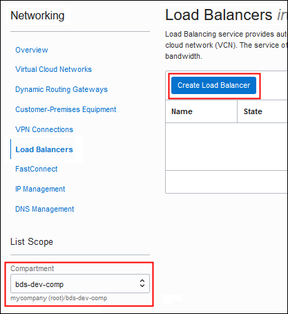
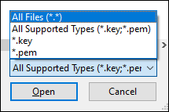
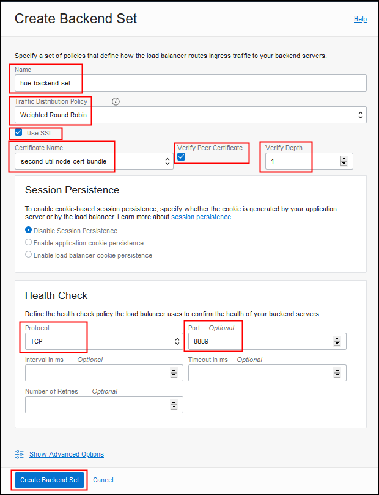
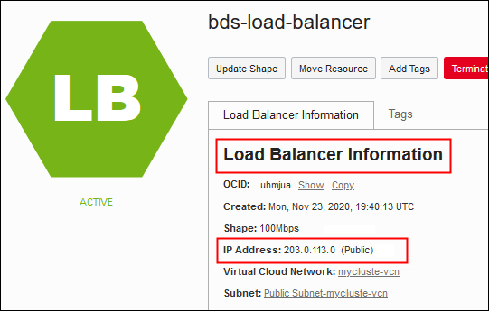

#  Use a Load Balancer to Access Services on Big Data Service (Non-HA Cluster)

## Introduction

In this lab, you'll create a load balancer that can be used as a front end for securely accessing Cloudera Manager, Hue, and Oracle Data Studio on your non-highly-available (non-HA) Big Data Service cluster.

Typically, a load balancer is used to spread workloads across multiple mirrored servers (for example, cluster nodes), to optimize resource usage and to ensure high-availability (HA). However, in this lab you'll use a load balancer to direct traffic to multiple ports on a single Big Data Service node. <!-- Cloudera Manager, Hue, and Data Studio all run on the first utility node of a non-HA cluster, and the load balancer you create in this lab will handle traffic on that node.--> <!--In an HA cluster, the services are divided between the first and second utility nodes.-->

One advantage of using a load balancer is that you can configure it to use the Secure Sockets Layer (SSL) protocol to secure traffic to and from the services on your cluster. SSL uses digital certificates and keys to encrypt and decrypt transmitted data, to ensure the identities of the sender and the receiver of data, and to sign the data to verify its integrity.  In this workshop, you'll implement end-to-end SSL, which means that the load balancer will accept SSL encrypted traffic from clients and encrypt traffic to the cluster.

When you complete this lab, you'll be able to open Cloudera Manager, Hue, and Oracle Data Studio by using the IP address (or hostname) of the load balancer, plus the port number on which each service listens. For example, if the IP address of the load balancer is `203.0.113.1`, and Cloudera Manager listens on port `7183`, you can open Cloudera Manager by entering `https://203.0.113.1:7183` in your web browser. Hue listens on port `8889`, so you can open Hue by entering `https://203.0.113.1:8889`.


Estimated workshop Time: 90 minutes, if you've already created the environment and cluster, as explained in [What Do You Need?](#whatdoyouneed), below.

### Objectives

In this workshop, you will:

* Create an Oracle Cloud Infrastructure load balancer for an existing non-HA Big Data Service cluster.

* Configure the load balancer to function as a front end for connecting to Cloudera Manager, Hue, and Big Data Studio on the cluster.

* Implement end-to-end SSL encryption for the load balancer by using the self-signed SSL certificates included with the cluster. <!--SSL is a protocol used to ensure privacy, authentication, and data security in internet communications.-->

More specifically, you will:

| STEP  | Task |
| --- | --- |
| [1](#STEP1:GatherInformation) | Gather information you'll need for subsequent steps in this lab: <br/> - the ***SSH file*** associated with your cluster<br/> - the ***private IP address*** of the first utility node in the cluster<br/> - the ***public IP address*** of the first utility node in the cluster |
| [2](#STEP2:CopySSLCertificatesfromtheCluster) | Download the ***SSL certificate*** and ***key*** files from the first utility node of your cluster.  <br/><br/>**Note:** For highest security on a production system, you should obtain certificates from a trusted SSL certificate authority like IdenTrust or DigiCert. However, Big Data Service includes certificate and key files which you can use for learning and testing. (The certificates are self-signed, which means that the certificates aren't issued by a trusted certificate authority.) |
| [3](#STEP3:CreatetheLoadBalancer) | a. Create the ***load balancer***. <br/><br/>b. Create a ***backend set*** for Cloudera Manager. A backend set routes incoming traffic to the specified target(s), checks the health of the server, and optionally uses SSL to encrypt traffic. You'll complete the configuration of this backend set in STEP 5. <br/><br/>c. Create a ***listener*** for Cloudera Manager. A listener is an entity that checks for incoming traffic on the load balancer's IP address. You'll complete the configuration of this listener in STEP 11. |
| [4](#STEP4:CreateaCertificateBundle) | Create a ***certificate bundle*** from the SSL certificate and key you downloaded from your cluster in STEP 2. In later steps, you'll apply this bundle to your backend sets and listeners, to implement SSL for the load balancer. |
| [5](#STEP5:ConfiguretheBackendSetforClouderaManager) | Complete the configuration of the ***backend set*** you created in step 3, for Cloudera Manager. You'll apply the certificate bundle you created in STEP 4 here. |
| [6](#STEP6:CreateaBackendSetforHue) | Create and configure the ***backend set*** for Hue. |
| [7](#STEP7:CreateaBackendSetforBigDataStudio) | Create and configure the ***backend set*** for Oracle Data Studio. |
| [8](#STEP8:AddaBackendServerforClouderaManager) | Add a ***backend server*** to the backend set you created for Cloudera Manager in STEP 3. Backend servers receive incoming TCP or HTTP traffic and generate content in reply. For this load balancer, the backend server is the first utility node of your cluster, where Cloudera Manager, Hue, and Data Studio run. |
| [9](#STEP9:AddaBackendServerforHue) | Add the ***backend server*** for Hue.|
| [10](#STEP10:AddaBackendServerforBigDataStudio) | Add the ***backend server*** for Data Studio. |
| [11](#STEP11:ConfiguretheListenerforClouderaManager) | Complete the configuration of the ***listener*** for Cloudera Manager, which you created in STEP 3.  You'll apply the certificate bundle you created in STEP 4 here. |
| [12](#STEP12:CreateaListenerforHue) | Create and configure a ***listener*** for Hue. |
| [13](#STEP13:CreateaListenerforBigDataStudio) | Create and configure a ***listener*** for Big Data Studio. |
| [14](#STEP14:AccesstheCluster) | Access Cloudera Manager, Hue, and Data Studio by using the IP address assigned to the load balancer, appended by the port number for the service. |

**Note:** If you want to create a load balancer for an HA cluster, see the [Use a Load Balancer to Access Services on Big Data Service (HA Cluster)](https://oracle.github.io/learning-library/data-management-library/big-data/bds-load-balancer-ha/workshops/freetier/?lab=use-load-balancer-access-services-on-big) workshop.  If you want to use SSL certificates from a trusted certificate authority, see [Use a Load Balancer to Connect to Services on a Cluster](https://docs.oracle.com/en/cloud/paas/big-data-service/user/use-load-balancer-connect-cluster.html) in *Using Big Data Service*.

### What Do You Need?

* This workshop requires an **Oracle Cloud account**. You may use your own cloud account or you can get a Free Trial account as described in the <!-- Prerequisites--> [Get Started with Oracle Cloud](?lab=get-started-oracle-cloud) lab in the **Contents** menu on the left side of this page. <!-- FIND OUT ABOUT RENAMING THAT TO "GET STARTED WITH ORACLE CLOUD"-->

* Any operating system command shell containing **Secure Shell (SSH)** and **Secure Copy (SCP)**. You can also use the open source PuTTY network file transfer application. See PuTTY documentation for instructions.

  This workshop assumes you're using a recent installation of Windows, such as Windows 10, which includes Windows PowerShell, `ssh`, and `scp`.  

  * An **Oracle Cloud Infrastructure environment** with a **Virtual Cloud Network (VCN)**, a **public subnet**, the appropriate **security rules** for creating a load balancer, and a **Big Data Service non-HA cluster**. The fastest way to set up the environment for this workshop is to complete the [Getting Started with Oracle Big Data Service (Non-HA Cluster)](https://oracle.github.io/learning-library/data-management-library/big-data/bds-non-ha/workshops/freetier/?lab=introduction-oracle-big-data-service) workshop. You can complete the entire workshop if you want, but you must complete at least the following labs:

    * **Lab 1: Set Up Your BDS Environment**
    * **Lab 2: Create a BDS Hadoop Cluster**
    * **Lab 4: Access a BDS Node Using a Public IP Address**

    Once you've completed those labs, you can start with [STEP 1: Gather Information](#STEP1:GatherInformation), below.

If you choose ***not*** to complete the [Getting Started with Oracle Big Data Service (Non-HA Cluster)](https://oracle.github.io/learning-library/data-management-library/big-data/bds-non-ha/workshops/freetier/?lab=introduction-oracle-big-data-service) workshop, you must create and configure:

* A **non-HA Oracle Big Data Service cluster** running in a **VCN** with an internet gateway and a public regional subnet (for a public load balancer). See [Set Up Oracle Cloud Infrastructure for Oracle Big Data Service](https://docs-uat.us.oracle.com/en/cloud/paas/big-data-service/user/set-oracle-cloud-infrastructure-oracle-big-data-service.html) and [Create a Cluster](https://docs.oracle.com/en/cloud/paas/big-data-service/user/create-cluster.html) in *Using Big Data Service*.

* **Security rules** that allow incoming traffic on the ports where services run in the cluster: Cloudera Manager (port 7183), Hue (port 8889), and Big Data Studio (port 30000). See [Create Ingress Rules \(Open Ports\)](https://docs.oracle.com/en/cloud/paas/big-data-service/user/define-security-rules.html#GUID-CE7BE686-4047-4DAA-BCE7-3B46BABC321F) in *Using Big Data Service*.

* **Administrative access** to manage load balancers.  See "Let network admins manage load balancers" in [Common Policies](https://docs.cloud.oracle.com/en-us/iaas/Content/Identity/Concepts/commonpolicies.htm) in the Oracle Cloud Infrastructure documentation.

* An **SSH key pair**. The SSH key pair must include the private key that was associated with the cluster when it was created. <!-- In the steps below, the sample key pair files are named `my-ssh-key` (the private key) and `my-ssh-key.pub` (the public key). See [Create a Cluster](https://docs.oracle.com/en/cloud/paas/big-data-service/user/create-cluster.html) in *Using Oracle Big Data Service* and [Creating a Key Pair](https://docs.cloud.oracle.com/en-us/iaas/Content/GSG/Tasks/creatingkeys.htm?Highlight=ssh%20key#CreatingaKeyPair) in the Oracle Cloud Infrastructure documentation.--> Se [Create a Cluster](https://docs.oracle.com/en/cloud/paas/big-data-service/user/create-cluster.html) in *Using Big Data Service*.

* **Access to the cluster file system** (via SSH). You must be able to connect directly to the first utility node of your cluster. To do this, prior to creating a load balancer, you must set up your environment to allow that access. For example you can use Oracle FastConnect or Oracle IpSec VPN, you can set up a bastion host, or you can map private IPs to public IP addresses. See  [Establish Connections to Nodes with Private IP Addresses](https://docs.oracle.com/en/cloud/paas/big-data-service/user/establish-connections-nodes-private-ip-addresses.html) in *Using Big Data Service*.


## **STEP 1:** Gather Information

Gather the following information before you start:

  | Information | What It Is and Where To Find It |
| :--- | :--- |
| SSH private key file | The name and location of the SSH private key file that is paired with with the SSH public key associated with the cluster. <br/><br/>The public key was associated with the cluster when the cluster was created. (See [Lab 2: Create a BDS Hadoop Cluster](https://oracle.github.io/learning-library/data-management-library/big-data/bds-non-ha/workshops/freetier/?lab=lab-2-create-bds-hadoop-cluster) in the "Getting Started with Oracle Big Data Service (non-HA)" workshop.) If you don't have the private key, contact the cluster administrator or the person who created the cluster.<br/><br/>In the examples shown in this workshop, the example SSH key pair is `my-ssh-key` (the  private key) and `my-ssh-key.pub` (the public key). In the examples, the private key is located in `C:\Users\MYHOME\bds\ssh\`. |
|Private IP address of the first utility node |The private IP address assigned to the first utility node when it was created. <br/><br/> Find this address in the **Node Information** box on the **Big Data > Clusters > Cluster Details > Nodes > Node Details** page for the first utility node of your cluster.<br/><br/>In the example shown in this workshop, the private IP address is `198.51.100.0`. Your IP address will be different. |
|Public IP address of the first utility node |The public IP address of the first utility node. <br/><br/>If you followed the steps in the [Getting Started with Oracle Big Data Service (Non-HA Cluster)](https://oracle.github.io/learning-library/data-management-library/big-data/bds-non-ha/workshops/freetier/?lab=introduction-oracle-big-data-service) workshop, this is the public IP address that you mapped to the node's private IP address. <br/><br/>If you're using a bastion host, Oracle FastConnect, or Oracle IPSec VPN, find the IP addresses of the nodes assigned via those solutions.  Note that IP addresses available via these solutions aren't reachable from the public internet. However, for convenience, they are called "public" in this lab.<br/><br/>In the examples shown in this workshop, the public IP address is `192.0.2.0`. Your IP address will be different.|


## **STEP 2:** Copy SSL Certificates from the Cluster

In this step, you'll obtain a self-signed SSL certificate and key that are included in your cluster. They're located in the `/opt/cloudera/security/x509` directory of the first utility node.

You'll copy the following certificate and key from the first utility node:

  * `/opt/cloudera/security/x509/`_&lt;first\_utility\_node\_certificate&gt;_`.pem`

  * `/opt/cloudera/security/x509/node.hue.key`

To copy the files:

1. On the Windows taskbar, right-click the Windows **Start** button and select **Windows PowerShell**.

    <!---->
    

    **Note:** If you use a Virtual Private Network (VPN), you may need to disconnect from VPN before using PowerShell to connect to your cluster. Re-establish your VPN connection when you move on to **STEP 3: Create the Load Balancer,** below.

2. In PowerShell, use `ssh` with your private key to connect to the first utility node:

    ```
    PS C:\Users\MYHOME\&gt; <copy>ssh -i &lt;private-ssh-key&gt; opc@&lt;first-util-node-public-ip-address&gt;</copy>
      ```
    For example:
    * If you're entering commands from your `C:\Users\MYHOME` directory,
    * and your private key file `my-ssh-key` is in `C:\Users\MYHOME\bds\ssh`,
    * and the public IP address of the first utility node of your cluster is `192.0.2.0`,

    then enter:

      ```
    PS C:\Users\MYHOME\&gt; <copy>ssh -i bds/ssh/my-ssh-key opc@192.0.2.0</copy>
    Last login: Tue Nov 10 17:59:41 2020 from some-host
    [opc@myclustun0 ~]$

      ```

      Notice that the name of the first utility node is shown in the Linux prompt. In the example above, it's `myclustun0`.

3. At the Linux prompt, list the contents of ``/opt/cloudera/security/x509/``, which is the directory that contains the SSL files on the node. For example:

      ```
    [opc@myclustun0 ~]$ <copy>ls -1 /opt/cloudera/security/x509/</copy>
    agents.pem
    hostname.key
    hostname.pem
    hue.pem
    node_myclustmn0.sub12345678901.myclustevcn.oraclevcn.com.pem
    node_myclustun0.sub12345678901.myclustevcn.oraclevcn.com.pem
    node_myclustwn0.sub12345678901.myclustevcn.oraclevcn.com.pem
    node_myclustwn1.sub12345678901.myclustevcn.oraclevcn.com.pem
    node_myclustwn2.sub12345678901.myclustevcn.oraclevcn.com.pem
    node.cert
    node.hue.key
    node.key
      ```

  4. Copy and save the file *name* of the PEM file for the first utility node. You can identify it by looking at the first part of the names, where ``<cluster>`` is the first seven letters of the cluster name and `un0` identifies the first utility node. For example, in a cluster named `mycluster`, the first utility node is:

    `node_`**`myclustun0`**`.sub12345678901.myclustevcn.oraclevcn.com.pem`

      

    You'll use this name in the following steps, when you issue commands to download the files.

5. At the Linux prompt, type `exit` to disconnect from the cluster.

6. Remain in PowerShell. For convenience later, create a directory for saving the SSL file. For example, if you have a `bds` directory under your home directory, you can create the `ssl-files` directory under it:

      ```
    PS C:\Users\MYHOME\&gt; <copy>mkdir bds/ssl-files</copy>

      ```

7. Use the `scp` command to copy the SSL certificate from the first utility node  (`node0`) to a `<target>` location on your computer, for example the `ssl-files` directory you just created. For convenience later, copy the file to an easily recognizable name, with a `.pem` filename extension:

      ```
    PS C:\Users\MYHOME\&gt; <copy>scp -i &lt;ssh-private-key&gt; opc@&lt;first-util-node-public-ip-address&gt;:/opt/cloudera/security/x509/&lt;ssl-cert-file-name&gt; &lt;target-dir/filename&gt;</copy>
      ```

    For example:
    * If you're entering the command from your `C:\Users\MYHOME` directory,
    * and you want to copy the file to your `C:\Users\MYHOME\bds\ssl-files\` directory,
    * and you want to rename the file to `first-util-node-cert.pem`,

    then enter:

      ```
    PS C:\Users\MYHOME\&gt; <copy>scp -i bds/my-ssh-key opc@192.0.2.0:/opt/cloudera/security/x509/node_myclustun0.sub12345678901.myclustevcn.oraclevcn.com.pem bds/ssl-files/first-util-node-cert.pem</copy>
      ```

      Notice that the public IP address is for the first utility node. In this example, it's  `192.0.2.0`.

8. Copy the SSL key file (named `node.hue.key`) for the first utility node to the target location on your computer, for example the `ssl-files` directory. For convenience later, copy the file to an easily recognizable name, with a `.key` filename extension, for example, `first-util-node.key`.  

      ```
    PS C:\Users\MYHOME\&gt; <copy>scp -i &lt;ssh-private-key&gt; opc@&lt;first-util-node-public-ip-address&gt;:/opt/cloudera/security/x509/node.hue.key &lt;target-dir/filename&gt;</copy>
      ```

      For example:

      ```
    PS C:\Users\MYHOME\&gt; <copy>scp -i bds/my-ssh-key opc@192.0.2.0:/opt/cloudera/security/x509/node.hue.key bds/ssl-files/first-util-node.key</copy>
      ```

9. List your downloaded files to make sure the files were downloaded appropriately, for example:

      ```
    PS C:\Users\MYHOME\&gt; <copy>ls</copy> bds/ssl-files

    Directory: C:\Users\MYHOME\ssl-files

    Mode      LastWriteTime            Length Name
    ----      -------------  ------    ----
    -a----    11/17/2020     9:21 AM   1285 first-util-node-cert.pem
    -a----    11/17/2020     9:30 AM   1675 first-util-node.key
      ```

10. Close Windows PowerShell.

## **STEP 3:** Create the Load Balancer

1.   **Note:** If you use VPN to connect to Oracle Cloud, and you disconnected from VPN to perform STEP 2, above, reconnect to VPN before continuing.

  Sign in to the **Oracle Cloud Console** as an administrator. See [Signing In to the Console](https://docs.cloud.oracle.com/en-us/iaas/Content/GSG/Tasks/signingin.htm).

2. On the banner at the top of the page, click the navigation menu  to open it. Under **Core Infrastructure**, point to **Networking**, and then click **Load Balancers**.

    <!-- -->
    

2. On the **Load Balancers in *&lt;compartment&gt;* Compartment** page, under **Compartment** in the panel on the left, select the compartment containing your cluster, and then click **Create Load Balancer**.

    <!-- -->
    

3. On the **Add Details** page of the **Create Load Balancer** wizard, enter the following information:

    * **Load Balancer Name:** Enter a name to identify the load balancer; for example, `bds-load-balancer`.

    * **Choose Visibility Type:** Click **Public** to create a load balancer that will be accessible from the public internet.

    * **Assign a public IP address:** Click **Ephemeral IP Address** to have an ephemeral IP address assigned to the load balancer. An ephemeral IP address is an IP address that doesn't persist beyond the life of the resource. When the load balancer is deleted, this IP address will return to the pool of available IP addresses in the tenancy.

    * **Choose Total Bandwidth:** Accept the default **Small**.

    * **Virtual Cloud Networking in *&lt;compartment&gt;*:** Click the **Select a virtual cloud network** list and select the VCN where your cluster is running. If the network is in a different compartment, click **Change Compartment** and select the compartment from the list.

     * **Subnet in *&lt;compartment&gt;*:** Click the **Select a subnet** list and select a public subnet in your VCN to use for the load balancer. (A public subnet is required for a public load balancer.) If the subnet is in a different compartment, click **Change Compartment** and select the compartment from the list.

     * **Use network security groups to control traffic:** Leave this box unchecked.

    <!---->
    

4. Click **Next**.

5.  On the **Choose Backends** page of the wizard, enter the following information to create a backend set for Cloudera Manager:

    * **Specify a Load Balancing Policy:** Accept the default **Weighted Round Robin**.

    * **Select Backend Servers:** Skip this option. You'll add a backend server later.

    * **Specify Health Check Policy:** Enter the following for the health check policy for this Cloudera Manager backend set:

        * **Protocol:** Select **HTTP**.

        * **Port:** Enter **7183**, which is the port on which Cloudera Manager listens.

        * **Interval in ms (Optional):** You can accept the default or change the value to suit your needs.

        * **Timeout in ms (Optional):** You can accept the default or change the value to suit your needs.

        * **Number of Retries (Optional):** You can accept the default or change the value to suit your needs.

        * **Status Code (Optional):** You can accept the default or change the value to suit your needs.

        * **URL Path (URI):** Keep the default forward slash (**/**).

        * **Use SSL:** Leave this box unchecked. You'll configure SSL for this backend set later.

        <!---->
        

    **Note:** When the load balancer is created, it will include this backend set for Cloudera Manager. The name of the backend set will be something like **bs\_lb\_&lt;date-timestamp&gt;**; for example, **bs\_lb\_2020-1117-1226**. You can't change this name.

6. Click **Next**.

7. On the **Configure Listener** page of the wizard, enter the following information:

    * **Listener Name:** Enter a name for the listener for Cloudera Manager; for example, `cm-listener`.

    * **Specify the type of traffic your listener handles:** Select **HTTP**. You'll change this to HTTPS later, by configuring SSL.

    * **Specify the port your listener monitors for ingress traffic**: Enter **7183**.

    <!---->
    

8. Click **Submit**. When the large load balancer status icon at the top of the **Load Balancer Details** page turns from orange to green and the label is "Active," you can continue with the steps below. It may take a few minutes to create the load balancer.

  <!---->
  

## **STEP 4:** Create a Certificate Bundle

In this step, you'll create a certificate bundle with the SSL certificate and key files that you downloaded in **STEP 2: Copy SSL Certificates from the Cluster**. You'll use it later to configure SSL for backend sets and listeners.  

1. On the left side of the **Load Balancer Details** page, under **Resources**, click **Certificates** and then click **Add Certificate**.

    <!---->
    

2. On the **Add Certificate** page, enter the following information:

    * **Certificate Name:** Enter `first-util-node-cert-bundle` (or a name of your choice).

    * **SSL Certificate:** In the **SSL Certificates** box, click the **select one** link, find and select the SSL certificate you downloaded from the first utility node; for example, `first-util-node-cert.pem` in `C:\Users\MYHOME\bds\ssl-files`, and click **Open**.

        

      **Note:** If you don't see your `.pem` and `.key` files in the directory where you saved them in **STEP 2: Copy SSL Certificates from the Cluster**, above, make sure that all files types are displayed in the Windows **File Upload** dialog box by selecting **All Files (\*.\*)** from the list above the **Open** button.

      <!---->
      

    * **Specify CA Certificate:** Check this box, and then click the **select one** link to add the same file that you just added for **SSL Certificate**, above; for example, `first-util-node-cert.pem`.

    * **Specify Private Key**: Check this box, and then click the **select one** link to add the SSL key you downloaded from the first utility node; for example, `first-util-node.key`.

    <!---->
    

3. Click **Add Certificate**, and then click **Close** in the **Work Request Submitted** dialog box. It may take a few moments for the bundle to be added to the **Certificates** table at the bottom of the **Certificates** page.

    <!---->
    

    **Note:** If you get an error that the certificate and key files don't match, check to make sure that you added the PEM and KEY files that you downloaded from the same (first) utility node.


## **STEP 5:** Configure the Backend Set for Cloudera Manager

1. On the left side of the **Certificates** page, under **Resources**, click **Backend Sets**. The backend set you created for Cloudera Manager in [STEP 3: Create the Load Balancer](#STEP3:CreatetheLoadBalancer) is displayed in the **Backend Sets** table, with a name like **`bs_lb_<date-timestamp>`**; for example, **bs\_lb\_2020-1117-1226**. Click the **Action**  menu at the end of the row containing this backend set, and select **Edit**.

    <!---->
    

3. On the **Edit Backend Set** page, enter the following information.

    * **Name:** This read-only field shows the name that was created for you by the wizard, for example, **bs\_lb\_2020-1117-1226**.

    * **Traffic Distribution Policy:** Accept the default **Weighted Round Robin**.

    * **Use SSL:** Select this box. Then, under **Certificate Name**, select the bundle you created with the self-signed SSL certificate for the first utility node; for example, **first-util-node-cert-bundle**.

    * **Verify Peer Certificate:** Check this box.

    * **Verify Depth:** Set to **1**.

    * **Session Persistence:** Accept the default **Disable Session Persistence**.

    <!---->
    

4. Click **Update Backend Set**, and then click **Close** in the **Work Request Submitted** dialog box. When complete, a cipher suite name is added to the **Cipher Suite** field for the backend set. It may take a few moments for the name to appear.

    <!-- -->
    

## **STEP 6:** Create a Backend Set for Hue

1. Remain on the **Backed Sets** page and click **Create Backend Set**. On the **Create Backend Set** page, enter the following information.

    * **Name:** Enter a name; for example, **`hue-backend-set`**.

    * **Traffic Distribution Policy:** Accept the default **Weighted Round Robin**.

    * **Use SSL:** Select this box. Then, under **Certificate Name**, select the bundle you created with the self-signed SSL certificate for the first utility node; for example, **first-util-node-cert-bundle**.

    * **Verify Peer Certificate:** Check this box.

    * **Verify Depth:** Set to **1**.

    * **Session Persistence:** Accept the default **Disable Session Persistence**.

    * **Health Check:** Enter the following information:

        * **Protocol:** Select **TCP**.

        * **Port:** Enter **`8889`**, which is the port on which Hue listens.

    <!-- -->
    


2. Click **Create Backend Set**, and then click **Close** in the **Work Request Submitted** dialog box. It may take a few moments for the backend set to be added to the **Backend Sets** table.

## **STEP 7:** Create a Backend Set for Big Data Studio

1. Remain on the **Backend Sets** page and click **Create Backend Set** again. On the **Create Backend Sets** page, enter the following information.

    * **Name:** Enter a name; for example, **`data-studio-backend-set`**.

    * **Traffic Distribution Policy:** Accept the default **Weighted Round Robin**.

    * **Use SSL:** Select this box, then, under **Certificate Name**, select the bundle you created with the self-signed SSL certificate for the first utility node; for example,  **first-util-node-cert-bundle**.

    * **Verify Peer Certificate:** Check this box.

    * **Verify Depth:** Set to **1**.

    * **Session Persistence:** Accept the default **Disable Session Persistence**.

    * **Health Check:** Enter the following information:

        * **Protocol:** Select **HTTP**.

        * **Port:** Enter **`30000`**, which is the port on which Big Data Studio listens.

        * **URL Path (URI)**: Enter a forward slash (**/**).

2. Click **Create Backend Set**, and then click **Close** in the **Work Request Submitted** dialog box. It may take a few moments for the backend set to be added to the **Backend Sets** table.

## **STEP 8:** Add a Backend Server for Cloudera Manager

1. Remain on the **Backend Sets** page. In the **Backend Sets** table, click the name of the backend set for Cloudera Manager; for example, **bs\_lb\_2020-0928-1136**. (Remember, the **Create Load Balancer** wizard assigned this name to first backend set; that is, the one for Cloudera Manager.)

2. On the left side of the **Backend Set Details** page, under **Resources**, click **Backends**.

    <!---->
    

3. On the **Backends** page, click **Add Backends**, and then enter the following information on the **Add Backends** page:

    * **IP Addresses:** Select this option at the top of the page, so you can enter a specific IP address.

    * **IP Address**: Enter the private IP address of the first utility node of your cluster; for example, `198.51.100.0`.

      * **Port:** Enter **`7183`**, which is the port on which Cloudera Manager listens.

      * **Weight:** Accept the default value **1**.

    <!---->
    

4. Click **Add**, and then click **Close** in the **Work Request Submitted** dialog box. It may take a few moments for the backend server to be added to the **Backends** table.

## **STEP 9:** Add a Backend Server for Hue

1. Click **Backend Sets** in the breadcrumbs at the top of the page to return to the **Backend Sets** page. In the **Backend Sets** table, click the name of the backend set you created for Hue; for example, **hue-backend-set**.

2. On the left side of the **Backend Set Details** page, under **Resources**, click **Backends**. Then click **Add Backends**.

3. On the **Backends** page, click **Add Backends**, and then enter the following information on the **Add Backends** page:

    * **IP Addresses:** Select this option at the top of the page, so you can enter a specific IP address.

    * **IP Address:** Enter the private IP address of the first utility node; for example, **`198.51.100.0`**.

    * **Port:** Enter **`8889`**, which is the port on which Hue listens.

    * **Weight:** Accept the default value **1**.

4. Click **Add**, and then click **Close** in the **Work Request Submitted** dialog box. It may take a few moments for the backend server to be added to the **Backends** table.

## **STEP 10:** Add a Backend Server for Big Data Studio

1. Click **Backend Sets** in the breadcrumbs at the top of the page to return to the **Backend Sets** page. In the **Backend Sets** table, click the name of the backend set you created for Big Data Studio; for example, **data-studio-backend-set**.

2. On the left side of the **Backend Set Details** page, under **Resources**, click **Backends**. Then click **Add Backends**.

3. On the **Backends** page, click **Add Backends**, and then enter the following information on the **Add Backends** page:

    * **IP Addresses:** Select this option at the top of the page, so you can enter a specific IP address.

    * **IP Address:** Enter the private IP address of the first utility node; for example, `198.51.100.0`.

    * **Port:** Enter **`30000`**, for the port where Big Data Studio listens.

    * **Weight:** Accept the default value **1**.

4. Click **Add**, and then click **Close** in the **Work Request Submitted** dialog box. It may take a few moments for the backend server to be added to the **Backends** table.

## **STEP 11:** Configure the Listener for Cloudera Manager

1. Click **Load Balancer Details** in the breadcrumbs at the top of the page. On the left side of the **Load Balancer Details** page, under **Resources**, click **Listeners**. Notice that the **Listeners** table includes the listener you created for Cloudera Manager in **STEP 3: Create the Load Balancer**; for example, **cm-listener**.

2. Click the **Action**  menu at the end of the row containing the listener, and select **Edit**.

3. On the **Edit Listener** page, enter the following information. (Most of these options were set when you created the load balancer in **STEP 3: Create the Load Balancer**, above. The option you'll change in this step is **Use SSL**.)

    * **Name:** Read only.

    * **Protocol:** Select **HTTP**. (This should be set already, because you selected it in **STEP 3: Create the Load Balancer**.)

    * **Port:** Enter **`7183`**, which is the port on which Cloudera Manager listens.  (This should be set already, because you selected it in **STEP 3: Create the Load Balancer**.)

    * **Use SSL:** Select this box. Then, under **Certificate Name**, select the bundle you created with the self-signed SSL certificate for the first utility node; for example, **first-util-node-cert-bundle**.

    * **Verify Peer Certificate:** Leave this box unchecked.

    * **Backend Set:** From the list, select the backend set you created for Cloudera Manager; for example, **bs\_lb\_2020-0928-1136**.  (This should be set already, because you selected it in **STEP 3: Create the Load Balancer**. Remember, the wizard assigned this name when you created the load balancer.)

    <!---->
    

4. Click **Update Listener**, and then click **Close** in the **Work Request Submitted** dialog box. It may take a few moments for the listener to be updated in the **Listeners** table, so that **Use SSL** is **Yes**.

## **STEP 12:** Create a Listener for Hue

1. Remain on the **Listeners** page and click **Create Listener**. Then, on the **Create Listener** page, enter the following information:

    * **Name:** Enter a name for the listener; for example, hue-listener.

    * **Protocol:** Select **HTTP**.

    * **Port:** Enter **`8889`**, which is the port on which Hue listens.

    * **Use SSL:** Select this box. Then, under **Certificate Name**, select the bundle you created with the self-signed SSL certificate for the first utility node; for example,  **first-util-node-cert-bundle**.

    * **Verify Peer Certificate:** Leave this box unchecked.

    * **Backend Set:** From the list, select the backend set you created for Hue in **STEP 6: Create a Backend Set for Hue**; for example, **hue-backend-set**.


2. Click **Create Listener**, and then click **Close** in the **Work Request Submitted** dialog box. It may take a few moments for the listener to be added to the **Listeners** table.

## **STEP 13:** Create a Listener for Big Data Studio

1. Remain on the **Listeners** page. Click **Create Listener** again. Then, on the **Create Listener** page, enter the following information:

    * **Name:** Enter a name for the listener; for example, **data-studio-listener**.

    * **Protocol:** Select **HTTP**.

    * **Port:** Enter **30000**, which is the port on which Big Data Studio listens.

    * **Use SSL:** Select this box. Then, under **Certificate Name**, select the bundle you created with the self-signed SSL certificate for the first utility node; for example,  **first-util-node-cert-bundle**.

    * **Verify Peer Certificate:** Leave this box unchecked.

    * **Backend Set:** From the list, select the backend set you created for Big Data Studio in **STEP 7: Create a Backend Set for Big Data Studio**; for example, **data-studio-backend-set**.

2. Click **Create Listener**, and then click **Close** in the **Work Request Submitted** dialog box. It may take a few moments for the listener to be added to the **Listeners** table.

## **STEP 14:** Access the Cluster

It may take a few minutes for the backend sets and listeners to be ready to receive requests. To open the services included in this load balancer:

1. Find the IP address or the hostname used for your load balancer.

    * **IP address**

      Find the IP address in the **Load Balancer Information** panel at the top of the load balancer pages.

      <!---->
      

    * **DNS hostname**

      (DNS hostname is optional.) After the load balancer is created and it's been given an IP address, you or another administrator must add a DNS entry to your DNS name servers, to resolve your desired hostname (for example, `bds-frontend.mycompany.com`) to the public IP address of the load balancer. Then, the services registered in the load balancer will be accessible by using that hostname; for example, `bds-frontend.mycompany.com:7183` for Cloudera Manager.

      For information about using DNS in Oracle Cloud Infrastructure, see [Overview of the DNS Service](https://docs.cloud.oracle.com/en-us/iaas/Content/DNS/Concepts/dnszonemanagement.htm) in the Oracle Cloud Infrastructure documentation.

2. In a web browser, enter the address as follows:

    * To use the load balancer's IP address: `https://`*`<load-balancer-ip-address>`*:*`<port>`*

    * To use the load balancer's hostname in a domain: `https://`*`<hostname>`*:*`<port>`*

    That is, for Cloudera Manager:

    * `https://`*`<load-balancer-ip-address>`*`:7183`

      <!---->
      

      * `https://`*`<hostname>`*`:7183`

    For Hue:
      * `https://`*`<load-balancer-ip-address>`*`:8889`
      * `https://`*`<hostname>`*`:8889`

    For Big Data Studio:
      * `https://`*`<load-balancer-ip-address>`*`:30000`
      * `https://`*`<hostname>`*`:30000`

**This concludes this workshop. <!-- Please proceed to the next lab in the Contents menu.-->**

## Want to Learn More?

* [Oracle Big Data Service](https://docs.oracle.com/en/cloud/paas/big-data-service/)

* [Overview of Load Balancing](https://docs.cloud.oracle.com/en-us/iaas/Content/Balance/Concepts/balanceoverview.htm)

* [Managing SSL Certificates](https://docs.cloud.oracle.com/en-us/iaas/Content/Balance/Tasks/managingcertificates.htm)

## Acknowledgements

* **Last Updated Date:** January 2021


## Need Help?

Please submit feedback or ask for help using our [LiveLabs Support Forum](https://community.oracle.com/tech/developers/categories/livelabsdiscussions). Please click the **Log In** button and login using your Oracle Account. Click the **Ask A Question** button to the left to start a *New Discussion* or *Ask a Question*.  Please include your workshop name and lab name.  You can also include screenshots and attach files.  Engage directly with the author of the workshop.

If you do not have an Oracle Account, click [here](https://profile.oracle.com/myprofile/account/create-account.jspx) to create one.

<!--
reserved text

To view your reserved public IP address in the console, click the Navigation menu and navigate to **Core Infrastructure > Networking > Public IPs**. The  reserved public IP address is displayed in the **Reserved Public IPs** list.
-->
<!--  You could choose instead to select **Private** to create a load balancer that will be accessible only from your private network, but for simplicity these instructions describe how to create a public load balancer.-->


<!--

As part of that load balancer, you'll create a ***backend set*** for each service (Cloudera Manager, Hue, and Data Studio), add a single ***backend server*** to each backend set, and create a ***listener*** for each service.

  * A backend set routes incoming traffic.

  * A backend server is the server that processes the request. For this load balancer, the  first utility node of the cluster is the backend server.

  *

 Specifically, you'll do the following:

| In this step...                                      | You will do this... |
|- - - |- - -|
| [STEP 1: Gather Information](#STEP1:GatherInformation)                         | Gather the information you need to create the load balancer. |  
| [STEP 2: Copy SSL Certificates from the Cluster](#STEP2:CopySSLCertificatesfromtheCluster)                         | Copy an SSL certificate and key from the cluster to use with the load balancer |  
| [STEP 3: STEP 3: Create the Load Balancer](#STEP3:STEP3:CreatetheLoadBalancer)                         | Create the load balancer and create a backend set for Cloudera Manager |  
| [STEP 4: Create a Certificate Bundle](#STEP4:CreateaCertificateBundle)                         | Blah blah |  
| [STEP 5: Configure the Backend Set for Cloudera Manager](#STEP5:ConfiguretheBackendSetforClouderaManager)                         | Blah blah |  
| [STEP 6: Create a Backend Set for Hue](#STEP6:CreateaBackendSetforHue)                         | Blah blah |  
| [STEP 7: Create a Backend Set for Big Data Studio](#STEP7:CreateaBackendSetforBigDataStudio)                         | Blah blah |  
| [STEP 8: Add a Backend Server for Cloudera Manager](#STEP8:AddaBackendServerforClouderaManager)                         | Blah blah |  
| [STEP 9: Add a Backend Server for Hue](#STEP9:AddaBackendServerforHue)                         | Blah blah |  
| [STEP 10: Add a Backend Server for Big Data Studio](#STEP10:AddaBackendServerforBigDataStudio)                         | Blah blah |  
| [STEP 11: Configure the Listener for Cloudera Manager](#STEP11:ConfiguretheListenerforClouderaManager)                         | Blah blah |  
| [STEP 12: Create a Listener for Hue](#STEP12:CreateaListenerforHue)                         | Blah blah |  
| [STEP 13: Create a Listener for Big Data Studio](#STEP13:CreateaListenerforBigDataStudio)                         | Blah blah |  
| [STEP 14: Access the Cluster](#STEP14:AccesstheCluster)                         | Blah blah |  
-->
