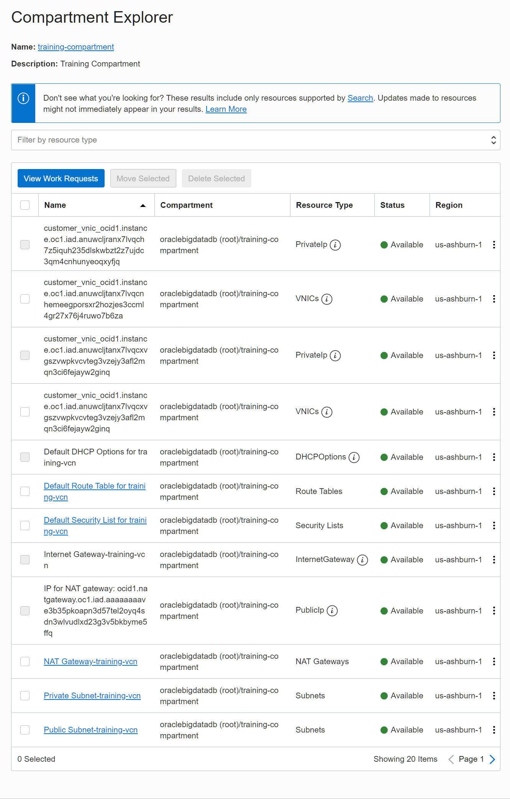
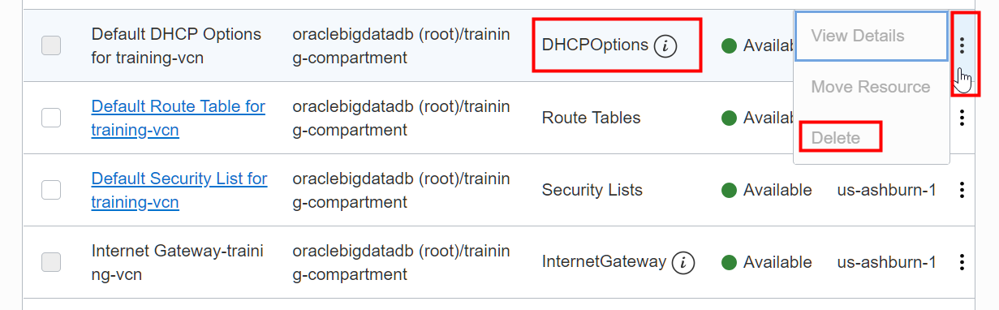
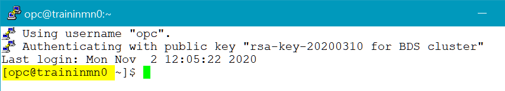

# Clean up Resources Used in this Workshop (Optional)

## Introduction

If you want to re-run the labs in this workshop again, you will need to perform the clean up steps in this lab. In this lab, you will learn how to identify and delete the resources that you have created in this workshop.

**Note:**    
If you are using a **Free Trial** account to run this workshop, Oracle recommends that you at least delete the BDS cluster that you created when you complete the workshop to avoid unnecessary charges.

### Objectives

* Delete your **`training-cluster`** Big Data Service Cluster.
* Identify the resources contained in your **`training-compartment`**.
* Delete the resources that you have created in your **`training-compartment`** as part of this workshop. This includes your IAM group, IAM user, IAM policies, VCN, reserved IP addresses, and so on.

### What Do You Need?

This lab assumes that you have successfully completed all the labs listed in the **Contents** menu.

## **STEP 1:** Delete the **`training-cluster`** Big Data Service Cluster

You can use the **Clusters** page to delete your cluster.

1. Log in to the **Oracle Cloud Console** as the Cloud Administrator that you used in the workshop.

2. Click the **Navigation** menu in the upper left-hand corner of the **Oracle Cloud Console** Home page. Navigate to **Data and AI > Big Data**.

3. On the **Clusters** page, on the row for **`training-cluster`**, click the **Actions** button, and then select **Terminate Big Data Cluster** from the context menu.

      

4. A confirmation message box is displayed. Enter the name of the cluster, and then click **Terminate**. The status of the cluster in the **State** column is **Deleting**. It can take up to 30 minutes before the cluster id deleted.  

      

5. The status of the cluster in the **State** column changes from **Active** to **Deleting**.

      


6. To view the status of the deletion process, click the cluster's name link in the **Name** column to display the **Cluster Details** page. In the **Resources** section at the bottom of the page, click **Work Requests**. In the **Work Requests** section, you can see the **% Complete** information.   

    **Note:** For additional details on the deletion process, click **CREATE\_BDS** in the **Operation** column. The **DELETE_BDS** page displays the logs, and errors, if any.

7. Click the **Clusters** link in the breadcrumbs to return to the **Clusters** page. When the cluster is successfully deleted, the status of the cluster in the **State** column changes from **Deleting** to **Deleted**.


## **STEP 2:** Identify the Resources in the **`training-compartment`**

Before you can delete OCI resources that you created or those that were created for you, you first must identify such resources.

1. From the **Oracle Cloud Console** Home page, click the **Navigation** menu. Navigate to **Governance and Administration > Governance > Compartment Explorer**.

2. On the **Compartment Explorer** page, in the **Select Compartment** section on the left pane, select the **Show Resources in Subcompartments** check box. In the **Search Compartments** field, type **`training`**. Select the **`training-compartment`** from the list of compartments.  

  

3. The resources in the **`training-compartment`** are displayed as shown in the following partial image.

  

4. To display specific types of resources in the compartment, click one or more resource type (click one at a time) from the **Filter by resource type** drop-down list. In the following example, we selected **PublicIp** resource type.

  

  The selected resources' types are displayed.

  


  **Note:** Note that some of the resources have an    icon next to the resource type. This indicates that some of the actions for this resource type are disabled such as the **Delete** action because they are not supported in the **Compartment Explorer**. In this lab, you will delete the resources from the same location where you created them.

  

## **STEP 3:** Delete Your IAM Group, IAM User, and IAM Policies

1. From the **Oracle Cloud Console** page, click the **Navigation** menu. Navigate to **Governance and Administration > Identity > Groups**.

2. From the list of available groups, search for your **training-bds-admin-group**. You cannot delete a group that contains any members; therefore, you will need to remove the **training-bds-admin** user from this group first. Click the group's name link in the **Name** column.

3. In the **Groups Detail** page, scroll down to the **Groups Members** section. Click the **Actions** button associated with the user that you want to remove from this group, and then select **Remove member from group** from the context menu.  A confirmation message box is displayed, click **Remove**.

4.  At the top of the **Groups Detail** page, click **Delete**. A confirmation message box is displayed, click **Delete**. The group is deleted and the **Groups** page is re-displayed.

5. Under **Identity** on the left pane, click **Users**. From the list of available users, search for your **training-bds-admin** user. Click the **Actions** button associated with this u ser, and then select **Delete** from the context menu. A confirmation message box is displayed, click **Delete**.

6. Under **Identity** on the left pane, click **Policies**. Click the **Actions** button associated with the **training-admin-policy** policy, and then select **Delete** from the context menu. A confirmation message box is displayed, click **Delete**.

7. Click the **Actions** button associated with the **training-bds-policy** policy, and then select **Delete** from the context menu. A confirmation message box is displayed, click **Delete**.

## **STEP 4:** Delete Your VCN

To delete a VCN, it must first be empty and have no related resources or attached gateways such as internet gateway, dynamic routing gateway, and so on. To delete a VCN's subnets, they must first be empty too.

1. From the **Oracle Cloud Console** page, navigate to **Core Infrastructure > Networking > Virtual Cloud Networks**.

2. From the list of available VCNs in your compartment, click the VCN's name link in the **Name** column. The **Virtual Cloud Network Details** page is displayed.

  

3. In the **Subnets** section, click the **Actions** button associated with **Private Subnet-training-vcn**. Select **Terminate** from the context menu. A confirmation message box is displayed. Click **Terminate**.

4. In the **Subnets** section, click the **Actions** button associated with **Public Subnet-training-vcn**. Select **Terminate** from the context menu. A confirmation message box is displayed. Click **Terminate**.

5. In the **Resources** section on the left pane, click **Route Tables**.

6. In the **Routes Tables** section, click the **Actions** icon associated with **Route Table for Private Subnet-training-vcn**. Select **Terminate** from the context menu. A confirmation message box is displayed. Click **Terminate**.

7. In the **Routes Tables** section, click the **Default Route Table for training-vcn** link in the **Name** column. The **Route Table Details** page is displayed. In the **Route Rules** section, click the **Actions** icon associated with **Internet Gateway-training-vcn**. Select **Remove** from the context menu. A confirmation message box is displayed. Click **Remove**.

8. In the **Resources** section on the left pane, click **Internet Gateways**. In the **Internet Gateways** section, click the **Actions** button associated with **Internet Gateway-training-vcn**. Select **Terminate** from the context menu. A confirmation message box is displayed. Click **Terminate**.

9. In the **Resources** section on the left pane, click **Security Lists**. In the **Security Lists** section, click the **Actions** button associated with **Security List for Private Subnet-training-vcn**. Select **Terminate** from the context menu. A confirmation message box is displayed. Click **Terminate**.

10. In the **Resources** section on the left pane, click **NAT Gateways**. In the **NAT Gateways** section, click the **Actions** button associated with **NAT Gateway-training-vcn**. Select **Terminate** from the context menu. A confirmation message box is displayed. Click **Terminate**.

11. In the **Resources** section on the left pane, click **Service Gateways**. In the **Service Gateways** section, click the **Actions** button associated with **Service Gateway-training-vcn**. Select **Terminate** from the context menu. A confirmation message box is displayed. Click **Terminate**.

12. At the top of the page, click **Terminate** to terminate your VCN. A **Terminate Virtual Cloud Network** window is displayed. After less than a minute, the **Terminate All** button is enabled. To delete your VCN, click **Terminate All**.

  

13. When the termination operation is completed successfully, a **Virtual Cloud Network termination complete** message is displayed in the window. Click **Close**.

  


## **STEP 5:** Delete Your Reserved IP Addresses

1. From the Oracle Cloud Console page, navigate to **Core Infrastructure > Networking > Virtual Cloud Networks > IP Management**. The **Reserved Public IP Addresses** page is displayed.

2. In the **List Scope** on the left pane, make sure that your **training-compartment** is selected.

3. In this workshop, you have created three reserved IP addresses: `traininmn0-public-ip`, `traininqs0-public-ip`, and `traininun0-public-ip`.

  

4. Click the **Actions** button associated with **`traininmn0-public-ip`**. Select **Terminate** from the context menu. A confirmation message box is displayed. Click * pane*Terminate**.

5. Click the **Actions** button associated with **`traininqs0-public-ip`**. Select **Terminate** from the context menu. A confirmation message box is displayed. Click **Terminate**.

6. Click the **Actions** button associated with **`traininun0-public-ip`**. Select **Terminate** from the context menu. A confirmation message box is displayed. Click **Terminate**.

## **STEP 6:** Delete Your Compartment

1. From the Oracle Cloud Console page, click the **Navigation** menu. Navigate to **Governance and Administration > Identity > Compartments**.

2. From the list of available compartments, search for your **training-compartment**.

3. From the **Compartments** page, click the **Actions** button associated with **training-compartment**. Select **Delete** from the context menu.

    

4. A confirmation message box is displayed. Click **Delete**. The status of the deleted compartment changes from **Active** to **Deleting** until the compartment is successfully deleted. You can click on the compartment name link in the **Name** column to display the status of this operation.

    


## **STEP 7:** Delete the Linux OS User and Group

In this step, you will connect to the first master node using SSH to delete the **`training`** Linux OS Administrator User and the OS group **`supergroup`** that you created in **Lab 6**. Refer to **Lab 6: Create a Hadoop Administrator User**, if needed, to review the steps on how to connect to first master node in your cluster.

**Note:** In this lab, we will connect to our cluster using Windows **PuTTY** and provide the SSH private key named `mykey.ppk` which is associated with our `mykey.pub` public key. If you created or used an OpenSSH key pair (using your Linux system or Windows PowerShell), you will need to use your Linux system or Windows PowerShell using the **`ssh`** command below.

1. Start **PuTTY**. The **PuTTY Configuration** window is displayed. In **Saved Sessions** section, click the `ssh to traininmn0 on BDS cluster` saved session that you created in **Lab 6**, and then click **Load**.

   


2. Click **Open**. You are connected to the **`traininmn0`** master node.

   

3.  Change to the root user as follows:
    ```
    $ <copy>sudo bash</copy>
    ```

4. Delete the **`training`** administrator user from each node in the **`training-cluster`** as follows:

    ```
    # <copy>dcli -C "userdel training"</copy>
    ```
5. Delete the group **supergroup** from each node in the **`training-cluster`** as follows:

    ```
    # <copy>dcli -C "groupdel supergroup"</copy>
    ```

## **STEP 8:** Remove the **`training`** User from Hue (optional)

If you have added the `training` administrator user to Hue in **Lab 6**, you will remove this user from Hue in this step.

1. Open a Web browser window.

2. Enter the following URL to login to Hue. Substitute **_``ip-address``_** with your own **_``ip-address``_** that is associated with the **first utility node** in your cluster, **`traininun0`**, which you created in a previous lab.

    ```
    https://<ip-address>:8888
    ```

    In our example, we used the reserved public IP address that is associated with our first utility node as follows:

    ```
    https://193.122.194.103:8888
    ```

4. On the Hue Login screen, enter your **`username`** (**`admin`** by default) and the **`password`** that you specified when you created the cluster such as **`Training123`**. The **Hue Editor** page is displayed.

5. From the **admin** drop-down menu, select **Manage Users**.

6. On the **User Admin** page, in the **Users** tab, select the checkbox next to the **training** user, and then click **Delete**. A confirmation message box is displayed. Click **Yes**.

  

7. Exit Hue. From the **admin** drop-down menu, select **Sign out**.


**This concludes this lab and the workshop.**

## Want to Learn More?

* [Using Oracle Big Data Service](https://docs.oracle.com/en/cloud/paas/big-data-service/user/index.html)
* [Oracle Cloud Infrastructure Documentation](https://docs.cloud.oracle.com/en-us/iaas/Content/GSG/Concepts/baremetalintro.htm)
* [Overview of Oracle Cloud Infrastructure Identity and Access Management](https://docs.cloud.oracle.com/en-us/iaas/Content/Identity/Concepts/overview.htm)

## Acknowledgements

* **Author:** Lauran Serhal, Principal UA Developer, Oracle Database and Big Data User Assistance
* **Last Updated By/Date:** Lauran Serhal, November 2020

## Need Help?
Please submit feedback or ask for help using our [LiveLabs Support Forum](https://community.oracle.com/tech/developers/categories/livelabsdiscussions). Please click the **Log In** button and login using your Oracle Account. Click the **Ask A Question** button to the left to start a *New Discussion* or *Ask a Question*.  Please include your workshop name and lab name.  You can also include screenshots and attach files.  Engage directly with the author of the workshop.

If you do not have an Oracle Account, click [here](https://profile.oracle.com/myprofile/account/create-account.jspx) to create one.
