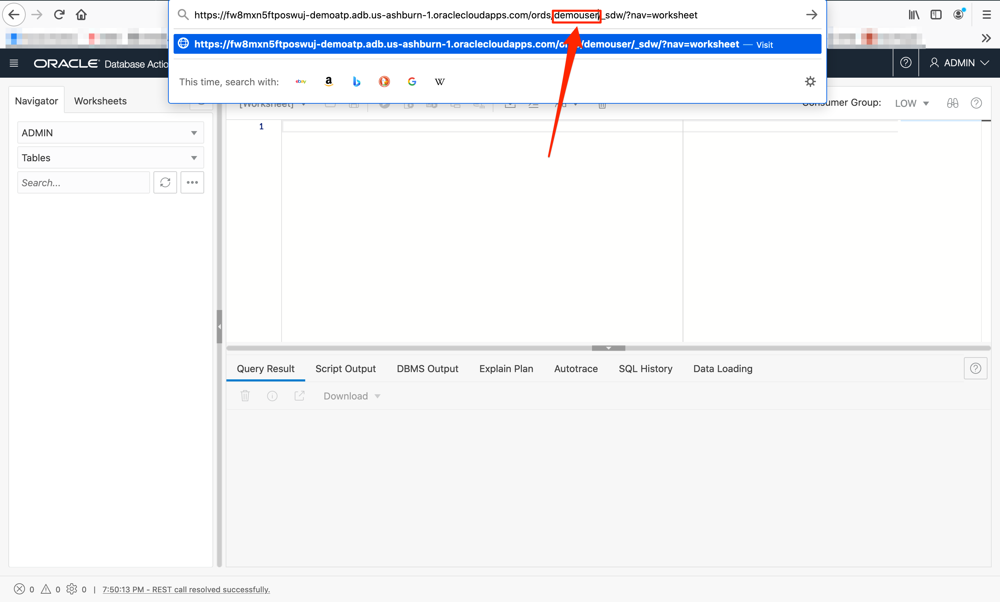

# Provision Autonomous Database and Compute Instance

## Introduction

In this lab, you will provision a Oracle linux compute instance and log into the instance. Then provision the Oracle Autonomous Database (ADB) instance and connect to the database as new user.

Estimated Time: 20 minutes

### Objectives

In this lab, you will:

- Provision a Oracle Linux compute instance and SSH into the instance
- Provision an Oracle Autonomous Transaction Processing instance
- Create a new database user using Database Actions
- Connect to ATP database as a new user from SQL Developer Web

### Prerequisites

This workshop assumes you have:

- Logged in to your own cloud account or a LiveLabs account.

## Task 1: Provision a Compute Instance

1. Click on hamburger menu, search for **Compute** and select **Instances** under Compute.

    

2. Make sure you are in the same region and compartment as the provisioned ATP instance and click on **Create Instance**.

    

3. Give a name to the instance. In this lab, we use the Name - **DEMOVM**.

    

4. In Placement, Image and shape, choose the following:
    - **Availability Domain** - For this lab, leave the default instance Placement to Always Free Eligible or you can click on **Edit** and choose an Availability Domain (AD).
    - **Image and shape** - For this lab, leave the default - Always Free Eligible resource or you can click on **Edit** to change the image and shape.

    
    

5. In Add SSH keys, choose **Paste public keys** and paste the public key noted earlier in lab 1 and click **Create**.

    *Note* - If the instance is not provisioning, choose a different Availability Domain (AD) and repeat 3 to 5 steps.
    

6. Your instance will begin provisioning. In a few minutes, the state will turn from Provisioning to Running. At this point, your compute instance is ready to use! Have a look at your instance's details and copy the **Public IP Address** to use later.

    
    

## Task 2: Connect to your Compute instance

There are multiple ways to connect to your cloud instance. Choose the way to connect to your cloud instance that matches the SSH Key you generated.  *(i.e If you created your SSH Keys in cloud shell, choose cloud shell)*

- Oracle Cloud Shell
- MAC or Windows CYCGWIN Emulator
- Windows Using Putty

### Oracle Cloud Shell

1. To re-start the Oracle Cloud shell, go to your Cloud console and click the cloud shell icon to the right of the region.  *Note: Make sure you are in the region you were assigned*

    

2.  Go to **Compute** -> **Instance** and select the instance you created (make sure you choose the correct compartment)

    
    

3.  On the instance homepage, find the Public IP address for your instance.

    

4.  In the command  below, replace "sshkeyname" with your actual ssh key name from Lab 1 and replace "Your Compute Instance Public IP Address" with the one you copied in Task 1 of this lab. Enter the edited command to login to your instance.     
    ````
    ssh -i ~/.ssh/<sshkeyname> opc@<Your Compute Instance Public IP Address>
    ````

    *Note: The angle brackets <> should not appear in your code.*
    

5.  When prompted, answer **yes** to continue connecting.

    

6.  Proceed to the next task on the left hand menu.

### MAC or Windows CYGWIN Emulator
1.  Go to **Compute** -> **Instance** and select the instance you created (make sure you choose the correct compartment)
2.  On the instance homepage, find the Public IP address for your instance.

3.  Open up a terminal (MAC) or cygwin emulator as the opc user.  Enter yes when prompted.

    ````
    ssh -i ~/.ssh/<sshkeyname> opc@<Your Compute Instance Public IP Address>
    ````
    

    

    *Note: The angle brackets <> should not appear in your code.*

4.  After successfully logging in, proceed to next task.

### Windows using Putty

1.  Open up putty and create a new connection.

    ````
    ssh -i ~/.ssh/<sshkeyname> opc@<Your Compute Instance Public IP Address>
    ````
    

    *Note: The angle brackets <> should not appear in your code.*

2.  Enter a name for the session and click **Save**.

    

3. Click **Connection** > **Data** in the left navigation pane and set the Auto-login username to root.

4. Click **Connection** > **SSH** > **Auth** in the left navigation pane and configure the SSH private key to use by clicking Browse under Private key file for authentication.

5. Navigate to the location where you saved your SSH private key file, select the file, and click Open.  NOTE:  You cannot connect while on VPN or in the Oracle office on clear-corporate (choose clear-internet).

    

6. The file path for the SSH private key file now displays in the Private key file for authentication field.

7. Click Session in the left navigation pane, then click Save in the Load, save or delete a stored session STEP.

8. Click Open to begin your session with the instance.

Congratulations!  You now have a fully functional Linux instance running on Oracle Cloud Compute.

## Task 3: Provision an ATP Instance

1. If you are using a Free Trial or Always Free account, and you want to use Always Free Resources, you need to be in a region where Always Free Resources are available. You can see your current default **Region** in the top, right hand corner of the page.

    

2. Once you are logged in, you can view the cloud services dashboard where all the services available to you. Click on hamburger menu, search Oracle Database and choose Autonomous Transaction Processing (ATP).

    **Note:** You can also directly access your Autonomous Transaction Processing service in the **Quick Actions** section of the dashboard.

    

3. From the compartment drop-down menu select the **Compartment** where you want to create your ATP instance. This console shows that no databases yet exist. If there were a long list of databases, you could filter the list by the **State** of the databases (Available, Stopped, Terminated, and so on). You can also sort by **Workload Type**. Here, the **Transaction Processing** workload type is selected.

    
    

4. Click **Create Autonomous Database** to start the instance creation process.

    

5.  This brings up the **Create Autonomous Database** screen. Specify the configuration of the instance:
    - **Compartment** - Select a compartment for the database from the drop-down list.
    - **Display Name** - Enter a memorable name for the database for display purposes. This lab uses **DEMOATP** as the ADB display name.
    - **Database Name** - Use letters and numbers only, starting with a letter. Maximum length is 14 characters. (Underscores not initially supported.) This lab uses **DEMOATP** as the database name.

    

6. Choose a workload type, deployment type and configure the database:
    - **Choose a workload type** - For this lab, choose __Transaction Processing__ as the workload type.
    - **Choose a deployment type** - For this lab, choose **Shared Infrastructure** as the deployment type.
    - **Always Free** - If your Cloud Account is an Always Free account, you can select this option to create an always free autonomous database. An always free database comes with 1 CPU and 20 GB of storage. For this lab, we recommend you to check **Always Free**.
    - **Choose database version** - Select a database version from the available database versions.
    - **OCPU count** - Number of CPUs for your service. Leave as it is. An Always Free databas comes with 1 CPU.
    - **Storage (TB)** - Storage capacity in terabytes. Leave as it is. An Always Free database comes with 20 GB of storage.
    - **Auto Scaling** - For this lab, leave auto scaling unchecked.

    
    

7. Create administrator credentials, choose network access and license type and click **Create Autonomous Database**.

    - **Password** - Specify the password for **ADMIN** user of the service instance. For this lab, we use the password - **WElcome123##**.
    - **Confirm Password** - Re-enter the password to confirm it. Make a note of this password. For this lab, re-enter and confirm password - **WElcome123##**.
    - **Choose network access** - For this lab, accept the default, "Allow secure access from everywhere".
    - **Choose a license type** - For this lab, choose **License Included**.

    
    


8.  Your instance will begin provisioning. In a few minutes, the state will turn from Provisioning to Available. At this point, your Autonomous Transaction Processing database is ready to use! Have a look at your instance's details here including its name, database version, OCPU count, and storage size.

    

    

## Task 4: Create a New User Using Database Actions

1. On the DEMOATP instance details page, click on the **Tools** tab, select **Database Actions**, a new tab will open up.
    

2. Provide the **Username - ADMIN** and click **Next**.
    

3. Now provide the **Password - WElcome123##** for the ADMIN user you created when you provisioned your ADB instance and click **Sign in** to sign in to Database Actions.
    

4.  In Oracle Database Actions menu, select **Database Users** under Administration.
    

5. Click on **Create User** to create a new user to access the database.
    

6. In the Create User page, under User tab, provide the following details:
    - **User Name** - Give the new user a User Name. In the lab, we name the user **Username - DEMOUSER**
    - **Password** - Provide the new user a password and confirm the Password. In this lab, we provide the same password as admin user for ease of use, **Password - WElcome123##** and confirm the password.
    - **Quota on tablespace DATA** - Set a value for the Quota on tablespace DATA for the user. Click the drop-down and choose **500M**.
    - **Web Access** - Turn on the Web Access radio button to access the SQL Developer Web.
    - **Web access advanced features** - Expand the Web access advanced features and turn off the Authorization required radio button to disable the authorization for `demouser` REST services

    

7. In the Create User page, under Grant Roles tab, search for all three of these roles: **CONNECT**, **RESOURCE**, **DWROLE**. Check both the Granted and Default checkboxes for each one.

    
    
    

8.  Click **Create User**.

    

    Notice that the new user is created successfully.
    

9. Click on the copy button for the DEMOUSER REST link and save it noted. Edit the link in notepad by removing the `/ords/demouser/_sdw/` at the end of the link and save it as Autonomous Database URL.

    The saved link should look like this

    ```
    https://c7arcf7q2d0tmld-demoatp.adb.us-ashburn-1.oraclecloudapps.com
    ```
    

## Task 5: Connect to ATP as a New User from SQL Developer Web

1. Click on the hamburger menu of the Oracle Database Actions and select **SQL** under Development.

    

2. Click on the the URL of the SQL Developer Web tab, replace `admin` with **DEMOUSER** and hit Enter.

    

3. On the Database Actions sign in page, provide the **Username - DEMOUSER**, **Password - WElcome123##** and click **Sign In**.

    

Congratulations!! Now you are connected to the ATP instance as DEMOUSER from SQL Developer Web.

## Acknowledgements

* **Author** - Anoosha Pilli, Database Product Manager
* **Contributors** -  Anoosha Pilli, Database Product Management
* **Last Updated By/Date** - Brianna Ambler, August 2021
