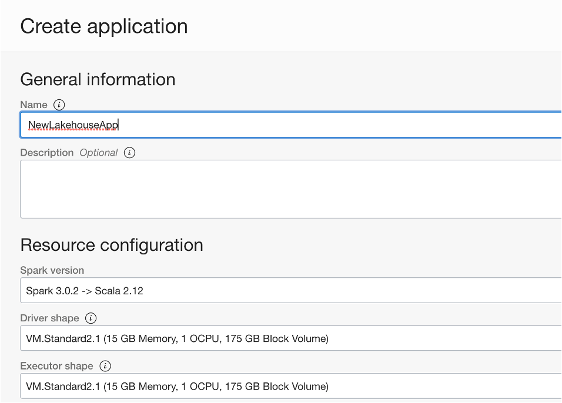
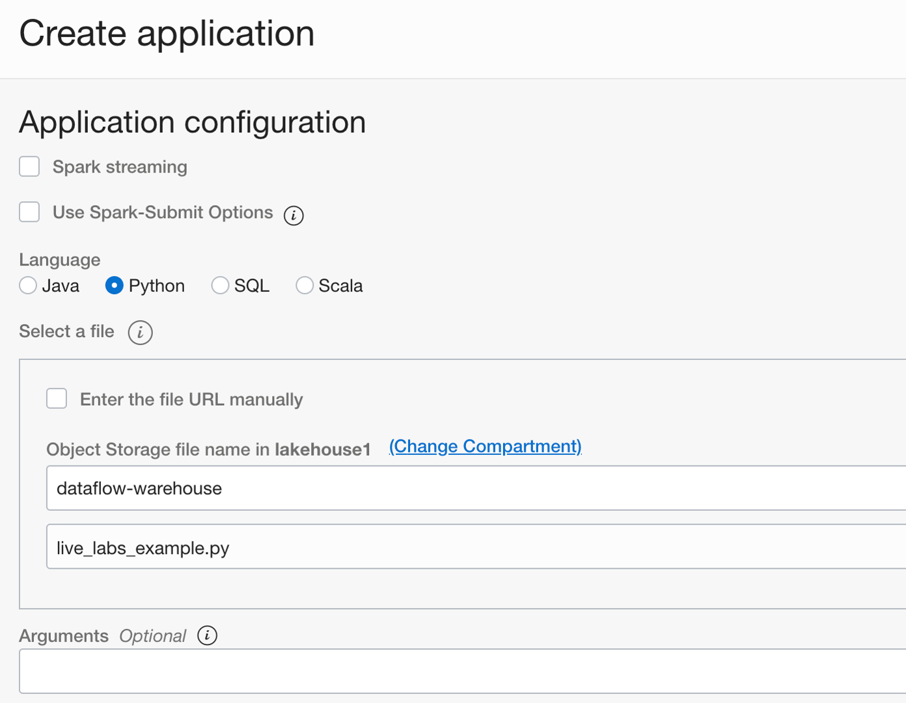

# OCI Data Flow in the Data Lake

## Introduction

Data is constantly growing being enhanced, validated and updated. That is why once you have the data assets you need to make sure that processing continues to manage the data assets and provide updated values you data lake.

OCI Data Flows handles these processes by loading new data or updating.

Estimated time: 20 minutes

Watch the video below for a quick walk through of the lab.

[](youtube:arWzMjy5-y8)

### Objectives

* Learn how to create OCI Data Flow from OCI Data Integration
* Learn how to create an OCI Data Flow App
* Learn how to schedule to automate OCI Data Flow Apps

## Task 2: Create OCI Data Flow from Data Integration

In this step, we are going to use again Quick Actions to click on Create Data Flow and then use the designer to setup the source and target along with any other filters we would like.


By default, at the bottom of the designer,  you want to enter the name for the New Data Flow, DataFlow_UploadGenre, and Select the Project that was created in the last lab.


Then click Create. This way you can save as you go along to in order not to lose any changes.

From the toolbar, there are sources, targets, filters, joins and other options. You are going to drag the source icon over to the design area. Then start to fill out the details for the source by clicking on Select, and then choose the ADW asset that was created in the first lab. Select the Default Connection, and in Schema, ADMIN. For the Entity choose the MOVIE_GENRE table. 


Next you want to filter the data in order not to pull in the entire data set. If this was streaming it or large files this would be an important step.


Now you are going to drag the Target icon over to the designer area. Target is going to be defined as the Object Storage that was created for the dataflow-warehouse. You can insert, overwrite or merge data with the existing data, and even create a new file or table here. This lab, you are just going to insert data, and choose one file which will overwrite the file each time.


Then click on the Data Entity and in the next menu type the name of the folder **File_output**. Choose JSON file. This will put the file based on the data and joins that you create into the data lake and allow other processes to use the data.


Save at this step, since you now have your source and target. Now you need to connect the source to the target. Drag the icon onto the designer area between the source and the target.
After Saving the dataflow, click on Validate, and the Snapshot should show 0s for Errors and Warnings.


## Task 2: Create an OCI Data Flow app

You have several choices on how to create applications and languages. You can choose something that makes sense for your environment. First, we are going to take a look at the OCI Data Flow and create an application to read through files in the object storage or data lake.

We have created a python script for you to use as part of your OCI Data Flow application. It requires a little bit of editing to get your ADB ID, user name and password added to script and then uploaded to object storage. We are going to use Cloud Shell to do the editing and upload to our object storage bucket.

Start Cloud Shell


From the current directory (your home directory of your user in Cloud Shell), create a file called livelabs_example.py

```
<copy>
vi live_labs_example.py
</copy>
```
Copy the following script and insert it into the live_labs_example.py file you are currently editing in Cloud Shell:

```
<copy>
from pyspark.sql import SparkSession
import sys

def oracle_datasource_example(spark):
    # Wallet  information.
    properties = {"adbId": "replacewithADBID","user" : "replacewithUSER","password": "replacewithPASSWORD"}

    print("Reading data from autonomous database.")
    df = spark.read.format("oracle").option("dbtable", SRC_TABLE).options(**properties).load()

    df.printSchema()

    print("Filtering recommendation.")
    df.filter(df.RECOMMENDED == "Y")

    print("Writing to autonomous database.")
    df.write.format("oracle").mode("overwrite").option("dbtable",TARGET_TABLE).options(**properties).save()

if __name__ == "__main__":
    spark = SparkSession \
        .builder \
        .appName("Python Spark Oracle Datasource Example") \
        .getOrCreate()

    # TODO: PROVIDE THE ARGUMENTS 
    ABD_ID = "replacewithADBID"
    SRC_TABLE = "ADMIN.EXPORT_STREAM_2020_UPDATED" 
    TARGET_TABLE = "ADMIN.MOVIE_GENRE" 
    USERNAME = "replacewithUSER"
    PASSWORD = "replacewithPASSWORD"

    oracle_datasource_example(spark)

    spark.stop()
</copy>
```

After pasting the above script, replace the ADB ID with your autonomous database ocid, replace the username and password for your autonomous database, probably ADMIN, where it stats replacewithXXXX. If you are unsure of your ADB ID, with Cloud Shell still open you can navigate to your ADW database from the hamburger menu to Autonomous Database and **Copy** the OCID to be pasted in the script in Cloud Shell in both places where it states "replacewithADBID".


Edit the replacewithXXXXX text with the correct information (paste with right click between the quotation marks:


See the edited file for the two places there are edits. When finished editing press **esc** **:wq** to save the file and your changes.

Upload this edited file to your object storage using the command line in Cloud Shell after replacing REPLACEYOURNAME with your actual namespace name (Namespace name can be found in OCI tenancy:

```
<copy>
oci os object put --file live_labs_example.py --namespace REPLACEYOURNAMESPACE --bucket-name dataflow-warehouse
</copy>
```


Navigate from the hamburger memu to storage and select buckets. And you should see your python script in your dataflow-warehouse bucket ready for you to use in your application.


Now, navigate to the OCI Data Flow and click on Create Application.


For creating the application, you need to have the python code and we are providing an example one. Also you will need to have access to the data files. Enter a name for the application and if you would like a description. Take the other defaults for the first part of the form.



For this example, choose python. Select Object Storage dataflow-warehouse, and then choose the file you just uploaded live_labs_example.py



Click on Show advanced options. And enter in the Spark configuration properties the key: spark.oracle.datasource.enabled and the value: true


Click on Create Application.

Now we can run the application by selecting the more option dots and selecting Run from the menu.


It of course depends on how big your data file is but this sample takes about two minutes to return successfully. This job has filtered out the data and populated the movie_genre table with the job.


You can also monitor your applications in the Spark UI. Click on the application name and click on the Spark UI button.


And there are additional views to see the details about the jobs and applications running and completed.


Now let's go back to OCI Data Integrations because we export our data flows from here into an application to run for OCI Data Flows.


## Task 3: Create an application for automation

Now you are going to navigate back to the data integration workspace, and click on Application. Click on create application.


Click on Save and Close. It is just a shell of an application where you can now publish tasks to be scheduled and run through the application.


## Task 4: Create and schedule OCI Data Flow apps for automation

Now you are going to navigate back to the project. Click on Task under Details and click on Create Task and choose Integration Task. This task is going to be included in the application.


Under Data Flow, you are going to click Select and add the Data Flow that you just finished creating in the previous task. Then click Save and Close.


Click on the menu for the task and select Publish to Application.


Choose the application that was just created in Task 2.


After the task has been added you will see run task or schedule, and you can navigate to the application. For regular loads of this data and automation, you are going to want to schedule the job to run. Again, to see how this is working now, click on Run.


You may now proceed to the next lab.

## Acknowledgements

* **Author** - Michelle Malcher, Database Product Management, Massimo Castelli, Senior Director Product Management
* **Contributors** - 
* **Last Updated By/Date** - Michelle Malcher, Database Product Management, September 2021
