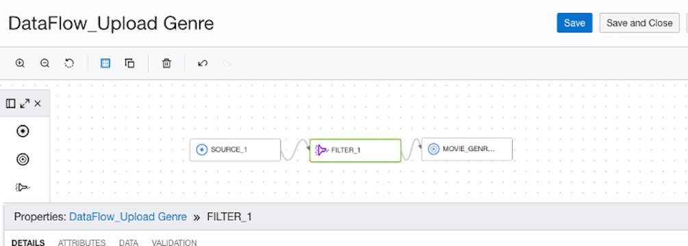
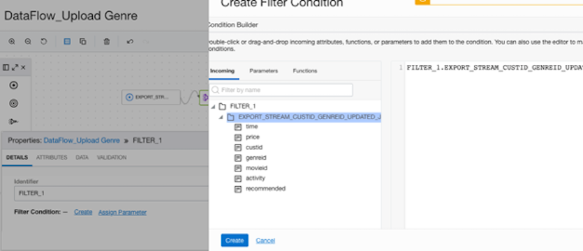
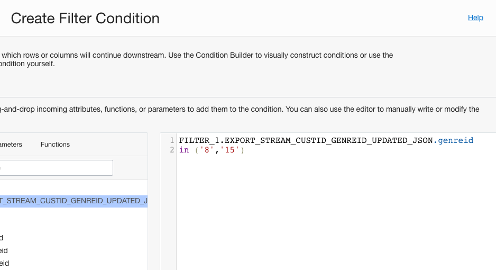
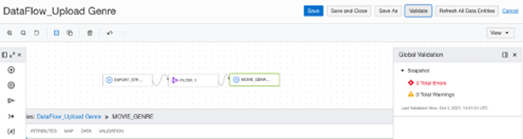

# OCI Data Flow in the Data Lake

## Introduction

Data is constantly growing being enhanced, validated and updated. That is why once you have the data assets you need to make sure that processing continues to manage the data assets and provide updated values you data lake.

OCI Data Flows handles these processes by loading new data or updating.

### Objectives

* Learn how to define OCI Data Flow
* Learn how to create an OCI Data Flow App
* Learn how to schedule to automate OCI Data Flow Apps

## Task 1: Define OCI Data Flow

In this step, we are going to use again Quick Actions to click on Create Data Flow and then use the designer to setup the source and target along with any other filters we would like.

By default, at the bottom of the designer,  you want to enter the name for the New Data Flow, DataFlow_Upload Genre, and Select the Project that was created in the last lab.

Then click Create. This way you can save as you go along to in order not to lose any changes.

From the toolbar, there are sources, targets and filters. You are going to drag the source icon over to the design area. Then we are going to start to fill out the details for the source by clicking on Select, and then choose the json data asset that was created in Lab 2.

Select the Default Connection, and in Schema, you are going to choose the compartment for the Data Lake, lakehouse1. The Schema is the name of the bucket, moviestream_bucket.

Now you are going to drag the Target icon over to the designer area. Target is going to be defined as the ADW database. You can insert, overwrite or merge data with the existing table, and even create a new table here. This lab, you are just going to insert data. 

Then click on Select for the Data Asset and select moviestream_adw. 

Continue with the Default Connection. Select ADMIN for Schema and movie_genre for the Data Entity.

Now you need your Filter, and for this exercise you are only going to pull specific genres. Drag the icon onto the designer area between the source and the target.

But before you can create the filter conditions, you have to connect the source to the file, and the filter to the target.

Click on Create Filter Condition, and since the connections are there between the target and filter, you see a list of columns that can be filtered on. For this exercise, just click on genreid.

The filter is going to be set for if genreid is in ('8','15'). Then click Save.

After Saving the dataflow, click on Validate, and the Snapshot should show 0s for Errors and Warnings.

## Task 2: Create and Schedule OCI Data Flow Apps for Automation

Now you are going to navigate back to the project. Click on Task under Details and click on Create Task. This task is going to be included in the application.

Under Data Flow, you are going to click Select and add the Data Flow that you just finished creating in the previous task. Then click Save and Close.

You may now [proceed to the next lab](#next).

## Acknowledgements

* **Author** - Michelle Malcher, Database Product Management
* **Last Updated By/Date** - Michelle Malcher, Database Product Management, September 2021
