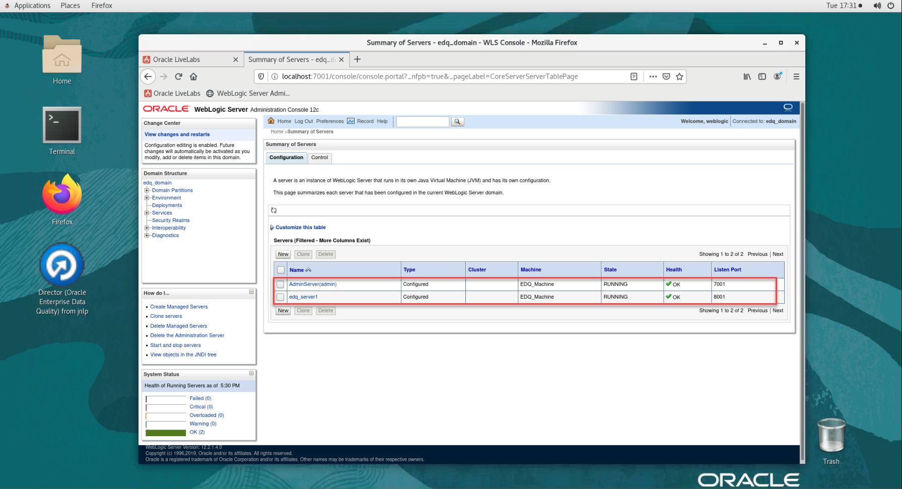
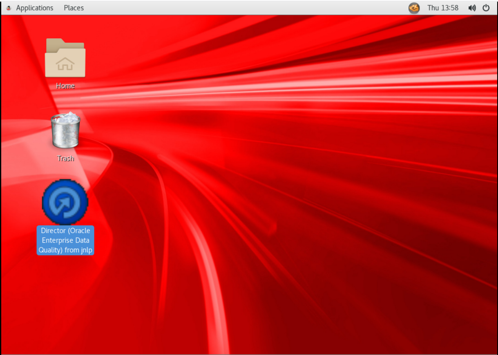
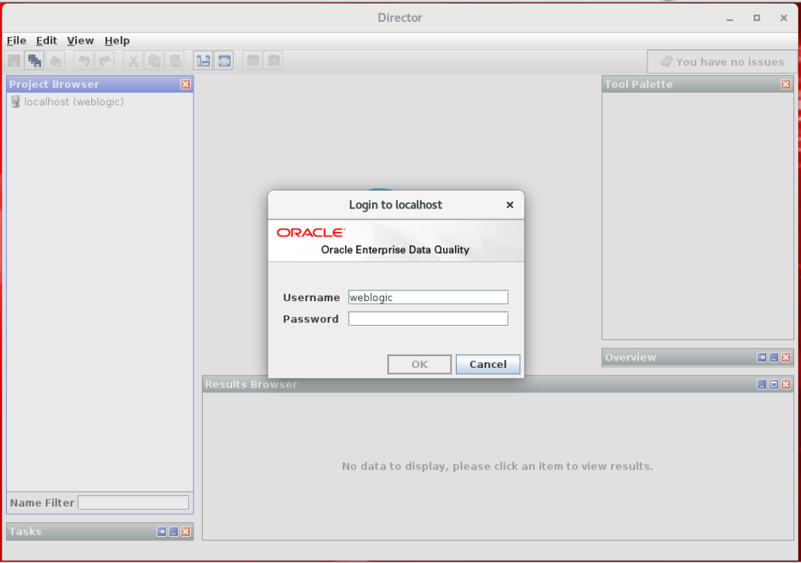
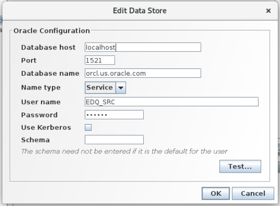

# Access and Configure EDQ Instance

## Introduction
This lab will show you how to access an EDQ instance using Apache Guacamole and create a new project in EDQ.

*Estimated Lab Time* - 15 minutes

### Objectives
* Access an EDQ Instance through Apache Guacamole
* Start EDQ Director
* Create New Project
* Create a Data Store and a Snapshot in EDQ
  
### Prerequisites
This lab assumes you have:
- A Free Tier, Paid or LiveLabs Oracle Cloud account
- SSH Private Key to access the host via SSH
- You have completed:
    - Lab: Generate SSH Keys
    - Lab: Prepare Setup
    - Lab: Environment Setup

## **STEP 1**: Access an EDQ instance through Apache Guacamole

1. Obtain the Apache Guacamole URL, credentials from the instructor and login into it using any browser.

    
2. Select "edqvnc" option after you login into the Guacamole.
   
    

3. Go to Applications -> Favorites -> Firefox.

        

4. Go to weblogic console and provide the login credentials.
   
   **URL:** http://localhost:7001/console

    ````
   <copy>
    username: weblogic
    password: oraedq123
   </copy>
    ````

    

    **Note:** If weblogic console is not working, run edq\_start\_up.sh script. This script will take 5 minutes to execute.

5.	In the login page, click on servers.

    

1.  If you see EDQ server and Admin server are running, you are good to proceed further.

    


### **Optional:** If EDQ is not running, use EDQ Start Script to start the Services

1. Right click on Home screen and select "Open Terminal".

    

2. Sudo to oracle user and run the edq\_start\_up.sh script to start the EDQ application.
   
    ````
   <copy>
    sudo su - oracle
    sh /home/oracle/scripts/edq_start_up.sh
   </copy>
    ````
     
This script will approximately take 5-10 minutes to start the Node Manager, Weblogic and EDQ Services.

Please login into weblogic console and check if all the EDQ services are up and running after 5 minutes.


## **STEP 2**: Start EDQ Director and Create new project in EDQ

1.	On the desktop, double click on Director icon.

    

2.	Select "Later" for the java update option.

    

3.	Wait a few minutes, you will receive a new message, click on “Run”.

    

4.	EDQ director will appear on your screen. Provide the Director login credentials.

    ````
   <copy>
    username: weblogic
    password: oraedq123
   </copy>
    ````

    

1. Take a moment to familiarize yourself with the Terminology of each of the four different areas of the Director application.

    

## **STEP 3**: Create a New Project
1.	In the "Project Browser", right-click "Projects" and select "New Project…" to start the wizard.

    

2.	Provide the following information:
    - Name: Exploring Customer Data
    - Description: Data Quality Project to Profile, Standardize, Match and Merge customer data
3.	Click on “Next >” button located at the bottom right corner.

    

4.	Ensure the “All Groups” checkbox is selected in “Project Permissions”; then click “Finish” button located at the bottom right.

    

The “Exploring Customer Data” project now appears in the Projects list!

## **STEP 4**: Create a Data Store and a Snapshot
Now that we have created a project, the next step is creating a Data Store. A Data Store is a connection to a source of data, whether the data is stored in a database or in one or more files.
1.	Expand the newly created project “Exploring Customer Data”, right click “Data Stores”, and select “New Data Store” to launch the wizard.

    

2.	Select "Server" on “Data is accessed from” field.
3.	Select “Database” on “Category” field.
4.	Select “Oracle” on the “Type” list and click “Next >” to continue.

    

5.	Provide the following data:
    ````
   <copy>
    Database host: localhost
    Port: 1521
    Database name: orcl.us.oracle.com
    Name type: Service
    User name: EDQ_SRC
    Password: oraedq
    Schema: 
   </copy>
    ````


6.	Click on “Test…” button located on the bottom right corner.

    

7.	When all information is correct, you will receive a message about connection success, click “OK”.

    

8.	Click on “Next > ” button located on the bottom right corner.
9.	Provide the following information as given below.
    - **Name**: Connection to Oracle Database
    - **Description**: Connection to US Custom Data
10.	Click on “Finish” button located on the bottom right corner.

    

11.	Now we will use this new connection and select a table for profiling and cleansing; the goal is to stage some of the data so we can begin to understand it. Right click “Staged Data” under your project and select “New Snapshot…”.

    

12.	Select the newly created database connection, then click “Next >” to continue.

    

13.	In “Table Selection”, select "US_Customers" from the list.  Click “Next >” to continue.

    

14.	In “Column Selection”, ensure all columns are selected, then click “Next >” to continue.

    

15.	In “Filter Options”, leave the default value of Simple and click “Next >” to continue.

    

16.	Sampling Options allows to specify the amount of data brought to the snapshot. If needed, it is possible to specify a certain “Count” or “Percentage” of data to be read for the snapshot. Leave the default and click “Next >“.

    

17.	Leave the default empty value for the ‘No Data’ Reference Data field, click on “Next >“.

    

18.	Provide the following data:
    - **Name**: US Customer Data
    - **Description**: Connection to Oracle Database.US_CUSTOMERS

19.	Verify that checkbox “Run Now?” is checked and click on “Finish”.

    

After a short delay, the Results Browser panel is populated. Taking the Snapshot causes EDQ to stage the data from the database into the EDQ data repository. From now on we will be working with the data residing in the "US_Customer" Data Snapshot and we will not be modifying or in any way accessing the source data.


Congratulations!  You may now *proceed to the next lab*.   

## Acknowledgements
* **Author** - Ravi Lingam, Sri Vishnu Gullapalli, Data Integration Team, Oracle, August 2020
* **Contributors** - Meghana Banka, Rene Fontcha
* **Last Updated By/Date** - Narayanan Ramakrishnan, NA Technology, December 2020

## Need Help?
Please submit feedback or ask for help using our [LiveLabs Support Forum](https://community.oracle.com/tech/developers/categories/goldengate-on-premises). Please click the **Log In** button and login using your Oracle Account. Click the **Ask A Question** button to the left to start a *New Discussion* or *Ask a Question*.  Please include your workshop name and lab name.  You can also include screenshots and attach files.  Engage directly with the author of the workshop.

If you do not have an Oracle Account, click [here](https://profile.oracle.com/myprofile/account/create-account.jspx) to create one.