# Consolidate Workloads to Autonomous Database using MV2ADB
## Introduction
Move to Autonomous Database (MV2ADB) is a tool, which migrates data from an "on premises" database to Autonomous Database Cloud utilizing Oracle Data Pump. Data Pump lets you Import your data into Autonomous Database using Data Pump Dump Files which are residing on Oracle Cloud Infrastructure Object Storage.
The MV2ADB tool is able to automatically take a data pump export, push it to OCI Object Storage, then it automatically imports it into the Autonomous Database using Data Pump in one command.
*Note: For using mv2adb for migration from source DB to ADB, the source DB should be at lower version than Autonomous Database.*


### Objectives
As a **root** user
1. Establish connectivity from source database instances to Target instance.
2. Install and configure MV2ADB tool on source databases.
3. Run the MV2ADB config script to migrate the databases from Source to Target.

### Required Artifacts
- A pre-provisioned dedicated autonomous database instance.
- Two pre-provisioned Source databases, one 19c and one 11g.
- ADB Wallet downloaded on your local machine.
- A pre-generated Auth Token from the console.


## STEP 1: Downloading ADB wallet to your local machine


- Navigate to your Autonomous Database and click on “DB Connection”.


- Click "Download Wallet"

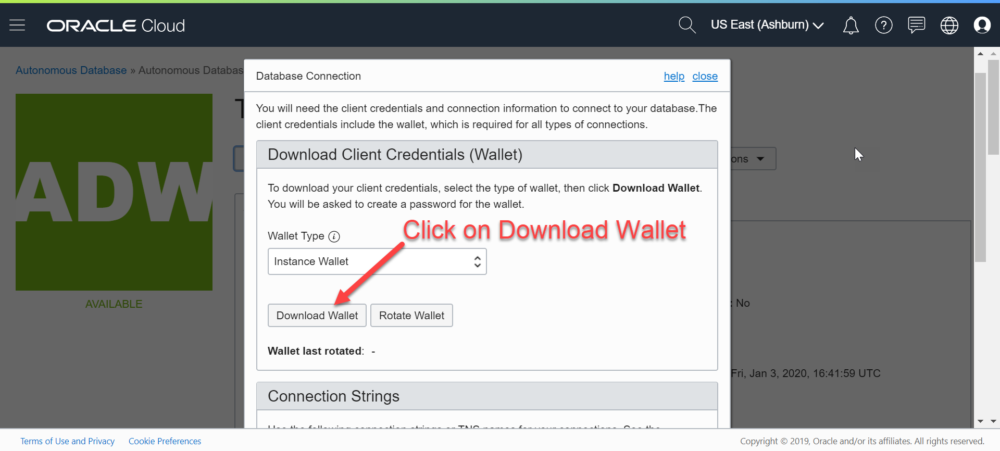

- Create a password for the wallet.


-  Click "Download"


## STEP 2: Generating an Auth Token and creating a bucket
##### Generating an Auth Token
- Click on your profile, then click your username


- Click on Auth Token, and click Generate


*Note: Copy your Auth Token to a notepad, as you cannot see it once you close the window.*


##### Creating a Bucket

- Login to your tenancy.
- Click on the menu in top left.
- Select Object Storage.


- Verify you are in the right compartment.
- Click "Create Bucket".


- Enter a name for your bucket, then hit Create Bucket again.


*Take note of your region, bucket name, and tenancy name for later.*


## STEP 3: Installing Instance Client on the Source database instances

- Navigate [here](https://www.oracle.com/database/technologies/instant-client/linux-x86-64-downloads.html) to find the links for the most recent instant client.
- Copy the file links of the following Instant Client packages by right clicking and selecting "Copy Link Address". Paste each one on your preferred text editor.
  - Basic Package (ZIP)
  - SQL*Plus Package (ZIP)
  - Tools Package (ZIP)

  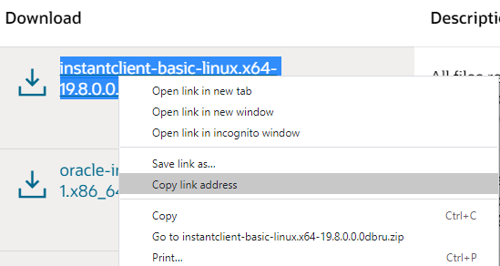


- Add "wget" in front of each copied link.
  ```
  wget https://download.oracle.com/otn_software/linux/instantclient/19800/instantclient-basic-linux.x64-19.8.0.0.0dbru.zip
  wget https://download.oracle.com/otn_software/linux/instantclient/19800/instantclient-sqlplus-linux.x64-19.8.0.0.0dbru.zip
  wget https://download.oracle.com/otn_software/linux/instantclient/19800/instantclient-tools-linux.x64-19.8.0.0.0dbru.zip
  ```


- Connect to both Source database instances, and switch to the ***root*** user.
```
ssh -i <private-key> opc@PublicIP
sudo su - root
```


<!-- HUMZA DONE !-->
- Run the "wget" commands that were created above on the root home directory on both Source database instances.
```
wget https://download.oracle.com/otn_software/linux/instantclient/19800/instantclient-basic-linux.x64-19.8.0.0.0dbru.zip
wget https://download.oracle.com/otn_software/linux/instantclient/19800/instantclient-sqlplus-linux.x64-19.8.0.0.0dbru.zip
wget https://download.oracle.com/otn_software/linux/instantclient/19800/instantclient-tools-linux.x64-19.8.0.0.0dbru.zip
```


- Unzip the files on both Source database instances.
```
unzip -o instantclient-basic-linux.x64-19.8.0.0.0dbru.zip
unzip -o instantclient-sqlplus-linux.x64-19.8.0.0.0dbru.zip
unzip -o instantclient-tools-linux.x64-19.8.0.0.0dbru.zip
```


- Navigate inside the directory named instantclient_yourversion on both Source database instances.
- Verify you have sqlplus, expdp, and impdp inside the directory on both Source database instances.
```
cd instantclient_19_8
ls -lrta
```


## STEP 4: Transferring the ADB wallet on your local machine to both Source database instances
- Using your preferred sftp client, connect to both Source database instances as opc user.
- Navigate to the /tmp/ folder on both Source database instances via the sftp client
- Upload the ADB wallet from your local machine to both Source database instances.
- Exit the sftp client on your local machine.
- On both Source database instances, connect as root and navigate to /root/instantclient_yourversion/network/admin.
- Move the ADB wallet from the /tmp/ directory to the /root/instantclient_yourversion/network/admin/ directory on both Source database instances.
- Unzip the ADB wallet inside the directory on both Source database instances.
```
mv /tmp/Wallet_T19.zip /root/instantclient_19_8/network/admin/
unzip Wallet_T19.zip
```
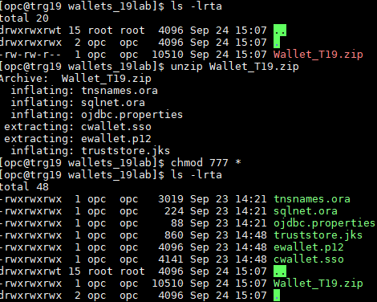


## STEP 5: Verifying both Source database instances can connect to the ADB database
- View the connect string via the tnsnames.ora from the ADB wallet on both Source database instances.
```
cd /root/instantclient_19_8/network/admin
cat tnsnames.ora
```
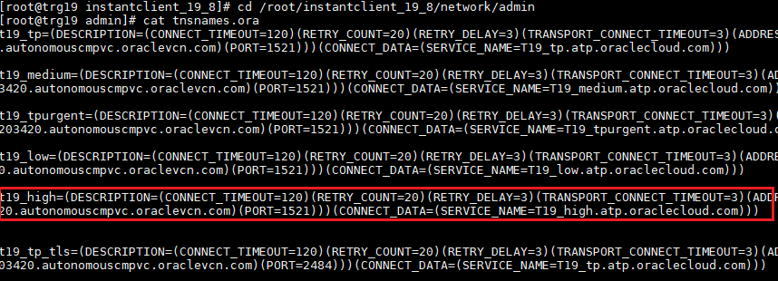
  *Note: Both 11g and 19c Source databases are being consolidated into one ADB database, so the connect string will be the same for both Source database instances.*


- Export instant client paths on both Source database instances.
```
export ORACLE_HOME=/root/instantclient_19_8
export LD_LIBRARY_PATH="$ORACLE_HOME"
export PATH="$ORACLE_HOME:$PATH"
```


 *Note: The ORACLE_HOME path may vary depending on your instant client version*


- Navigate to the base instant client directory on both Source database instances.
- Test connectivity to the Target database from both Source database instances.
```
cd /root/instantclient_19_8
./sqlplus ADMIN/DATABASEPASSWORD@t19_high
```
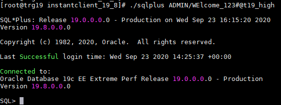


## STEP 6: Download and Install MV2ADB on both Source database instances.
- On your local machine, download the MV2ADB rpm file [here](https://support.oracle.com/epmos/faces/DocContentDisplay?_afrLoop=291097898074822&id=2463574.1&_afrWindowMode=0&_adf.ctrl-state=v0102jx12_4). Platform specific rpm can be downloaded under the History Tab.

  


- Using your preferred sftp client, connect to both Source database instances as opc user.
- Navigate to the /tmp/ folder on both Source database instances via the sftp client.
- Upload the MV2ADB rpm file from your local machine to both Source database instances.
- Exit the sftp client on your local machine.
- Connect as root and navigate to /tmp/ on both Source database instances.
- Install the RPM on both Source database instances.
```
rpm -i mv2adb-2.0.1-114.el6.x86_64.rpm
```
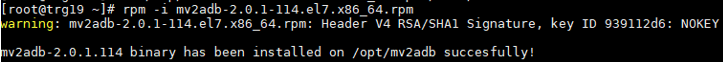


- Verify installation was successful on both Source database instances.
```
ls -lrta /opt/mv2adb
```


## STEP 7: Encrypt passwords of both Source database instances, Target database, and Auth Token.
- Encrypt the following passwords using the “mv2adb encpass” command, and save the values to a safe location (Eg: Notepad). Run the command for each password you would like to encrypt.
  - Both Source database SYS passwords.
  - ADMIN password of the Target database.
  - Auth Token.
```
cd /opt/mv2adb
./mv2adb.bin encpass
```
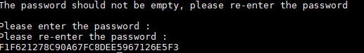

  *Note: If you get an error saying it cannot find the command, you may have to run the mv2adb.bin without any parameters to first initialize it! (./mv2adb.bin)*


## STEP 8: Configure the MV2ADB Script on both source database instances
- Backup the existing configuration file on both Source database instances.
```
cd /opt/mv2adb/conf/
cp DBNAME.mv2adb.cfg BKP_DBNAME.mv2adb.cfg
```


- The following parameters need to be edited in the config file on both Source database instances.
- Edit the config file by running VI on the config file on both Source database instances.
- When using vi, you enable editing by pressing the "i" key.
- To disable editing, press the "escape" key.
- To save, when editing is disabled, press the ":" key followed by "x" and then press "enter".
```
vi /opt/mv2adb/conf/DBNAME.mv2adb.cfg
```
```
DB_CONSTRING =//<hostname>/<servicename of DB>
SYSTEM_DB_PASSWORD=<enc_password>
SCHEMAS=<schemas to be migrated>
REMAP=<Source tablespace>:<Target tablespace>
DUMP_NAME=<name for your dump file>
DUMP_PATH=<path to store your dump file>
DUMP_FILES=<full path of dump file>
OHOME=<Oracle Home Path>
ICHOME=<Instant Client Path>
ADB_NAME=
ADB_PASSWORD=
ADB_CFILE=
OCI_REGION=
OCI_NAMESPACE=
OCI_BUCKET=
OCI_ID=
OCI_PASSWORD=  
```
- Unused parameters that need to be commented out.
- To comment, add a # as the first character of the line.
```
#DBV_USER=
#FULL=Y
#EXCLUDE=
#ADB_CORES=
#ADB_TARGET=  
```

### Finding parameters

##### DB_CONSTRING
Hostname
- Navigate to both Source database instances and switch to "Oracle" user.
- Set the environment on both Source database instances.
- Check the listener on both of the databases.
- Note down the "HOST" entry after the "Listening Endpoints Summary..." entry.
```
. oraenv
lsnrctl status
```
  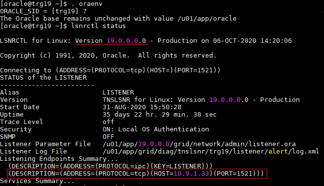
  


Service Name for **databases running 11g**
- With the environment still set for the 11g database, navigate to the tnsnames.ora file.
- View the file.
- Note down the "SERVICE_NAME" entry under the respective database entry.
```
cat $ORACLE_HOME/network/admin/tnsnames.ora
```
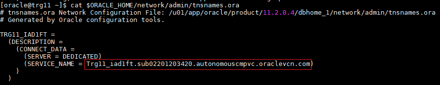


Service Name for **19c databases or any container databases above version 12**
- With the environment still set for the 19c database, connect to sqlplus.
- Display PDBs, and note down the targeted PDB for migration.
- Check the listener, and note down the first "Service" entry that starts with the targeted PDB name.
```
sqlplus / as sysdba
show pdbs
exit
lsnrctl status
```


Verifying DB_CONSTRING
```
sqlplus SYS/DATABASEPASSWORD@//HOSTNAME/SERVICENAME as sysdba
```

11g example
```
sqlplus SYS/WElcome_123#@//10.9.1.34/Trg11_iad1ft.sub02201203420.autonomouscmpvc.oraclevcn.com as sysdba
```
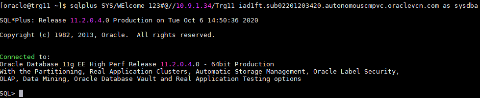

19c example
```
sqlplus SYS/WElcome_123#@//10.9.1.33/trg.sub02201203420.autonomouscmpvc.oraclevcn.com as sysdba
show con_name
```
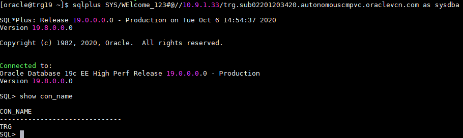


##### ADB_NAME
- The ADB target database name.
- This can be also found in the "tnsnames.ora" file inside the ADB Wallet. Do not include consumer group (e.g. _high)

##### ADB_PASSWORD
- The encrypted target ADB ADMIN password.

##### ADB_CFILE
- The ADB Wallet.zip file located in /root/instantclient_yourversion/network/admin.

##### OCI_NAMESPACE
- This is the Oracle Cloud Infrastructure tenancy name.

##### OCI_ID
- This is the Oracle Cloud Infrastructure login username.

##### OCI_PASSWORD
- This is the **ENCRYPTED** Auth Token.

#### Example of completed configuration file
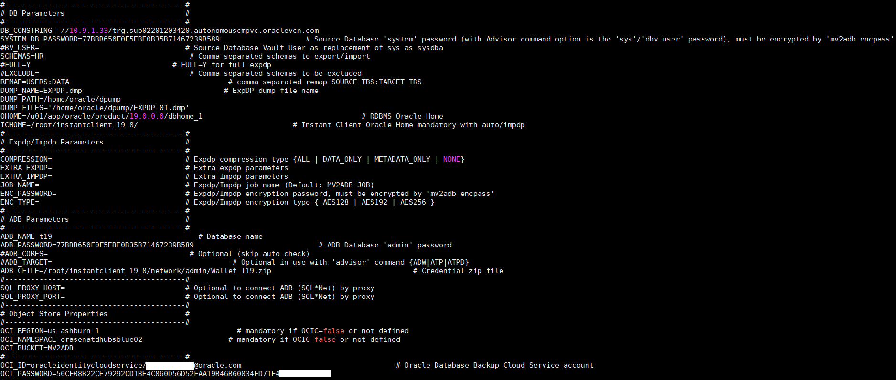


## STEP 9: Run the MV2ADB migration script on both Source database instances
The migration script will export from your source databases, then import into your Autonomous database using data pump. For more information, refer to the official steps from my Oracle support (MOS) [here](https://support.oracle.com/epmos/faces/DocContentDisplay?_afrLoop=291097898074822&id=2463574.1&_afrWindowMode=0&_adf.ctrl-state=v0102jx12_4).

- As root user on both source database instances, run the script in AUTO mode.
```
cd /opt/mv2adb
./mv2adb.bin auto -conf /opt/mv2adb/conf/DBNAME.mv2adb.cfg
```


## STEP 10: Validate the Data Migration
- On both source database instances, run the mv2adb report.
```
cd /opt/mv2adb
./mv2adb.bin report -conf conf/DBNAME.mv2adb.cfg
```

- 11g database example (MARKET SCHEMA)


- 19c database example (HR SCHEMA)


## Troubleshooting Common Issues
**Dump File errors**
- Make sure to clear out the dump file directory after each failed iteration.
```
rm /home/oracle/dpump/*
```


  *Note: Validate the rm command is being ran on the DUMP_PATH parameter.*

**Account Locked error**
- Switch to Oracle user, set environment (.oraenv), sqlplus, and unlock.
- The following commands will display all users that are locked, and how to unlock a user.
```
sqlplus / as sysdba
SELECT username, account_status, created, lock_date, expiry_date FROM dba_users WHERE account_status != 'OPEN';
ALTER USER username ACCOUNT UNLOCK
```

**Cannot Open Logfile**
- Change directory group from root:root to oracle:oninstall, and change permissions.
```
chown oracle:oinstall /home/oracle/dpump
chmod -R 660 /home/oracle/dpump
```


**Getting an unreasonable amount of errors**
- Verify the config file has the FULL=Y parameter commented out.

  

## Acknowledgements
*Great Work! You have successfully migrated two source database schemas (HR for 19c, and MARKET for 11g) into one ADB database.*

- **Author** - Noah Horner & Humza Meraj
- **Last Updated By/Date** - Noah Horner & Humza Meraj October 7th, 2020.
