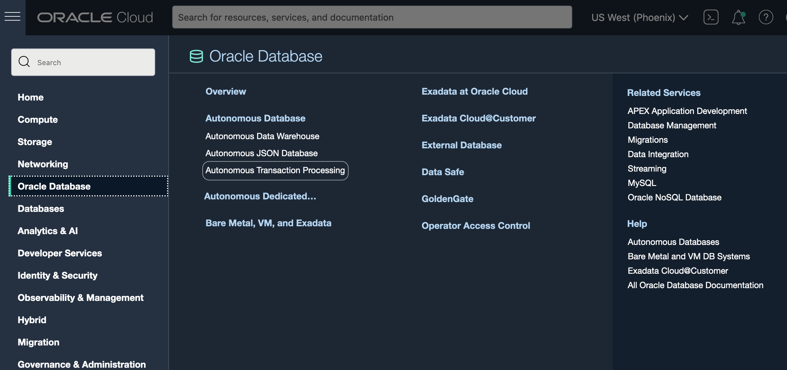
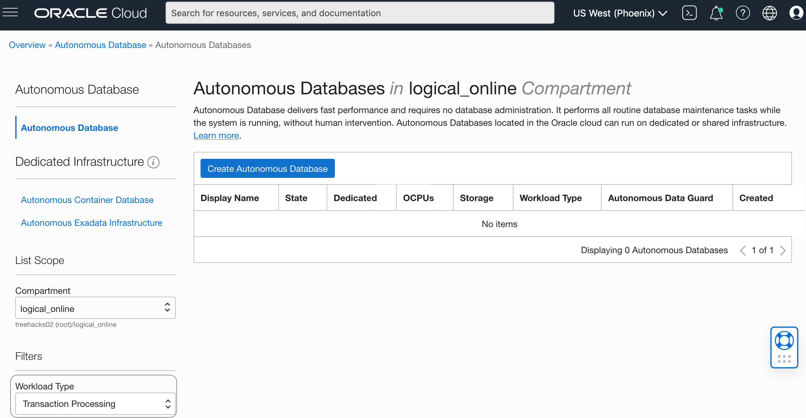
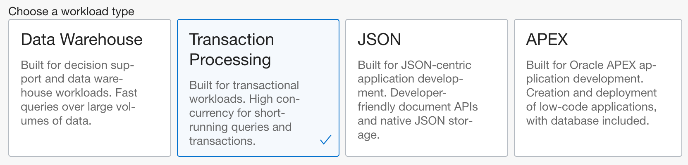
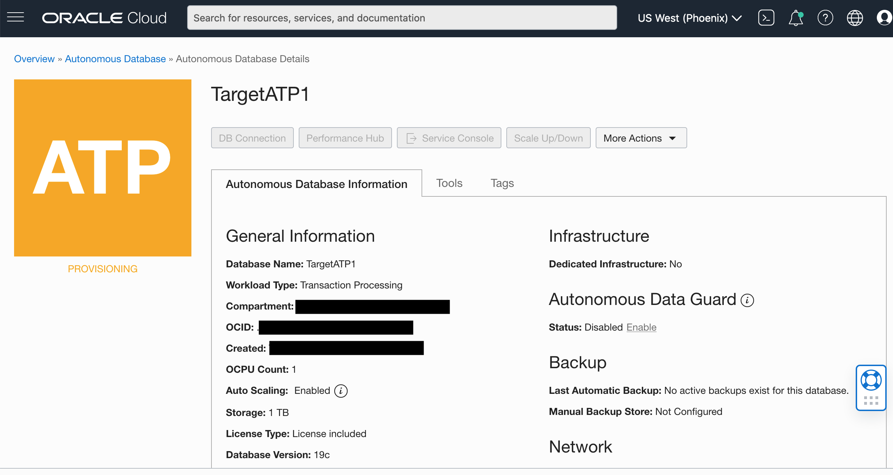

# Provision an Autonomous Database (Oracle Autonomous Data Warehouse and Oracle Autonomous Transaction Processing)

## Introduction

You will need to provision an autonomous database that will act as the target database we will be completing the migration with ZDM.

This lab walks you through the steps to get started using the Oracle Autonomous Database (Oracle Autonomous Data Warehouse and Oracle Autonomous Transaction Processing) on Oracle Cloud. In this lab, you provision a new Oracle Autonomous Transaction Processing instance.

 **Note:** While this lab uses Oracle Autonomous Transaction Processing, the steps are identical for creating an Oracle Autonomous Data Warehouse database. ZDM supports both type of databases as valid targets.

Estimated Lab Time: 5 minutes

### Objectives

In this lab, you will:

-   Learn how to provision a new Autonomous Database

### Prerequisites
This workshop section requires having access to an Oracle Cloud account.

## Task 1: Choosing Oracle Autonomous Transaction Processingfrom the Services Menu

1. Login to the Oracle Cloud.
2. Once you are logged in, you are taken to the cloud services dashboard where you can see all the services available to you. Click the navigation menu in the upper left to show top level navigation choices.

     **Note:** You can also directly access your Autonomous Data Warehouse or Autonomous Transaction Processing service in the __Quick Actions__ section of the dashboard.

    

3. The following steps apply similarly to either Autonomous Data Warehouse or Autonomous Transaction Processing. This lab shows provisioning of an Autonomous Transaction Processing database, so click **Autonomous Transaction Processing**.

    

4. Make sure your workload type is __Transaction Processing__ or __All__ to see your Autonomous Transaction Processing instances. Use the __List Scope__ drop-down menu to select a compartment. <if type="livelabs">Enter the first part of your user name, for example `LL185` in the Search Compartments field to quickly locate your compartment.

5. This console shows that no databases yet exist. If there were a long list of databases, you could filter the list by the **State** of the databases (Available, Stopped, Terminated, and so on). You can also sort by __Workload Type__. Here, the __Transaction Processing__ workload type is selected.

    

## Task 2: Creating the Oracle Autonomous Database instance

1. Click **Create Autonomous Database** to start the instance creation process.

    

2.  This brings up the __Create Autonomous Database__ screen where you will specify the configuration of the instance.

3. Provide basic information for the autonomous database:

    - __Choose a compartment__ - Use the same compartment as your compute instance.
    - __Display Name__ - Enter a memorable name for the database for display purposes. For this lab, use __TargetATP1__.
    - __Database Name__ - Use letters and numbers only, starting with a letter. Maximum length is 14 characters. (Underscores not initially supported.)
    For this lab, use __TargetATP1__. Please bear in mind that there must not be another database with the same name, otherwise there will be an issue while creating and provisioning it. 

4. Choose a workload type. Select the workload type for your database from the choices:

    - __Transaction Processing__ - For this lab, choose __Transaction Processing__ as the workload type.
    - __Data Warehouse__ - Alternatively, you could have chosen Data Warehouse as the workload type.

    

5. Choose a deployment type. Select the deployment type for your database from the choices:

    - __Shared Infrastructure__ - For this lab, choose __Shared Infrastructure__ as the deployment type.
    - __Dedicated Infrastructure__ - Alternatively, you could have chosen Dedicated Infrastructure as the deployment type.

    

6. Configure the database:

    - __Always Free__ - If your Cloud Account is an Always Free account, you can select this option to create an always free autonomous database. An always free database comes with 1 CPU and 20 GB of storage. For this lab, we recommend you leave Always Free unchecked.
    - __Choose database version__ - Select a database version from the available versions.
    - __OCPU count__ - Number of CPUs for your service. For this lab, specify __1 CPU__. If you choose an Always Free database, it comes with 1 CPU.
    - __Storage (TB)__ - Select your storage capacity in terabytes. For this lab, specify __1 TB__ of storage. Or, if you choose an Always Free database, it comes with 20 GB of storage.
    - __Auto Scaling__ - Auto scaling allows the system to automatically use up to three times more CPU and IO resources to meet workload demand.
    - __New Database Preview__ - If a checkbox is available to preview a new database version, do NOT select it.

    > **Note:** You cannot scale up/down an Always Free autonomous database.

    

7. Create administrator credentials:

    __Password and Confirm Password__ - Specify the password for ADMIN user of the service instance. We are using the password `WELcome##1234` again for ease and consistency. If you prefer to set your own you can do that as well. The password must meet the following requirements:
    - The password must be between 12 and 30 characters long and must include at least one uppercase letter, one lowercase letter, and one numeric character.
    - The password cannot contain the username.
    - The password cannot contain the double quote (") character.
    - The password must be different from the last 4 passwords used.
    - The password must not be the same password that is set less than 24 hours ago.
    - Re-enter the password to confirm it. Make a note of this password.

    

8. Choose network access:
    - For this lab, accept the default, "Allow secure access from everywhere".
    - If you want a private endpoint, to allow traffic only from the VCN you specify - where access to the database from all public IPs or VCNs is blocked, then select "Virtual cloud network" in the Choose network access area.
    - You can control and restrict access to your Autonomous Database by setting network access control lists (ACLs). You can select from 4 IP notation types: IP Address, CIDR Block, Virtual Cloud Network, Virtual Cloud Network OCID).

    

9. Choose a license type. For this lab, choose __License Included__. The two license types are:

    - __Bring Your Own License (BYOL)__ - Select this type when your organization has existing database licenses.
    - __License Included__ - Select this type when you want to subscribe to new database software licenses and the database cloud service.

10. Click __Create Autonomous Database__.

11.  Your instance will begin provisioning. In a few minutes, the state will turn from Provisioning to Available. At this point, your Autonomous Data Warehouse database is ready to use! Have a look at your instance's details including its name, database version, OCPU count, and storage size.

    

Please *proceed to the next lab*.

## Want to Learn More?

Visit [Oracle Autonomous Transaction Processing's documentation](https://docs.oracle.com/en/cloud/paas/atp-cloud/index.html) for information on the typical workflow for using this database service.

## Acknowledgements

- **Author** - Nilay Panchal, Oracle Autonomous Database Product Management
- **Adapted for Cloud by** - Richard Green, Principal Developer, Database User Assistance
- **Adapted for ZDM by** - Ameet Kumar Nihalani, Senior Principal Support Engineer, Oracle Cloud Database Migration
- **Adapted for ZDM by** - Ricardo Gonzalez, Senior Principal Product Manager, Oracle Cloud Database Migration
- **Contributors** - Oracle LiveLabs QA Team (Jeffrey Malcolm Jr, Intern | Arabella Yao, Product Manager Intern)
- **Last Updated By/Date** - Ricardo Gonzalez, January 2022
