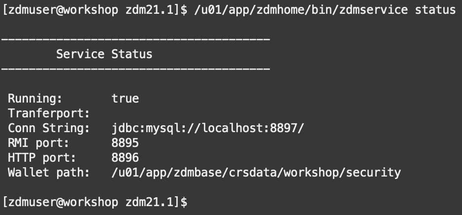

# Configure the ZDM Environment

## Introduction
In this lab on your host instance, you will:
* Install Oracle Cloud Infrastructure Command Line Interface (OCI CLI)
* Create a Zero Downtime Migration (ZDM) group and user
* Add directories for ZDM  
* Install and Start ZDM
* Generate API keys
* Create your OCI directories and configuration files under all 3 users: 'zdmuser', 'oracle', and 'opc'
* Create RSA keys


The CLI is a small-footprint tool that you can use on its own or with the Console to complete Oracle Cloud Infrastructure tasks. The CLI provides the same core functionality as the Console, plus additional commands. Some of these, such as the ability to run scripts, extend Console functionality.

The API keys you are generating are to allow the OCI CLI you installed on your host instance to connect to your OCI user profile to run commands. The RSA keys will allow you to SSH connect directly to 'oci' from 'zdmuser' which will be needed when running the Zero Downtime Migration.

The reason your OCI directory is being copied to 'zdmuser', 'oracle', and 'opc' is so that each of these 3 users can utilize the OCI CLI.

Estimate Lab Time: 20 minutes

**Disclaimer**: Throughout the workshop there will be locations where you are copying and pasting multiple lines of code at a time from the instructions into SQLPlus. However, the last line pasted will not commit until you manually hit enter a second time. To avoid statement failure, please be cognizant of this and hit enter twice when pasting.

## **Task 1: Install OCI CLI**
1. Return to your compute instance command prompt as 'opc'. If you navigated away while creating your target database, you can reconnect through your command prompt with the following command. Replace < sshkeyname > and < Your Compute Instance Public IP Address > with the key file name and IP address of your source compute instance:

    ```
    <copy>
    ssh -i ~/.ssh/<sshkeyname> opc@<Your Compute Instance Public IP Address>
    </copy>
    ```


2. Install OCI CLI. Respond y at the prompt.

    ```
    <copy>
    sudo yum install python36-oci-cli
    </copy>
    ```

## **Task 2: Set ZDM Group and User and Create Directories**
1. Run code below to add the group zdm, create the user zdmuser, and add directories for the ZDM.

    ```
    <copy>
    sudo groupadd zdm
    sudo useradd -g zdm zdmuser
    sudo mkdir /u01/app/zdmhome
    sudo mkdir /u01/app/zdmbase
    sudo mkdir /u01/app/zdmdownload
    sudo chown zdmuser:zdm /u01/app/zdmhome
    sudo chown zdmuser:zdm /u01/app/zdmbase
    sudo chown zdmuser:zdm /u01/app/zdmdownload
    </copy>
    ```

## **Task 3: Install Zero Downtime Migration**
1. As 'opc' check that the following packages are installed:
    * expect
    * glib-devel
    * oraclelinux-developer-release-el7

    Run the below command to check each of the 3 packages above:

    ```
    <copy>
    rpm -qa | grep expect
    rpm -qa | grep glib-devel
    rpm -qa | grep oraclelinux-developer-release-el7
    </copy>
    ```

    If any of the packages are missing run the following command replacing `<package>` with the missing package name:

    ```
    <copy>
    sudo yum install <package>
    </copy>
    ```

2. Switch to the newly created 'zdmuser' and go to the directory 'zdmdownload'.

    ```
    <copy>
    sudo su - zdmuser
    cd /u01/app/zdmdownload
    </copy>
    ```

3. Retrieve the ZDM install file, unzip it, and go to the directory.

    ```
    <copy>
    wget https://objectstorage.us-ashburn-1.oraclecloud.com/p/mvN0sYf5aYnY5Skvy8gCB2gbHgvJ-1Hcwbx2sNgH7lPjSgm46v-PvevSOvV1u4lt/n/frwachlef5nd/b/MV2ADB/o/zdm21.1.zip
    unzip zdm*.zip
    cd zdm21.1
    </copy>
    ```

4. Run the install and start the service.

    Install ZDM:

    ```
    <copy>
    ./zdminstall.sh setup oraclehome=/u01/app/zdmhome oraclebase=/u01/app/zdmbase ziploc=/u01/app/zdmdownload/zdm21.1/zdm_home.zip -zdm
    </copy>
    ```

    Start ZDM service:

    ```
    <copy>
    /u01/app/zdmhome/bin/zdmservice start
    </copy>
    ```

    Check its status:

    ```
    <copy>
    /u01/app/zdmhome/bin/zdmservice status
    </copy>
    ```

    

## **Task 4: Generating API Keys**
1. As 'zdmuser' go to 'zdmhome' directory.

    ```
    <copy>
    cd /u01/app/zdmhome
    </copy>
    ```

2. Create your .oci directory and generate your API keys. Copy the catted 'oci\_api\_key\_public.pem' file to your clipboard. During the copy, include the "Begin Public Key" and "End Public Key" lines.

    ```
    <copy>
    mkdir .oci
    cd .oci
    openssl genrsa -out /u01/app/zdmhome/.oci/oci_api_key.pem 2048                        
    openssl rsa -pubout -in /u01/app/zdmhome/.oci/oci_api_key.pem -out /u01/app/zdmhome/.oci/oci_api_key_public.pem
    cat oci_api_key_public.pem
    </copy>
    ```

3. On your OCI Dashboard navigate to and click on your user profile in the top right. Select the top option, your user.
    

4. Select 'API Keys' and 'Add API Key'.
    

5. Paste your public OCI API key file you copied above and click "Add Key".
    

6. You will see a configuration file preview. Copy its contents to clipboard. You will be using it to populate your configuration file in the following step.
    

## **Task 5: Creating Your Configuration File and Copying Your Directory**
1. Back in your command prompt create your config file.

    ```
    <copy>
    vi config
    </copy>
    ```

2. 'i' command lets you insert text into the file.

    ```
    <copy>
    i
    </copy>
    ```

3. Paste the config file preview contents that were copied to clipboard into the file.

4. Replace < path to your private keyfile > # TODO with:

    ```
    <copy>
    /u01/app/zdmhome/.oci/oci_api_key.pem
    </copy>
    ```

    

5. Press the escape key to escape insert.

6. To save and quit vi editor.

    ```
    <copy>
    :wq!
    </copy>
    ```

    If you need to leave vi editor without saving.

    ```
    <copy>
    :q!
    </copy>
    ```

7. Copy ''.oci' to 'opc'. Start by switching from 'zdmuser' to 'opc'.

    ```
    <copy>
    exit
    </copy>
    ```

8. Go to root directory and make .oci directory.

    ```
    <copy>
    cd ~
    mkdir .oci
    cp /u01/app/zdmhome/.oci/config /home/opc/.oci
    cp /u01/app/zdmhome/.oci/oci_api_key.pem /home/opc/.oci
    cp /u01/app/zdmhome/.oci/oci_api_key_public.pem /home/opc/.oci
    </copy>
    ```

9. Update the config file.

    ```
    <copy>
    cd .oci
    vi config
    </copy>
    ```
10. 'i' command lets you insert text into the file.

    ```
    <copy>
    i
    </copy>
    ```

11. Update the last line, key_file path, to ~/.oci/oci\_api\_key.pem and then save and quit the vi editor.

    ```
    <copy>
    ~/.oci/oci_api_key.pem
    </copy>
    ```
    


12. To save and quit vi editor.

    ```
    <copy>
    :wq!
    </copy>
    ```


13. Lock the private key file.
    ```
    <copy>
    chmod go-rwx ~/.oci/oci_api_key.pem
    </copy>
    ```


14. Test OCI CLI as 'opc'. Ignore any warnings. If the output is similar to the image below the test was successful.

    ```
    <copy>
    oci iam region list
    </copy>
    ```

    

15. Repeat the steps for 'oracle'.

    ```
    <copy>
    sudo su - oracle
    cd ~
    mkdir .oci
    mkdir /u01/app/oracle/export
    cd .oci
    cp /u01/app/zdmhome/.oci/config /home/oracle/.oci
    cp /u01/app/zdmhome/.oci/oci_api_key.pem /home/oracle/.oci
    cp /u01/app/zdmhome/.oci/oci_api_key_public.pem /home/oracle/.oci		
    </copy>
    ```


16. Update the config file.

    ```
    <copy>
    vi config
    </copy>
    ```
17. 'i' command lets you insert text into the file.

    ```
    <copy>
    i
    </copy>
    ```

18. Update the last line, key_file path, to ~/.oci/oci\_api\_key.pem and then save and quit the vi editor.

    ```
    <copy>
    ~/.oci/oci_api_key.pem
    </copy>
    ```
    


19. To save and quit vi editor.

    ```
    <copy>
    :wq!
    </copy>
    ```


20. Lock private key file.

    ```
    <copy>
    chmod go-rwx ~/.oci/oci_api_key.pem
    </copy>
    ```

21. Test OCI CLI with 'oracle'. Ignore any warnings. If the output is similar to the image below the test was successful.

    ```
    <copy>
    oci iam region list
    </copy>
    ```
    

    
22. Lock 'zdmuser' private key file.

    ```
    <copy>
    exit
    sudo su - zdmuser
    cd /u01/app/zdmhome/.oci
    chmod go-rwx /u01/app/zdmhome/.oci/oci_api_key.pem
    </copy>
    ```

## **Task 6: Creating RSA Keys**

1. As 'zdmuser' go to root directory and generate RSA keys. Hit enter key 3 times for no password and to save to /home/zdmuser/.ssh/id_rsa.

    ```
    <copy>
    cd ~
    ssh-keygen
    </copy>
    ```

2. Switch from 'zdmuser' to 'opc'.

    ```
    <copy>
    exit
    </copy>
    ```

3. Create a copy of the public key file under 'opc'.

    ```
    <copy>
    cd ~/.ssh
    sudo cat /home/zdmuser/.ssh/id_rsa.pub >> /home/opc/.ssh/authorized_keys
    </copy>
    ```

4. There should now be two keys under authorized_keys:

    ```
    <copy>
    cat authorized_keys
    </copy>
    ```

        


## **Task 7: Configuring Connectivity Between ZDM, OGG Hub, Source and Target**

1. Edit the /etc/hosts file

    ```
    <copy>
    sudo vi /etc/hosts
    </copy>
    ```

2. 'i' command lets you insert text into the file.

    ```
    <copy>
    i
    </copy>
    ```

3. Add entries for the OGG Hub. Use the following as an example but update with the values current for your environment:

    ```
    <copy>
    ogg_host_ip ogg_host_address ogg_host_domain_name 
    </copy>
    ```

4. To save and quit vi editor.

    ```
    <copy>
    :wq!
    </copy>
    ```


## **Task 8: Adding OGG self-signed Certificate**

Oracle GoldenGate Hub uses a self-signed certificate which can cause an issue, in order to preempt this please copy the following so that it can be pasted on a file to be created on next step. 

1. As the zdmuser, open the vi editor for a new file named zdm_add_cert.sh

    ```
    <copy>
    sudo su - zdmuser
    vi zdm_add_cert.sh
    </copy>
    ```
2. 'i' command lets you insert text into the file.

    ```
    <copy>
    i
    </copy>
    ```

3. Paste the contents of the following script.

    ```
    <copy>
    #!/bin/bash
    #
    # Copyright (c) 2019, 2020, Oracle and/or its affiliates. All rights reserved.
    #
    # NAME
    # Workaround for SunCertPathBuilderException: unable to find valid certification path to requested target
    #
    # DESCRIPTION
    # GoldenGate hub created using OCI Marketplace will have
    # an Nginx server with a self-signed certificate which
    # will cause above Java error.
    # This script adds the specified GoldenGate hub's
    # self-signed certificate to ZDM Server's JDK trust store.
    #
    # NOTES
    # Set ORACLE_HOME environment variable to execute this script.
    # Usage: zdm_add_cert.sh <gghub_hostname_or_ip>
    #
    #
    REMHOST=$1
    REMPORT=443
    #Make sure we use the short host name (-s is not available in Solaris)
    LOCALHOST_NAME=`/bin/hostname | /bin/cut -d . -f 1 | tr '[:upper:]' '[:lower:]'`
    ORACLE_BASE=`$ORACLE_HOME/bin/orabase`
    if [ $? -ne 0 ]; then
    echo "ERROR: failed to determine Oracle base"
    exit 1
    fi
    echo "stopping zdmserver"
    $ORACLE_HOME/bin/zdmservice stop
    if [ $? -eq 1 ]; then
    echo "ERROR: failed to stop zdmserver"
    exit 1
    fi
    JDKHOME="$ORACLE_HOME/jdk"
    KEYTOOL="$JDKHOME/jre/bin/keytool"
    KEYSTORE_PASS=changeit
    JDKCACERTS="$JDKHOME/jre/lib/security/cacerts"
    TMPDIR="/tmp/"
    CERT_TO_IMPORT="${TMPDIR}${REMHOST}_${REMPORT}.pem"
    for CACERTS in `ls $JDKCACERTS`
    do
    if [ -e "$CACERTS" ]
    then
    echo "Adding certs to $CACERTS"
    set -e
    rm -f $CERT_TO_IMPORT
    if openssl s_client -connect $REMHOST:$REMPORT 1> $TMPDIR/keytool_stdout 2> $TMPDIR/output </dev/null
    then
    :
    else
    cat $TMPDIR/keytool_stdout
    cat $TMPDIR/output
    exit 1
    fi
    echo "extracting certificate from $CERT_TO_IMPORT"
    if sed -ne '/-BEGIN CERTIFICATE-/,/-END CERTIFICATE-/p' < $TMPDIR/keytool_stdout > $CERT_TO_IMPORT
    then
    :
    else
    echo "ERROR: Unable to extract the certificate from $CERT_TO_IMPORT ($?)"
    cat $TMPDIR/output
    exit 1
    fi
    if $KEYTOOL -list -storepass ${KEYSTORE_PASS} -alias $REMHOST:$REMPORT >/dev/null
    then
    echo "Key of $REMHOST found, deleting it."
    $KEYTOOL -delete -storepass ${KEYSTORE_PASS} -alias $REMHOST:$REMPORT
    fi
    $KEYTOOL -import -trustcacerts -noprompt -storepass ${KEYSTORE_PASS} -alias $REMHOST:$REMPORT -file $CERT_TO_IMPORT
    if [ $? -ne 0 ]; then
    echo "ERROR: import failed"
    exit 1
    fi
    if $KEYTOOL -list -storepass ${KEYSTORE_PASS} -alias $REMHOST:$REMPORT -keystore "$CACERTS" >/dev/null
    then
    echo "Key of $REMHOST found in cacerts, deleting it."
    $KEYTOOL -delete -storepass ${KEYSTORE_PASS} -alias $REMHOST:$REMPORT -keystore "$CACERTS"
    fi
    $KEYTOOL -import -trustcacerts -noprompt -keystore "$CACERTS" -storepass ${KEYSTORE_PASS} -alias $REMHOST:$REMPORT -file $CERT_TO_IMPORT
    if [ $? -ne 0 ]; then
    echo "ERROR: import failed"
    exit 1
    fi
    fi
    done
    cp $JDKCACERTS $ORACLE_BASE/crsdata/$LOCALHOST_NAME/security/
    if [ $? -ne 0 ]; then
    echo "ERROR: Failed to copy JRE cacerts file for ZDM"
    exit 1
    fi
    echo "starting zdmserver"
    $ORACLE_HOME/bin/zdmservice start
    if [ $? -ne 0 ]; then
    echo "ERROR: failed to start zdmserver"
    exit 1
    fi
    </copy>
    ```


4. To save and quit vi editor press the ESC key and then copy the following and press Enter.

    ```
    <copy>
    :wq!
    </copy>
    ```

5. The file needs to have executable permissions, grant this by executing the following:

    ```
    <copy>
    chmod a+x zdm_add_cert.sh
    </copy>
    ```

6. Set the Oracle Home

    ```
    <copy>
    export ORACLE_HOME=/u01/app/zdmhome
    </copy>
    ```
 
7. Execute the Script, replace <gghub_hostname_or_ip> with the GG Hub Compute Instance IP
    
    ```
    <copy>
    ./zdm_add_cert.sh <gghub_hostname_or_ip>
    </copy>
    ```    

8. Executing the Script correctly will trigger the ZDM Service to stop and then start again, wait for some minutes for this operation to complete succesfully.        


## **Task 9: Updating IPTables on the Source DB Server**

It is important to update the IPTables on the Source DB Server. In order to do so: 

1. Switch to the opcuser, verify the Cloud Shell prompt is on __opc@workshop__ after entering exit: 

    ```
    <copy>
    exit
    </copy>
    ```

2. Then proceed to run the following command in Cloud Shell:    
    ```
    <copy>
    sudo iptables -A IN_public_allow -p tcp -m tcp --dport 1521 -m conntrack --ctstate NEW,UNTRACKED -j ACCEPT
    </copy>
    ```

You may now [proceed to the next lab](#next). 


## Acknowledgements
* **Author** - Zachary Talke, Solutions Engineer, NA Tech Solution Engineering
- **Contributors** - Ricardo Gonzalez, Senior Principal Product Manager, Oracle Cloud Database Migration
* **Contributors** - LiveLabs Team, ZDM Development Team
* **Last Updated By/Date** - Ricardo Gonzalez, August 2021
