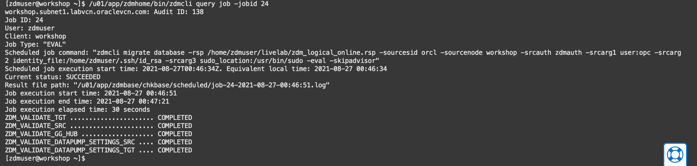

# Configure the ZDM Environment

## Introduction
In this lab on your host instance, you will:
* Perform a migration on evaluation mode to troubleshoot any connectivity or setup issue
* Learn how to to monitor an ongoing migration job
* Migrate your Database


## **Task 1: Run a Migration on Evaluation Mode**

1. The migrate zdmcli command performs a migration and consists of several parameters. Let's review one by one to undertand them better.

```
/u01/app/zdmhome/bin/zdmcli migrate database -rsp /path/zdmresponsefile.rsp -sourcesid ORACLE_SID -sourcenode source_host_name -srcauth authentication_plugin_name -srcarg1 user:source_database_server_login_user_name -srcarg2 identity_file:ZDM_installed_user_private_key_file_location  -srcarg3 sudo_location:/sudo_location -eval -skipadvisor
```

Let's review one by one the different parameters that are part of this command:

```
-rsp /path/zdmresponsefile.rsp
```
The __-rsp__ option specifies the migration response file path

```
-sourcesid ORACLE_SID
```
The __-sourcesid__ option specifies the ORACLE_SID of the source database. This option is used here instead of -source given that the source database is a single instance database with no Grid Infrastructure deployment.

```
-sourcenode source_host_name
```
The __-sourcenode__ option specifices the Source Database Host Name

```
-srcauth authentication_plugin_name
```
The __-srcauth__ option specifies the Authentication Plugin to be used, the default plugin is zdmauth.


```
-srcarg1 user:source_database_server_login_user_name
```
The __-srcarg1 user:__ option specifies the Source Database Server Login user name

```
-srcarg2 identity_file:ZDM_installed_user_private_key_file_location
```
The __-srcarg2 identity_file__ option specifies the ZDM installed user private key file location

```
-srcarg3 sudo_location:/sudo_location
```
The __-srcarg3 sudo_location__ option specifies the path for the sudo location

```
-eval -skipadvisor
```
Finally, the __-eval__ flag specifies that this is an Evaluation mode migration, hence ZDM will not be actually performing the migration but just a validation in order to verify everything is in order. The __-skipadvisor__ flag specifies that ZDM can skip the Pre-Migration advisor phase, which will not be required for the purposes of this workshop.

2. Let's now proceed to perform a migration on Evaluation mode. Providing all the steps have been followed, the following zdmcli migrate database command and corresponding options, parameters and flags should work without requiring any modification. As the zdmuser, execute the following in your Cloud Shell: 

    ```
    <copy>
    /u01/app/zdmhome/bin/zdmcli migrate database -rsp /home/zdmuser/livelab/zdm_logical_online.rsp -sourcesid orcl -sourcenode workshop -srcauth zdmauth -srcarg1 user:opc -srcarg2 identity_file:/home/zdmuser/.ssh/id_rsa -srcarg3 sudo_location:/usr/bin/sudo -eval -skipadvisor
    </copy>
    ```

3. You will be prompted for different passwords for different components. As you remember, for the purpose of this lab and for your convenience, we set all the passwords to __WELcome##1234__, please copy this an enter it for every prompt:

    ```
    <copy>
    WELcome##1234
    </copy>
    ```

4. ZDM will then proceed to create a migration job id that should look as follows:

    


## **Task 2: Evaluate a Migration Job**

1. In order to evaluate the migration job, we will use the __/u01/app/zdmhome/bin/zdmcli query job -jobid idnumber__ command. Copy the command from below and replace idnumber with the assigned Job ID provided by ZDM on your migration, then, press Enter.

    ```
    <copy>
    /u01/app/zdmhome/bin/zdmcli query job -jobid idnumber
    </copy>
    ```

2. You might need to execute the command several times until the evaluation is completed. Upon succesful completion of your migration in evaluation mode, you should see an output like the following:



## **Task 3: Migrate your Database**

1. You are now ready to migrate your database, in order to so, you will execute the same command as before, minus the __-eval__ flag. Copy the command from below, paste it on your Cloud Shell and press enter.

    ```
    <copy>
    /u01/app/zdmhome/bin/zdmcli migrate database -rsp /home/zdmuser/livelab/zdm_logical_online.rsp -sourcesid orcl -sourcenode workshop -srcauth zdmauth -srcarg1 user:opc -srcarg2 identity_file:/home/zdmuser/.ssh/id_rsa -srcarg3 sudo_location:/usr/bin/sudo -skipadvisor
    </copy>
    ```

2. Again, you will be prompted for different passwords for different components. Please copy the password above an enter it for every prompt:

    ```
    <copy>
    WELcome##1234
    </copy>
    ```    

3. You will now evaluate the migration job until completion, using the command provided above. Remember to replace idnumber with the assigned Job ID provided by ZDM on your migration, then, press Enter.

    ```
    <copy>
    /u01/app/zdmhome/bin/zdmcli query job -jobid idnumber
    </copy>
    ```


## Acknowledgements
* **Author** - Ricardo Gonzalez, Senior Principal Product Manager, Oracle Cloud Database Migration
* **Last Updated By/Date** - Ricardo Gonzalez, August 2021
