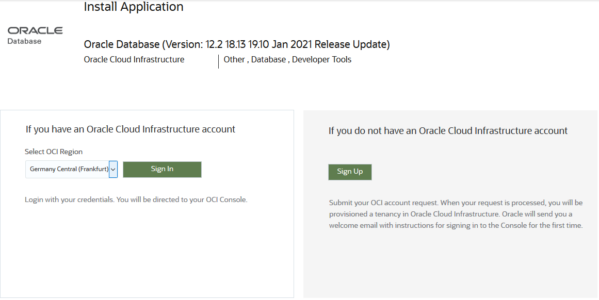
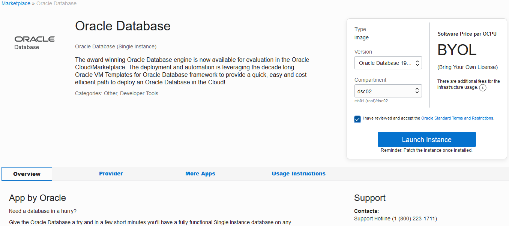
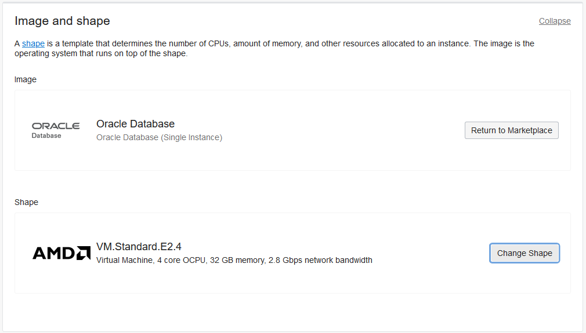
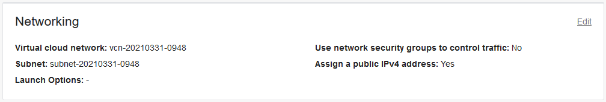
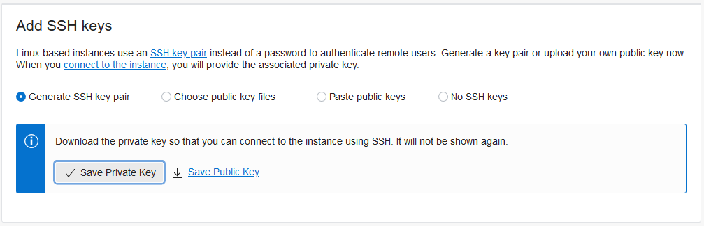

# Deploy an Oracle Database Image from Oracle Cloud Marketplace

## Introduction

To quickly get you up and running with a compute instance and fully operational Oracle Database, Oracle provides an Oracle Database image in Oracle Cloud Marketplace that you can deploy. In this lab, you configure the deployment to create a compute instance running Oracle Linux 7 with Oracle Database 19c (release 19.10). The steps in this lab are quick and easy for you to complete, but you do have to wait about 30 minutes for the database to be installed and configured.

Estimated lab time: 35 minutes

### Objectives

In this lab, you learn how to do the following:
- Access the Oracle Database image in Oracle Cloud Marketplace
- Deploy the Oracle Database image to your compartment in Oracle Cloud Infrastructure
- Connect to your compute instance
- Monitor the provisioning of your database
- Connect to your database

### Prerequisites

- You have an Oracle account. You can obtain a free account by using Oracle Free Tier or you can use a paid account provided to you by your own organization.
- You have a compartment in Oracle Cloud Infrastructure that you can use.


## **STEP 1**: Access the Oracle Database image in Oracle Cloud Marketplace

1. In a browser on your local computer, enter the following url:

    ```nohighlighting
     <copy>https://cloudmarketplace.oracle.com/marketplace/en_US/listing/47726045</copy>
     ```

  The Oracle Database image page is displayed.

  

2. If you are not familiar with Oracle Cloud Marketplace, you may find it helpful to read through the content provided on the **Overview** tab. It explains the features provided by the image, customization options, and how to access your database after the image is deployed.


## **STEP 2**: Deploy the Oracle Database image to your compartment in Oracle Cloud Infrastructure

1. Click **Get App**.

2. On the **Install Application** page, select the Oracle Cloud Infrastructure (OCI) region to which you are subscribed to in your tenancy, and then click **Sign In**.

  

3. Sign in to your tenancy.

  The **Oracle Database** page is displayed.

4. In the **Version** drop-down list, select **Oracle Database 19.10.0.0.210199 - OL7U9 (3/31/2021)**.

5. In the **Compartment** drop-down list, select your compartment.

6. Click the **Oracle Standard Terms and Restrictions** link and review the information.

7. To accept the terms and restricts, select the check box for **I have reviewed and accept the Oracle Standard Terms and Restrictions**.

8. Click **Launch Instance**.

  

  The **Create Compute Instance** page is displayed.

9. In the **Name** box, enter **Workshop**.

10. Leave compartment as is. You already selected the compartment on the previous page.

11. Leave the **Placement** configuration as is.

  

12. For **Image and shape**, do the following:

  a) Click **Edit**.

  b) Click **Change Shape**.

  c) Scroll down and select **VM.Standard.E2.4**. This shape has enough memory to support an Oracle Database 19c installation.

  d) Click **Select Shape**.

  

13. Leave the **Networking** settings as is. You want to assign a public IP address to your database.

  

14. For **Add SSH keys**, do the following:

  a) Leave **Generate SSH key pair** selected.

  b) *Important!* Click **Save Private Key**.

  c) In the dialog box, leave **Save File** selected, and click **OK**.

  d) Browse to a directory on your local computer to where you can save the private key file.

  e) Click **Save**.

  

15. Leave the **Boot volume** configuration as is.

  

16. Click **Create**. Details for your instance are displayed and provisioning is started.

17. Scroll down to the **Work Requests** section. A **Create Instance** job is listed. Wait for the job's state to read **Succeeded**. This means that you can access your compute instance.

  


## **STEP 3**: Connect to your compute instance from your Cloud Shell machine

To connect to your compute instance using Cloud Shell, you need to add your private key to an `.ssh` directory on your Cloud Shell machine. You only need to add your private key once (step 2 below). After your private key is in its proper place, you can simply SSH to connect in future sessions (step 4 below).

1. On the toolbar in Oracle Cloud Infrastructure, click the **Cloud Shell** icon to open the Cloud Shell window, and wait for a terminal prompt to be displayed.

  

2. Upload your private key to the `.ssh` directory on your Cloud Shell machine.

  a) From the **Cloud Shell** menu, select **Upload**. The **File Upload to your Home Directory** dialog box is displayed.

  b) Click **select from your computer**. Browse to and select your private key file, and then click **Open**. Click **Upload**. Your private key is uploaded to the `home` directory on your Cloud Shell machine.

  c) Move your private key to the `.ssh` directory. In the code below, replace `private-key-filename` with the name of own private key file. Be sure to include the slash (/) after .ssh in the command to ensure that the file gets moved to a directory.

    ```nohighlighting
      $ <copy>mv private-key-filename.key .ssh/</copy>
      ```

  d) Set permissions on the `.ssh` directory so that only you (the owner) can read, write, and execute on the directory. Also set permissions on the private key itself so that only you (the owner) can read and write (but not execute) on the private key file.

    ```nohighlighting

    $ <copy>chmod 700 ~/.ssh</copy>
    $ <copy>cd .ssh</copy>
    $ <copy>chmod 600 *</copy>
    ```

3. On the **Instance Information** tab for your compute instance, find the public IP address and copy it to the clipboard.

4. Enter the following `ssh` command to connect to your compute instance, replacing `private-key-file` and `public-ip-address` with your own values.

   ```nohighlighting
    $ <copy>ssh -i ~/.ssh/private-key-file.key opc@public-ip-address</copy>
    ```

    You receive a message stating that the authenticity of your compute instance can't be established. Do you want to continue connecting?

5. Enter **yes** to continue. The public IP address of your compute instance is added to the list of known hosts on your Cloud Shell machine.

  The terminal prompt becomes `[opc@workshop ~]$`, where `opc` is your user account on your compute instance and `workshop` is the name of your compute instance. You are now connected to your new compute instance.


## **STEP 4**: Monitor the database installation

The database installation and configuration tasks take approximately 30 minutes. You can monitor the progress by viewing the `buildsingle.log` file.

1. Switch to the `root` user.

    ```nohighlighting
    <copy>sudo su -</copy>
    ```

2. View the `buildsingle.log` file.
    ```nohighlighting
    <copy>tail -f /u01/ocidb/buildsingle.log</copy>
    ```

    REVIEWER: if you are accessing as opc user, use tail -f /u01/ocidb/buildsingle1.log

3. Wait until the following line is displayed in the log. This line indicates that the deployment is completed and the database is ready for operation.

    ```nohighlighting
    2019-04-30 19:50:33:[buildsingle:Time :instance-20190430-12c] Completed successfully in 296 seconds (0h:04m:56s)
    ```

## **STEP 5**: Connect to your database

1. Switch to the `oracle` user.

    ```nohighlighting
    <copy>sudo su - oracle</copy>
    ```

2. Review the environment variables.

    ```nohighlighting
    $ <copy>env | grep ORA</copy>

    ORACLE_UNQNAME=ORCL
    ORACLE_SID=ORCL
    ORACLE_BASE=/u01/app/oracle
    ORACLE_HOSTNAME=<vm>.opcdbaas.oraclecloud.internal
    ORACLE_HOME=/u01/app/oracle/product/19.1.0/dbhome_1
    ```

3. Using SQLPlus, connect to the `root` container of your database. SQL*Plus is an interactive and batch query tool that is installed with every Oracle Database installation.

    ```nohighlighting
    $ <copy>sqlplus / as sysdba</copy>

    SQL*Plus: Release 19.0.0.0.0 - Production on Fri Apr 16 21:08:02 2021
    Version 19.10.0.0.0

    Copyright (c) 1982, 2019, Oracle. All rights reserved.

    SQL>
    ```


4. Verify that you are logged in to the `root` container as the `SYS` user.

    ```nohighlighting
    SQL> <copy>SHOW user</copy>

    USER is "SYS"
    SQL>
    ```

5. Find the current container name. Because you're currently connected to the `root` container, the name is `CDB$ROOT`.

    ```nohighlighting
    SQL> <copy>SHOW con_name</copy>

    CON_NAME
    -------------------
    CDB$ROOT
    SQL>
    ```

6. List all of the containers in the CDB by querying the `V$CONTAINERS` view. The results list three containers - the `root` container (`CDB$ROOT`), the seed PDB (`PDB$SEED`), and the pluggable database (`ORCLPDB`).

    ```nohighlighting
    SQL> <copy>COLUMN name FORMAT A8</copy>
    SQL> <copy>SELECT name, con_id FROM v$containers ORDER BY con_id;</copy>

    NAME         CON_ID
    -------- ----------
    CDB$ROOT          1
    PDB$SEED          2
    ORCLPDB           3
    SQL>
    ```

7. Exit SQL*Plus.

    ```nohighlighting
    SQL> <copy>EXIT</copy>

    $
    ```
