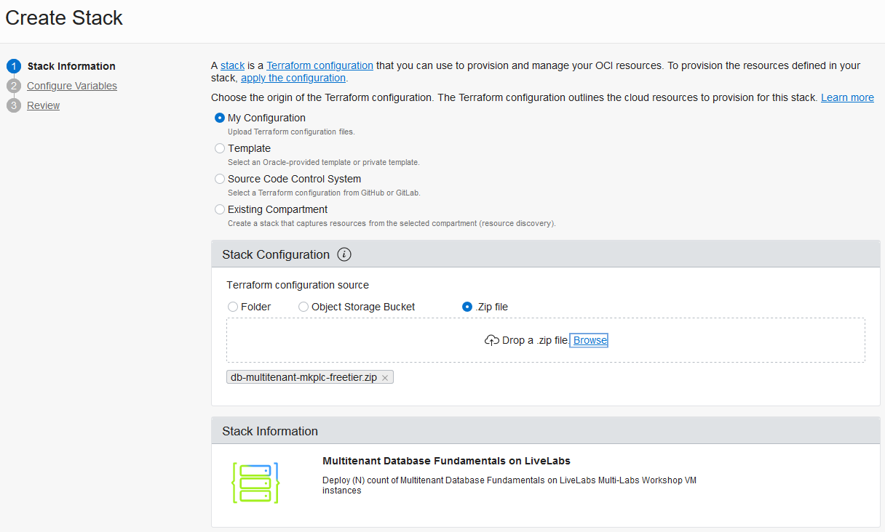
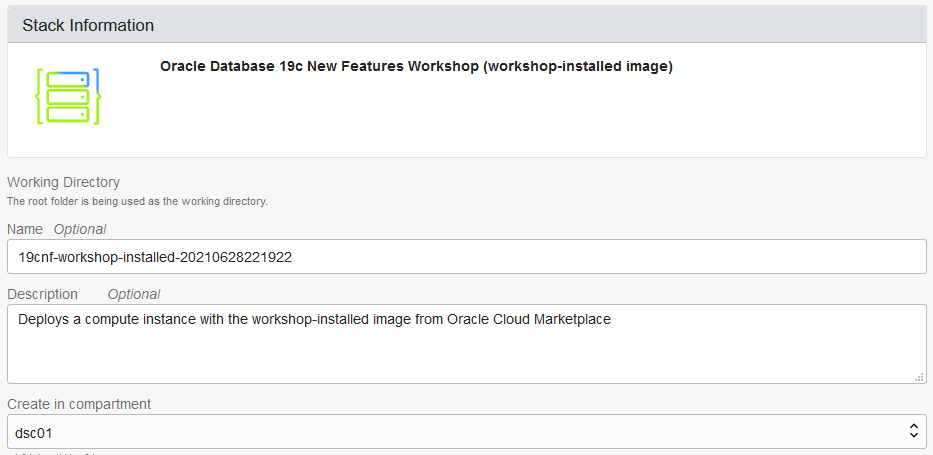
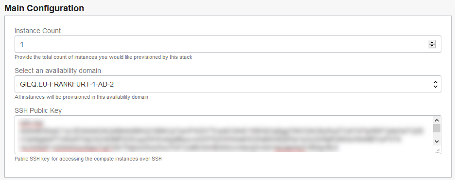
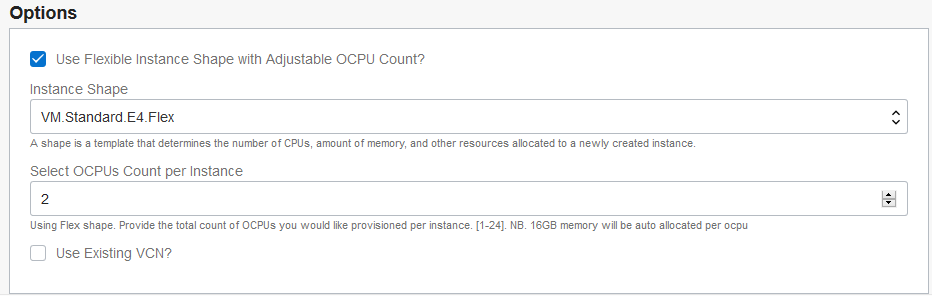
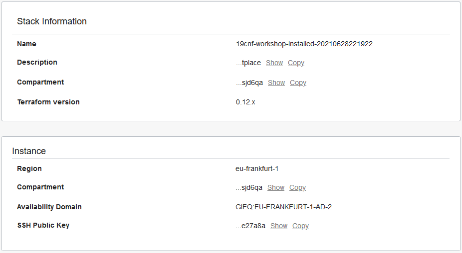
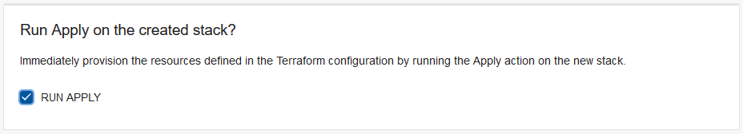
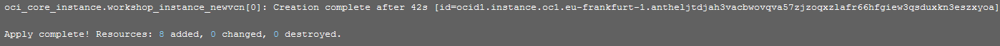

# Obtain a Compute Image with Oracle Database 19c Installed

## Introduction

Use Resource Manager in Oracle Cloud Infrastructure (OCI) to quickly deploy a compute image that has Oracle Database 19c installed on it.

Begin by creating a stack in Resource Manager. A stack is a collection of Oracle Cloud Infrastructure resources corresponding to a given Terraform configuration. A Terraform configuration is a set of one or more TF files written in HashiCorp Configuration Language (HCL) that specify the Oracle Cloud Infrastructure resources to create. The Terraform configuration that you use here loads a custom image stored in Oracle Cloud Marketplace and creates a virtual cloud network (VCN). After you create the stack, you apply it to start a provisioning job. When the job is completed, you verify that you can connect to your compute instance via a browser and Cloud Shell.

Oracle highly recommends that you create a new VCN when configuring the stack, which is the default, to ensure you have all of the proper connectivity required to access your compute instance and run the applications. If you choose to use one of your own existing VCNs when you configure the stack, be sure that your VCN has a public subnet and a routing table configured with an Internet Gateway. Your VCN also requires several ingress security rules. STEP 1 covers how to configure the security rules. If you accept the default to create a new VCN when configuring the stack, then you can skip STEP 1.

> **Note**: If you are working in the LiveLabs environment, you can skip STEP 1 and STEP 2 because those steps have already been done for you.

Estimated Lab Time: 15 minutes

### Objectives

Learn how to do the following:

- Add security rules to your existing VCN
- Create and apply a stack in Resource Manager
- Obtain the public IP address of your compute instance
- Connect to your compute instance via Cloud Shell
- Download the script files for this workshop
- Start the container databases on the compute instance
- Discover the container databases and pluggable databases

### Prerequisites

Be sure that the following tasks are completed before you start:

- Obtain an Oracle Cloud account.
- Create SSH keys.
- Sign in to Oracle Cloud Infrastructure.

## **STEP 1**: Add security rules to your existing VCN

Configure ingress rules in your VCN's default security list to allow traffic on port 22 for SSH connections and traffic on ports 1521, 1523, and 1524 for the DB Listener.

> **Note**: You can skip this step if you plan to create a new VCN when configuring the stack (recommended).

1. From the navigation menu in Oracle Cloud Infrastructure, select **Networking**, and then **Virtual Cloud Networks**.

2. Select your VCN.

3. Under **Resources**, select **Security Lists**.

4. Click the default security list.

5. For each port number (22, 1521, 1523, 1524), do the following:

    1. Click **Add Ingress Rule**.

    2. For **Source CIDR**, enter **0.0.0.0/0**.

    3. For **Destination port range**, enter the port number.

    4. Click **Add Ingress Rule**.

## **STEP 2**: Create and apply a stack in Resource Manager

> **Note**: If you are working in the LiveLabs environment, you can skip this step and proceed to STEP 2.

1. Download [db-multitenant-mkplc-freetier.zip](https://objectstorage.us-ashburn-1.oraclecloud.com/p/G7LZB2PC1IU-WlBfrsDzKTgqKL9vbyhE5mWrF01MAyD3Gi589C6detaJdbTESF3F/n/natdsecurity/b/stack/o/db-multitenant-mkplc-freetier.zip) to a directory on your local computer. This ZIP file contains the necessary terraform scripts to create your compute instance and database.

2. On the home page in Oracle Cloud Infrastructure, click **Create a stack**.

  

    The **Create Stack** page is displayed.

3. For **Stack Information**, do the following:

    1. Select **My Configuration**.

    2. In the **Stack Configuration** section, select **.ZIP file**, click **Browse**, select the ZIP file that you just downloaded, and then click **Open**.

    3. Leave the default values for **Name** and **Description** as is.

    4. Select your compartment.

  

  

4. Click **Next**.

    The **Configure Variables** page is displayed.

5. In the **Main Configuration** section, do the following:

    1. Leave **Instance Count** set to **1**.

    2. Select an **availability domain**.

    3. Paste your **SSH Public Key** into the box.

  

6. In the **Options** section, do the following:

    1. Leave **Use Flexible Instance Shape with Adjustable OCPU Count** selected.

    2. For **Instance Shape**, leave **VM.Standard.E4.Flex** selected.

    3. For **Select OCPUs Count per Instance**, leave 2 selected.

    4. (Optional) If you want to use one of your existing VCNs, select **Use Existing VCN**, and then select a VCN that has a regional public subnet and the required security rules. Also select your public subnet.

  

7. Click **Next**.

8. On the **Review** page, review your configuration variables and make sure they are correct. Only the variables that you edited are displayed.

  

9. In the **Run Apply on the created stack** section, select **RUN APPLY**.

  

10. Click **Create** to begin the provisioning job.

    The **Job Details** page is displayed showing the job in progress.

11. Wait for the job to be completed. The job is successful when it reads "SUCCEEDED" and the last line of the log file reads `Apply complete!`.

  


## **STEP 3**: Obtain the public IP address of your compute instance

1. From the navigation menu in the Oracle Cloud Infrastructure Console, select **Compute**, and then **Instances**.

2. Select your compartment.

3. Find the public IP address of the compute instance that starts with **db19-hol-s01-...** in the table and jot it down.


## **STEP 4**: Connect to your compute instance via Cloud Shell

1. On the toolbar in Oracle Cloud Infrastructure, click the Cloud Shell icon to launch Cloud Shell.

  

  A terminal window is displayed at the bottom of the page.

2. Enter the following `ssh` command to connect to your compute instance. Replace `public-ip-address` with the public IP address of your compute instance. Replace `cloudshellkey` with the name of your private key file if it has a different name.

    ```
    $ ssh -i ~/.ssh/cloudshellkey opc@public-ip-address
    ```

    A message states that the authenticity of your compute instance can't be established. Do you want to continue connecting?

3. Enter **yes** to continue. The public IP address of your compute instance is added to the list of known hosts on your Cloud Shell machine.

  You are now connected to your new compute instance via Cloud Shell.


## **STEP 5**: Download the script files for this workshop

1. Switch to the `oracle` user.

    ```
    $ sudo su - oracle
    ```

2. Switch to the labs directory and confirm your directory

    ```
    $ cd ~/labs
    $ pwd

    /home/oracle/labs
    ```

3. Download the script files for this workshop.

    ```
    wget https://objectstorage.eu-frankfurt-1.oraclecloud.com/p/iHB8oCR7sve_J-hdridcAIS7-TGJ-cvZdkR5POjqpY0UwYnucbhyonPUhiSqhruY/n/frmwj0cqbupb/b/19cNewFeatures/o/19cNewFeatures.zip
    ```

4. Extract the ZIP file in the `labs` directory.

    ```
    $ unzip -q 19cNewFeatures.zip
    ```

5. Verify that you have the following directories in the `/home/oracle/labs` directory:

    ```
    ls

    19cNewFeatures.zip  admin  DB   db.rsp   DIAG   DW   envprep.sh   HA  multitenant   OBEs   PERF   SEC   Videos
    ```

6. Grant permissions to execute on files in the `labs` directory.

    ```
    chmod -R +x ~/labs
    ```

## **STEP 6**: Start the container databases on the compute instance

1. Return to the `opc` user.

    ```
    exit
    ```

2. Change to the `/tmp` directory

    ```
    cd /tmp/
    ```

3. Download a ZIP file that contains initialization scripts.

    ```
    wget https://objectstorage.us-ashburn-1.oraclecloud.com/p/agZ9XqafKHNCN3rpIegRlFFFJXe6YRPMqO7uHsO49vnLgm_3o0H_I_XTemvaAEXu/n/natdsecurity/b/labs-files/o/db-multitenant-prelab-init.zip
    ```

4. Extract the ZIP file into the `/tmp/bootstrap` directory.

    ```
    unzip db-multitenant-prelab-init.zip -d bootstrap
    ```

6. Change to the `/tmp/bootstrap` directory.

    ```
    cd bootstrap
    ```

7. Grant execute permissions on the SSH files in the `bootstrap` directory.

    ```
    chmod +x *.sh
    ```

8. Run the `db19-prelab-init.sh` script.

    ```
    sudo ./db19-prelab-init.sh
    ```

9. Switch to the `oracle` user.

    ```
    sudo su - oracle
    ```

10. Change to the `/tmp/bootstrap` directory.

    ```
    cd /tmp/bootstrap
    ```

11. Start the database listeners.

    ```
    lsnrctl start LISTCDB1
    lsnrctl start LISTCDB2
    ```

12. Stop the two container databases (CDB1 an CDB2). Wait until they are both stopped.

    ```
    ./stop_all.sh
    ```

13. Start the two container databases.

    ```
    ./start_all.sh
    ```

14. View the status of the listeners and verify that the listeners are ready.

    ```
    lsnrctl status LISTCDB1
    lsnrctl status LISTCDB2
    ```


## **STEP 7**: Discover the container databases and pluggable databases


1. Set the oracle environment and connect to the CDB1 container database. When prompted for the `ORACLE_SID`, enter **CDB1**.

    ```
    $ . oraenv
    ORACLE_SID = [ORCL] ? CDB1

    The Oracle base remains unchanged with value /u01/app/oracle
    ```

2. Connect to the root container using SQL*Plus.

    ```
    $ sqlplus / as sysdba

    SQL*Plus: Release 19.0.0.0.0 - Production on Wed May 26 20:51:15 2021
    Version 19.10.0.0.0

    Copyright (c) 1982, 2020, Oracle.  All rights reserved.

    Connected to:
    Oracle Database 19c Enterprise Edition Release 19.0.0.0.0 - Production
    Version 19.10.0.0.0
    ```

2. Verify that you are logged in to the `root` container as the `SYS` user.

    ```
    SQL> SHOW user

    USER is "SYS"
    SQL>
    ```

3. Find the current container name. Because you're currently connected to the `root` container, the name is `CDB$ROOT`.

    ```
    SQL> SHOW con_name

    CON_NAME
    -------------------
    CDB$ROOT
    SQL>
    ```

4. List all of the containers in CDB1 by querying the `V$CONTAINERS` view. The results show that there are three containers: the `root` container (`CDB$ROOT`), the seed PDB (`PDB$SEED`), and the pluggable database (`PDB1`).

    ```
    SQL> COLUMN name FORMAT A8
    SQL> SELECT name, con_id FROM v$containers ORDER BY con_id;

    NAME         CON_ID
    -------- ----------
    CDB$ROOT          1
    PDB$SEED          2
    PDB1              3

    SQL>
    ```

5. Exit SQL*Plus.

    ```
    SQL> exit

    $
    ```

Congratulations! You have a fully functional Oracle Database 19c instance running on a compute instance in Oracle Cloud Infrastructure.


## Learn More

- [Resource Manager Video](https://youtu.be/udJdVCz5HYs)

## Acknowledgements

- **Author**- Jody Glover, Principal User Assistance Developer, Database Development
- **Last Updated By/Date** - Jody Glover, Database team, May 26 2021
