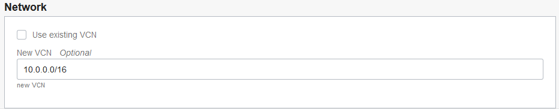

# Obtain a Compute Image with Oracle Database 19c Installed

## Introduction

Use Resource Manager in Oracle Cloud Infrastructure (OCI) to quickly deploy a compute instance with the private **workshop-installed** image in Oracle Cloud Marketplace. The image has Oracle Database 19c installed on it and noVNC, which provides an easy-to-use browser user interface. On the desktop, there are shortcuts to a terminal window, a Firefox browser, and a gedit text editor.

Begin by creating and applying a stack in Resource Manager. A stack is a collection of Oracle Cloud Infrastructure resources corresponding to a given Terraform configuration. A Terraform configuration is a set of one or more TF files written in HashiCorp Configuration Language (HCL) that specify the Oracle Cloud Infrastructure resources to create. The Terraform configuration that you use here loads a custom image stored in Oracle Cloud Marketplace and creates a virtual cloud network (VCN). After your compute instance is created, you can log into it via a browser and then download the lab files.

Oracle highly recommends that you create a new VCN when creating the stack, which is the default, to ensure you have all of the proper connectivity required to access your compute instance and run the applications. If you choose to use one of your own existing VCNs, be sure that your VCN has a public subnet and a routing table configured with an Internet Gateway. Your VCN also requires several ingress security rules, which is covered in STEP 1. If you accept the default to create a new VCN when creating the stack, then you can skip STEP 1.

> **Note**: If you are working in the LiveLabs environment, you can skip STEP 1 and STEP 2 because they have already been done for you.

Estimated Lab Time: 15 minutes

### Objectives

Learn how to do the following:

- Add security rules to your existing VCN
- Create and apply a stack in Resource Manager
- Connect to your compute instance via a browser and set up your desktop
- Download the labs files for this workshop

### Prerequisites

Before you start, be sure that you have done the following:

- Obtained an Oracle Cloud account
- Signed in to Oracle Cloud Infrastructure
- Created SSH keys in Cloud Shell


## **STEP 1**: Add security rules to your existing VCN

Configure ingress rules in your VCN's default security list to allow traffic on port 22 for SSH connections, traffic on ports 1521, 1523, and 1524 for the database listeners, and traffic on port 6080 for HTTP connections to the noVNC browser interface.

> **Note**: If you plan to let the terraform script create a new VCN for you (recommended), you can skip this step and proceed to STEP 2. If you are working in the LiveLabs environment, you can skip this step and STEP 2 and proceed to STEP 3.

1. From the navigation menu in Oracle Cloud Infrastructure, select **Networking**, and then **Virtual Cloud Networks**.

2. Select your VCN.

3. Under **Resources**, select **Security Lists**.

4. Click the default security list.

5. For each port number/port number range (22, 1521-1524, 6080), click **Add Ingress Rule**. For **Source CIDR**, enter **0.0.0.0/0**. For **Destination port range**, enter the port number. Click **Add Ingress Rule**.

## **STEP 2**: Create and apply a stack in Resource Manager

> **Note**: If you are working in the LiveLabs environment, you can skip this step and proceed to STEP 3.

1. Download [19cnf-workshop-installed.zip](https://objectstorage.us-ashburn-1.oraclecloud.com/p/K5s7Sw5wGMvC4ose91816ptvrxQgLM2RFNaP6w-uO3oCA[…]b/LiveLabsBucket/o/19cnf-workshop-installed.zip) to a directory on your local computer. This ZIP file contains the necessary terraform scripts to create your compute instance and database.

2. On the home page in Oracle Cloud Infrastructure, click **Create a stack**.

    

    The **Create Stack** page is displayed.

3. For **Stack Information**, select **My Configuration**. In the **Stack Configuration** section, select **.Zip file**, click **Browse**, select the ZIP file that you just downloaded, and then click **Open**. Leave the default values for stack name and description as is. Select your compartment.

    

    

4. Click **Next**.

    The **Configure Variables** page is displayed.

5. In the **Instance** section, select a region, your compartment, an availability domain, and **Paste SSH Key**. In the SSH field, paste your public SSH key.

    

6. In the **Network** section, leave the default setting as is to create a new VCN (recommended).

    If you want to use one of your existing VCNs, select **Use existing VCN**, select a VCN that has a regional public subnet and the required security rules, and select your public subnet.

    

7. Click **Next**.

8. On the **Review** page, review your configuration variables and make sure they are correct.

    

9. Scroll to the bottom. In the **Run Apply on the created stack** section, select **RUN APPLY**.

    

10. Click **Create**.

    Resource Manager starts provisioning your compute instance. The **Job Details** page is displayed. You can monitor the progress of the job by viewing the details in the log. When the job is finished, the state reads **Succeeded**.

    

11. Wait for the log to indicate that the Apply job has completed. The last line in the log contains the URL to access your compute instance. For example, your URL looks similar to the one below, with your own public IP address.

    ```
    remote_desktop = http://public-ip-address:6080/index.html?password=s0TGCvFfk9&resize=scale&autoconnect=true&quality=9&reconnect=true
    ```


## **STEP 3**: Connect to your compute instance via a browser and set up your desktop

> **Note**: If you are working in the LiveLabs tenancy, you are provided the URL to your compute instance. Otherwise, you obtain the URL in the previous step by looking in the log for the stack job.

1. In a browser, enter the URL to your compute instance.

    You are automatically logged into your workshop-staged computed instance and presented with user-friendly desktop. On the desktop, you can find shortcuts to Firefox and a terminal window. The "Install Oracle Database 19c with Automatic Root Script Execution" lab instructions are displayed in Firefox.

    

2. To enable full screen display: Click the small gray tab on the middle-left side of your screen to open the control bar. Click the **Fullscreen** icon (6th button down).

    

3. If the workshop guide is not already open on the desktop: Double-click the Firefox icon on the desktop to open Firefox. On the Firefox toolbar, click **Workshop Guides** and then select **Oracle Database 19c New Features**.


## **STEP 4**: Download the lab files for this workshop

1. On the noVNC desktop, open a terminal window.

2. Create a `/home/oracle/labs/19cnf` directory and switch to it.

    ```
    $ mkdir -p ~/labs/19cnf
    $ cd ~/labs/19cnf
    ```

3. Download the lab files into the `19cnf` directory.

    ```
    wget https://objectstorage.eu-frankfurt-1.oraclecloud.com/p/5BYzHdiNpOX1w6BT_iitF9kqujT244EMC3UMLNtT5QQ60Hqsqy9f7m3G4mS7swhh/n/frmwj0cqbupb/b/19cNewFeatures/o/19cnf-lab-files.zip
    ```

4. Extract the ZIP file in the `19cnf` directory.

    ```
    $ unzip -q 19cnf-lab-files.zip
    ```

5. Verify that you have 27 files.

    ```
    ls
    ```

6. Grant permissions to execute on files in the `19cnf` directory.

    ```
    chmod -R +x ~/labs/19cnf
    ```


## Learn More

- [Resource Manager Video](https://youtu.be/udJdVCz5HYs)

## Acknowledgements

- **Author**- Jody Glover, Principal User Assistance Developer, Database Development
- **Last Updated By/Date** - Jody Glover, Database team, July 8 2021
