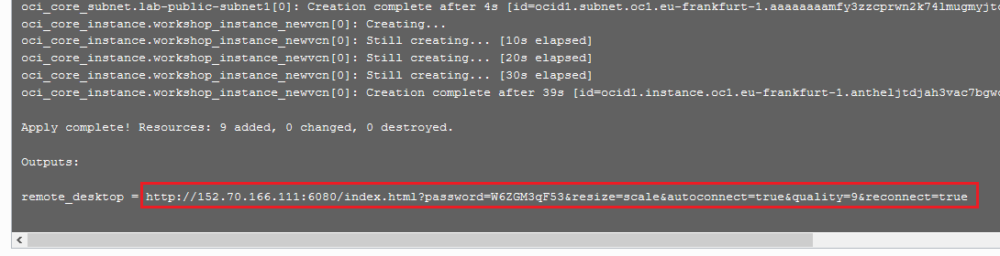

# Obtain a Compute Image with Oracle Database 19c Installed

## Introduction

Use Resource Manager in Oracle Cloud Infrastructure (OCI) to quickly deploy a compute instance with the private **workshop-installed** image in Oracle Cloud Marketplace. The image has Oracle Database 19c installed on it and noVNC, which provides an easy-to-use browser user interface. On the desktop, there are shortcuts to a terminal window, a Firefox browser, and a gedit text editor.

Begin by creating and applying a stack in Resource Manager. A stack is a collection of Oracle Cloud Infrastructure resources corresponding to a given Terraform configuration. A Terraform configuration is a set of one or more TF files written in HashiCorp Configuration Language (HCL) that specify the Oracle Cloud Infrastructure resources to create. The Terraform configuration that you use here loads a custom image stored in Oracle Cloud Marketplace and creates a virtual cloud network (VCN). After your compute instance is created, you can log into it via a browser, download the lab files, and start the listeners for the database listeners.

Oracle highly recommends that you let Resource Manager create a new VCN for you when creating the stack to ensure that you have all of the proper connectivity required to access your compute instance and run the applications. If you accept, you can skip STEP 1. If you choose to use one of your own existing VCNs, be sure that your VCN has a public subnet and a routing table configured with an Internet Gateway. Your VCN also requires several ingress security rules, which is covered in STEP 1.

> **Note**: If you are working in the LiveLabs environment, you can skip STEP 1 and STEP 2 because they have already been done for you.

Estimated Lab Time: 15 minutes

### Objectives

Learn how to do the following:

- Add security rules to your existing VCN
- Create and apply a stack in Resource Manager to create the workshop-installed compute instance
- Connect to your compute instance via a browser and set up your desktop
- Download the labs files

### Prerequisites

Before you start, be sure that you have done the following:

- Obtained an Oracle Cloud account
- Signed in to Oracle Cloud Infrastructure
- Created SSH keys in Cloud Shell


## Task 1: Add security rules to your existing VCN

Configure ingress rules in your VCN's default security list to allow traffic on port 22 for SSH connections, traffic on ports 1521, 1523, and 1524 for the database listeners, and traffic on port 6080 for HTTP connections to the noVNC browser interface.

> **Note**: If you plan to let Resource Manager create a new VCN for you (recommended), you can skip this step and proceed to STEP 2. If you are working in the LiveLabs environment, you can skip this step and STEP 2 and proceed to STEP 3.

1. From the navigation menu in Oracle Cloud Infrastructure, select **Networking**, and then **Virtual Cloud Networks**.

2. Select your VCN.

3. Under **Resources**, select **Security Lists**.

4. Click the default security list.

5. For each port number/port number range (22, 1521-1524, 6080), click **Add Ingress Rule**. For **Source CIDR**, enter **0.0.0.0/0**. For **Destination port range**, enter the port number. Click **Add Ingress Rule**.

## Task 2: Create and apply a stack in Resource Manager

> **Note**: If you are working in the LiveLabs environment, the workshop-installed compute instance is already created for you; therefore, you can skip this step and proceed to STEP 3.

1. Download [db19cnf-workshop-installed.zip](https://objectstorage.eu-frankfurt-1.oraclecloud.com/p/sO1PZkqdsK3-VmPZ8TMQBgKL6Mjy73iNY9O3h00qjI1TEVSVSyqBpOyTucfNbk8z/n/frmwj0cqbupb/b/19cNewFeatures/o/db19cnf-workshop-installed.zip) to a directory on your local computer. This ZIP file contains the terraform script that you use with Resource Manager.

2. On the home page in Oracle Cloud Infrastructure, click **Create a stack**. The **Create Stack** page is displayed.

  

    The **Create Stack - Stack Information** page is displayed.

3. Select **My Configuration**.

4. In the **Stack Configuration** area, select **.Zip file**, click **Browse**, select the ZIP file that you just downloaded, and then click **Open**.

  

5. For **Name**, leave the default stack name as is.

6. For **Description**, leave the default description for the stack as is.

7. Select your compartment. This compartment will be used to store the stack, the VNC (if you choose to create a new one), and the workshop-compute instance.

8. Click **Next**. The **Configure Variables** page is displayed.

9. In the **Main Configuration** section, leave **1** selected for the instance count.

10. Select an availability domain.

11. Paste the contents of your public key into the **SSH Public Key** box. Be sure that there are no carriage returns.

  

12. In the **Options** section, configure the following:

    - Leave **Use Flexible Instance Shape with Adjustable OCPU Count** selected. For **Instance Shape**, select **VM.Standard.E3.Flex**. Depending on the quota that you have in your tenancy, you can choose a different instance shape.
    - Leave **2** set as the number of OCPUs per instance. Two OCPUs provides 32 GB of RAM, which is the minimum you need for this workshop. If you increase this value, be sure that you have the capacity available.
    - Leave the **Use Existing VCN** check box deselected (recommended) if you want Resource Manager to create a VCN for you. If you choose to use your own VCN, select your VCN and and public subnet. Your VCN needs to have a public subnet and a routing table configured with an Internet Gateway. It also requires the ingress security rules specified in STEP 1 above.

    

13. Click **Next**.

15. On the **Review** page, verify that the information is correct.

  

16. In the **Run Apply on the created stack** section, select **Run Apply** to immediately provision the resources.

    

17. Click **Create**.

    Resource Manager starts provisioning your compute instance and the **Job Details** page is displayed. You can monitor the progress of the job by viewing the details in the log. The job is finished when the state reads **Succeeded**.

  


18. Scroll down to the end of your log. Locate the `remote-desktop` URL and copy it to the clipboard. Don't include the double-quotation marks.

    


## Task 3: Connect to your compute instance via a browser and set up your desktop

> **Note**: If you are working in the LiveLabs tenancy, you are provided the URL to your compute instance.

1. In a browser, enter the URL to your `workshop-installed` compute instance. If your compute instance is not displayed, wait 30 seconds and try again.

    You are automatically logged into your compute instance and presented with a user-friendly desktop. On the desktop, you can find shortcuts to Firefox, a terminal window, and gedit (text editor). The Oracle Database 19c New Features workshop guide is displayed in Firefox.

    

2. To enable full screen display: Click the small gray tab on the middle-left side of your screen to open the control bar. Next, click the **Fullscreen** icon (6th button down).

    

    

3. If the workshop guide is not open on the desktop: Double-click the Firefox icon on the desktop to open Firefox. On the Firefox toolbar, click **Workshop Guides** and then select **Oracle Database 19c New Features**.


## Task 4: Download the lab files

1. On the noVNC desktop, open a terminal window.

2. Run the following commands to create a `/home/oracle/labs/19cnf` directory, switch to it, download the lab files into the `19cnf` directory and extract the ZIP file, set permissions, and view the list of files.

    ```
    $ <copy>mkdir -p ~/labs/19cnf</copy>
    $ <copy>cd ~/labs/19cnf</copy>
    $ <copy>wget https://objectstorage.eu-frankfurt-1.oraclecloud.com/p/AFqOJPH1zeb-VgwvBphlRuUz7P28KTo5xQ6LFz6VukqKgDcpsTAcpDMcRN_tCZKS/n/frmwj0cqbupb/b/19cNewFeatures/o/19cnf-lab-files.zip</copy>
    $ <copy>unzip -q 19cnf-lab-files.zip</copy>
    $ <copy>chmod -R +x ~/labs/19cnf</copy>
    $ <copy>ls -an</copy>
    ```


## **STEP 5**: Start the database listeners

The ORCL, CDB1, and CDB2 database instances are not started by default on the `workshop-installed` image. This is by design because several of the labs need the databases to be in `ARCHIVELOG` mode disabled, which requires a database shut down at the beginning of the lab. The labs include instructions on how and when to start up the databases.

When you start the listeners, the output indicates that the listener doesn't support any services. You can ignore this message. After you start up the databases in the labs, the listener will support the services.

The listener for the ORCL, CDB1, and CDB2 databases are `LISTENER` (the default listener), `LISTCDB1`, and `LISTCDB2` respectively.

1. Enter the following command to set the environment variable. At the prompt, enter ORCL.

    ````
    $ <copy>. oraenv</copy>
    ORCL
    ````

2. Start the listeners for the ORCL, CDB1, and CDB2 database instances.

    ````
    $ <copy>lsnrctl start LISTENER</copy>
    $ <copy>lsnrctl start LISTCDB1</copy>
    $ <copy>lsnrctl start LISTCDB2</copy>
    ````

## Learn More

- [Resource Manager Video](https://youtu.be/udJdVCz5HYs)

## Acknowledgements

- **Author**- Jody Glover, Principal User Assistance Developer, Database Development
- **Last Updated By/Date** - Jody Glover, Database team, July 23 2021
