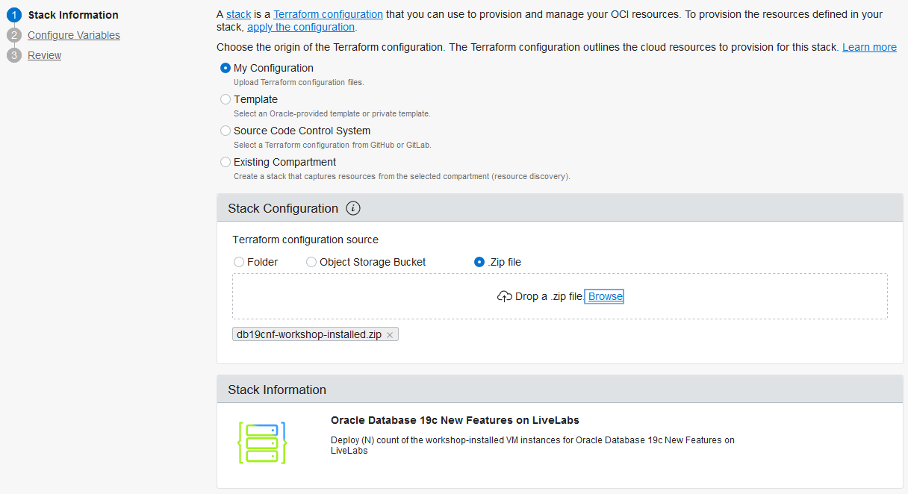
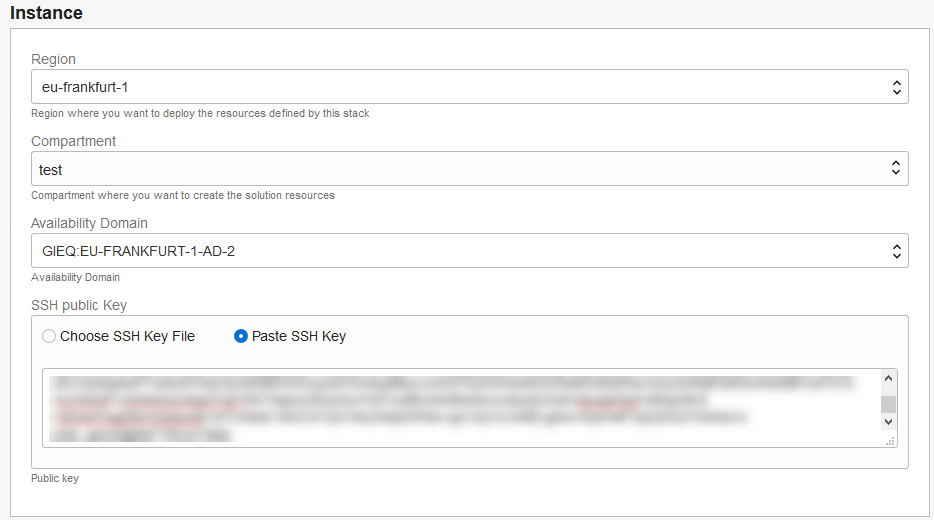
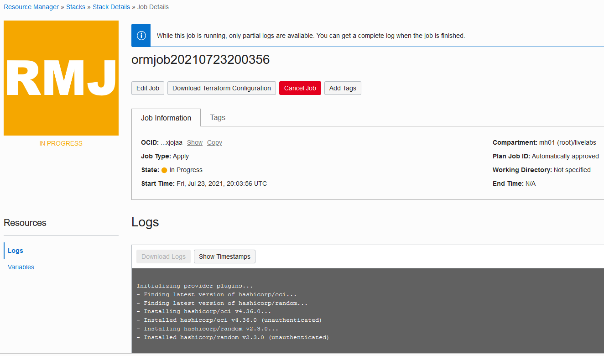
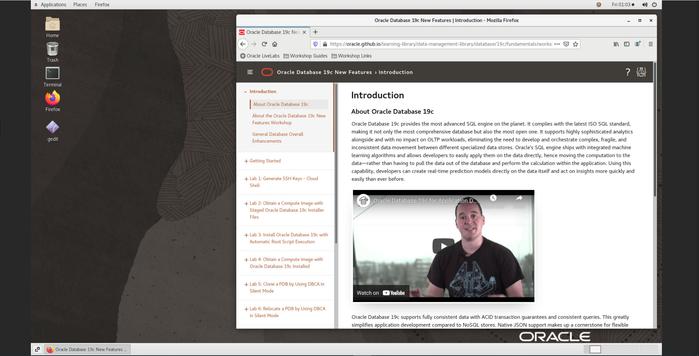

# Obtain a Compute Image with Oracle Database 19c Installed

## Introduction

Use Resource Manager in Oracle Cloud Infrastructure (OCI) to quickly deploy a compute instance with the private **workshop-installed** image in Oracle Cloud Marketplace. The image has Oracle Database 19c installed on it and noVNC, which provides an easy-to-use browser user interface. On the desktop, there are shortcuts to a terminal window, a Firefox browser, and a gedit text editor.

Begin by creating and applying a stack in Resource Manager. A stack is a collection of Oracle Cloud Infrastructure resources corresponding to a given Terraform configuration. A Terraform configuration is a set of one or more TF files written in HashiCorp Configuration Language (HCL) that specify the Oracle Cloud Infrastructure resources to create. The Terraform configuration that you use here loads a custom image stored in Oracle Cloud Marketplace and creates a virtual cloud network (VCN). After your compute instance is created, you can log into it via a browser and then download the lab files.

Oracle highly recommends that you let Resource Manager create a new VCN for you when creating the stack to ensure that you have all of the proper connectivity required to access your compute instance and run the applications. If you accept, you can skip STEP 1. If you choose to use one of your own existing VCNs, be sure that your VCN has a public subnet and a routing table configured with an Internet Gateway. Your VCN also requires several ingress security rules, which is covered in STEP 1.

> **Note**: If you are working in the LiveLabs environment, you can skip STEP 1 and STEP 2 because they have already been done for you.

Estimated Lab Time: 15 minutes

### Objectives

Learn how to do the following:

- Add security rules to your existing VCN
- Create and apply a stack in Resource Manager
- Connect to your compute instance via a browser and set up your desktop
- Download the labs files

### Prerequisites

Before you start, be sure that you have done the following:

- Obtained an Oracle Cloud account
- Signed in to Oracle Cloud Infrastructure
- Created SSH keys in Cloud Shell


## **STEP 1**: Add security rules to your existing VCN

Configure ingress rules in your VCN's default security list to allow traffic on port 22 for SSH connections, traffic on ports 1521, 1523, and 1524 for the database listeners, and traffic on port 6080 for HTTP connections to the noVNC browser interface.

> **Note**: If you plan to let Resource Manager create a new VCN for you (recommended), you can skip this step and proceed to STEP 2. If you are working in the LiveLabs environment, you can skip this step and STEP 2 and proceed to STEP 3.

1. From the navigation menu in Oracle Cloud Infrastructure, select **Networking**, and then **Virtual Cloud Networks**.

2. Select your VCN.

3. Under **Resources**, select **Security Lists**.

4. Click the default security list.

5. For each port number/port number range (22, 1521-1524, 6080), click **Add Ingress Rule**. For **Source CIDR**, enter **0.0.0.0/0**. For **Destination port range**, enter the port number. Click **Add Ingress Rule**.

## **STEP 2**: Create and apply a stack in Resource Manager

> **Note**: If you are working in the LiveLabs environment, you can skip this step and proceed to STEP 3.

1. Download [19cnf-workshop-installed.zip](https://objectstorage.eu-frankfurt-1.oraclecloud.com/p/UyFdPRkpgtXDamUYzyMeZckjhekdqj1BJ83Jpp8rVC1baCP06xDIKCeVX4gcTwwM/n/frmwj0cqbupb/b/19cNewFeatures/o/19cnf-workshop-installed.zip) to a directory on your local computer. This ZIP file contains the terraform script that you use with Resource Manager.

2. On the home page in Oracle Cloud Infrastructure, click **Create a stack**. The **Create Stack** page is displayed.

  

    The **Create Stack - Stack Information** page is displayed.

3. Select **My Configuration**.

4. In the **Stack Configuration** area, select **.Zip file**, click **Browse**, select the ZIP file that you just downloaded, and then click **Open**.

  

5. For **Name**, leave the default stack name as is.

6. For **Description**, leave the default description for the stack as is.

7. Select your compartment to store the stack.

8. Click **Next**. The **Configure Variables** page is displayed.

9. In the **Instance** section, make sure the appropriate region is selected.

10. Select your compartment.

11. Select an availability domain.

12. Select **Paste SSH Key**, and then paste the contents of your public key into the box. Be sure that there are no carriage returns. The key should be all on one line.

  

13. In the **Network** section, choose one of the following options:

    - **Option 1 (Recommended)**: Leave the default settings as is to create a new VCN.

    

    - **Option 2**: Select **Use existing VCN** and select an existing VCN and subnet in your tenancy. You may need to select different compartments to locate these items. Your VCN needs to have a public subnet and a routing table configured with an Internet Gateway. It also requires the ingress security rules specified in STEP 1 above.

14. Click **Next**.

15. On the **Review** page, verify that the information is correct.

  

16. In the **Run Apply on the created stack** section, select **Run Apply** to immediately provision the resources.

  

17. Click **Create**.

    Resource Manager starts provisioning your compute instance and the **Job Details** page is displayed. You can monitor the progress of the job by viewing the details in the log. The job is finished when the state reads **Succeeded**.

  

18. Scroll down in the log to the last line. This line contains the URL to access your compute instance via a browser. For example, your URL looks similar to the one below, with your own public IP address. Copy the URL (don't include `remote_desktop =`) to the clipboard because you need it in STEP 3.

    ```
    remote_desktop = http://public-ip-address:6080/index.html?password=s0TGCvFfk9&resize=scale&autoconnect=true&quality=9&reconnect=true
    ```


## **STEP 3**: Connect to your compute instance via a browser and set up your desktop

> **Note**: If you are working in the LiveLabs tenancy, you are provided the URL to your compute instance.

1. In a browser, enter the URL to your `workshop-installed` compute instance.

    You are automatically logged into your compute instance and presented with a user-friendly desktop. On the desktop, you can find shortcuts to Firefox, a terminal window, and gedit (text editor). The Oracle Database 19c New Features workshop guide is displayed in Firefox.

    

2. To enable full screen display: Click the small gray tab on the middle-left side of your screen to open the control bar. Next, click the **Fullscreen** icon (6th button down).

    

    

3. If the workshop guide is not open on the desktop: Double-click the Firefox icon on the desktop to open Firefox. On the Firefox toolbar, click **Workshop Guides** and then select **Oracle Database 19c New Features**.


## **STEP 4**: Download the lab files

1. On the noVNC desktop, open a terminal window.

2. Create a `/home/oracle/labs/19cnf` directory and switch to it.

    ```
    $ mkdir -p ~/labs/19cnf
    $ cd ~/labs/19cnf
    ```

3. Download the lab files into the `19cnf` directory.

    ```
    wget https://objectstorage.eu-frankfurt-1.oraclecloud.com/p/AFqOJPH1zeb-VgwvBphlRuUz7P28KTo5xQ6LFz6VukqKgDcpsTAcpDMcRN_tCZKS/n/frmwj0cqbupb/b/19cNewFeatures/o/19cnf-lab-files.zip
    ```

4. Extract the ZIP file in the `19cnf` directory.

    ```
    $ unzip -q 19cnf-lab-files.zip
    ```

5. View the list of files.

    ```
    ls
    ```

6. Grant permissions to execute on files in the `19cnf` directory.

    ```
    chmod -R +x ~/labs/19cnf
    ```


## Learn More

- [Resource Manager Video](https://youtu.be/udJdVCz5HYs)

## Acknowledgements

- **Author**- Jody Glover, Principal User Assistance Developer, Database Development
- **Last Updated By/Date** - Jody Glover, Database team, July 9 2021
