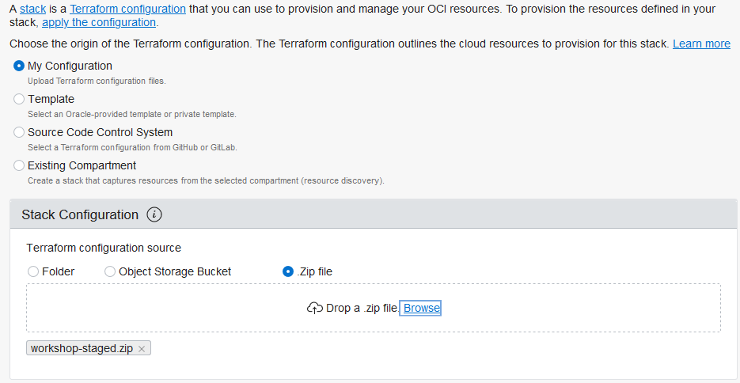
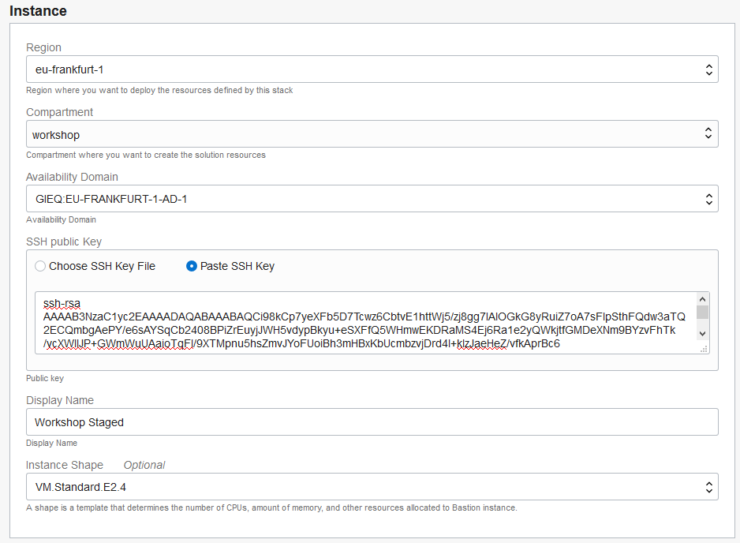
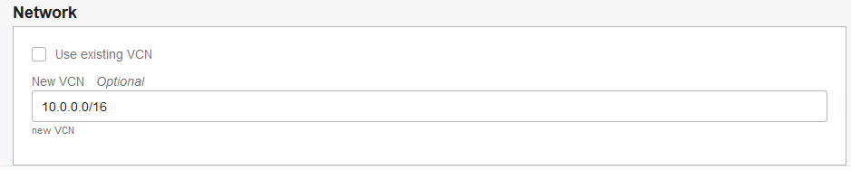
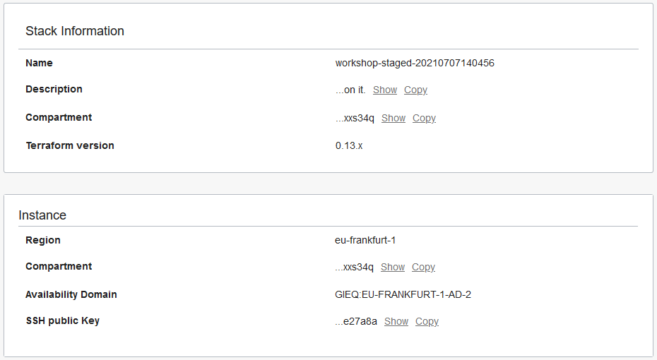
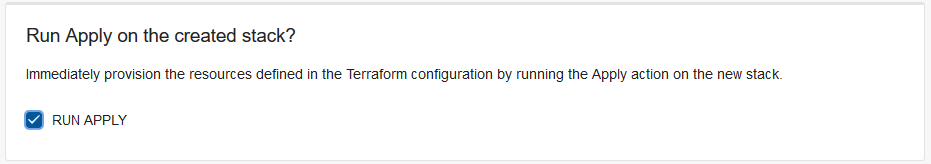
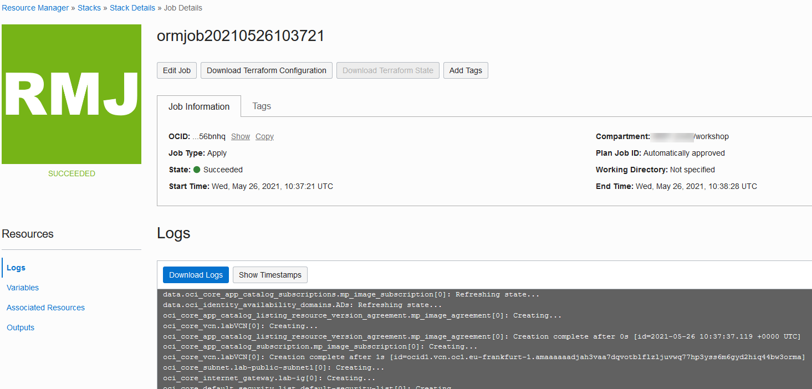
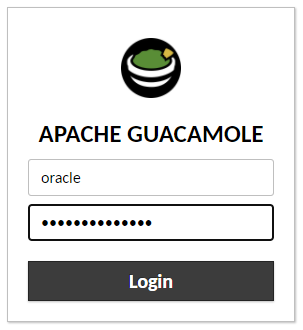
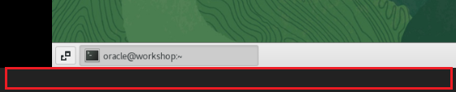
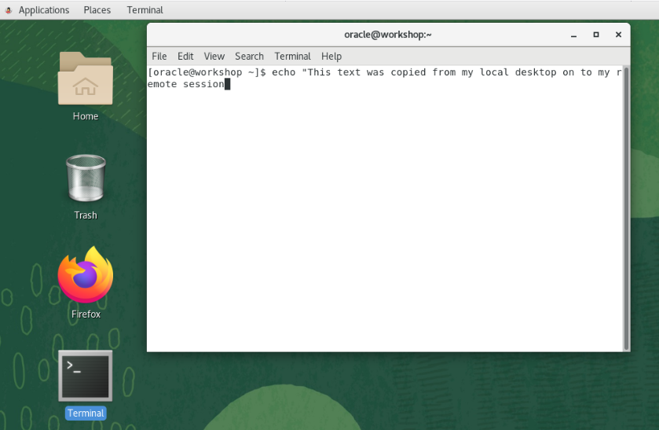

# Obtain a Compute Image with Staged Oracle Database 19c Installer Files

## Introduction
Use Resource Manager in Oracle Cloud Infrastructure (OCI) to quickly create a compute instance that has the Oracle Database 19c installer files staged on it. Guacomole is installed on the compute instance to provide an easy-to-use browser user interface. You can also access a terminal window on the compute instance.

Begin by creating a stack in Resource Manager. A stack is a collection of Oracle Cloud Infrastructure resources corresponding to a given Terraform configuration. A Terraform configuration is a set of one or more TF files written in HashiCorp Configuration Language (HCL) that specify the Oracle Cloud Infrastructure resources to create. The Terraform configuration that you use here loads a custom image stored in Oracle Cloud Marketplace and creates a virtual cloud network (VCN). After your compute instance is created, you can log into it via a browser.

Oracle highly recommends that you create a new VCN when configuring the stack, which is the default, to ensure you have all of the proper connectivity required to access your compute instance and run the applications. If you choose to use one of your own existing VCNs when you configure the stack, be sure that your VCN has a public subnet and a routing table configured with an Internet Gateway. Your VCN also requires an ingress security rule to allow traffic on port 8080 so that you can access your compute instance via a browser. STEP 5 covers how to configure the security rule.

> **Note**: If you are working in the LiveLabs environment, you can skip STEP 1 because it is already done for you.

Estimated Lab Time: 30 minutes

### Objectives

Learn how to do the following:

- Create and apply a stack in Resource Manager
- Obtain the public IP address of your compute instance
- Connect to your compute instance from a browser
- Enable copying and pasting from your local computer to your Guacamole desktop
- Configure a security rule in your VCN

### Prerequisites

Be sure that the following tasks are completed before you start:

- Obtain an Oracle Cloud account.
- Create SSH keys.
- Sign in to Oracle Cloud Infrastructure.


## **STEP 1**: Create and apply a stack in Resource Manager

> **Note**: If you are working in the LiveLabs environment, you can skip this step and proceed to STEP 2.

1. Download [workshop-staged.zip](need url) to a directory on your local computer. This ZIP file contains the terraform script that you use with Resource Manager.

2. On the home page in Oracle Cloud Infrastructure, click **Create a stack**. The **Create Stack** page is displayed.

  

    The **Create Stack - Stack Information** page is displayed.

3. Configure the following for the stack:

    1. Select **My Configuration**.

    2. In the **Stack Configuration** area, select **.ZIP file**, click **Browse**, select the ZIP file that you just downloaded, and then click **Open**.

  

    3. For **Name**, leave the default stack name as is.

    4. For **Description**, leave the default description as is.

    5. Select your compartment.

4. Click **Next**.

    The **Configure Variables** page is displayed.

5. In the **Instance** section, configure the following for the compute instance:

    1. Make sure the appropriate region is selected.

    2. Select your compartment.

    3. Select an availability domain.

    4. Select **Paste SSH Key**, and then paste the contents of your public key into the box. Be sure that there are no carriage returns. The key should be all on one line.

    5. Leave **VMStandard.E2.4** selected as the instance shape. This shape meets the memory requirements for installing Oracle Database 19c.

  

6. Choose one of the following options to configure the network:

    - Option 1 (Recommended): Leave the default settings as is to generate a new VCN.

    - Option 2: Select **Use existing VCN** to select one of your own existing VCNs. If you select this option, your VCN needs to have a public subnet and a routing table configured with an Internet Gateway. Your VCN also requires an ingress security rule to allow traffic on port 8080 so that you can access your compute instance via a browser. See STEP 5 for information on how to configure the security rule.

  

7. Click **Next**.

8. On the **Review** page, verify that the information is correct.

  

9. In the **Run Apply on the created stack** section, select **RUN APPLY** to immediately provision the resources.

  

6. Click **Create**.

    Resource Manager starts provisioning your compute instance. The **Job Details** page is displayed. You can monitor the progress of the job by viewing the details in the log. When the job is finished, the state reads **Succeeded**.

  

7. Wait for the log to indicate that the Apply job has completed. The last line in the log should read as follows:

    ```
    Apply complete! Resources: 8 added, 0 changed, 0 destroyed.
    ```


## **STEP 2**: Obtain the public IP address of your compute instance

1. From the navigation menu in the Oracle Cloud Infrastructure Console, select **Compute**, and then **Instances**.

2. Select your compartment.

3. Find the public IP address of the compute instance called **workshop-staged** in the table and jot it down.

4. (Optional) Click the name of your compute instance to view all of its details.


## **STEP 3**: Connect to your compute instance via a browser

1. On your local computer, open a browser, and enter the following url. Replace `compute-public-ip` with the public IP address of your compute instance.

    ```
    compute-public-ip:8080/guacamole
    ```

2. Enter `oracle` as the username and `Guac.LiveLabs_` as the password, and then click **Login**. Don't forget the underscore at the end of the password!
    

   You are presented with a Guacamole desktop. The desktop provides shortcuts to Firefox and a terminal window.


## **STEP 4**: Enable copying and pasting from your local computer to your Guacamole desktop
Direct copying and pasting isn't supported on the Guacamole desktop. However, you can enable an alternative local-to-remote clipboard by using the Input Text field.

1. On your compute instance, enter **CTRL+ALT+SHIFT** (Windows) or **CTRL+CMD+SHIFT** (Mac).

2. Select **Text Input**.

  A black Text Input field is added to the bottom of your screen. In this field, you can paste any text copied from your local environment.

    

3. Test the copy/paste feature by doing the following:

    1. Double-click the **Terminal** icon on the desktop to open a terminal window.

    2. Position the cursor after the prompt in the terminal window. You want to make sure that the cursor is positioned in the place where you want to paste the copied text.

    3. Copy the following text to the clipboard.

    ```
    echo "This text was copied from my local desktop on to my remote session"
    ```

    4. Right-click the black Text Input field, and select **Paste**. The text is pasted into the terminal window.

    


## **STEP 5**: Configure a security rule on your VCN

> **Note**: Complete this step only if you selected to use one of your own existing VCNs in STEP 1.

1. From the navigation menu, select **Networking**, and then **Virtual Cloud Networks**.

2. Select the compartment in which your VCN resides.

3. Click the name of your VCN.

4. On the left, click **Security Lists**.

5. Click the default security list.

6. Click **Add Ingress Rules**. An Ingress Rule dialog box is displayed.

7. Configure the following rule, and then click **Add Ingress Rules**.

    - source type: CIDR
    - source cidr 0.0.0.0/0
    - destination port: 8080


## Learn More

- [Resource Manager](https://docs.oracle.com/en-us/iaas/Content/ResourceManager/Concepts/landing.htm#ResourceManager)
- [Video about Resource Manager](https://youtu.be/udJdVCz5HYs)
- [Oracle Cloud Marketplace](https://cloudmarketplace.oracle.com/marketplace/en_US/homePage.jspx)

## Acknowledgements

- **Author**- Jody Glover, Principal User Assistance Developer, Database Development
- **Last Updated By/Date** - Jody Glover, Database team, May 26 2021
