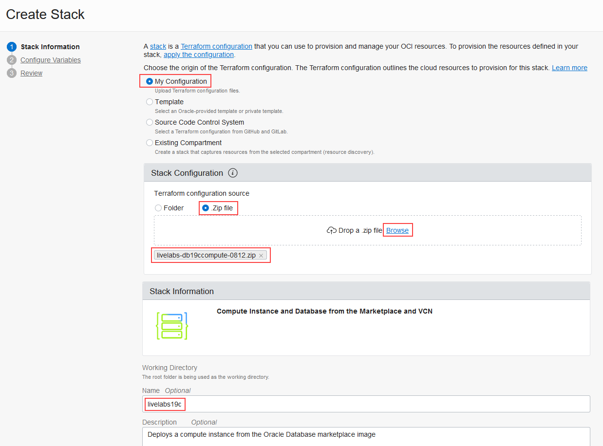
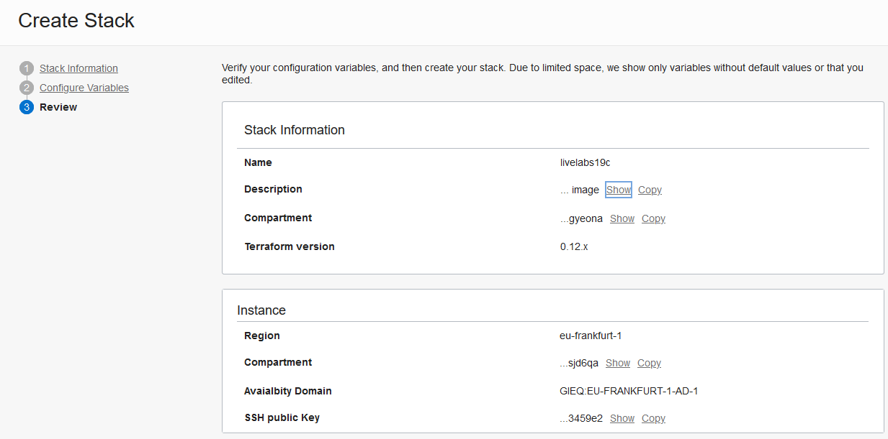

# Prepare Setup

## Introduction
Use Resource Manager to quickly deploy the following two compute instances:

- **workshop-staged**: This Linux instance has Oracle Database 19c installation files staged on it.
- **workshop-installed**: This Linux instance has Oracle Database 19c fully installed on it.

We strongly recommend letting Resource Manager create a virtual cloud network (VCN) for you when you build the compute instances. If you would rather use an existing VCN, then be sure to complete STEP 3 to add an ingress rule to your existing VCN.

In Resource Manager, you create a stack to generate each compute instance. A stack is a collection of Oracle Cloud Infrastructure resources corresponding to a given Terraform configuration. A Terraform configuration is a set of one or more TF files written in HashiCorp Configuration Language (HCL) that specify the Oracle Cloud Infrastructure resources to create. The Terraform configurations that you use in this lab are provided in the form of two downloadable ZIP files. Both ZIP files load a custom image stored in Oracle Cloud Marketplace onto a compute instance for you. After you create a stack, you apply it to start a provisioning job.

*Estimated Lab Time:* 1 hour

### Objectives
- Download the Oracle Resource Manager stack ZIP files to your local computer
- Create two compute instances by using Resource Manager
- (Optional) Add an ingress rule to your existing VCN

### Prerequisites

- You have an Oracle Cloud account.
- You are signed in to the Oracle Cloud Infrastructure Console.
- You created SSH Keys.

## **STEP 1**: Download Oracle Resource Manager stack ZIP files to your local computer.

Click the following links and download the files to your browser's `Download` folder.

- **workshop-staged**: <link 1>
- **workshop-installed**: https://objectstorage.us-ashburn-1.oraclecloud.com/p/G7LZB2PC1IU-WlBfrsDzKTgqKL9vbyhE5mWrF01MAyD3Gi589C6detaJdbTESF3F/n/natdsecurity/b/stack/o/db-multitenant-mkplc-freetier.zip

## **STEP 2**: Create two compute instances by using Resource Manager

In this section, you run through the following steps twice. The first time, you create a `workshop-staged` compute instance. The second time, you create a `workshop-installed` compute instance.

1. On the home page in Oracle Cloud Infrastructure, click **Create a stack**. The **Create Stack** page is displayed. The **Create Stack** page is displayed.

  

2. For **Stack Information**, do the following:

  a) Select **My Configuration**.

  b) In the **Stack Configuration** area, select **.ZIP file**, click **Browse**, select the `workshop-staged` ZIP file that you just downloaded, and then click **Open**.

  c) Scroll down, and in the **NAME** box, enter a name of your choice, for example, **livelabs19c**.

  

  d) Click **Next**.

4. For **Configure Variables**, do the following:

  a) Leave **Region** as is.

  b) Select the compartment in which you want to create the compute instance.

  c) Select an availability domain.

  d) Select **Paste SSH Key**, and paste the contents of your public key into the box.

  e) Leave **VMStandard.E2.4** selected as the instance shape. This shape meets the memory requirements for installing Oracle Database 19c. *REVIEWER: We plan to set up this stack so that the user uses VM.Standard.E3.Flex and doesn't need to select one here*

  f) For network, select an existing VCN or leave the default as is so that Resource Manager creates a new network for you.

  

  g) Click **Next**.

5. On the **Review** page, verify that the information is correct.

  

6. Click **Create**. Your stack is created and the **Stack Details** page is displayed.

7. From the **Terraform Actions** drop-down, select **Apply**. The **Apply** window is displayed.

8. In the **Apply** window, leave the name as is and the **APPLY JOB PLAN RESOLUTION** set to **Automatically approve**, and click **Apply**. Resource Manager starts a job to deploy your resources.

  

9. When the job is finished, inspect the log. The last line should read `Apply complete!`.

10. Repeat all the steps again and select the `workshop-installed` ZIP file instead for step 2b.

## **STEP 3**: Add an ingress rule to your existing VCN

Perform this step only if you opted to use an existing VCN in the previous step. If you let Resource Manager create a new VCN for your compute instances, then you can skip this step.

This workshop requires port 8080 be available on your VCN, therefore, you need to add an ingress rule to your VCN.

1. From the navigation menu in Oracle Cloud Infrastructure, select **Networking**, and then **Virtual Cloud Networks**.

2. Select the compartment where your VCN resides.

3. Click the virtual cloud network name.

4. On the left, click **Security Lists**.

5. Click **Default Security List**.

6. Click **Add Ingress Rules**. The Ingress Rule 1 dialog box is displayed.

7. Configure the following rule, and then click **Add Ingress Rules**.

  - source type: CIDR
  - source cidr 0.0.0.0/0
  - destination port: 8080

## Acknowledgements

* **Author** - Jody Glover, Principal User Assistance Developer, Database Development
* **Last Updated By/Date** - Jody Glover, May 5 2021
