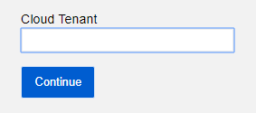
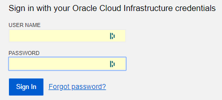
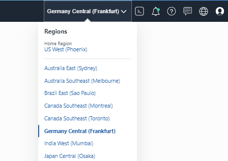
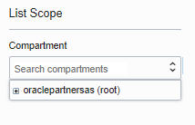
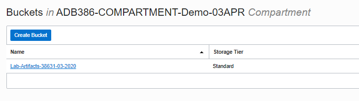
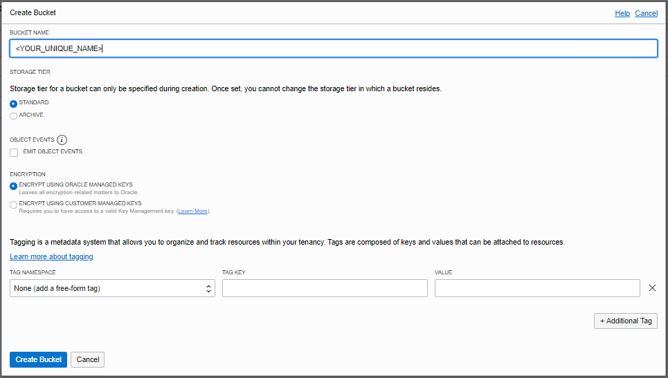

# Upgrade to 19c Autonomous Database #

In this lab will be show the usage of a new tool called MV2ADB. This tool can, after completing the configuration file, execute all the steps to export, transport and import a database to the Oracle Autonomous Cloud.

## Disclaimer ##
The following is intended to outline our general product direction. It is intended for information purposes only, and may not be incorporated into any contract. It is not a commitment to deliver any material, code, or functionality, and should not be relied upon in making purchasing decisions. The development, release, and timing of any features or functionality described for Oracle’s products remains at the sole discretion of Oracle.

## Prerequisites ##

- You have access to the Upgrade to a 19c Hands-on-Lab client image
- A new 19c database has been created in this image
- All databases in the image are running

When in doubt or need to start the databases, please login as **oracle** user and execute the following command:

````
$ <copy>. oraenv</copy>
````
Please enter the SID of the 19c database that you have created in the first lab. In this example, the SID is **`19C`**
````
ORACLE_SID = [oracle] ? <copy>DB19C</copy>
The Oracle base has been set to /u01/app/oracle
````
Now execute the command to start all databases listed in the `/etc/oratab` file:

````
$ </copy>dbstart $ORACLE_HOME</copy>
````

The output should be similar to this:
````
Processing Database instance "DB112": log file /u01/app/oracle/product/11.2.0/dbhome_112/rdbms/log/startup.log
Processing Database instance "DB121C": log file /u01/app/oracle/product/12.1.0/dbhome_121/rdbms/log/startup.log
Processing Database instance "DB122": log file /u01/app/oracle/product/12.2.0/dbhome_122/rdbms/log/startup.log
Processing Database instance "DB18C": log file /u01/app/oracle/product/18.1.0/dbhome_18c/rdbms/log/startup.log
Processing Database instance "DB19C": log file /u01/app/oracle/product/19.3.0/dbhome_19c/rdbms/log/startup.log
````

## Download and install the required tools ##

The script that allows you easy migration to ADB can be downloaded from MyOracle Support through note **2463574.1**. In the Workshop environment we have already downloaded the tool for you in the `/source` directory.

### Install the MV2ADB script ###
The MV2ADB tool is an .rpm package and needs to be installed as the root user.

````
[oracle@ws ~]$ <copy>sudo yum -y localinstall /source/mv2adb*.rpm</copy>

Loaded plugins: langpacks, ulninfo
Examining /source/mv2adb-2.0.1-80.noarch.rpm: mv2adb-2.0.1-80.noarch
Marking /source/mv2adb-2.0.1-80.noarch.rpm to be installed
Resolving Dependencies
--> Running transaction check
---> Package mv2adb.noarch 0:2.0.1-80 will be installed
--> Finished Dependency Resolution

==========================================================================================
 Package            Arch            Version        Repository                       Size
==========================================================================================
Installing:
 mv2adb             noarch          2.0.1-80       /mv2adb-2.0.1-80.noarch          273 k

Transaction Summary
==========================================================================================
Install  1 Package

Total size: 273 k
Installed size: 273 k
Downloading packages:
Running transaction check
Running transaction test
Transaction test succeeded
Running transaction
  Installing : mv2adb-2.0.1-80.noarch                                                 1/1

MV2ADB has been installed on /opt/mv2adb succesfully!

  Verifying  : mv2adb-2.0.1-80.noarch                                                 1/1

Installed:
  mv2adb.noarch 0:2.0.1-80

Complete!
````

Please note that the install script shows the location where the tool has been installed. In this case **`/opt/mv2adb`**. We need this later in the Lab.

### Check already installed Oracle Instant Client ###

We have already downloaded and unzipped the required files for the Oracle Instant Client. In the directory `/opt/instantclient` we have unzipped the base Instant Client, the SQL*Plus zip file and the Tools zip file. All have been downloaded from OTN.

Make sure the directory 19.6 exists and that the directory has contents by executing the following command:

````
$ <copy>ls -l /opt/instantclient/19.6/</copy>

[oracle@upgradews-4 ~]$ ls -l /opt/instantclient/19.6/
total 645368
-rwxr-xr-x 1 root root     41840 Mar 31 13:55 adrci
-r-xr-xr-x 1 root root      5780 Mar 31 13:55 BASIC_LICENSE
-rw-r--r-- 1 root root      1632 Mar 31 13:55 BASIC_README
-rwxr-xr-x 1 root root   1018928 Mar 31 13:55 exp
-rwxr-xr-x 1 root root    220624 Mar 31 13:55 expdp
-rwxr-xr-x 1 root root     59312 Mar 31 13:55 genezi
-rw-r--r-- 1 root root       342 Mar 31 13:55 glogin.sql
-rwxr-xr-x 1 root root    502464 Mar 31 13:55 imp
-rwxr-xr-x 1 root root    232752 Mar 31 13:55 impdp
-rwxr-xr-x 1 root root   8049064 Mar 31 13:55 libclntshcore.so.19.1
...
-rwxr-xr-x 1 root root    750992 Mar 31 13:55 wrc
-rw-r--r-- 1 root root     74263 Mar 31 13:55 xstreams.jar
````

## Create a new Autonomous Database ##

Since we are migrating to Oracle Autonomous Database, we will need to create a new ATP database before we can continue. 

### Login to Oracle Cloud Infrastructure ###

In your Workshop hand-out you will see an Oracle Cloud Infrastructure URL like `https://console.<region>.oraclecloud.com`. Locate this URL and enter it into the browser inside the supplied image. In the same section on the handout, you will see the Cloud Tenancy, the username and the password.

Execute the following steps:

- Navigate to the Oracle Cloud Infrastructure Console
	- Enter the Tenancy name and submit
	- Enter the username and password supplied and press submit





When logged in, execute the following steps

- Use the left side menu (stacked menu or hamburger menu)
- Navigate to the Autonomous Transaction Processing menu


In this menu, you can see the databases currently running and you can create new databases. 

### Select correct region and compartment ###

Since Oracle has several regions in the world to host the databases and your administrator might have restricted the locations where you can create those databases, make sure you have selected the correct values for the following items:

- Datacenter Region
	- Like US West (Phoenix) or Germany Central (Frankfurt)
	- Correct region can be found on your hand-out



- Compartment
	- By default the (root) compartment is selected
	- Select the Compartment you have access to
	- Correct compartment can be found on your hand-out
	- Compartment name in PTS workshops has the format `ADB-COMPARTMENT-<city>-<date>`


 
### Create a new Autonomous Transaction Processing database ###

By clicking on the blue 'Create Autonomous Database' button, the wizard will display that helps you with the creation. Enter the following values for your new database:

````
Workload Type    : Autonomous Transaction Processing
Compartment      : <keep value>
Display Name     : ATP-<your-name>
Database Name    : ATP<your-initials>
Database version : 19c
CPU Core Count   : 1
Storage (TB)     : 1
Autoscaling      : unchecked
Password         : OraclePTS#2019
Network Access   : Allow secure access from everywhere
License Type     : Bring Your Own License (BYOL)
````

After this, click on the **'Create Autonomous Database'** button to start the process. This process should not take more than a few minutes to complete. 

You may continue with the Lab guide while the database is being created.

## Create an Object Store Bucket ##

The MV2ADB tool needs to upload one or several Datapump dump files to the Oracle Cloud Environment before the import process can start. It requires Cloud Object storage to do this.

The MV2ADB tool can create the required Object Store Bucket as part of the execution of the script but this requires the install and setup of the OCI Command Line Interface. To bypass the extra install requirement, we will pre-create the bucket ourselves in the OCI Console.

### Navigate to the Object Storage menu in the OCI Console ###

Execute the following steps:

- Make sure you are logged into the OCI Cloud console
- Use the left side menu (stacked menu or hamburger menu)
- Navigate to the Object Storage menu



- Make sure you are working in the correct region
- Make sure you have selected the correct compartment

To create a new bucket (which behaves similar to a subdirectory in a filesystem), click on the blue **'Create Bucket'** button. A 'Create Bucket' window will be displayed where you can enter the Bucket name.



- Do not use the default name
- Enter a unique name that you can remember
	- Like 'Upgrade-<Your Initials>'
- Make sure you store the bucket name somewhere
	- Copy/paste it on a notepad or piece of papier
	- The name of the bucket is case sensitive
	- We need this name in the configuration file for MV2ADB

## Gather parameters and create the MV2ADB config file ##

The MV2ADB script needs input parameters so that it can identify the source database, the schemas to be migrated and the destination system. In the following sections, we will go through the minimum required parameters needed for this lab and the migration. 

For additional parameters, please check the MV2ADB documentation in the MOS note.

### Create the initial configuration file ###

In this section will we create an initial configuration file. Some parameters have already been filled with values, some values you will need to gather and enter. We will create an empty config file using a text editor. 

Text editing on the supplied Linux image can be done using any tool you know in the image like `vi` (for people who know how vi works) or for example `gedit` which works similar to Notepad in a Windows environment. In all examples in this Lab where you see `vi` used, you can replace `vi` by `gedit`.

If you are currently not logged in as the root user, execute the following command as either `oracle` or `opc` user:

````
$ <copy>sudo -s</copy>
````

Create the new configuration file by executing the following command:
````
# <copy>vi /opt/mv2adb/conf/atp.mv2adb.cfg</copy>
````

Cut-and-paste the following default setup file in the new config file:
````
<copy>
# DB Parameters
DB_CONSTRING=//localhost:1521/DB112
SYSTEM_DB_PASSWORD=53152A9726C00647158CD4B1E103F1F2
SCHEMAS=PARKINGFINE
DUMP_PATH=/tmp
DUMP_NAME=DB112-ATP.dmp
OHOME=/u01/app/oracle/product/11.2.0/dbhome_112
ICHOME=/opt/instantclient/19.6

# Object Store Properties
OCI_HOST=https://swiftobjectstorage.<region>.oraclecloud.com
OCI_NAMESPACE=oraclepartnersas
OCI_BUCKET=
OCI_ID=
OCI_PASSWORD=

# ADB Parameters
ADB_NAME=
ADB_PASSWORD=
ADB_CFILE=
ADB_TARGET=ATP
</copy>
````

<!-- ADB_TARGET=ATP is needed because of issue with 11g database/sqlplus. Has been logged as a bug -->

<!-- Removed because of issues with 11g and encryption
# Expdp/Impdp Parameters
ENC_PASSWORD=53152A9726C00647158CD4B1E103F1F2
ENC_TYPE=AES256
-->

In the next sections we will locate the required parameters and put them in this config file. Please keep this config file open but save it on a regular basis so that no information is lost if something goes wrong. If you need to access the Operating System, please open a second terminal window.

### Gather the (Source) DB Parameters ###

The initial section is regarding the source database. Since this is a Lab environment, we know what the connection details are and which schema we want to migrate. In a regular setup, you need to change the options to your settings.

Here is some information where you can find the details:

- **DB_CONSTRING**
	- Connecting string from the local system (where mv2adb is running) to the database instance that needs to be migrated
- **SYSTEM_DB_PASSWORD**
	- Password for SYSTEM user for this source database
- **SCHEMAS**
	- Schema's to be exported
	- Only transport the schema's that you need, do not include any default schema's like HR, OE, SYSTEM, SYS etc as they already exist in ADB and might result in errors (or get ignored)
- ** DUMP_PATH**
	- Directory on the local filesystem where the .dmp files can be storage before getting uploaded to the Object Storage.
	- Outside of this image, please make sure there is enough free space available for the export.
- **DUMP_NAME**
	- Name of the dumpfiles
	- In case of parallelism, the script will automatically append numbers to the file.
	- Make sure the files are unique in the source but also in the destination (ATP) environment.
	- During the execution of the script, existing files on the Object storage will be overwritten without warning.
- **OHOME**
	- The source database Oracle Home
- **IHOME**
	- The installed Oracle Instant Client home (basic, SQL*Plus and Tools unzipped)

All of the values have been entered already. In case you want to specify your own password, you need will need to encrypt this password using the MV2ADB tooling. For this, the command `encpwd` has been created.

Example: If your password is 'Welcome_123', you would need to execute the following command:

````
# <copy>/opt/mv2adb/mv2adb encpass</copy>
````

After this, you enter the password your want to encrypt (twice) and the encrypted value will be displayed:

    Please enter the password :
    Please re-enter the password :
    53152A9726C00647158CD4B1E103F1F2

This value has already been entered in the config file as password entry for the database. For this Hands On Lab, please do not change it (unless you change the password on the 11g Source database as well).

<!-- Removed of issue with encryption and 11g clients
### Gathering Expdb/Impdb parameters ###

The MV2ADB tool only allows you to transport encrypted dumpfiles to the OCI Cloud to make sure your data cannot be compromised when exporting and uploading your data. In this section of the config file, you need to specify the password and the encryption type. We have already entered a password and encryption type for you.

- **ENC_PASSWORD**
	- A password that will encrypt your datapump exports. 
	- It has nothing to do with any existing user or password. 
	- Please note that this password cannot be plain text, it needs to be encrypted
- **END_TYPE**
	- Type of encryption of your data. 
	- The higher the number, the more encryption but also slower export/import. 
	- Options are  **AES128**, **AES192** and **AES256**
-->

### Gathering Object Store properties ###

The MV2ADB script can currently only work with .dmp dumpfiles using the Swift compatible interface and Swift compatible storage. The parameters in the 'Object Store Properties' section specify where the dumpfiles should be uploaded to after the export and imported from during the import. This location is also where the logfiles of the impdp process will be stored.

If the OCI Command Line Interface (OCI CLI) is installed on the MV2ADB server, you do not need to enter the Swift compatible details. See the example config in the documentation for more information.

- **OCI_HOST**
	- This is the Swift object storage URL for your environment. 
	- It usually has the form of `https://swiftobjectstorage.<region>.oraclecloud.com` 
	- Region is **`us-phoenix-1`**, **`eu-frankfurt-1`** or similar. Please check your hand-out for details
- **OCI_NAMESPACE**
	- Namespace of your Tenancy, this is usually the lowercase version of your Tenancy 
	- Be aware, for SWIFT we only use lower case naming
- **OCI_BUCKET**
	- The name of an object storage bucket that will be used for this migration. 
	- In the previous section you pre-created a bucket with a unique name.
- **OCI_ID**
	- Your username in OCI
	- Example: ADB-<city>-<date>
- **OCI_PASSWORD**
	- This is NOT the console password for your user !
	- The Swift interface needs a so-called Authentication Token
	- This Auth Token is user specific and would normally be generated by you
	- In this workshop, we have already generated the Auth Token for you.

Before we can enter all information into our configuration file, we need to encrypt the Swift Authentication Token using the mv2adb password encoder. The clear-text value of the generated Auth token can be found in the Object storage bucket in your compartment. Locate the file in the **`Lab-Artifacts-<xxx>`** bucket.

- Navigate to the Object Storage section of OCI
- Click on your Lab-Artifacts-<xx> bucket
- Locate the file called auth_token.txt
- Click on the stacked menu for the file and choose 'Object Details'
	- The Authentication Token will be displayed and consists of 20 random characters.

We can now encrypt the Authentication Token by running the mv2adb password encoder.

````
# <copy>/opt/mv2adb/mv2adb encpass</copy>
````

- Select the 20 characters of the Authentication Token in your console screen
	- Right click your mouse and select Copy
- Navigate to the terminal window where the `mv2adb` script is waiting for input
	- Paste the copied value twice (and press enter if needed after every paste action)

````
Please enter the password : <cut-and-paste auth_key>
Please re-enter the password : <cut-and-paste auth_key>
765B5FDA9F3F6110E7AB9E7D808612B3E38DA130FBCC2E3C0535DA923DF46CDF
````

Now that we have the last value we need for the Object Store settings, please enter the required information into the Object Store Properties section of the configuration file. Below is an **example** of the configuration file.

**Please do not copy these values, use your own values to complete YOUR file**

````
# Object Store Properties 
OCI_HOST=https://swiftobjectstorage.eu-frankfurt-1.oraclecloud.com
OCI_NAMESPACE=oraclepartnersas
OCI_BUCKET=ATP-MyInitials
OCI_ID=ADB-<city>-<date>
OCI_PASSWORD= 765B5FDA9F3F6110E7AB9E7D....12B3E38DA130FBCC2E3C0535DA923DF46CDF
````

### Gathering the ADB Parameters ###

During the gathering of the other parameters, your ADB environment should have been created. As a last step we will now gather the information needed for the last section in your configuration file:

- **ADB_NAME**
	- Name of your ADB instance
	- This is the **Database Name** and NOT the **Display Name** 
- **ADB_PASSWORD**
	- Database ADMIN password
	- Encrypted using the mv2adb tool
- **ADB_CFILE**
	- Zipfile containing database credentials
- **ADB_TARGET**
	- Target type of your Autonomous database.
	- Values can be ATP or ADB
	 
**First parameter** requires the name of your created ADB environment. 
- Navigate to the ADB Console and find the name of your database. 
- This should be the 'Database Name' value and not the 'Display Name' value
- Enter the Database Name value into the configuration file
 
**Second parameter** is the password you have entered while creating the Autonomous environment. 
- If you have used the suggested password, it would be OraclePTS#2019. 
	- If you have chosen another password, you now need to remember it
- Encrypt the database password using the `/opt/mv2adb/mv2adb encpass` command
- Enter the result innto your configuration file

**Third parameter** requires a download from the OCI console for this Autonomous Database, the so-called Wallet file.
- Navigate to the Autonomous Database you have created
- Click on the Display name of the database and display the details for the instance
- Click on the DB Connection button next to the green 'ATP' image
- Select Wallet type = Instance Wallet
	- Click on Download Wallet
	- In the following screen a password is requested. 
	- This is the password that protects the keystore inside the zipfile. 
	- For this exercise we will not be using this keystore so enter **any random password** twice.
	- Your zipfile will be downloaded to the default location `/home/oracle/Downloads`. 
- Please note the exact name and location of the wallet.zip and enter this in your parameters.

**Fourth parameter** should be ATP for Autonomous Transaction Processing. If you, by accident, created an Autonomous Data Warehouse environment, change the parameter accordingly.

Example values for the ADB Parameters section:

**Please do not copy these values, use your own values to complete YOUR file**

````
# ADB Parameters 
ADB_NAME=ATPINIT
ADB_PASSWORD= DE3D105A8E6F6A4D5E8XXXSW6BC1D3BA
ADB_CFILE=/home/oracle/Downloads/Wallet_ATPINIT.zip
ADB_TARGET=ATP
````

#### Make sure all parameters have a value and save the file ####

The file should be in the `/opt/mv2adb/conf` directory and is called `ATP.mv2adb.conf`

````
# <copy>ls -l /opt/mv2adb/conf</copy>

total 12
-rw-r--r-- 1 root root  471 May 17 13:13 ATP.mv2adb.conf
-rwxr-xr-x 1 root root 5159 Dec 28 12:52 DBNAME.mv2adb.cfg
````

## Check Source schema(s) for compatibility ##

Not everything is supported in the Autonomous Database Cloud environment. To make sure you do not run into any issues, a tool called ADB Schema Advisor has been created. This tool, initially a stand-alone PL/SQL Package and available on MyOracle Support, has been integrated into the MV2ADB tool. It can generate a report to show you any issues you might encounter before you actually execute the migration.

Execute the following command as root user and check the output:

````
# <copy>/opt/mv2adb/mv2adb advisor -conf /opt/mv2adb/conf/ATP.mv2adb.conf</copy>
````

Output similar as below should be displayed:

````
INFO: 2020-03-20 16:25:28: Please check the logfile '/opt/mv2adb/out/log/mv2adb_18978.log' for more details

--------------------------------------------------------
mv2adb - Move data to Oracle Autonomous Database
Version: 2.0.1-80
Copyright (c) 1982-2019 Oracle and/or its affiliates.
--------------------------------------------------------
Author: Ruggero Citton <ruggero.citton@oracle.com>
RAC Pack, Cloud Innovation and Solution Engineering Team
--------------------------------------------------------

INFO: 2020-03-20 16:25:28: Reading the configuration file '/opt/mv2adb/conf/ATP.mv2adb.conf'
INFO: 2020-03-20 16:25:28: Due to ADB_TARGET skipping online Cloud Service Type check
INFO: 2020-03-20 16:25:28: Using Oracle Home '/u01/app/oracle/product/11.2.0/dbhome_112'
INFO: 2020-03-20 16:25:28: Target Cloud Service Type is 'ATP'
INFO: 2020-03-20 16:25:29: Getting advisor report for '//localhost:1521/DB112'
INFO: 2020-03-20 16:25:29: ...step1 - installing advisor package on '//localhost:1521/DB112'
INFO: 2020-03-20 16:25:30: ...step2 - getting advisor report
INFO: 2020-03-20 16:25:30: ...getting advisor report for schema 'PARKINGFINE', it may get some time...

 ==========================================================================================                                                             
 == ATP SCHEMA MIGRATION REPORT FOR PARKINGFINE                                                                                                          
 ==========================================================================================                                                              
                                                                                                                                                         
 ADB Advisor Version   : 19.3.0.0.1                                                                                                                      
 Instance Name         : DB112                                                                                                                           
 Database Name         : DB112                                                                                                                           
 Host Name             : upgradews                                                                                                                
 Database Version      : 11.2.0.4.0                                                                                                                      
 Schemas Analyzed      : PARKINGFINE                                                                                                                     
 Analyzing for         : Autonomous Transaction Processing (Serverless)                                                                                  
 Report Start date/time: 20-MAR-2020 16:25                                                                                                               
                                                                                                                                                         
 ------------------------------------------------------------------------------------------                                                              
 -- SECTION 1: SUMMARY                                                                                                                                   
 ------------------------------------------------------------------------------------------                                                              
                                                                                                                                                         
                                            Objects         Objects         Total                                                                        
                            Object          Will Not        Will Migrate    Objects                                                                      
 Object Type                Count           Migrate         With Changes    Will Migrate                                                                 
 -------------------------  --------------  --------------  --------------  --------------                                                               
 TABLE                      1               0               0               1                                                                            
 User Objects in SYS        0               0               0               0                                                                            
 User Objects in SYSTEM     0               0               0               0                                                                            
                                                                                                                                                         
 ------------------------------------------------------------------------------------------                                                              
 -- SECTION 2: FOLLOWING OBJECTS WILL NOT MIGRATE                                                                                                        
 ------------------------------------------------------------------------------------------                                                                                                                                                                                                                      
                                                                                                                                                         
 ------------------------------------------------------------------------------------------                                                              
 -- SECTION 3: FOLLOWING OBJECTS WILL MIGRATE WITH CHANGES                                                                                               
 ------------------------------------------------------------------------------------------                                                              
                                                                                                                                                         
 ------------------------------------------------------------------------------------------                                                              
 -- SECTION 4: MIGRATION ADDITIONAL INFO                                                                                                                 
 ------------------------------------------------------------------------------------------                                                              
                                                                                                                                                         
 1) User defined tablespaces are not allowed in ATP-S and ADW-S (Serverless) (Count=1):                                                                  
 --------------------------------------------------------------------------------------                                                                  
 Note: Creation of tablespaces is disallowed in ATP and ADW (Serverless). The tablespace clause gets ignored                                             
 and all objects get created in 'DATA' tablespace. The following is the list of schemas and the tablespaces                                              
 currently in use.                                                                                                                                       
                                                                                                                                                         
 PARKINGFINE          USERS                                                                                                                              
                                                                                                                                                         
 2) Schema Owner's user attributes will be modified in ADB (Count=1):                                                                                    
 --------------------------------------------------------------------                                                                                    
 Note: The following schema owner's DEFAULT TABLESPACE and/or DEFAULT PROFILE will be modified in ADB.                                                   
                                                                                                                                                         
 DEFAULT TABLESPACE for PARKINGFINE will be modified from 'USERS' to 'DATA'                                                                              
                                                                                                                                                         
 3) User Profiles will not migrate to ADB (Count=1):                                                                                                     
 ---------------------------------------------------                                                                                                     
 Note: In ADB all users will be assigned the 'DEFAULT' Profile. Plus, you are not allowed to create additional                                           
 PROFILEs. The following user defined PROFILEs will not migrate:                                                                                         
                                                                                                                                                         
 MONITORING_PROFILE                                                                                                                                      
                                                                                                                                                         
 4) Database Options currently in use but will not be available in the ADB (Count=1):                                                                    
 ------------------------------------------------------------------------------------                                                                    
 Note: The following Database Options are detected as being used. ADB does not have these Options installed.                                             
 Please verify if the application/schema to be migrated depends on these options.                                                                        
                                                                                                                                                         
 Tuning Pack                                                                                                                                             
                                                                                                                                                         
 5) Database Parameters are detected as modified in the current database but can't be modified in the ADB (Count=1):                                     
 -------------------------------------------------------------------------------------------------------------------                                     
 Note: The following init parameters are modified in your database that you would not be able to modify                                                  
 in ADB. Please refer to the Oracle Autonomous Database documentation on the parameters that you are                                                     
 allowed to modify.                                                                                                                                      
                                                                                                                                                         
 local_listener                                                                                                                                          
                                                                                                                                                         
                                                                                                                                                         
 ------------------------------------------------------------------------------------------                                                              
 -- END OF REPORT                                                                                                                                        
 ------------------------------------------------------------------------------------------                                                              
 Report End Datetime   : 20-MAR-2020 16:25                                                                                                               
 Report Runtime        : +000000000 00:00:03.771542000                                                                                                   
 ------------------------------------------------------------------------------------------                                                              
````

In this output, you can see that the schema PARKINGFINE has no issues with tables as it only contains a simple table with 9 million rows in it. We will use this schema to demonstrate the MV2ADB script.

## Execute the MV2ADB script ##

Now we can start the actual migration by starting the MV2ADB tool using the proper options. Execute the following command as root user:

````
$ <copy>/opt/mv2adb/mv2adb auto -conf /opt/mv2adb/conf/ATP.mv2adb.conf</copy>

INFO: 2020-03-20 16:34:40: Please check the logfile '/opt/mv2adb/out/log/mv2adb_30698.log' for more details

--------------------------------------------------------
mv2adb - Move data to Oracle Autonomous Database
Version: 2.0.1-80
Copyright (c) 1982-2019 Oracle and/or its affiliates.
--------------------------------------------------------
Author: Ruggero Citton <ruggero.citton@oracle.com>
RAC Pack, Cloud Innovation and Solution Engineering Team
--------------------------------------------------------

INFO: 2020-03-20 16:34:40: Reading the configuration file '/opt/mv2adb/conf/ATP.mv2adb.conf'
INFO: 2020-03-20 16:34:44: Checking schemas on source DB
INFO: 2020-03-20 16:34:44: Performing schema expdp for 'PARKINGFINE' from source DB...
INFO: 2020-03-20 16:34:44: Step 1 - ...getting ADB parallelism
INFO: 2020-03-20 16:34:45: Step 2 - ...getting source DB version
INFO: 2020-03-20 16:34:45: Step 3 - ...creating expdp directory 'MV2ADB_EXPDP_DIR' for path '/tmp'
INFO: 2020-03-20 16:34:45: Step 4 - ...getting latest SCN
INFO: 2020-03-20 16:34:46: Step 5 - ...checking Cloud Service Type
INFO: 2020-03-20 16:34:47: Step 6 - ...executing export datapump
SUCCESS: 2020-03-20 16:35:31: Expdp executed successfully

INFO: 2020-03-20 16:35:31: Performing '6' dump upload to Oracle Object Store...
INFO: 2020-03-20 16:35:31: ...loading '/tmp/DB112-ATP_01.dmp' into bucket 'MyBucket'
SUCCESS: 2020-03-20 16:35:31: ...file '/tmp/DB112-ATP_01.dmp' uploaded on 'MyBucket' successfully
INFO: 2020-03-20 16:35:31: ...loading '/tmp/DB112-ATP_02.dmp' into bucket 'MyBucket'
SUCCESS: 2020-03-20 16:35:39: ...file '/tmp/DB112-ATP_02.dmp' uploaded on 'MyBucket' successfully
INFO: 2020-03-20 16:35:39: ...loading '/tmp/DB112-ATP_03.dmp' into bucket 'MyBucket'
SUCCESS: 2020-03-20 16:35:45: ...file '/tmp/DB112-ATP_03.dmp' uploaded on 'MyBucket' successfully
INFO: 2020-03-20 16:35:45: ...loading '/tmp/DB112-ATP_04.dmp' into bucket 'MyBucket'
SUCCESS: 2020-03-20 16:35:53: ...file '/tmp/DB112-ATP_04.dmp' uploaded on 'MyBucket' successfully
INFO: 2020-03-20 16:35:53: ...loading '/tmp/DB112-ATP_05.dmp' into bucket 'MyBucket'
SUCCESS: 2020-03-20 16:36:00: ...file '/tmp/DB112-ATP_05.dmp' uploaded on 'MyBucket' successfully
INFO: 2020-03-20 16:36:00: ...loading '/tmp/DB112-ATP_06.dmp' into bucket 'MyBucket'
SUCCESS: 2020-03-20 16:36:07: ...file '/tmp/DB112-ATP_06.dmp' uploaded on 'MyBucket' successfully
SUCCESS: 2020-03-20 16:36:07: Upload of '6' dumps over Oracle Object Store complete successfully

INFO: 2020-03-20 16:36:07: Performing impdp into ADB...
INFO: 2020-03-20 16:36:07: Step 1 - ...drop Object Store Credential
INFO: 2020-03-20 16:36:10: Step 2 - ...creating Object Store Credential
INFO: 2020-03-20 16:36:11: Step 3 - ...executing import datapump to ADB
INFO: 2020-03-20 16:42:48: Moving impdp log 'mv2adb_impdp_20200320-163611.log' to Object Store
SUCCESS: 2020-03-20 16:42:49: Impdp to ADB 'ATPDB' executed successfully

INFO: 2020-03-20 16:42:43: Recompiling schemas on ADB 'ATPDB_high'...
INFO: 2020-03-20 16:42:43: ...recompiling schema 'PARKINGFINE', it may get some time...

INFO: 2020-03-20 16:42:44: Recompiling schemas on ADB 'ATPDB__high'...
INFO: 2020-03-20 16:42:44: ...recompiling schema 'PARKINGFINE', it may get some time...
````

After about 10 minutes, all the steps should have been executed successfully. 

If you want to see which issues end/or errors were found during the import, check the logfile as specified in the logging. If you encounter any error during the running of the script, please check the logfile in the directory that was displayed immediately after you started the script. 

#### Login and check the migrated database ####

In the workshop image, on your Desktop, you can see SQL*Developer. 

- Start this application.
- Create a new connection by clicking on the green (+) plug sign
	- This is in the left top, the Connections pane

Enter the following details:

- **Connection Name**
	- Choose your own name
- **Username**
	- admin
- **Password**
	- OraclePTS#2019 (or any other password you have used)
- **Connection Type**
	- Cloud Wallet
- **Configuration File**
	- Select the wallet you downloaded in /home/oracle/Downloads
- **Service**
	- Select your service with the `_tp` extension
	- Make sure you select a service that belongs to your ATP instance

After connecting, a new SQL Window will be displayed. Here you can execute queries on the ATP environment.

````
<copy>select count(*) from parkingfine.parking_violations</copy>
````

After clicking on the green arrow in the SQL Window, the query will be executed. The result of the query should be similar to this:

````
COUNT(*)
--------
 9060183
````

It seems the migration of our table with over 9 million rows was successful.

## Acknowledgements ##

- Author - Robert Pastijn, DB Dev Product Management, PTS EMEA - March 2020
