## Introduction
This Lab walks you through the steps to install Oracle container database using Oracle Universal Installer (OUI).

Estimated Lab Time: 10 minutes

## **STEP 1**: Create a Container Database

1. Log on to your computer as a member of the administrative group that is authorized to install Oracle Database software and create a database.
2. Invoke DBCA as appropriate to your operating system.
3. The Database Operation window appears. Select **Create a Database**. Click **Next**.

    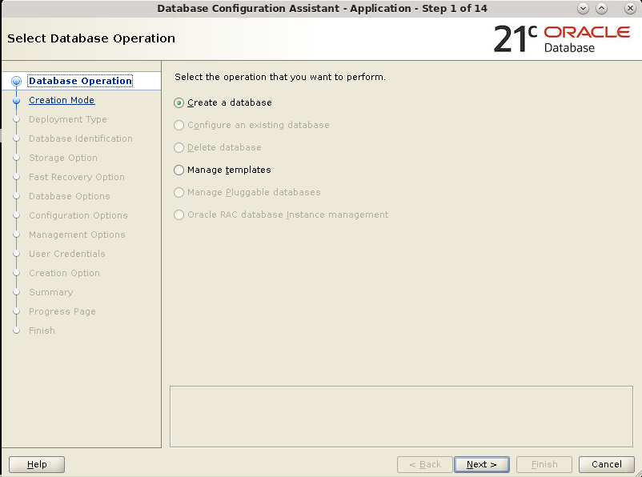

4. The Creation Mode window appears. Select Advanced configuration and click Next.

    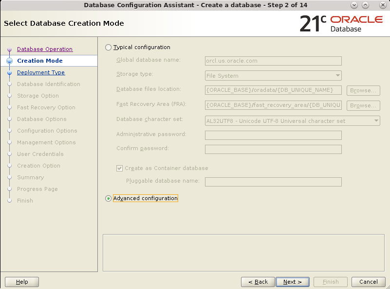

5. The Deployment Type window appears. Select the template suited to the type of workload your database will support. If you are not sure which to choose, then select the default General Purpose or Transaction Processing template and click Next.  

    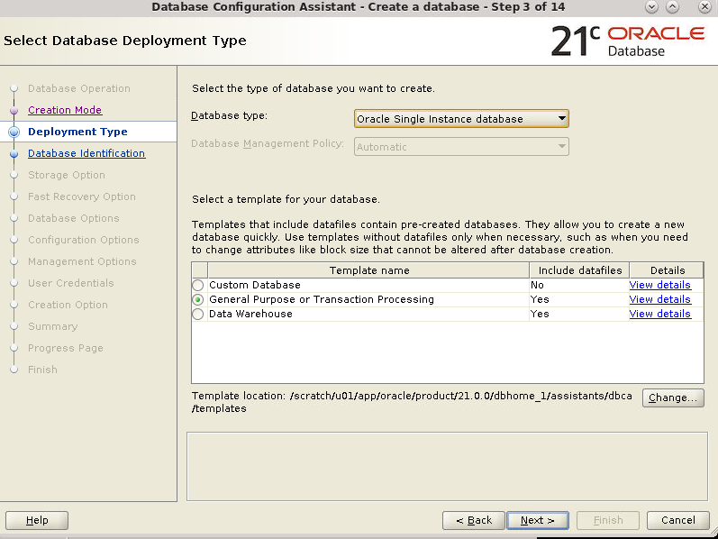

6. The Database Identification window appears. Enter a value in the Global Database Name field. Check "Create as Container database" and click Next.

    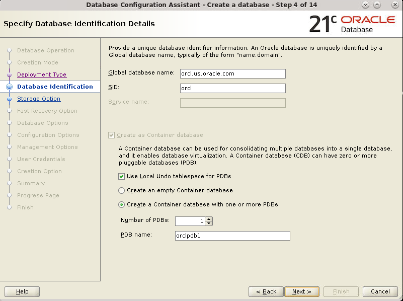

7. The Storage Option window appears. Ensure that "Use template file for database storage attributes" is selected and click Next. If you want to specify your own location to store database files select "Use following for the database storage attributes" option.

    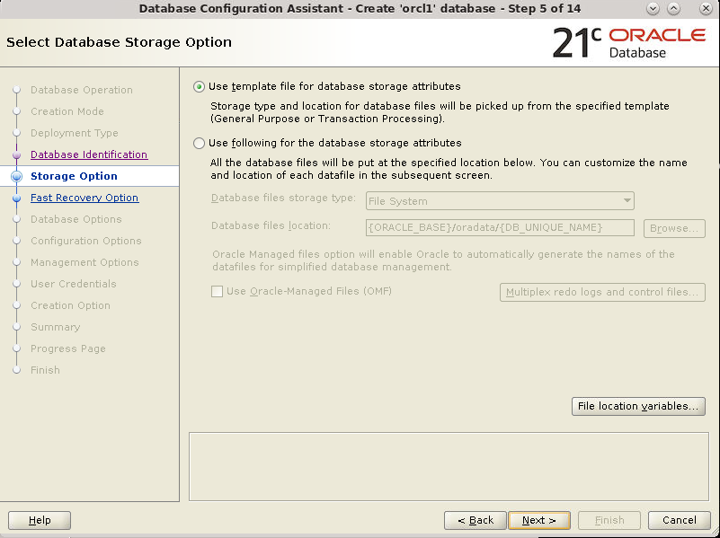

8. In the Fast Recovery Option window, select Specify Fast Recovery Area. Accept the default value for the Specify Fast Recovery Area region and click Next.

    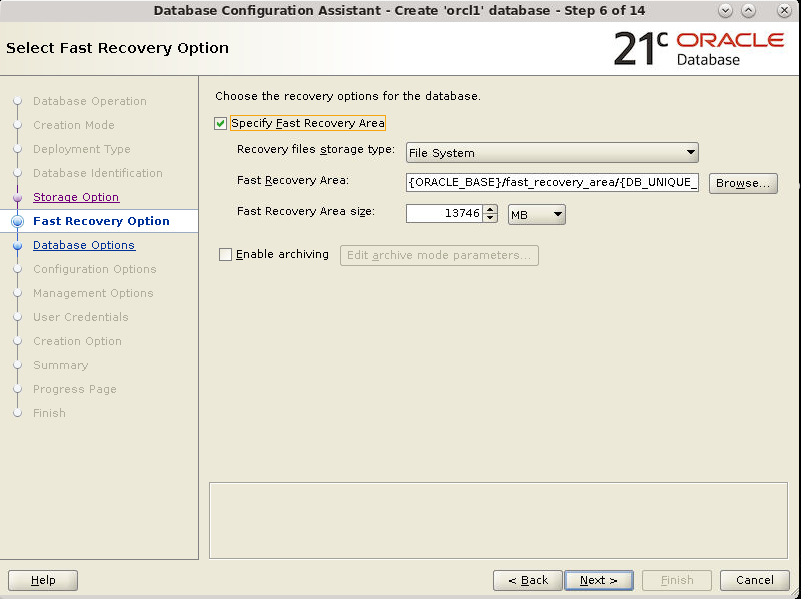

9. The Network Configuration window appears. This page displays the listeners in the current home. Select the listener from the list and click Next. If no listeners are listed, create a new listener by selecting the Create a new listener checkbox, provide a Listener name and port, and click Next.

    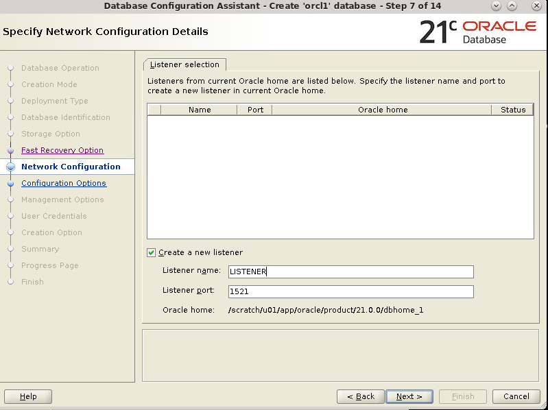

10. The Data Vault Option window appears. Select Configure Database Vault and/or Configure Label Security if appropriate for your installation. Click Next.

    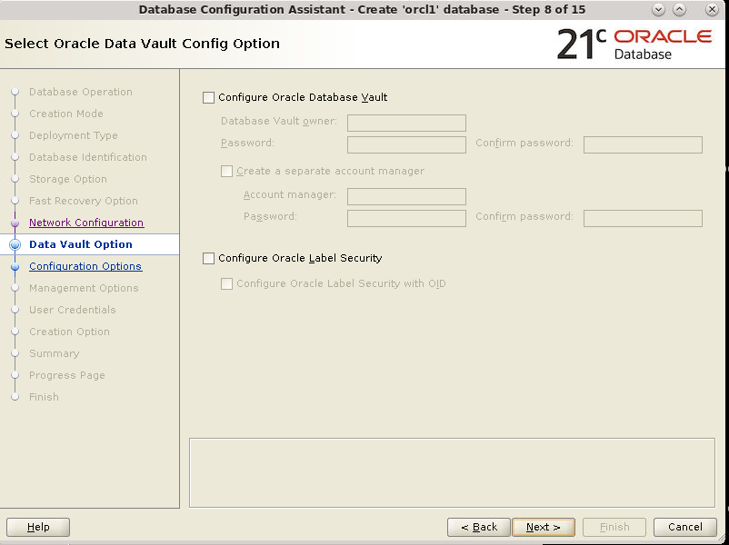

11. The Configuration Options window appears. Select the Use Automatic Shared Memory Management option. Modify the value for SGA size and PGA size if necessary for your installation and click the Sizing tab.

    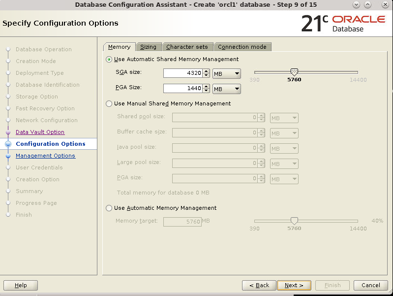

12. On the Sizing tab accept the default value in the Processes field or change it as appropriate for your installation. Click the Character sets tab.

    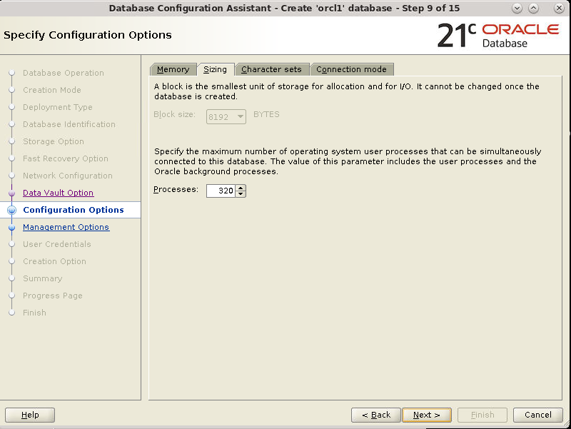

13. On the Character sets tab select Use Unicode (AL32UTF8) or change it as appropriate for your installation. Click the Connection mode tab.
character sets.

    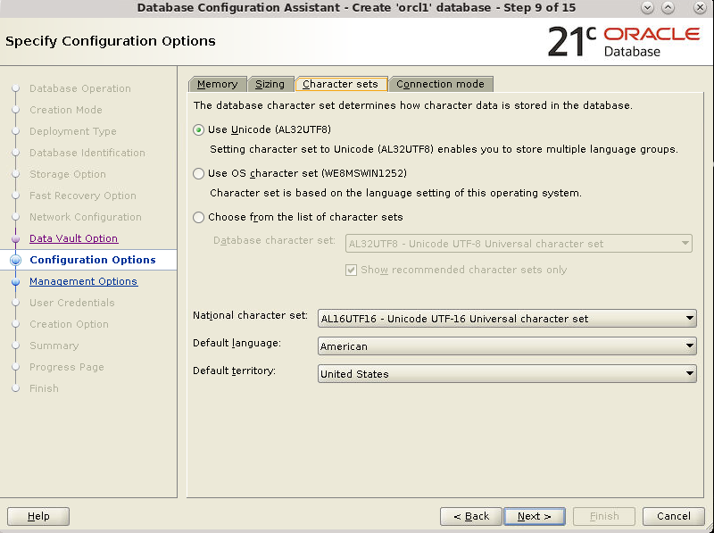

14. On the Connection mode tab accept the default of Dedicated server mode. Click the Sample schemas tab.

     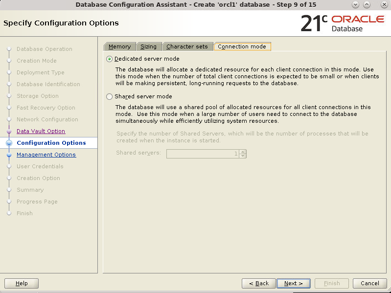

15. The Sample schemas tab appears. Select Add sample schemas to the database and click Next.

     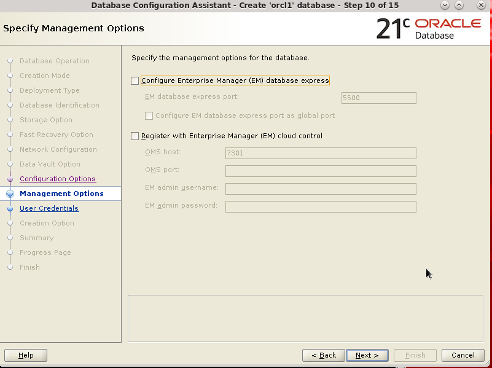

16. The Management Options window appears. Accept the defaults and click Next.

    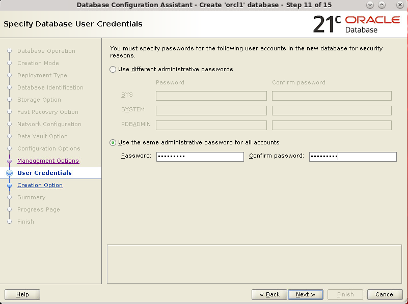

17. The User Credentials window appears. Select "Use the same administrative password for all accounts." Enter your password in the Password and Confirm password fields. Click Next.

    

18. The Creation Option window appears. Review the details and click Next.

     

19.  The Summary window appears. Review the information. Click **Finish**.

    

20. The Progress Page window appears.

    

21. The Database Configuration Assistant window appears indicating that the database has been successfully created. You can click Password Management to unlock the user accounts or you can perform this task at a later time. Click **Close**.

    

**Note**: The Create as Container Database option is enabled to create the database as a CDB that can support zero, one, or many user-created PDBs. If you want DBCA to create a PDB when it creates the CDB, specify the PDB name in the Pluggable database name field.

## Acknowledgements
* **Author** - Dimpi Sarmah, Senior UA Developer
* **Contributors** -  <Name, Group> -- optional
* **Last Updated By/Date** - <Name, Group, Month Year>
* **Workshop (or Lab) Expiry Date** - <Month Year> -- optional, use this when you are using a Pre-Authorized Request (PAR) URL to an object in Oracle Object Store.

## See an issue?
Please submit feedback using this [form](https://apexapps.oracle.com/pls/apex/f?p=133:1:::::P1_FEEDBACK:1). Please include the *workshop name*, *lab* and *step* in your request.  If you don't see the workshop name listed, please enter it manually. If you would like us to follow up with you, enter your email in the *Feedback Comments* section.
