## Introduction
This Lab walks you through the steps on how to perform the advanced installation of container database using the Oracle Universal Installer (OUI).

Estimated Lab Time: 10 minutes

## **STEP 1**: Install Container Database

1. Log on to your computer as a member of the administrative group that is authorized to install Oracle Database software and create a database.

2. If you are installing from distribution media, insert the distribution media for Oracle Database into your computer. The Auto-run feature opens the Select a Product to Install window automatically. If you have downloaded the installation software from the Oracle Web site, follow the instructions on the site to invoke the Oracle Universal Installer.

3. The Select Configuration Option window appears. Select **Create and configure a single instance database**. Click **Next**.
 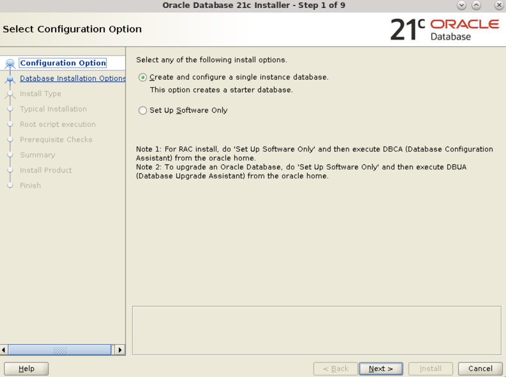

4. The Select System Class window appears. Select **Server Class** and click **Next**.
 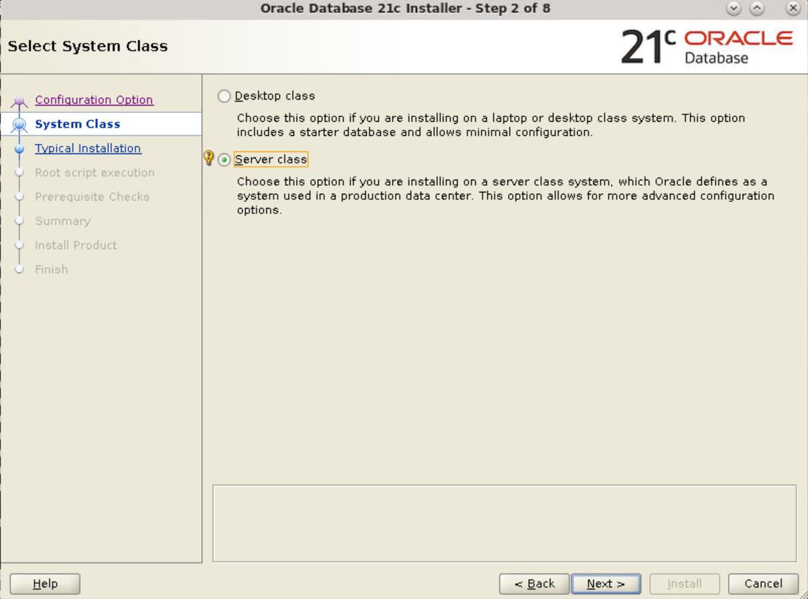

5. The Select Database Edition window appears. Select **Enterprise Edition**. Click **Next**.
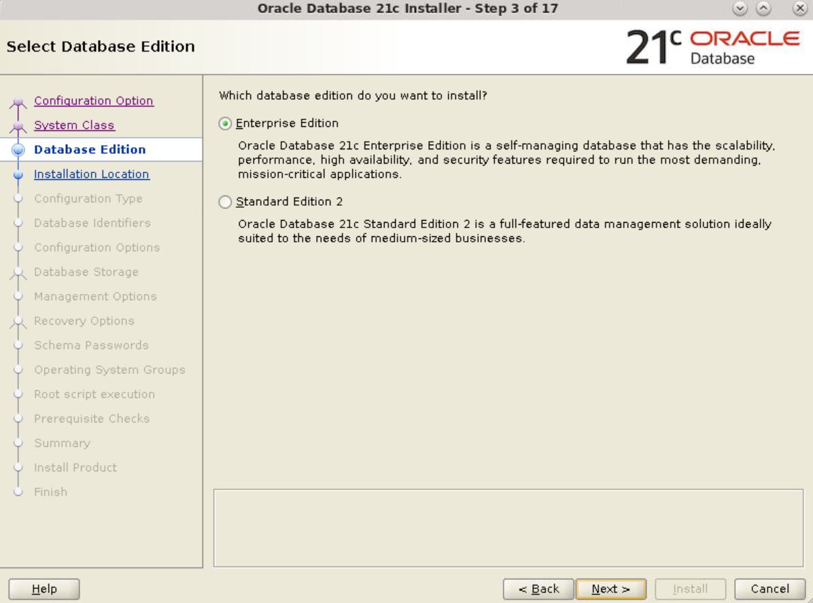

6. The **Specify Installation Location** window appears. Accept the default values. Click **Next**.
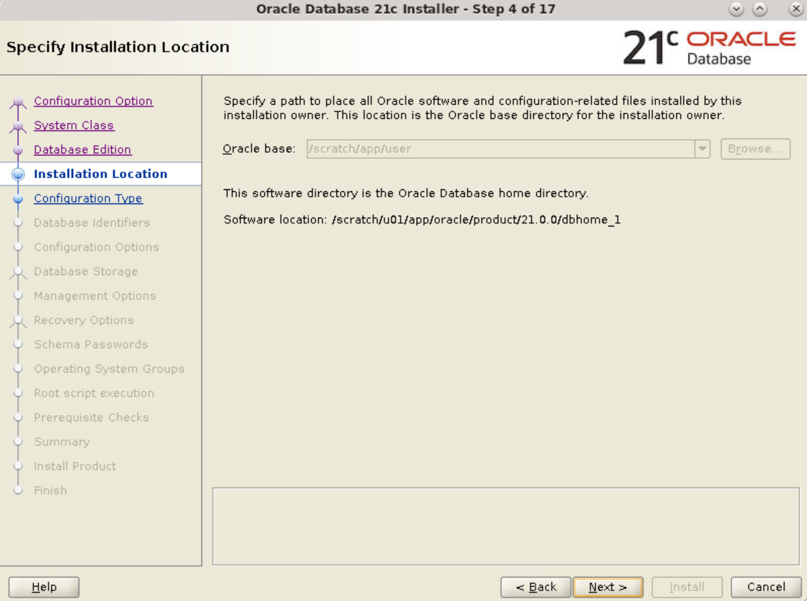

7. The **Select Configuration Type** window appears. Select **General Purpose/Transaction Processing**. Click **Next**.
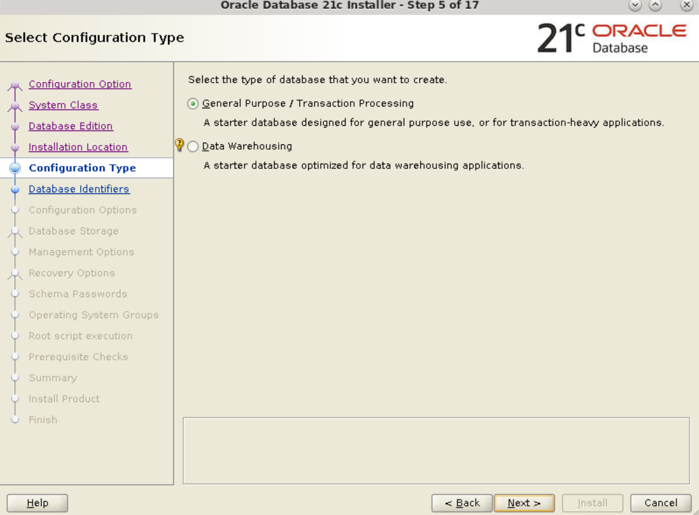

8. The Specify Database Identifiers window appears. Accept the default values or change as necessary for your installation. Click **Next**.
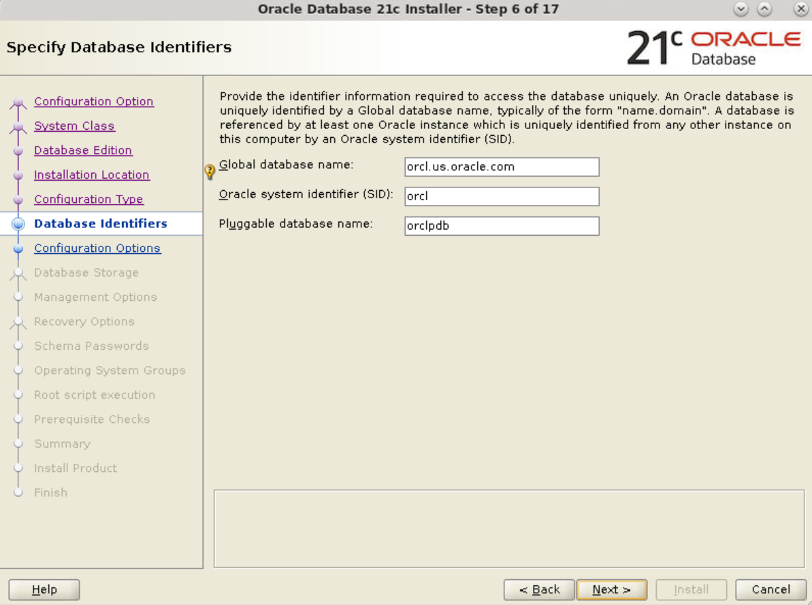

10. The Specify Configuration Options window appears. Select the amount of memory you wish to allocated and click the **Character sets** tab.
**Note**: In this tutorial, 5759 MB is allocated for memory. You may choose a different value based on your requirement.
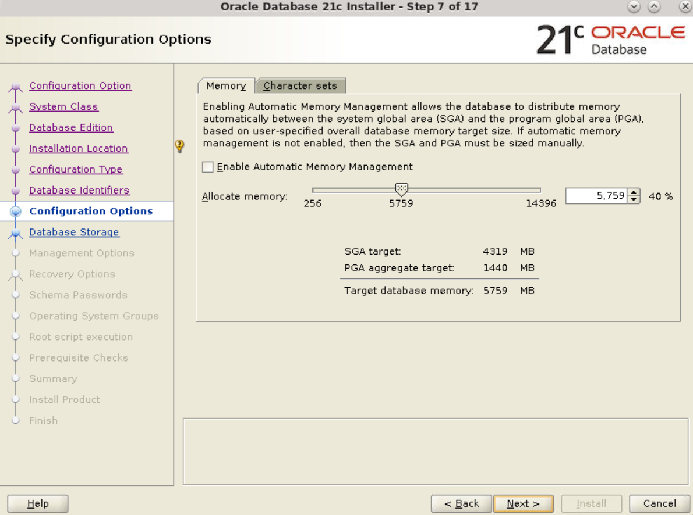

11. On the **Character sets** tab ensure that **Use Unicode (AL32UTF8)** is selected or select as appropriate to your installation. Click **Next**.


12. The Specify Database Storage Options window appears. Accept the default value for File System and click **Next**.
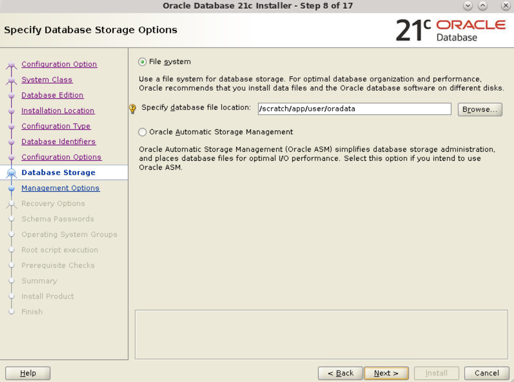

14. The Specify Management Options window appears. Click **Next**.


15. The Specify Recovery Options window appears. Select **Enable Recovery**. Click **Next**.
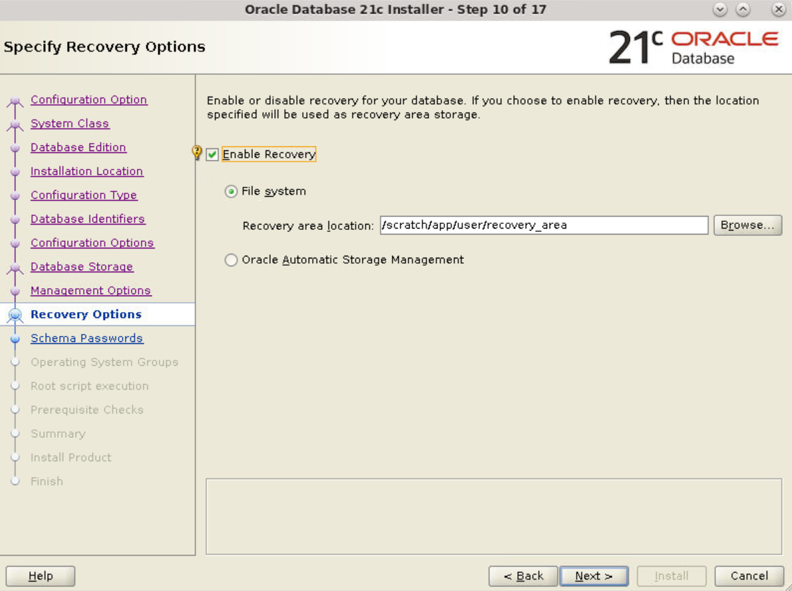

16. The Specify Schema Passwords window appears. Specify separate passwords for the SYS, SYSTEM, and PDBADMIN users or select **Use the same password for all accounts**. Enter the password(s) in the Password and **Confirm password** fields. Click **Next**.
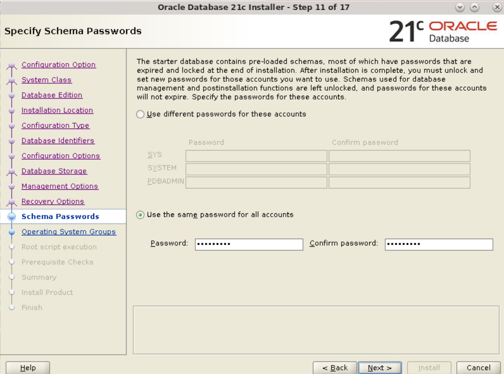

17. The Privileged Operating System groups window appears. Select the appropriate operating system groups for each group. Click **Next**.
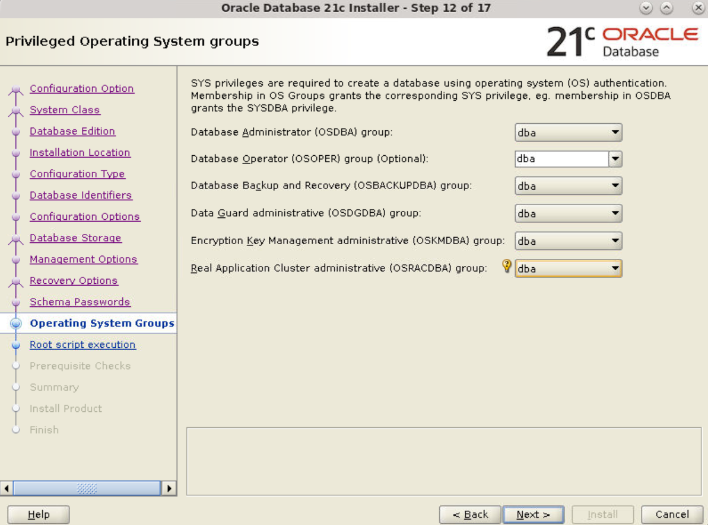

18. The Root script execute window appears. For Linux and UNIX operating systems only, you are prompted to run configuration scripts. To run root scripts automatically, select Automatically run configuration scripts. Alternatively, you can run the configuration scripts manually as the root user. In this scenario, we have chosen to run the configuration scripts manually. Click **Next**.
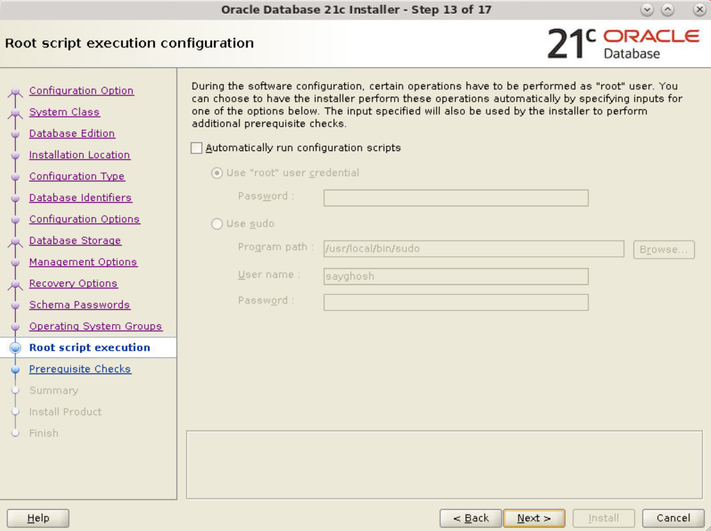

19. The Perform Prerequisite Checks window appears. After the prerequisite checks complete, the Installer advances to the next window.

20. The Summary window appears. Review the settings. Click **Install** to install the Oracle Database software and create the database.


21. The Install Product window appears.


22. The **Execute Configuration scripts** window appears.

23. Open a terminal window and log in as the root user. Execute the scripts as instructed. Close your terminal window.
```
<copy>$ su - root
Password: Enter password for root user
The following environment variables are set as:
ORACLE_HOME=  /scratch/u01/app/oracle/product/21.0.0/dbhome_1/root.sh
</copy>
```

24. After executing the scripts in your terminal window, return to the Execute Configuration scripts window and click **OK**.

25. After the Database Configuration Assistant creates the database, the Finish window appears indicating the installation of Oracle Database software and creation of the database was successful. Click **Close** to exit the Oracle Universal Installer.


*At the conclusion of the lab add this statement:*
You may proceed to the next lab.

## Acknowledgements
* **Author** - Dimpi Sarmah, Senior UA Developer
* **Contributors** -  <Name, Group> -- optional
* **Last Updated By/Date** - <Name, Group, Month Year>
* **Workshop (or Lab) Expiry Date** - <Month Year> -- optional, use this when you are using a Pre-Authorized Request (PAR) URL to an object in Oracle Object Store.

## See an issue?
Please submit feedback using this [form](https://apexapps.oracle.com/pls/apex/f?p=133:1:::::P1_FEEDBACK:1). Please include the *workshop name*, *lab* and *step* in your request.  If you don't see the workshop name listed, please enter it manually. If you would like us to follow up with you, enter your email in the *Feedback Comments* section.
