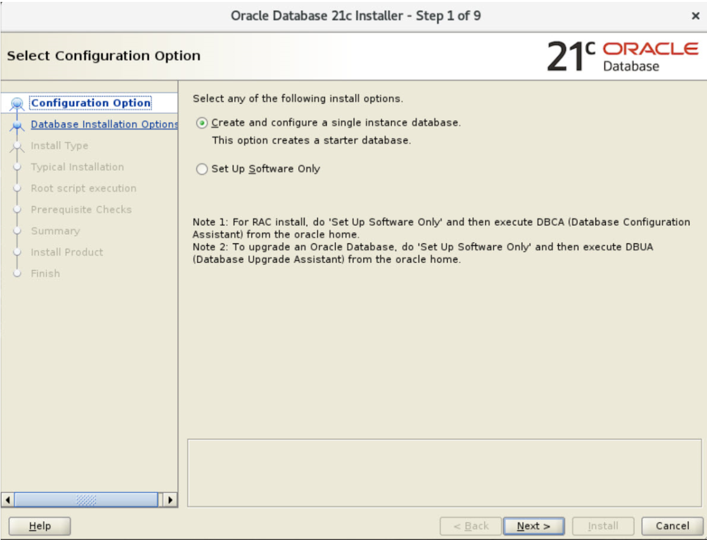
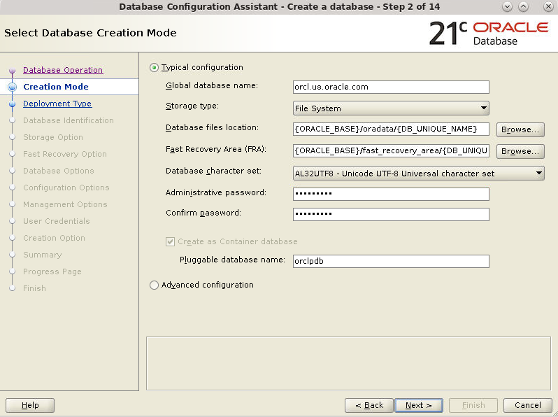
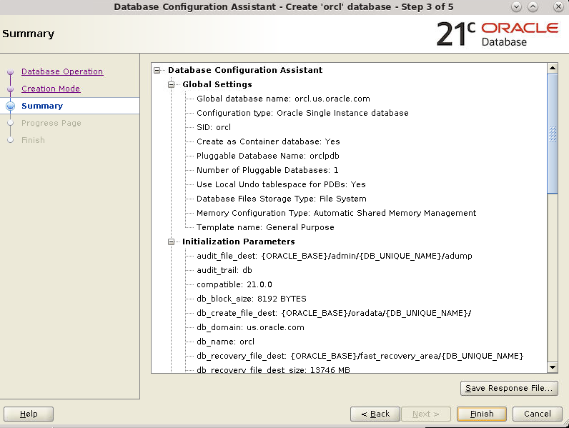
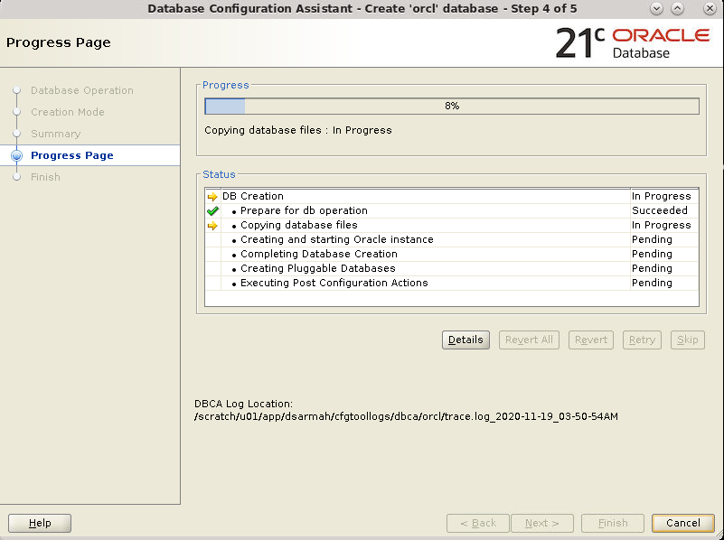
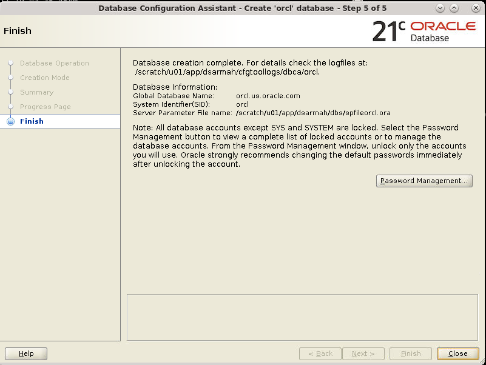

# Introduction
This Lab walks you through the steps to install Oracle container database using Oracle Universal Installer (OUI).

Estimated Lab Time: 10 minutes

## **STEP 1**: Create a Container Database

1. Log on to your computer as a member of the administrative group that is authorized to install Oracle Database software and create a database.
2. Invoke DBCA as appropriate to your operating system.
3. The Database Operation window appears. Select **Create a Database**. Click **Next**.

    

4. The Creation Mode window appears. Ensure that Create a database with default configuration is selected. Enter a value in the Global Database Name field. Select File System in the Storage Type menu. Accept the default values for Database Files Location and Fast Recovery Area. Select AL32UTF8 - Unicode UTF - 8 Universal character set in the Database Character Set menu. Enter a password for the SYS and SYSTEM users in the Administrative Password and Confirm Password fields. Ensure that Create as Container database option is selected. Click **Next**.

    

5. The Summary window appears. Review the information. Click **Finish**.

    

6. The Progress Page window appears.

    

5. The Database Configuration Assistant window appears indicating that the database has been successfully created. You can click Password Management to unlock the user accounts or you can perform this task at a later time. Click **Close**.

    

**Note**: The Create as Container Database option is enabled to create the database as a CDB that can support zero, one, or many user-created PDBs. If you want DBCA to create a PDB when it creates the CDB, specify the PDB name in the Pluggable database name field.

## Acknowledgements
* **Author** - Dimpi Sarmah, Senior UA Developer
* **Contributors** -  <Name, Group> -- optional
* **Last Updated By/Date** - <Name, Group, Month Year>
* **Workshop (or Lab) Expiry Date** - <Month Year> -- optional, use this when you are using a Pre-Authorized Request (PAR) URL to an object in Oracle Object Store.

## See an issue?
Please submit feedback using this [form](https://apexapps.oracle.com/pls/apex/f?p=133:1:::::P1_FEEDBACK:1). Please include the *workshop name*, *lab* and *step* in your request.  If you don't see the workshop name listed, please enter it manually. If you would like us to follow up with you, enter your email in the *Feedback Comments* section.
