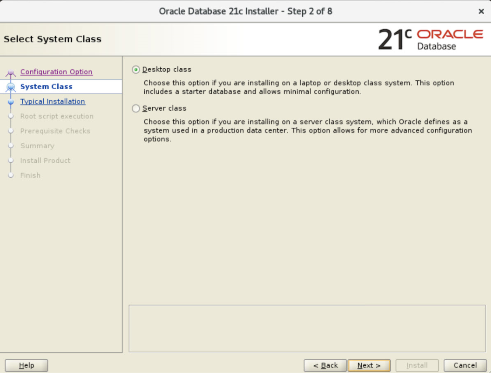
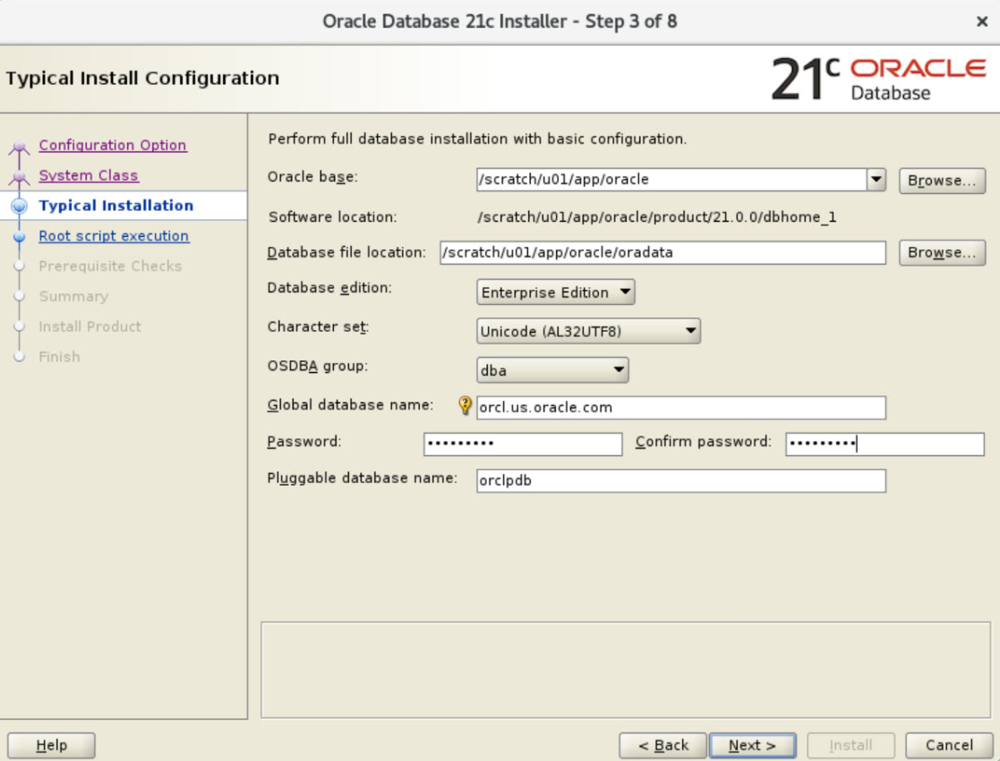
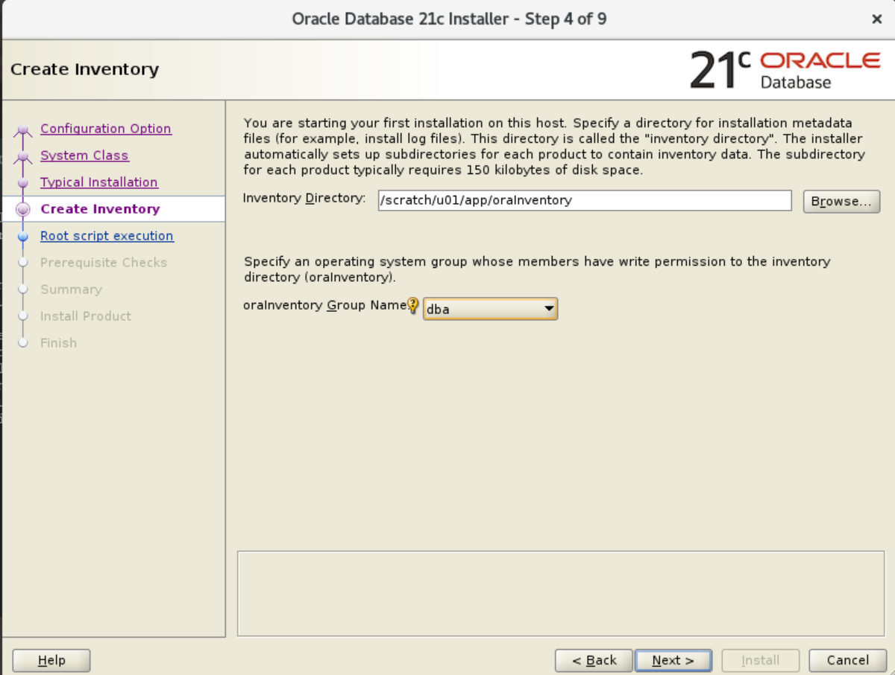
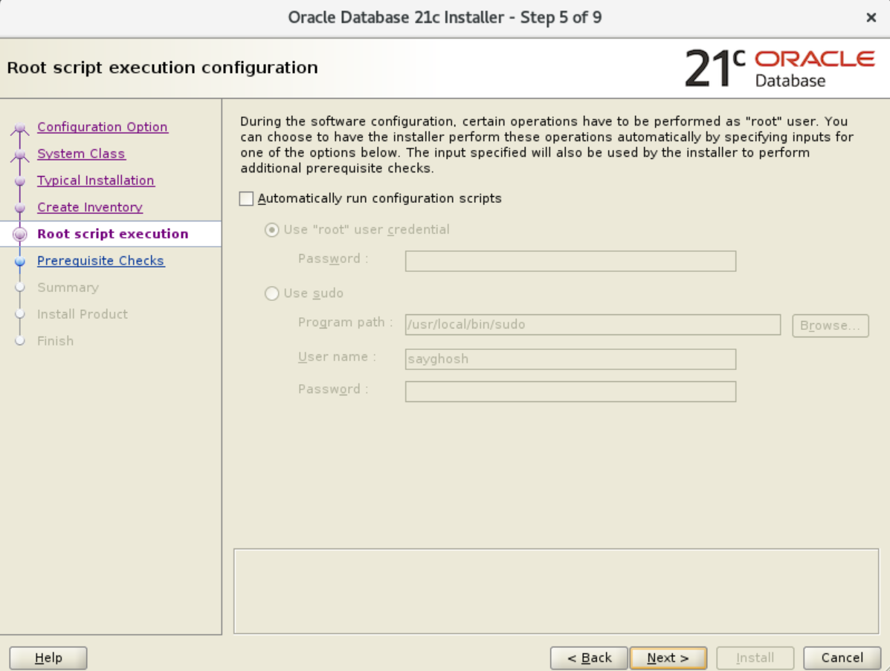
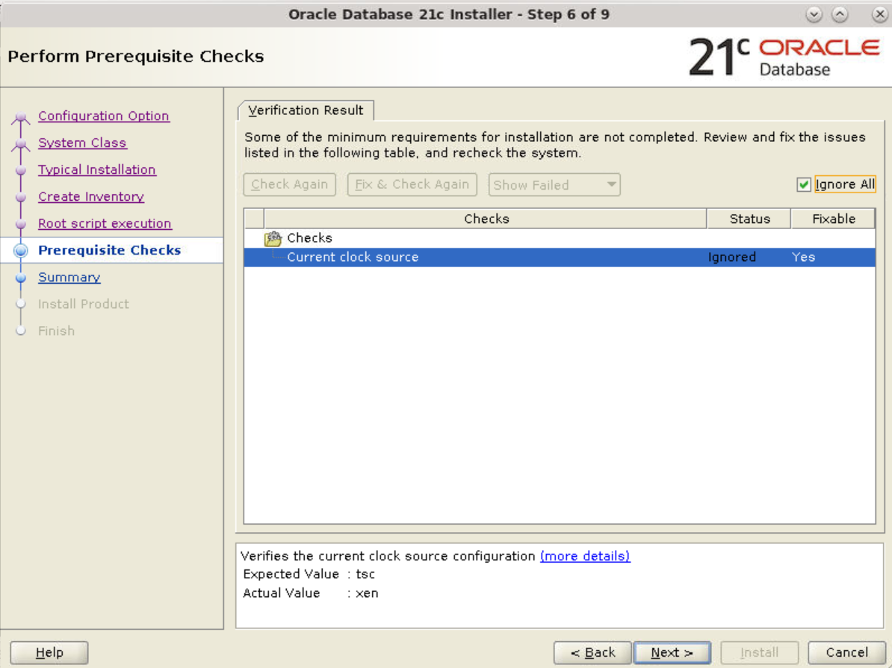
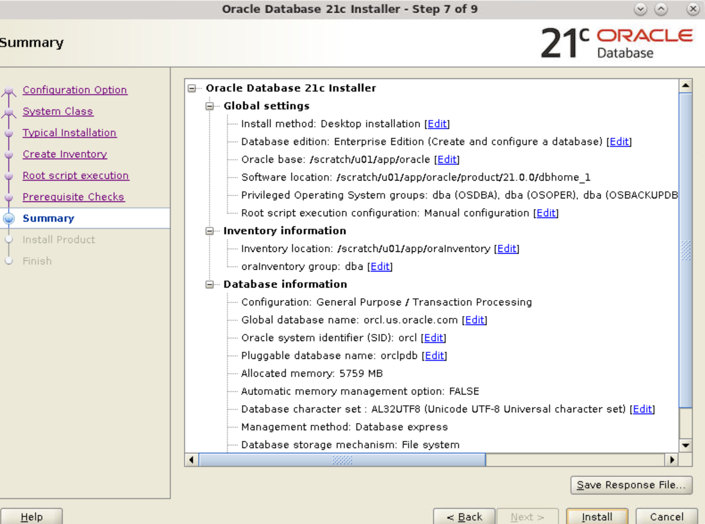
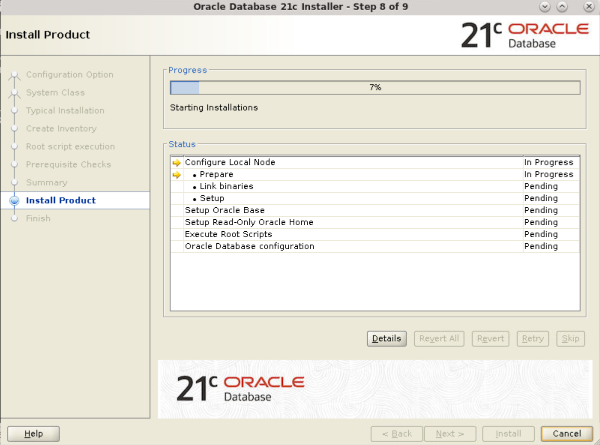
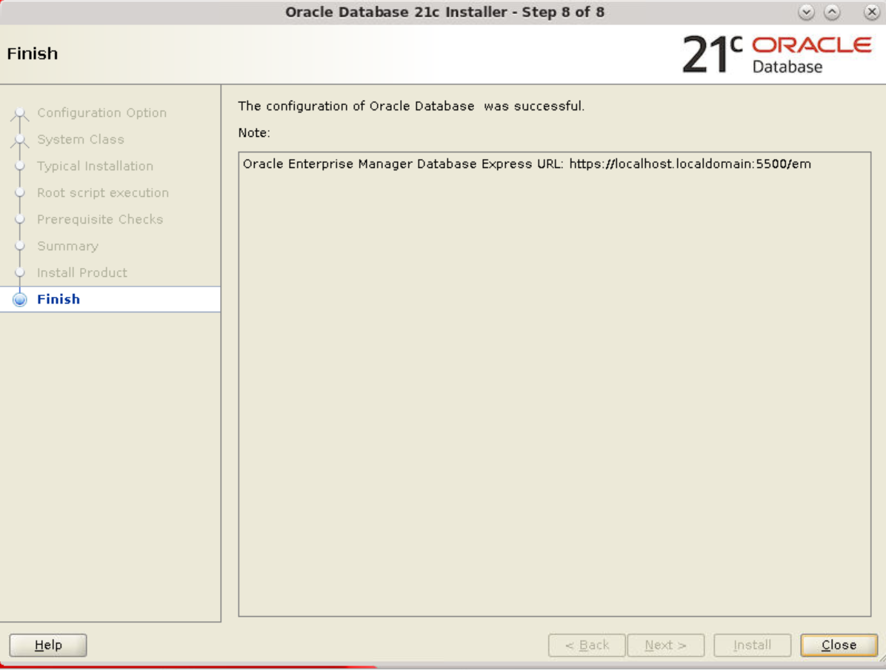

## Introduction
This Lab walks you through the steps to install Oracle container database using Oracle Universal Installer (OUI).

Estimated Lab Time: 10 minutes


## **STEP 1**: Install Container Database(including PDB)

1. Log on to your computer as a member of the administrative group that is authorized to install Oracle Database software and create a database.

2. If you are installing from distribution media, insert the distribution media for Oracle Database into your computer. The Auto-run feature opens the Select a Product to Install window automatically. If you have downloaded the installation software from the Oracle Web site, follow the instructions on the site to invoke the Oracle Universal Installer.

3. The Select Configuration Option window appears. Select **Create and configure a single instance database**. Click **Next**.

    

4. The System Class window appears. Select **Desktop Class**. Click **Next**.
  

5. The Typical Install Configuration window appears. In the **Administrative password** field, specify the password to be used for the SYS, SYSTEM, SYSMAN, and DBSNMP accounts. (A warning is displayed if the password does not meet oracle password standards.) Click **Next**.
  
**Note**: The Create as Container Database option is enabled to create the database as a CDB that can support zero, one, or many user-created PDBs. If you want DBCA to create a PDB when it creates the CDB, specify the PDB name in the Pluggable database name field.

6. The Create Inventory window appears. Accept the defaults and click **Next**.


7. The Root script execute window appears. For Linux and UNIX operating systems only, you are prompted to run configuration scripts. To run root scripts automatically, select Automatically run configuration scripts. Alternatively, you can run the configuration scripts manually as the root user. In this scenario, we have chosen to run the configuration scripts manually. Click **Next**.


8. The prerequisite checks are performed and a Summary window appears. You can select the checkbox **Ignore All** if these is any minor issue. Review the settings and click **Install**.



9. The progress window appears.


10. The Execute Configuration Scripts window appears.


11. Open a terminal window and log in as the root user. Execute the scripts as instructed. Close your terminal window.
  	```
  <copy>$ su - root
Password: Enter password for root user
$ /scratch/u01/app/oracle/product/21.0.0/root.sh
</copy>
  ```
12. After executing the scripts in your terminal window, return to the Execute Configuration scripts window and click **OK**.

13. After the Database Configuration Assistant creates the database, the Finish window appears indicating the installation of Oracle Database software and creation of the database was successful. Click **Close** to exit the Oracle Universal Installer.


*At the conclusion of the lab add this statement:*
You may proceed to the next lab.

## Acknowledgements
* **Author** - Dimpi Sarmah, Senior UA Developer
* **Contributors** -  <Name, Group> -- optional
* **Last Updated By/Date** - <Name, Group, Month Year>
* **Workshop (or Lab) Expiry Date** - <Month Year> -- optional, use this when you are using a Pre-Authorized Request (PAR) URL to an object in Oracle Object Store.

## See an issue?
Please submit feedback using this [form](https://apexapps.oracle.com/pls/apex/f?p=133:1:::::P1_FEEDBACK:1). Please include the *workshop name*, *lab* and *step* in your request.  If you don't see the workshop name listed, please enter it manually. If you would like us to follow up with you, enter your email in the *Feedback Comments* section.
