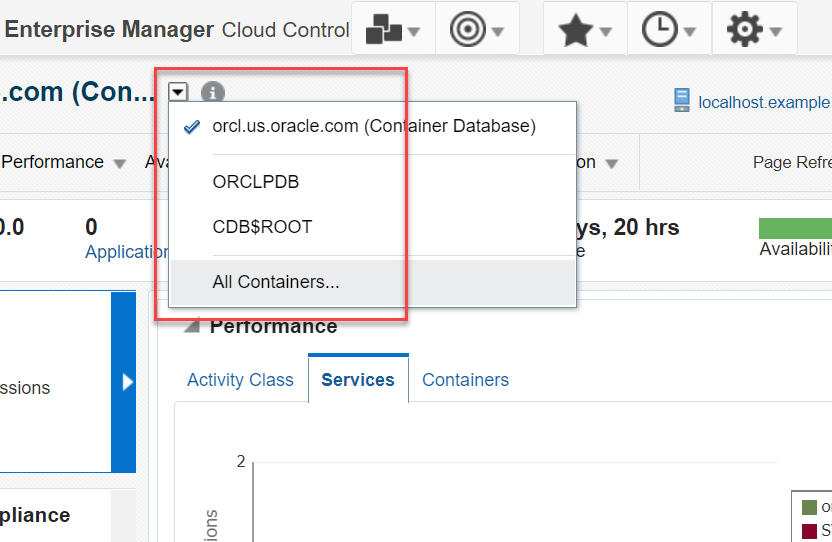
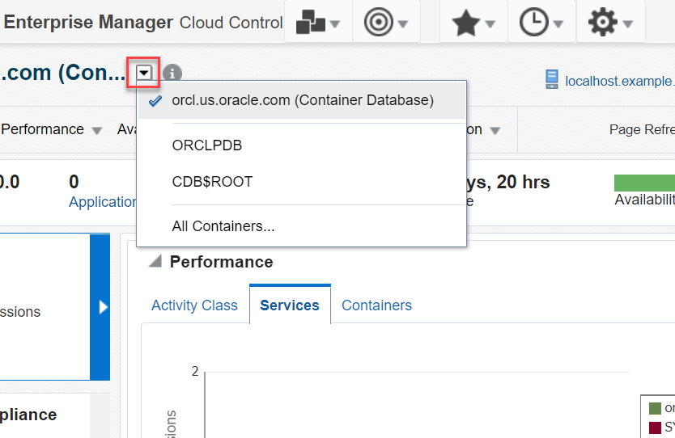
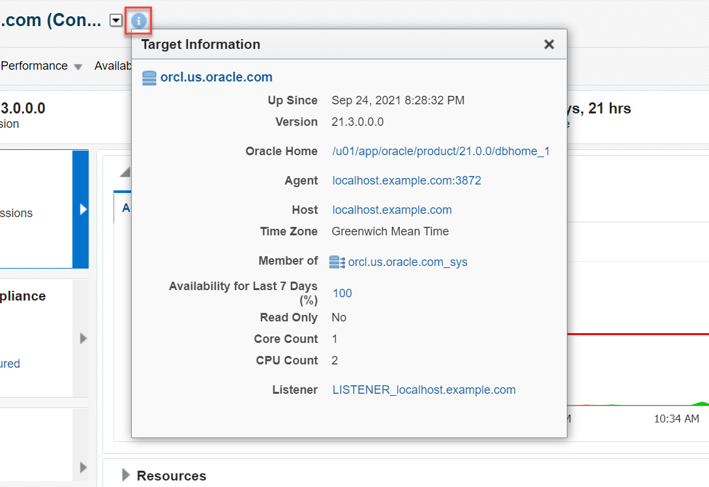
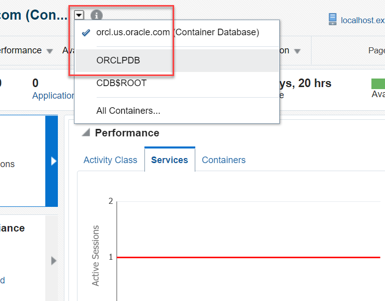
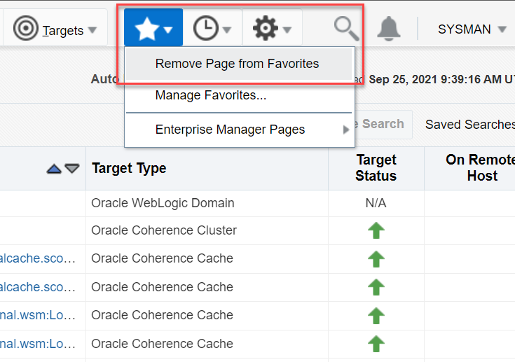

# Access Container Homepage from Cloud Control

## Introduction

This lab walks you through the steps to access the container homepage from Oracle Enterprise Manager Cloud Control (Oracle EMCC). You will also learn how to switch between containers and manage your favorites.

Estimated Time: 15 minutes

### Objectives

Log in to Oracle EMCC and access the container homepage. Switch between the Container Database (CDB) homepage and the Pluggable Database (PDB) homepage. Add pages to and remove pages from the favorites.

### Prerequisites

 - Oracle Database 21c installed and a CDB with at least one PDB created.
 - Oracle EMCC 13.5 installed with Oracle Database 19c as the repository.
 - You have completed -
    - Lab: [Log in to Oracle EMCC](?lab=log-into-emcc)

## Task 1: Access Container Homepage

1.  From the **Targets** menu, select **Databases**.

    

    The Databases page displays a list of Oracle Databases added to Oracle EMCC as managed targets.   
	The values may differ depending on the system you are using.  

    

2.  On the Databases page, select the Oracle Database name, for example *orcl.us.oracle.com*, and go to **View** > **Expand All Below**. 

    

    Alternatively, click on the expand/collapse arrow next to the Oracle Database name. The list displays the database instance and the PDBs for each Oracle Database on the host.

    

3.  Click on the container name to access the container homepage.

    **Container homepage**: If you click the Oracle Database instance name, for example *orcl.us.oracle.com*, it brings up the instance homepage.

    

    **PDB homepage**: If you click the PDB name, for example *orclpdb*, it brings up the PDB homepage.

    

From the homepage, you can monitor and administer your Oracle Database.

## Task 2: Switch between Containers

You can alter the session and switch between containers in Oracle EMCC within a single login.

This means that from the database instance homepage, you can switch to the CDB or the PDB homepage without logging out of Oracle EMCC. Similarly, from the PDB homepage, you can switch to the CDB or to another PDB homepage, if more than one PDB exists in the CDB.

1.  Open the container homepage for the Oracle Database instance as explained in *Task 1*.   

2.  Click the down arrow next to the container and select **All Containers**.

    

3.  Select the CDB name, *CDB$ROOT*, from the containers list and click **OK**.  

    

    It brings up the CDB homepage. 

    

    Similarly, select the PDB name, for example *orclpdb*, from the containers list to open the PDB homepage.

    

    **Note**: To jump from one container to another quickly, click the down arrow followed by the container name. The window displays the selected container homepage.

    

	> You cannot open the database instance homepage from the CDB or the PDB homepage. To open the database instance homepage, go to the Databases page and click on the database instance name as explained in *Task 1*. 

## Task 3: View Target Information

To view information about a target or to monitor a target, open the target homepage. 

1.  Open the container homepage for the Oracle Database instance as explained in *Task 1*.   

2.  From the **Oracle Database** menu, select **Target Information**. 

    

    Alternatively, you can click on the icon (i) next to the container name.

    

    The window displays the details of the target container.   

3.  Switch the container to PDB and view PDB details. Click the down arrow next to the container and select the PDB name, *orclpdb*.  
    The values may differ depending on the system you are using.

    

    It opens the PDB homepage.  

4.  From the **Oracle Database** menu, select **Target Information**.  
    Alternatively, click the icon (i) next to the PDB name, *orclpdb*.

    

    Similarly, open the CDB homepage and view details of the target CDB.

    

## Task 4: Manage Your Favorites

You can add pages to the favorites and bookmark them in Oracle EMCC for easy access. Similarly, you can remove pages from the favorites.

1.  Open the page that you want to bookmark. For example, go to the CDB homepage as explained in *Task 2*.

    

2.  To add a page to favorites, click the **Favorites** menu (star icon) and select **Add Page to Favorites**.

    

    The window displays a confirmation message that you have added the active page to favorites.   

3.  To remove a page from favorites, click on the **Favorites** menu (star icon) and select **Remove Page from Favorites**.

    

    The window displays a confirmation message that you have removed the page from favorites.

    Moreover, you can open a recently visited page from the **History** menu in Oracle EMCC. 

    

This brings you towards the completion of this workshop on *EM - Oracle Database Administration (DBA)*.

## Acknowledgements

-   **Author** - Manish Garodia, Principal User Assistance Developer, Database Technologies

-   **Contributors** - Suresh Rajan, Kurt Engeleiter

-   **Last Updated By/Date** - Manish Garodia, October 2021
